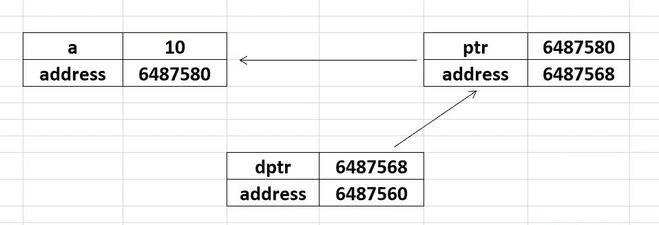
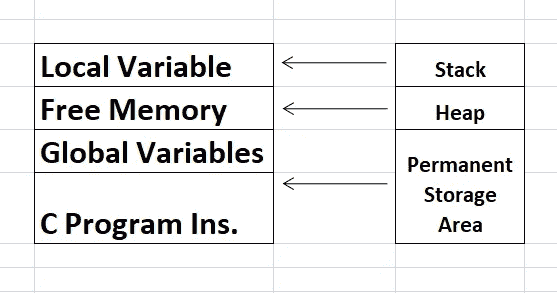

# 关于指针你需要知道的一切-第 2 部分

> 原文：<https://medium.com/nerd-for-tech/all-you-need-to-know-about-pointers-part-2-b6153ed93fe?source=collection_archive---------0----------------------->

本文是指针系列文章的第二部分。在上一篇文章中，我们讨论了指针的基本概念，并介绍了指针的应用。如果你没有看过第一部分，可以在这里找到[。在这篇文章中，我们将深入了解指针的应用。](/@vaidhyanathan.sm/all-you-need-to-know-about-pointers-part-1-1470d2d24d78)

我想重申一下上一篇文章，我们有两个主要应用:

> 1.引用调用
> 
> 2.动态存储分配

让我们先来看看关于**的引用调用**。另一个经常看到的术语是**按值调用**。考虑下面的例子**交换两个数字。**

从上面的代码可以推断出，*形式参数中的变化并没有反映回实际参数*。也就是说，由 swap()函数执行的交换是局部的，并不显示 num1 和 num2 的实际值的变化(大体上)。发生这种情况是因为**通过值**调用。

现在，如果我们真的想要将更改反映回实际的参数，那么我们需要通过引用进行**调用。在引用调用中，我们**将变量**的地址传递给函数。请参见下图:**

这里，我们将变量的地址传递给 swap()函数，为了存储地址，函数 swap 的变量(参数)必须是指针。因为，我们知道**指针**是一个变量，可以存储另一个变量的地址。现在，在这种情况下，*因为地址是作为参数传递给函数的，所以这些地址上的值被交换*。因此，现在**形式参数**的变化反映回了**实际参数。**

接下来，我们探讨一下所谓的**双指针**。

能够保存**指针**的**地址**的**变量**(其本身保存另一个变量的地址)是一个双指针。为清晰起见，请参见下图。

可以注意到，ptr 保存 a 的地址，dptr 保存 ptr 的地址。这意味着*dptr 指向存储在 ptr 中的值(即 a 的地址)。**dptr 表示 ptr 存储的地址值为 10。

从图表上看，它可以如下图所示:

内存中指针的表示

现在，我们该转向动态内存分配了。

# 对动态内存分配的需求

一般来说，要在内存中分配的**大小**(比如一个数组)在编译时就已经知道了。在这种情况下，我们用已知的大小初始化数组。请参见下面的示例:

当大小已知时，这就是我们处理普通数组的方式。

有时，会出现这样的情况:数组的大小只有在执行时(运行时)才知道。实际上，这种情况可以在不使用**动态内存分配**的情况下**处理。请参见下面的示例:**

在上面的代码中，我们在运行时获取数组的大小，并相应地分配内存。但是，这种方法的**缺点**是*分配给数组的内存只有在其作用域结束后才会被释放，这是 main()函数*。动态内存分配(DMA)允许我们更有效地管理内存。主要的好处是我们可以防止**内存的浪费**。此外，更重要的是，数据结构可以根据需求增长和收缩。我们可以根据需要分配、重新分配和取消分配空间。

让我们探索一下在 c 中 DMA 是如何实现的。我们可以通过使用**内存管理函数**来实现。让我们看看 C 程序的存储结构。

C 程序的存储

内存管理功能包括:

> 1.malloc()
> 
> 2.卡洛克()
> 
> 3.realloc()
> 
> 4.免费()

## 分配一块内存:malloc

可以使用 malloc()分配一块内存。malloc()函数保留一个指定大小的块，并返回一个 void 类型的指针。malloc()的语法如下:

> ptr = (cast-type *) malloc(字节大小)

让我们看一个例子:

在上面的程序中，内存是根据用户在运行时给定的大小来分配的。

## 分配多个内存块

calloc()是另一个内存分配函数，用于在运行时分配内存空间，以存储派生的数据类型，如数组或结构。malloc()分配单个存储空间块，calloc()分配多个存储空间块，每个块的大小相同，并将所有字节设置为零。calloc()的语法如下:

> ptr =(铸件类型*) calloc (n，elem-size)；

请参见下面的示例:

> 注意:需要使用 free()函数来释放空间，正如您在上面的例子中所看到的。

## 改变块的大小:realloc()

函数 realloc()用于改变已经使用 malloc()或 calloc()分配的内存空间。

请参见下面的示例:

## DMA 的优点和缺点

*优点*:

> 1.数据结构可以根据需求增长和收缩。
> 
> 2.我们可以根据需要分配、重新分配和取消分配内存空间。
> 
> 3.DMA 在运行时发生。

*缺点*:

> 1.由于内存是在运行时分配的，因此需要更多的时间。
> 
> 2.完成后，用户需要释放内存。否则，它可能会导致一些错误，这些错误以后会变得难以调试。

所以，这都是关于 DMA 的。希望你喜欢阅读这篇文章！

如果您有任何疑问，请在下面的**评论**部分发帖。在 [LinkedIn](https://www.linkedin.com/in/vaidhyanathansm/) 上与我联系。此外，如果你想看看我开发的惊人的应用程序集，别忘了查看[谷歌 Play 商店](https://play.google.com/store/apps/developer?id=Programmers+Gateway)。

更多了解我[这里](https://vaidhyanathansm.tech/)。

话虽如此，感谢阅读我的文章和*快乐编码！*