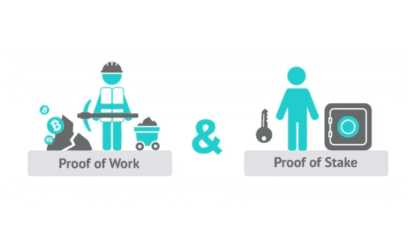

# 减轻加密货币对环境的影响

> 原文：<https://medium.com/nerd-for-tech/alleviating-the-environmental-impacts-of-cryptocurrency-fd350bf7115f?source=collection_archive---------10----------------------->

[林丽安](https://unsplash.com/@li_anlim?utm_source=medium&utm_medium=referral)在 [Unsplash](https://unsplash.com?utm_source=medium&utm_medium=referral) 上的照片

多年来，我们一直听说开采比特币等加密货币的能源成本。随着最近这种硬币价值的飙升(在撰写本文时，一个 BTC 的美元价值在 59，000 美元左右徘徊，但一年前在 6，000 美元左右)，对用于驱动这种区块链的分布式计算网络消耗多少能量的关注再次进入公共话题。

## 危机

那么，到底发生了什么？嗯，根据我的搜索引擎结果，仅比特币采矿(所以，暂时忽略所有其他加密货币)的年度碳足迹[与新西兰的](https://www.cnbc.com/2021/02/05/bitcoin-btc-surge-renews-worries-about-its-massive-carbon-footprint.html)相似，年度电力消耗[比阿根廷的](https://www.bbc.com/news/technology-56012952)多。在一个我们已经感受到气候变化巨大影响的时代，几乎没有理由增加这种能源消耗，尤其是当大部分能源用于驱动最终浪费能源的机器时。

## 工作证明

为了解释我所说的浪费是什么意思，我们首先需要考察比特币挖矿是如何进行的。本质上，正在发生的事情是，有一个计算机(即矿工)的分布式网络，它们正在竞相解决许多人简单描述为“非常困难的数学问题”。我们不会详细说明这意味着什么，但这个数学问题的关键属性是:1)它非常非常难解决，计算量很大，但 2)它非常非常容易验证它是正确的。这里的“问题”本质上也包含了用于确定下一批交易或者区块链中的块应该是什么的信息。也就是说，当一个矿工解决这个问题时，输出的是一个可以从数学上证明有效的事务块。

这就是挖矿比特币的意思吗？

因为这些矿工投入了大量的时间和精力来解决这些问题，这种形式的区块添加被称为工作证明。这意味着，因为有效区块只能通过投入大量工作来产生，所以矿工得到有效区块(这也很容易验证)的事实足以证明矿工投入了“工作”来解决这个问题。作为对完成这项工作的奖励，那台计算机(或者我认为，那台计算机的所有者及其相关的比特币地址)被分配到一定数量的新铸造的比特币，这些比特币凭空出现，就像有人刚刚在一个洞穴中挖出它一样(因此出现了术语“采矿”)。如果你感兴趣，你肯定应该多读一些关于比特币奖励和减半的内容，但现在只需要知道，每增加一块，奖励是 6.25 BTC。

让我们在这里做一些快速的数学运算。

还记得大鲨鱼吗？

6.25 BTC 每枚价值 59，000 美元……是的，368，750 美元，感觉成为一名矿工是值得的，对吗？特别是考虑到大约每十分钟就添加一个新的块(通过设计)，这感觉像是一个可靠的经济投资。但是，估计有 100 万矿工，一年只有 52560 个 10 分钟的间隔。因此，你每年有 52，560 次机会赢得 368，750 美元的彩票，但每次只有百万分之一的机会获胜。要想“赢”，你的电脑必须再次解决每次都会改变的数学难题，并在其他 999，999 名矿工之前解决它。

好吧，这就是比特币的工作证明的味道，也是为什么人们选择建造昂贵的钻机来解决这些问题。我们之前提到的能源浪费发生在哪里？好吧，让我们回头看看。我们有 100 万台计算机专门用来解决一个没有现实意义的数学问题。其中一台计算机首先解决了这个问题，并获得了巨额奖金，但其他 999，999 名矿工毫无理由地在泥浆中旋转他们的计算轮，现在必须从头开始解决下一个数学问题。这意味着，就生产工作而言，为这个计算机网络提供动力所消耗的 99.9999%的能量实际上是毫无价值的。

## 替代难题

我们能善用这种计算能力吗？嗯……理论上，是的。已经有一些关于利用工作证明所需的计算的不同方法的研究，例如解决离散对数的，并且有可能有其他问题可以合并到工作证明上下文中，这样问题的输出对现实世界也是有用的。

然而，提出这样的问题是有用的，并重新纳入区块链的协议有点困难，并没有改变这样一个事实，即只有最快的问题解决者才能获胜，我们有很多多余的计算被洗澡水扔掉了。

此外，比特币等加密货币的矿工也很难改变他们的硬件来解决不同的问题。比特币矿工遇到的“问题”可以通过使用名为[ASIC](https://www.bitcoin.com/get-started/how-to-setup-a-bitcoin-asic-miner-and-what-they-are/)的专门硬件来更快地解决，这种硬件几乎只能运行与该问题相关的计算，但它们的速度真的很快。因此，很可能这一池浪费的计算不能用于其他任何事情。

## 利害关系证明

好吧，所以使用工作证明可能没有明显的方法来减少向加密货币区块链添加块的能量成本。幸运的是，除了这一系列协议之外，还有其他选择，其中最著名的可能是“利害关系证明”。为了简洁起见，我们不会深入讨论其他方法是如何工作的，但是还有其他提议的替代方法，例如[空间证明](https://eprint.iacr.org/2017/893.pdf)和[时间证明](https://eprint.iacr.org/2018/183.pdf)。

那么什么是利害关系的证据呢？该协议有许多实现方式，但本质上它的工作方式是，网络不是依赖最快解决困难问题的挖掘器来确定哪些事务进入下一个块，而是有一个[加密硬](https://en.wikipedia.org/wiki/Computational_hardness_assumption)进程来选择一个或一组挖掘器，这些挖掘器被允许添加和验证下一个块并接收块奖励。选择矿工的过程可以以多种方式进行，但在最基本的情况下，网络可以为每个人分配一个被选中的概率，该概率与他们拥有的相关加密货币的数量成线性比例。这种方法基本上假设，如果一个人拥有大量的基础加密货币，他就不会成为一个坏的参与者，并添加一个无效的块，因为这将导致其他人对系统失去信任，并使货币贬值，这直接影响到那个人。可以说，这是他们的利益，或者说是他们的赌注。

然而，这种特殊的实现方式很容易造成一种不公平的系统，在这种系统中，拥有大量货币的人可能会继续积累财富，因为他们从开采当前区块中获得的奖励使他们有更高的机会开采下一个区块。还有其他不仅仅基于钱包大小的利害关系证明，但它们超出了本文的范围。

## 股权证明的优势

因为每一次方块加法只选择了所有可能矿工的一个小子集，所以其余的矿工不必使用电力来尝试解决任意的、困难的问题。他们可以只是坐在一个潜伏状态，直到他们被选中提出一个区块。

如果我们挥动魔杖，将它应用于比特币区块链，我们可以回收大部分浪费的 99.9999%的能量和计算。这意味着，比特币不会产生整个新西兰的碳足迹，只会产生新西兰额外的 0.0001%的碳足迹。然而，在本文撰写之时，还没有关于比特币转向股权证明的公告。

## 真实世界应用

也就是说，以太坊(为第二大知名加密货币以太提供动力的区块链)正计划[将他们的协议](https://ethereum.org/en/developers/docs/consensus-mechanisms/pos/)从工作证明迁移到利益证明。这是一个独特的、非常有趣的案例研究，我们可以用它来检验利益相关证明的含义和潜在好处。

[尼克·钟](https://unsplash.com/@nick604?utm_source=medium&utm_medium=referral)在 [Unsplash](https://unsplash.com?utm_source=medium&utm_medium=referral) 上的照片

有什么条件？为什么大家都没有采用利害关系证明？嗯，一个公平、安全、公正的利益证明算法显然已经研究了五年多了。但是，我认为，全球的影响和权衡是非常值得的，特别是对以太坊而言。该系统不仅不必消耗浪费的能量，还打开了一个可能性的世界，因为以太坊目前的工作证明“难题”是无法用 ASICs 解决的。所有的以太矿工都使用图形处理器或 GPU 来运行他们的计算。这种硬件可以用于任何通用的计算密集型问题，如训练机器学习模型。

这意味着，一旦以太坊完成了向股权证明的转移，将会有一个巨大的基于 GPU 的计算能力池突然被释放出来供使用。

这个计算池仍然只限于以太坊区块链，但人们可以很容易地想象出一个激励系统，允许这些 GPU 的所有者选择加入，以允许学术机构和研究人员运行计算密集型任务，以换取少量费用。利用我们刚刚允许关闭的机器感觉起来违反直觉，但如果你想想，这些计算无论如何都会运行，但可能会有一个现成的云提供商(如 AWS 或 Google Cloud)，所以这给了人们一个不依赖于大公司的选择，同时也有效地将以前只是浪费大部分能量的机器转变为分布式计算网络。

## 结论

现在是一个很好的时机来提及我不是一个密码学家或环境工程师或任何类似的人。我只是一个和电脑打交道的人，当我还没有厌倦回收塑料在很大程度上是一个神话的事实时，我会在垃圾日把两个垃圾桶都扔到路边。但我确实相信，加密货币正在对社会和地球产生深远的影响，我们应该理解并帮助塑造它是如何产生影响的。

感谢 Gabe 帮我理清思路，了解加密货币的底层机制。

感谢你的阅读！