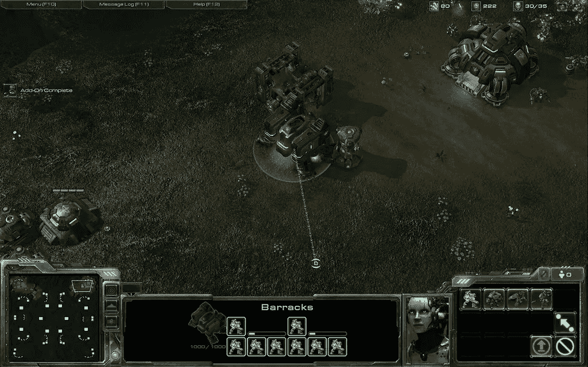
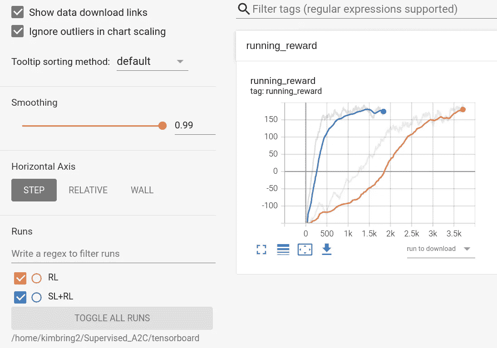

# AlphaStar 实施系列—监督学习

> 原文：<https://medium.com/nerd-for-tech/alphastar-implementation-series-part7-d28468c07739?source=collection_archive---------3----------------------->

在过去的帖子中，我展示了如何使用演员-评论家强化学习算法解决 PySC2 的一个小游戏。在具有简单结构的迷你游戏的情况下，代理不需要人类专家数据来进行行为克隆。然而，在实际的 1 对 1 游戏中，由于过多的状态和动作，训练时间呈指数增长。在这篇文章中，我将检查阿尔法星模型实际上可以使用人类重放数据模拟人类的游戏。

# 热身

行为克隆最简单的方法是用网络在重放状态下的输出动作和重放动作的差值作为损失值。首先尝试用 OpenAI Gym 的 LunarLander-v2 环境做一个实验，这是一个简单的环境，看看这种方法对演员-评论家强化学习是否真的有效。

解释的[代码](https://drive.google.com/file/d/1h7qF1LjuICvMrownSnfTuaKUxkoFFUPD/view?usp=sharing)和[数据集](https://drive.google.com/drive/folders/1oBBGCApt2TzpEC8mSZYrZgrZGaSD2CFt?usp=sharing)可以从 Google Drive 下载。

首先，我改变 Tensorflow 的[影评人官方代码](https://www.tensorflow.org/tutorials/reinforcement_learning/actor_critic)的环境、网络大小，训练它直到奖励达到 200。我用这个[训练过的模型](https://drive.google.com/drive/folders/14PyeXlKr2vKTxm5zctajYBjMLvbZl7sB?usp=sharing)用下面的代码创建专家数据。

收集 A2C 专家数据进行行为克隆的代码

请尝试理解原代码的每一部分，因为我重用它的代码，使监督学习的一部分。接下来，根据专家数据的作用和网络的作用之间的差异来计算损失。

A2C 的监督损失

与强化学习的损失不同，对于按奖励计算的批评家网络来说，没有损失。您可以通过运行共享 Jupyter 笔记本文件的下方单元格来开始监督学习。

A2C 行为克隆的主循环

train_supervised_step 是与原始代码的 train_step 函数相对应的函数。完成行为克隆后，您可以使用强化学习方法训练代理。

行为克隆的 A2C 训练监督步长函数

run_supervised_episode 函数对应于从实际环境中收集数据的 run_episode 函数。这个函数从我们之前制作的 npy 类型文件中收集用于监督学习的专家数据。

A2C 的行为克隆运行监督集功能

我们可以使用新创建的监督学习来训练强化学习。首先，将我们要训练的模型的动作逻辑和监督模型保存在一起。

使用监督学习模型运行强化情节

Kl 散度方法可用于计算行动逻辑之间的差异，因为它们是概率分布。

计算 KL 损失

将计算出的 KL 损耗加到 RL 损耗上来训练模型。

有 KL 损失的训练强化学习

这样，代理可以比单独使用强化学习更快地学习，如下图所示。

监督 A2C 的报酬图

# 星际争霸 2 的监督学习

在 LunarLander-v2 环境中，仅使用强化学习就可以充分解决这个问题。但像《星际争霸 2》这种有复杂观察和动作空间的情况下，共同使用监督学习来缩短训练时间是很常见的。在 LunarLander-v2 环境中，可以使用通过强化学习训练的模型来生成数据，并且仅针对一个动作计算损失。但是对于星际争霸 2 的情况，人类需要直接玩游戏来收集数据，动作类型和全部 13 个动作参数都需要考虑损耗。

1.  使用两个兵营陆战队 rush 在 Simple64 地图回放人族 vs 人族的文件:[https://drive . Google . com/drive/folders/1 lqb _ _ ublklfw 4 jiig 6 kso-D0e _ wrng wk](https://drive.google.com/drive/folders/1lqb__ubLKLfw4Jiig6KsO-D0e_wrnGWk)
2.  PySC2 的监督培训代码:【https://github.com/kimbring2/AlphaStar_Implementation 

下载重放文件后，需要将其转换为 hkl 文件格式。详见[https://github . com/Kim bring 2/alpha star _ Implementation # supervised-training](https://github.com/kimbring2/AlphaStar_Implementation#supervised-training)。

下面的代码基本上使用一键编码、分类交叉熵和 L2 正则化来计算 Pysc2 中监督学习的损失，类似于 LunarLander-v2 环境。

PySC2 监督学习的损失函数

但在《星际争霸 2》中，即使人类执行了特定的动作类型，也可能无法体现，这取决于当前游戏中是否可用。因此，它通过 available_actions 特性进行过滤。此外，即使在 action 参数的情况下，它也会被过滤，因为特定的操作类型只需要有限的 action 参数。

下图是《星际争霸 2》监督学习的损失。由于动作和观察空间的复杂性，训练需要非常长的时间。

星际争霸 2 的训练损耗图

以下视频是训练好的模型在 5 天左右，使用 1000 左右的专家数据的评估结果。我们可以确认智能体在某种程度上模仿了人类的行为。

星际争霸 2 的监督学习评估

# 结论

在这篇文章中，我们以星际争霸 2 为例，研究了在演员-评论家强化学习中使用专家数据的监督学习方法。考虑到几乎所有实验室外的实际环境都很复杂。人的数据和多种行动方法的损失计算应该被认为是高性能的代理开发的基本要素。