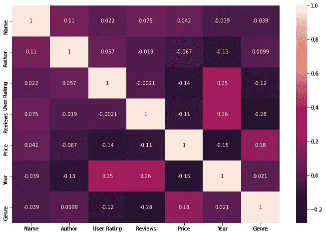
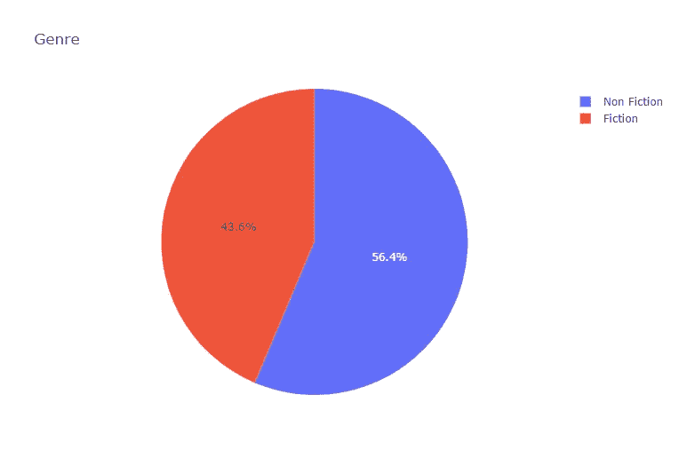
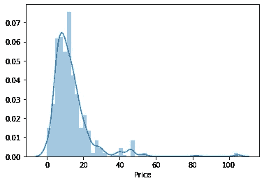
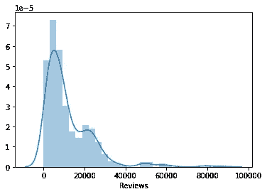
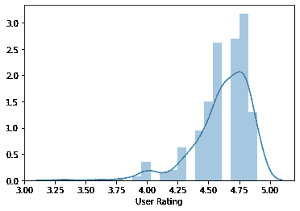
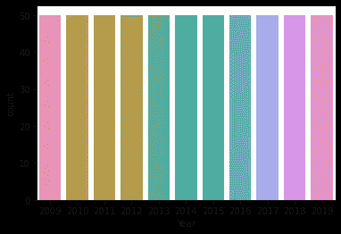
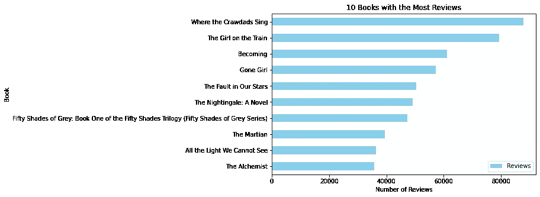
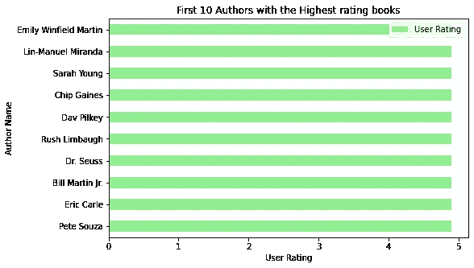
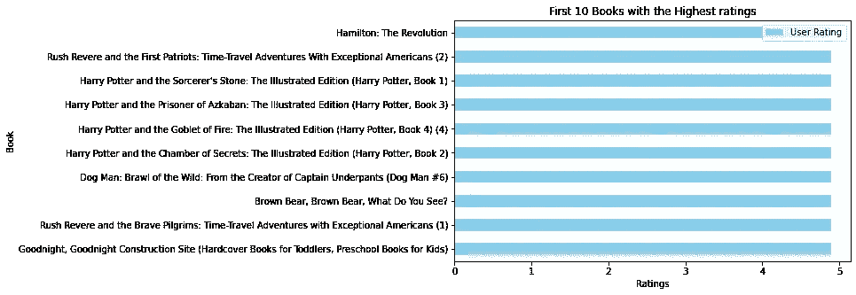
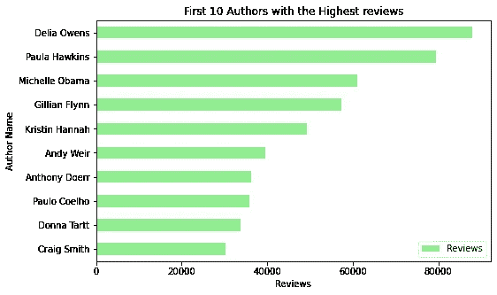

# 亚马逊畅销书:EDA 和回归模型

> 原文：<https://medium.com/nerd-for-tech/amazon-bestsellers-eda-and-regression-model-8f7cf45378df?source=collection_archive---------25----------------------->

*“一本伟大的书应该给你留下许多经历，到最后还会略显疲惫。你一边读书一边过着好几辈子。”——*威廉·斯泰伦

*安妮·拉莫特曾经说过:“对我们中的一些人来说，书籍几乎和地球上的其他任何东西一样重要。从这些又小又平又硬的纸片中，一个接一个的世界展现出来，这些世界为你歌唱，给你带来舒适和宁静，或者让你兴奋，这是一个多么大的奇迹。书籍帮助我们了解我们是谁，以及我们应该如何表现。他们向我们展示了社区和友谊的含义；他们向我们展示如何生存和死亡。”*


这个世界充满了故事、奇迹、神秘、惊险等等！在这个世界上，书籍是激励我们、娱乐我们、帮助我们获得更多知识的源泉！有时他们带我们环游世界，有时他们带我们进入想象的世界，有时他们只是通过精彩的故事让我们开心，让我们微笑，而有时他们也通过激动人心的故事和神秘事件让我们兴奋。所以，现在我要在这里谈谈一些最好的书。我收集了亚马逊 50 本畅销书的数据。让我们探索这些数据，并尝试从中得出一些结论！

Kaggle 上有 [***数据集***](https://www.kaggle.com/sootersaalu/amazon-top-50-bestselling-books-2009-2019) 。

**EDA 是什么？**

*   在统计学中，探索性数据分析是一种分析数据集以总结其主要特征的方法，通常使用统计图形和其他数据可视化方法。
*   EDA 是为了看看数据能告诉我们什么，而不仅仅是正式的建模或假设检验任务。

**要执行的步骤:**

1.  导入数据
2.  数据解释
3.  数据清理(使用标签编码器)
4.  数据可视化
5.  数据建模:1。线性回归 2。决策树分类器

**讨论的要点:**

1.  独特图书的总数
2.  唯一作者总数
3.  虚构和非虚构书籍的百分比
4.  书籍中与年份有关的变化
5.  书籍的分布:价格，评论，用户评分
6.  评论最多的前 10 本书，最高用户评级，最高评论，最高用户评级的作者。
7.  线性回归模型
8.  误差的计算(梅伊，R2 评分)
9.  用于类型预测的决策树分类器
10.  用于用户评分预测的决策树分类器

**1。** [**导入数据**](https://www.kaggle.com/arya24/bestsellers-user-rating-prediction/notebook#1.-Import-Data)

```
*#Importing required libraries*

**from** **sklearn.model_selection** **import** train_test_split                
**from** **sklearn.tree** **import** DecisionTreeClassifier                     
**from** **sklearn.metrics** **import** accuracy_score                          
**from** **sklearn.metrics** **import** classification_report                   
**from** **sklearn** **import** tree    
**from** **sklearn.preprocessing** **import** LabelEncoder
**import** **seaborn** **as** **sns**
**import** **matplotlib.pyplot** **as** **plt**
**import** **plotly.express** **as** **px**
**import** **math**
**from** **sklearn.metrics** **import** mean_absolute_error
**from** **sklearn.metrics** **import** mean_squared_error
**from** **sklearn.metrics** **import** r2_score
**from** **PIL** **import** Image*#Importing Data
df = pd.read_csv('../input/amazon-top-50-bestselling-books-2009-2019/bestsellers with categories.csv')*
```

**2。** [**数据解读**](https://www.kaggle.com/arya24/bestsellers-user-rating-prediction/notebook#2.-Data-Interpretation)

在这里，我检查统计数据、空值(如果有的话)、行和列的总数。

**3。** [**数据清理**](https://www.kaggle.com/arya24/bestsellers-user-rating-prediction/notebook#3.-Data-Cleaning-:-Label-Encoding)

在这里，我使用标签编码器进行数据清理。标签编码是指将标签转换成数字形式，从而将其转换成机器可读的形式。然后，机器学习算法可以以更好的方式决定这些标签必须如何操作。这是监督学习中结构化数据集的重要预处理步骤。这里执行以下 4 列的标签编码:流派、名称、作者、用户评级。这里有一个例子:

```
from sklearn.preprocessing import LabelEncoder

df1 = df.copy(deep = True)
Genre = LabelEncoder()
df1['Genre'] = Genre.fit_transform(df['Genre'])
```

**4。** [**数据可视化**](https://www.kaggle.com/arya24/bestsellers-user-rating-prediction/notebook#4.-Data-Visualization)

1.  检查相关性:

相关矩阵是表示给定数据中属性之间“相关性”的表格数据。

```
corr1 = df4.corr()
plt.figure(figsize = (12,8))
sns.heatmap(corr1,annot=True)
plt.show()
```



2.小说还是非小说？

为了得到虚构和非虚构书籍的百分比，使用了饼状图。

```
pie_df = df.Genre.value_counts().reset_index()
pie_df.columns = ['Genre', 'count']
fig = px.pie(pie_df, values='count', names='Genre', title='Genre',
             color_discrete_sequence=['blue', 'light green'])
fig.show()
```



3.价格、评论和用户评级图:为此，使用 distplots。distplot 代表数据的单变量分布，即变量相对于密度分布的数据分布。代码如下:

```
sns.distplot(df["Price"])
sns.distplot(df["Reviews"])
sns.distplot(df["User Rating"])
```



价格、评论、用户评级图

4.相对于年份的变化:

```
sns.countplot('Year', data=df)
plt.show()
```



5.这里有 10 本评论最高的书，10 位作者评价最高的书，10 本评价最高的书和 10 位作者评价最高的书..

下图的代码示例如下:

```
df_new1 = df.drop_duplicates(subset=['Name'])

highest_reviews = df_new1[['Name','Reviews']].groupby('Name').sum().sort_values('Reviews', ascending=False)

highest_reviews.iloc[:10].plot(kind='barh', color=['skyblue', 'blue'])
plt.gcf().set_size_inches(8, 5)
plt.title('10 Books with the Most Reviews')
plt.gca().invert_yaxis()
plt.xlabel('Number of Reviews')
_ = plt.ylabel('Book')
```



**5。** [**数据建模**](https://www.kaggle.com/arya24/bestsellers-user-rating-prediction/notebook#5.-Data-Modelling-)

```
*#Dependent variables*
X = np.array(df4[['Name', 'Author', 'Reviews', 'Price', 'Year', 'Genre']]) 

*#Independent variables*
y = np.array(df4["User Rating"])X_train, X_test, y_train, y_test = train_test_split(X, y, test_size=0.30, random_state = 100)
```

[**回归模型:**](https://www.kaggle.com/arya24/bestsellers-user-rating-prediction?scriptVersionId=52069679&cellId=35)

当我们希望根据一个变量的值来预测另一个变量的值时，就会用到它。我们要预测的变量称为因变量(有时称为结果变量)，我们用来预测另一个变量的值的变量称为自变量(有时称为预测变量)。

```
*#Linear Regression*
from sklearn import linear_model
reg = linear_model.LinearRegression()

reg.fit(X_train, y_train)
y_1 = reg.predict(X_test)print("MAE: " + str(mean_absolute_error(y_test, y_1)))
print("R2_score: " + str(r2_score(y_test, y_1)))MAE: 1.666678590798705
R2_score: -0.009373168157821965
```

[**决策树:预测流派**](https://www.kaggle.com/arya24/bestsellers-user-rating-prediction?scriptVersionId=52069679&cellId=40)

决策树以树结构的形式建立分类或回归模型。它将一个数据集分解成越来越小的子集，同时一个相关的决策树被增量开发。决策树可以处理分类数据和数值数据。

```
X1 = np.array(df4[['Name', 'Author','Reviews', 'Price', 'Year', 'User Rating']])
y1 = np.array(df4[['Genre']])
from sklearn import tree

tree1 = tree.DecisionTreeClassifier(max_depth=4)
tree1 = tree1.fit(X1, y1)
X1_train, X1_test, y1_train, y1_test = train_test_split(X1, y1, test_size=0.30, random_state = 1)
tree1.score(X1, y1)0.7963636363636364
```

类似地，决策树用于预测用户评分。它给出的分数是. 44，没那么好(你可以查看 [*GitHub 库*](https://github.com/aryatalathi/Amazon-Bestsellers-EDA-and-REGRESSION-MODEL-) 或者 [*Kaggle 笔记本*](https://www.kaggle.com/arya24/bestsellers-user-rating-prediction/notebook#5.-Data-Modelling-) 中的代码)。因此，我们可以说线性回归模型在用户评分预测中工作良好。

# 结论:

1.  独特图书总数:351。
2.  独立作者总数:248。
3.  平均用户评分:4.6。
4.  均价:13.10。
5.  最低评分:3.3 |最高评分:4.9。
6.  书籍数量最多的是 2019 年，而最少的是 2009 年。
7.  56.4 %的书是非虚构的，而 43.6%是虚构的。
8.  决策树分类器对于类型预测来说足够好，但是对于用户评级预测来说就不那么准确了。
9.  线性回归模型在用户评分预测方面表现良好。

完整代码可以在这里找到: [***GitHub 资源库***](https://github.com/aryatalathi/Amazon-Bestsellers-EDA-and-REGRESSION-MODEL-) ， [***Kaggle 笔记本***](https://www.kaggle.com/arya24/bestsellers-user-rating-prediction/notebook)

谢谢大家！

ARYA·塔拉西