# 亚马逊推出 Re:Skill Program 2021 |免费亚马逊 t 恤|免费亚马逊课程

> 原文：<https://medium.com/nerd-for-tech/amazon-launched-re-skill-program-2021-free-amazon-t-shirts-free-amazon-courses-88c4b95c9752?source=collection_archive---------0----------------------->

## AWS re:技能——赚取奖励。

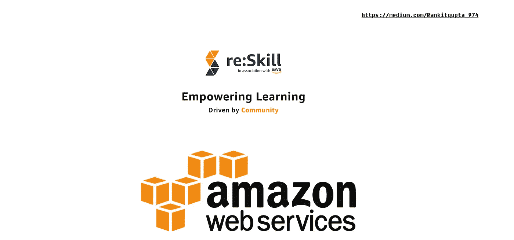

图片来源:[安基特·古普塔](/@ankitgupta_974)

## *** * *预警:**

**这不是任何人付费或推广或推广的博客。我只是想把这些信息分享给大家，这样每个人都可以提高他们的技能，也可以在 re:skill platform(由 AWS 支持)的博客部分分享他们的博客。**

嗨，极客们，这个博客将要通知你们亚马逊网络服务 AWS 已经启动了它的 re:Skill Program 2021。如果你是初学者，这个程序一定会帮助你成为 AWS 和云计算的专家。这个项目帮助博客作者分享他们的博客，也帮助专业人士引领 AWS 行业。

# 什么是 AWS re:技能计划 2021？

[**re:Skill**](https://awsreskill.com/signup?source=d89ae6c3&medium=direct)**与 AWS Community 合作，是由 [CodeOps Technologies LLP](https://codeops.tech/) 开发的一个平台，帮助开发者在 AWS 平台上学习和 [upskill/reskill](https://awsreskill.com/signup?source=d89ae6c3&medium=direct) 。 [re:Skill](https://awsreskill.com/signup?source=d89ae6c3&medium=direct) 与 **AWS 社区**合作，帮助开发者了解并认识 **AWS 平台**上的广大社区。**

**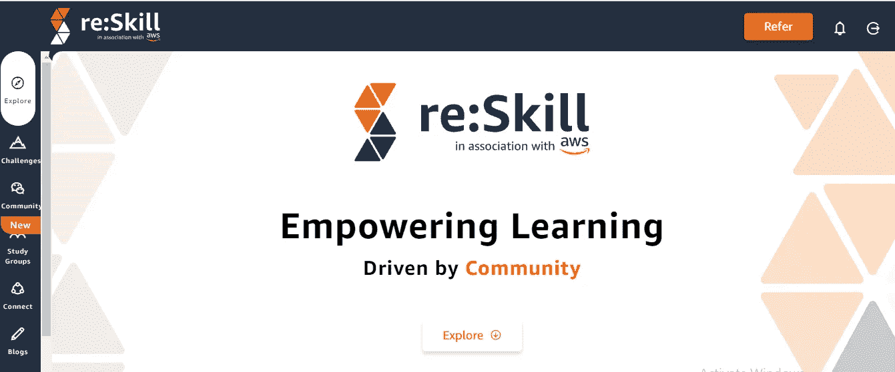**

**图片来源:[安基特·古普塔](/@ankitgupta_974)**

**亚马逊网络服务 **AWS** 邀请您:**

1.  ****提高技能** —充分利用这个平台，通过复习学习内容和接受挑战，在 AWS 平台上重新获得技能。**
2.  ****赢取奖励** —通过挑战、上传您的证书等方式获得积分**
3.  ****建立关系网** —联系专家、社区成员&领导和其他热情的爱好者，扩大你的关系网，加速你的职业生涯迈向下一个台阶。您也可以通过提交您最近的博客做出贡献，并通过推荐您的朋友和同事来帮助扩展平台(并为此获得积分)。**

****

**图片来源:[安基特·古普塔](/@ankitgupta_974)**

# **主要亮点**

1.  **被认定为国家级**专家**。
    2)赚取 **AWS Goodies** 。所有候选人都可以免费获得**数字徽章**。价值卢比的现金奖励。5000 **亚马逊优惠券**。**

**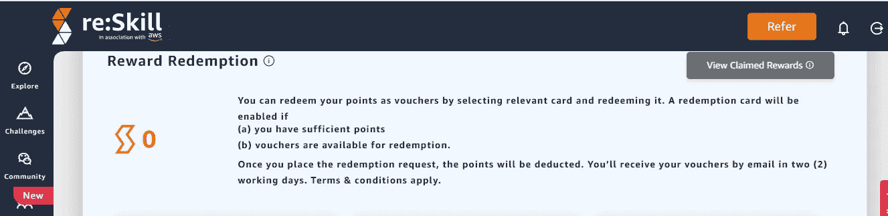**

**图片来源:[安基特·古普塔](/@ankitgupta_974)**

**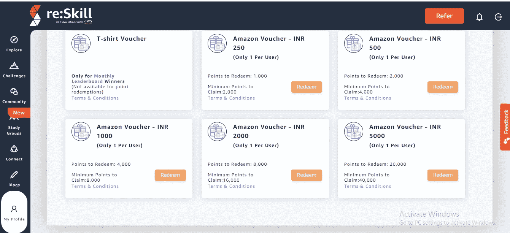**

**图片来源:[安基特·古普塔](/@ankitgupta_974)**

**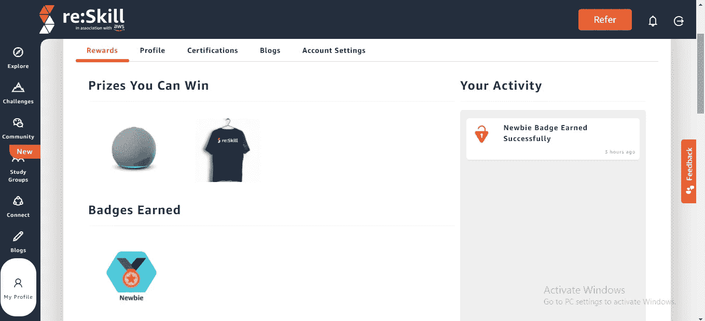**

**图片来源:[安基特·古普塔](/@ankitgupta_974)**

**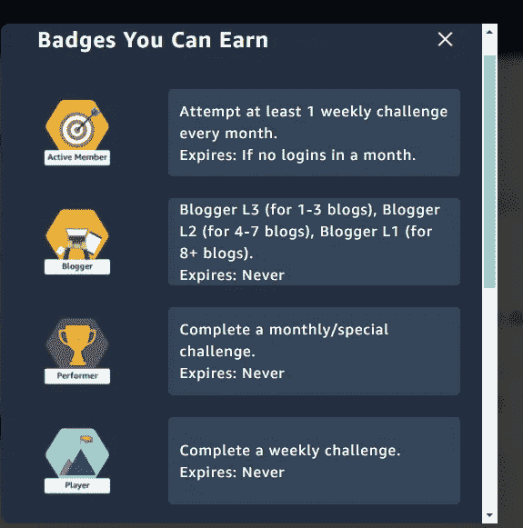**

**图片来源:[安基特·古普塔](/@ankitgupta_974)**

# **谁应该出席/参与？**

**所有的科技爱好者都可以参加**。如果你有科技创新的天赋，这可能是你的机会。浏览**学习视频**并接受**挑战，**并获得**赢取徽章和积分**的机会(正如他们所说，学习是值得的！).每周每月都有新的挑战；所以要经常重温，尝试新的挑战(也要留意特殊的挑战！).****

**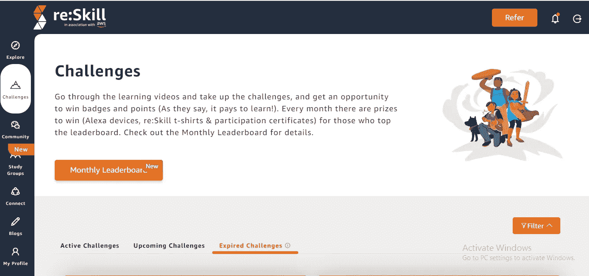**

**图片来源:[安基特·古普塔](/@ankitgupta_974)**

**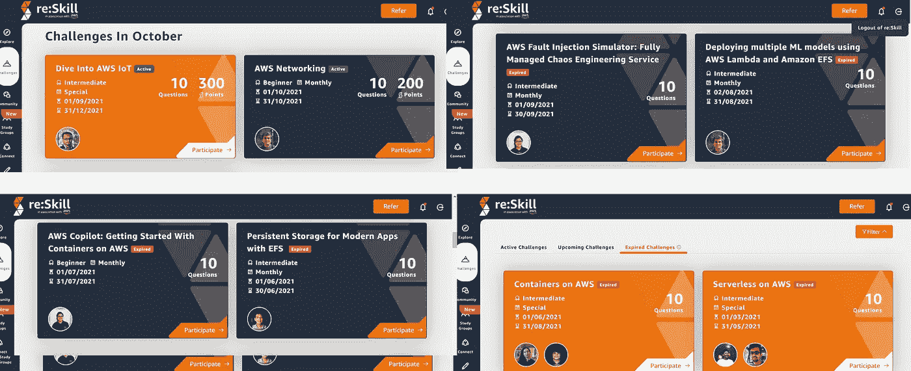**

**图片来源:[安基特·古普塔](/@ankitgupta_974)**

# **如何入学？**

1.  **点击此链接访问网站— [**回复:技能**](https://awsreskill.com/signup?source=d89ae6c3&medium=direct)**
2.  **使用电子邮件、亚马逊帐户、脸书帐户或谷歌帐户创建您的帐户。**

**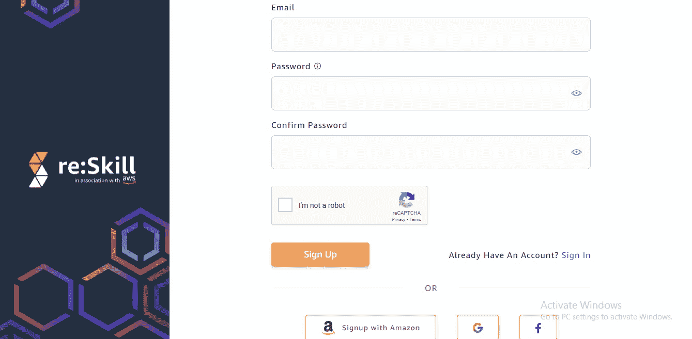**

**图片来源:[安基特·古普塔](/@ankitgupta_974)**

**3.只需 [**登录 Re:skill**](https://awsreskill.com/signup?source=d89ae6c3&medium=direct) 平台，你就准备好参与了。**

**在**完成测验**并获得 1000 分后，你就有资格**兑换**你的 **T 恤**。然后你会收到一封电子邮件。**

## ****免费 AWS T 恤&奖励— 3 种方式:****

*   **你对这里列出的博客感兴趣吗？分享你的博客，并且每年赚取高达 **1000 奖励积分**！-每个被批准的博客 50 分(如果被拒绝，则无分)，每年最多 20 篇被批准的博客帖子。**

**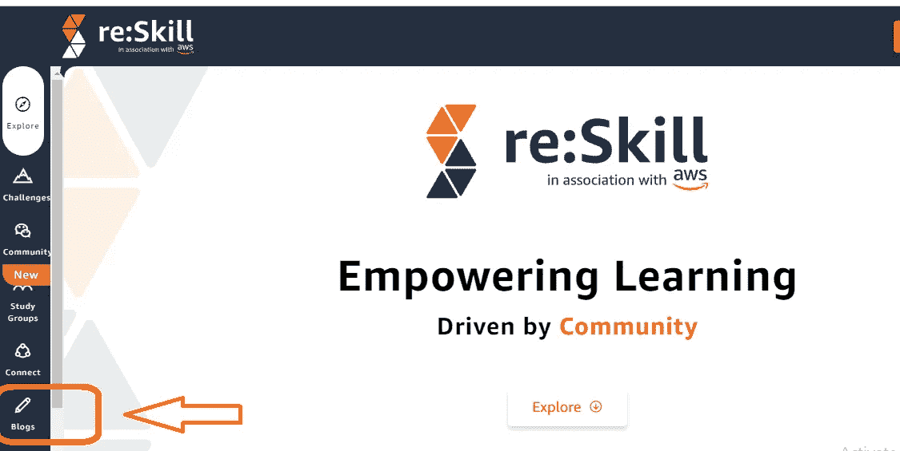**

**图片来源:[安基特·古普塔](/@ankitgupta_974)**

**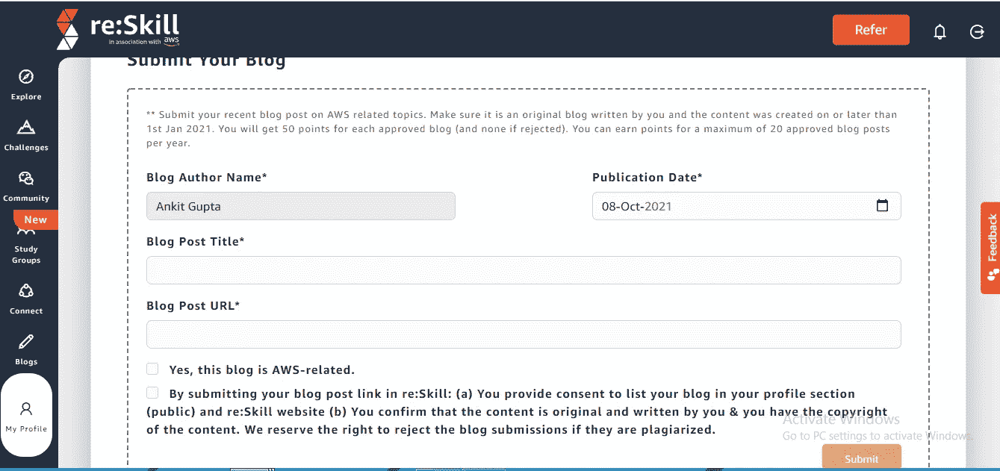**

**图片来源:[安基特·古普塔](/@ankitgupta_974)**

*   **帮助社区，赚取高达 **1000 积分**。**
*   **从你的圈子里推荐，赢取积分！您每月最多可获得 **10 次推荐积分&每次成功的推荐注册可获得 25 积分**。**

****

**图片来源:[安基特·古普塔](/@ankitgupta_974)**

****这是我的引荐链接:**[https://awsreskill.com/signup?source=d89ae6c3&中=直](https://awsreskill.com/signup?source=d89ae6c3&medium=direct)。**

****结语:**
希望这篇博客对你有所帮助，为你节省时间和金钱，让你可以和你爱的人一起度过。保持微笑，展现爱心！**

****参考文献:****

** [## 回复:技能

### 回复:Skill 与 AWS 社区合作，为开发者提供了一个学习和提升技能的平台。你可以做很多…

awsreskill.com](https://awsreskill.com/) 

**作者领英:**

 [## 印度马哈拉施特拉邦 ankit Gupta-Pune |职业简介| LinkedIn

### 我是深度学习爱好者/学习者，正在寻找一个可以贡献和提高技能的机会…

www.linkedin.com](https://www.linkedin.com/in/ankit-gupta2/) 

**其他博客:**

 [## 在亚马逊 S3 存储桶之间迁移数据

### 在同一个账户里。

aws .平原英语. io](https://aws.plainenglish.io/migrate-data-between-amazon-s3-buckets-db9c37d81708)  [## 什么是亚马逊 S3 复制？

### 关于 AWS S3 复制，您需要知道的一切:类型、要求、使用、时间控制

aws .平原英语. io](https://aws.plainenglish.io/what-is-amazon-s3-replication-fbb9c45507b3)  [## 如何在亚马逊注册域名

### 使用 AWS Route53 注册域名。

aws .平原英语. io](https://aws.plainenglish.io/how-to-register-a-domain-name-with-amazon-80a1bf809859) 

**感谢您的阅读，如果您喜欢请点击拍手按钮。**

**关注我们了解更多内容。**

**查看更多 AWS 相关内容** [书呆子科技](https://medium.com/nerd-for-tech) **。**

*更多内容看* [书呆子看理工](https://medium.com/nerd-for-tech) ***。*****