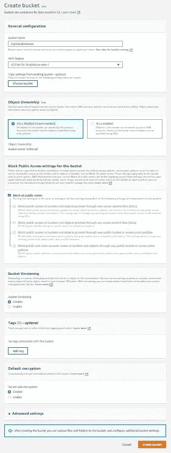
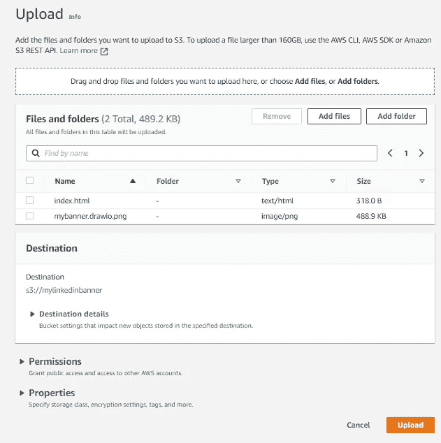
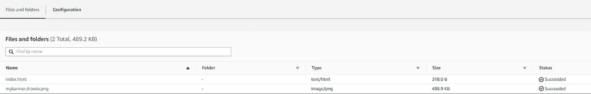
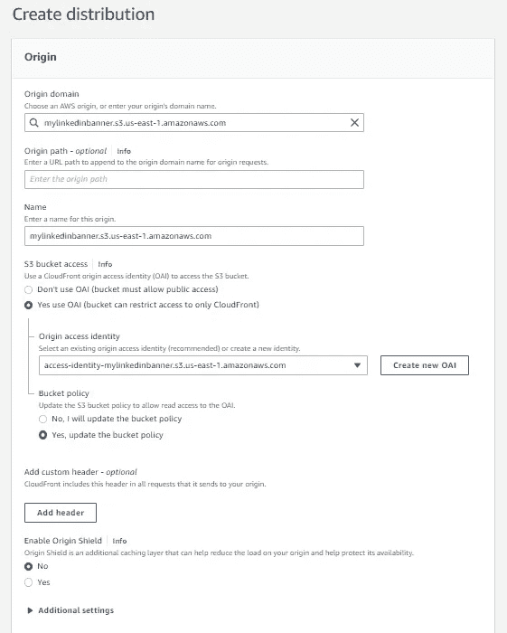
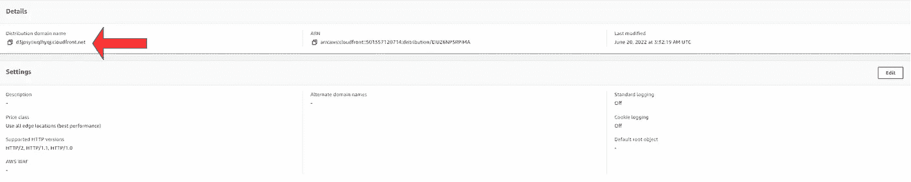
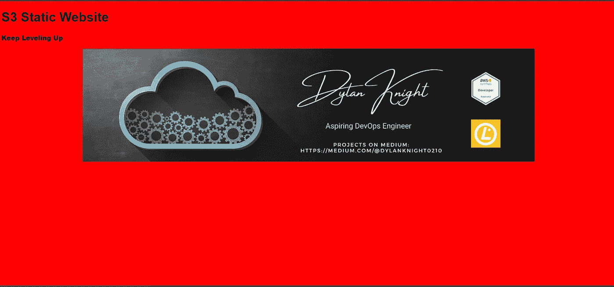

# 亚马逊 S3 托管静态网站

> 原文：<https://medium.com/nerd-for-tech/amazon-s3-to-host-static-website-a949bfa9d9f7?source=collection_archive---------5----------------------->

## 利用 CloudFront 提高可靠性和可用性

谢尔盖·佐尔金在 [Unsplash](https://unsplash.com/s/photos/web?utm_source=unsplash&utm_medium=referral&utm_content=creditCopyText) 上拍摄的照片

在我们开始创建这个项目之前，让我们讨论一下什么是亚马逊 S3 和 CloudFront。S3(简单存储服务)是一种对象存储服务，用于将数据存储在存储桶中。S3 是一项全球性服务，为我们提供 99.999999999%的耐用性，也称为 11 个 9；但是，这些存储桶是特定于地区的。CloudFront 是一个内容交付网络(CDN ),允许我们在边缘位置缓存数据。这为访问内容提供了更好的延迟和更快的访问速度，对于提供快速安全的网站来说是最佳的。

## S3 静态网站

步骤 1)创建一个存储桶:

*   进入亚马逊 S3 控制台，选择 ***创建桶*** 。 ***(*** 记住桶名必须是唯一的，不能包含空格或大写字母)
*   输入 ***桶名*** 并选择 ***AWS 区域***
*   将其他一切设置为默认设置，并点击`Create bucket`

步骤 2)启用静态网站托管:

*   在新创建的桶内，选择 ***属性*** 选项卡 ***。*** 然后在 ***静态网站托管下，*** 选择`Edit`
*   选择 ***启用*** 静态网站托管
*   对于*索引文件，*输入 index.html
*   现在选择`Save changes`

步骤 3)将自定义 index.html 和图像上传到存储桶

*   选择 ***对象*** 标签，点击`Upload`
*   从这里上传了我定制的***index.html***文件和我个性化的***LinkedIn banner***；然而，你可以简单地上传你选择的图片。

*   再次选择`Upload`,我们现在可以看到两个对象都成功上传到桶中。

## 云锋

*   转到 CloudFront，点击`Create a CloudFront distribution`
*   对于 ***原点域*** ，选择新创建的 S3 桶创建
*   在 ***S3 bucket access*** 下，选择⦿ *Yes use OAI (bucket 可以限制只能访问 CloudFront)*
*   现在在**下*原点接入标识*下**，选择`Create new OAI`。它会自动调出一个带有新 OAI 的屏幕，你所要做的就是点击`Create`。
*   对于 ***斗策略*** ，选择⦿Yes，更新斗策略。这将为我们的 S3 桶创建并附加一个策略，并允许我们通过 CloudFront 访问我们的对象。
*   向下滚动到 ***默认根对象*** ，在【index.html】中添加
*   *将其他一切设置为默认设置，并选择`Create distribution`*

**

*   *CloudFront 发行版现在正在部署。你必须等几分钟才能完成。部署完成后，可以复制 ***分发域名*** 并粘贴到新的标签页中。然后按回车键。*

****

## *干得好！我们已经与亚马逊 S3 正式创建了一个静态网页，并使用 CloudFront 向我们提供内容。*