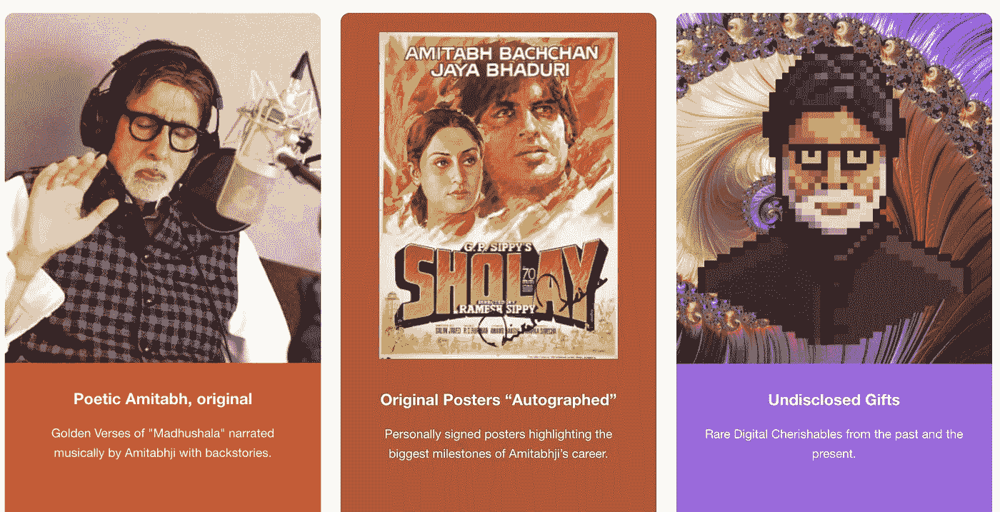
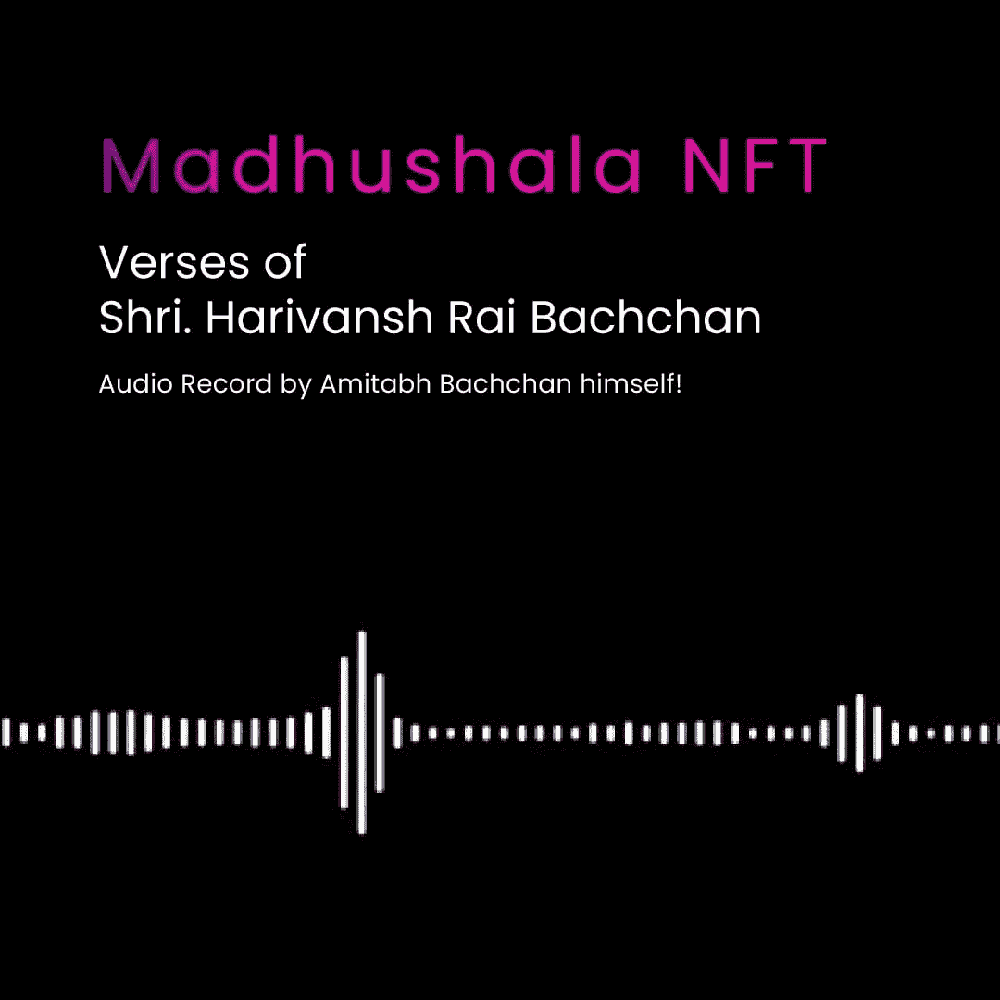
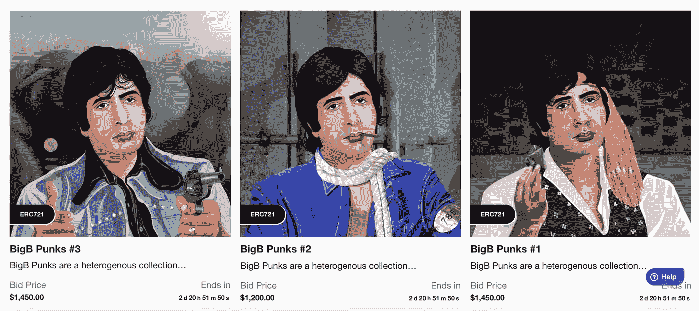
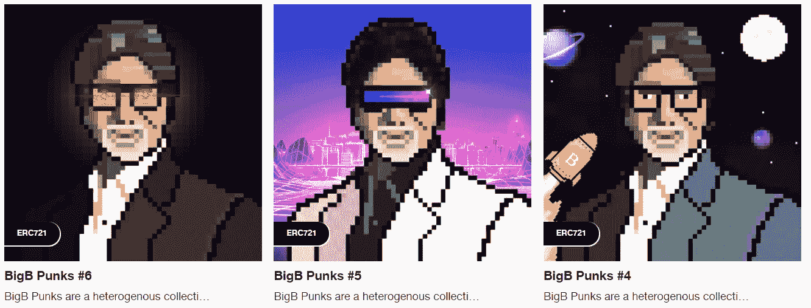

# 阿米特巴·巴强·NFT 来了！宝莱坞明星将如何影响印度的 NFT 市场？

> 原文：<https://medium.com/nerd-for-tech/amitabh-bachchan-nft-drop-is-here-how-will-the-bollywood-stars-impact-indias-nft-market-8e6428a752f1?source=collection_archive---------9----------------------->

来自 amitabh.beyondlife.club 的 NFTs

现在是 2021 年，几乎已经成为了 NFTs 的时代。随着越来越多的全球用户开始兑现，不可替代的令牌正在撼动数字空间。NFT 在印度的地位如何？如果这是你心中的问题，宝莱坞巨头萨尔曼·可汗和阿米特巴·巴强已经宣布推出 NFTs，首次亮相加密领域。传说中的条目将 NFT 的地位说得很清楚，不是吗？

在深入研究之前，让我们先了解一下什么是不可替代的令牌，以及它们为什么越来越受欢迎。

**国家森林公园的概念**

与任何实物资产不同，不可替代的代币是数字权利主张，其所有权记录在区块链网络上的公共账本上。其优势在于，它确保了完全的透明性，任何数据或数字资产都不能被更改或修改。NFT 的另一个显著特点是它们中的每一个都是独一无二的。当我说独特的时候，它意味着一个 NFT 永远不能与另一个互换，因为它们的价值不同，而且每一个都以自己的方式是罕见的。等等，不要就此下结论。还有更重要的事情。

只要代币存在，创作者作为 NFT 代币铸造的数字资产就可以获得版税特权。每次买家在二级市场上出售 NFT，代币的原始所有者都会从销售中获得一小部分。这给创作者带来了长期利益，当然，投资者也从中获利。你能看出为什么 NFT 得到所有的炒作，吸引全球用户的魅力吗？

**NFT 进入印度次大陆…**

随着 NFT 潮流的出现，许多印度人，尤其是最受尊敬的宝莱坞明星，如阿米特巴·巴强、萨尔曼·可汗和板球运动员迪内什·卡蒂克、里沙布·潘特，都将此视为开发蓬勃发展的市场的机会。如果你是在问，那是唯一的原因吗？答案肯定是否定的。如果不利用数字空间，如何与精通技术的人群保持联系？NFTs 被视为一种与数百万粉丝互动的无限制方式。

随着阿米特巴·巴强的 NFTs 于 11 月 1 日发布，它给加密千禧一代带来了绝对的喜悦。我感到更加欣喜若狂的是在这个话题上放一盏灯，这将是下一节的亮点。

**展开阿米特巴·巴强·NFT 的收藏！**

我们标志性的 [**阿米特巴·巴强 NFT 系列**](https://amitabh.beyondlife.club/) 是最近在印度 NFT 地区的热门产品。阿米特巴·巴强主题的 NFT 已经在 BeyondLife.club 平台上进行现场拍卖，拍卖将持续 3 天！你知道它们是什么吗？继续阅读博客，它一定会很有趣。

**我们传奇英雄的经典收藏**

**Madhushala NFTs**

智慧记录在阿弥陀佛的声音中，保留了马达胡沙拉诗歌壮丽诗句的精华和风味。嗯，这就是 [**马德胡沙拉 NFT**](https://amitabh.beyondlife.club/explore/category/Madhushala/J0RLMBoWUoBv2PzQ) 的全部意义。

**战利品箱 NFT**

惊喜来自一个战利品盒包装。战利品盒提供了探索和发现获胜的机会。它可以是任何东西，比如价值 10 万卢比的老式电影海报，价值 10000 卢比的大朋克，或者价值 5000 卢比的彩色艺术。

**亲笔签名的艺术电影海报 NFTs**

通过 [**旧电影海报作为 NFTs**](https://amitabh.beyondlife.club/explore/category/Physical%20Posters/QobmxgwyU9Bl9LzY) 赋予珍惜阿弥陀佛常青时刻的机会。它还带有阿米塔布本人的签名，以点缀其价值。

BigB 朋克和 NFT 艺术

从“愤怒的年轻人”到“长着法国胡子的教父”，阿米塔布扮演的每一个角色的微缩版都被捕获为 NFTs 以根据趋势进行删减。

阿米塔布生命中所有珍贵的时刻都以他们想象不到的方式让全球粉丝震惊。你现在要做的就是走进 BeyondLife.club，打开钱包，找到你最想要的 NFT。不容错过的是，交易尽可能地方便，即使是非加密用户也能轻松购买。是的，就此而言，借记卡或信用卡支付都可以。

**NFT 及其与印度的关系**

随着许多名人、板球运动员和时装设计师进入这一领域，NFTs 给人留下了不容置疑的印象。艺术家们认为这是一个无需中间人介入就能迅速接触到观众的机会。利用 NFT 的趋势不仅仅是创作者/名人的福音，投资者/粉丝也以自己是真正的粉丝而自豪。

**最终触摸，**

很明显，NFTs 是一个稳赚数百万的方法，因为这个概念每天都在加速增长。我想我不是唯一一个对这件事感到兴奋的人。还有谁想从阿米塔布的巴克强·NFT 那里得到更多？如果你还没有购买阿米塔布 NFT，那么最好现在就赶快用胜利来沐浴自己。