# 奥斯卡最佳影片奖得主的 R 分析

> 原文：<https://medium.com/nerd-for-tech/an-analysis-of-best-picture-oscar-winners-using-r-2de5fd37bc87?source=collection_archive---------7----------------------->

我试图练习数据搜集，以及使用`tidyverse`来执行一些探索性的数据分析。我想到了用 IMDB 的数据来分析奥斯卡最佳影片奖的想法，这将使我能够做到这两点。我搜遍了 IMDb，找到了这个[列表](https://www.imdb.com/search/title/?groups=best_picture_winner&sort=year,asc&start=page_num01&ref_=adv_nxt)，并开始着手处理它。

# 步骤 1:数据搜集

我使用库`rvest`和`tidyverse`来进行搜集。第一项任务是选择要搜集的数据。我决定刮掉电影的标题，连同发行年份、放映时间、类型、导演姓名、全体演员、IMDb 评分和 IMDb 用户的投票。在这方面，谷歌 Chrome 的 SelectorGadget 插件非常有用，因为你可以指向并选择适当的 HTML 元素，并在代码中使用它们来抓取数据。

除了电影的全部演员表，获取所有其他变量很容易，因为所有数据都可以在页面上找到。代码如下所示:

获取完整的演员阵容有些棘手，因为主页上只提供了一个子集，需要打开电影的专用页面才能访问完整的演员阵容。

到目前为止，我们已经从列表的第一页获得了所有的细节。因为列表上总共有 94 部电影，而一个 IMDb 页面只包含 50 个结果，所以我们需要遍历页面来获得所有结果。我不会用细节来烦你，你可以在本页末尾的链接中找到全部代码。

# 步骤 2:探索性数据分析

除了`tidyverse`，我还使用了库`tidytext`、`forcats`、`broom`和`knitr`进行分析。

让我们先来看看我们从 IMDb 搜集的数据集。

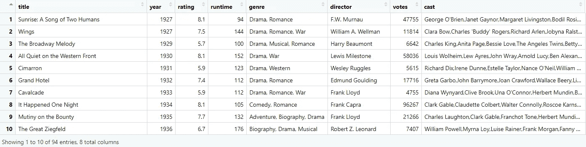

电影一共 94 部，从 1927 年到 2020 年。

## 跨年度评分:

我们从历年最佳影片获奖者的 IMDb 评分开始，试图看看我们是否能找到一种模式。

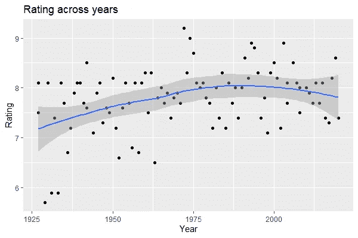

直到 1990 年，收视率似乎略有上升，之后收视率下降。这是否意味着 1975 年至 2000 年间的电影收视率最高？IMDb 将他们的评级系统描述为加权平均值，而不仅仅是算术平均值(投票总数/投票数)，但他们没有披露产生评级的确切方法。我们可以假设这意味着评级较少受电影获得的票数的影响，即电影在 IMDb 用户中有多受欢迎，但是它仍然可以影响评级。尽管如此，我们还是来看看电影跨年度获得的票数吧。

## **跨年度用户投票:**

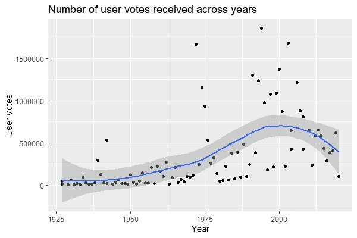

我们确实看到在 1975-2000 年间投票数量的增加，这很可能是那个时期电影中 IMDb 评分增加的原因。

## 电影的运行时间:

被选为最佳影片的电影[往往比一般电影更长](https://www.bbc.com/news/entertainment-arts-25710399)。我们来看看这些电影的运行时间是怎样的。

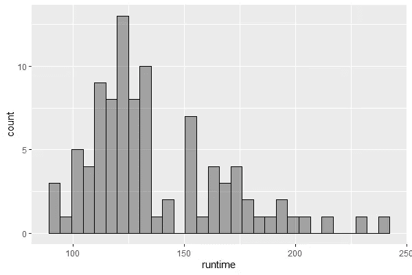

这些电影的运行时间最多在 100 到 140 分钟之间，大约是 2 个小时或更长，但也有一些电影长达 4 个小时！

我们可以看看运行时间是否随着几十年而增加。我在分析中排除了 2020 年，因为这十年到现在只有一年。

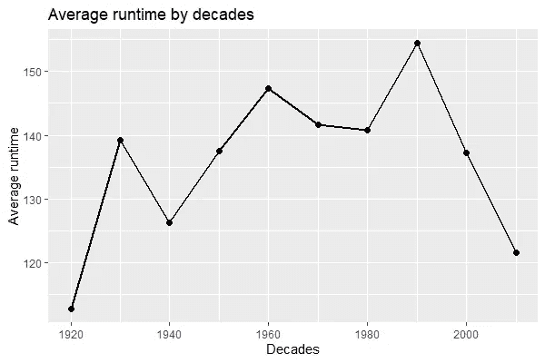

1990 年似乎有最高的平均运行时间。让我们看看 90 年代上映的电影。

看看 90 年代播放时间最长的前三部电影，即《辛德勒的名单》、《泰坦尼克号》和《与狼共舞》，我们发现这些电影都超过了 3 个小时。

但是我们之前说过，有接近 4 小时的电影。所以我们来看看那些播放时间最长的电影。

看看播放时间最长的前 10 部电影，我们看到《飘》排在第一位，播放时间接近 4 小时。90 年代最长的三部电影排在榜单的后半部分。

## 董事:

让我们先来看看获得过不止一部最佳影片的导演。

作为导演，威廉·惠勒获得了 3 部最佳影片，还有 10 部获得了 2 部最佳影片。

让我们来看看威廉·惠勒的最佳获奖影片。

尽管他获得了最多的最佳影片奖，但他的作品并没有最高的 IMDb 评分。

在获得 2 部最佳影片的导演中，他们是连续获奖吗？

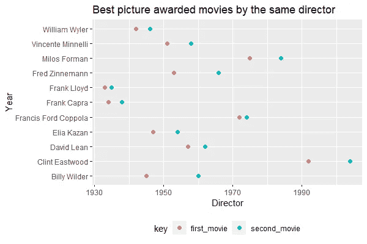

没有一位导演连续获得最佳影片，但是弗兰克·劳埃德和弗朗西斯·福特·科波拉非常接近。比利·怀尔德两次获胜之间的差距最大。

与第一次获奖相比，这些导演的第二次最佳影片奖的评分更高，还是观众对他们的第二次获奖反应不佳？

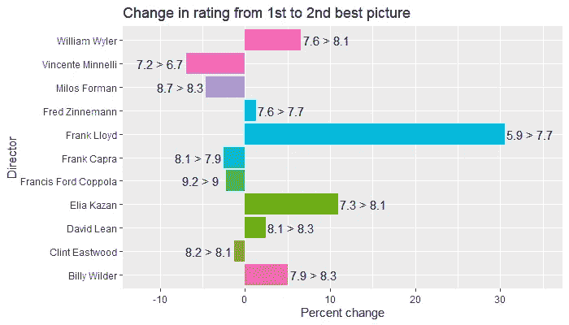

我们看到超过一半的导演在他们的第二部最佳影片中获得了更好的评价。弗兰克·劳埃德似乎进步最大，他从第一场胜利的 5.9 分升至第二场胜利的 7.7 分。但是，那些第二次获得最佳影片的导演在 IMDb 评分方面较低，他们做得并不差，因为第二部电影的评分与第一部相比有小幅下降。

# 流派:

让我们来看看获得奥斯卡最佳影片奖的电影类型。

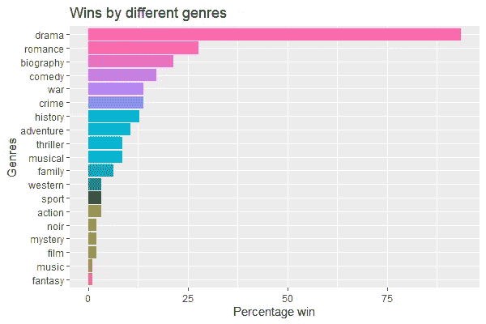

学院显然热爱戏剧！属于这一类型的电影远远领先于其他任何电影。

但这并没有给出完整的画面，因为大多数电影被分为不止一种类型。让我们看看赢得最佳影片的成对类型。使用`ngrams`，我们可以产生不同类型的组合。

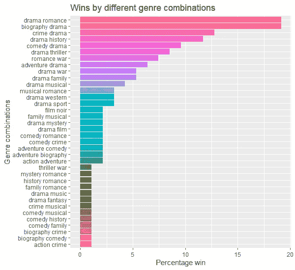

浪漫剧和传记剧似乎是学院的最爱。我们可以更进一步，看看哪三种类型的组合赢得最多。

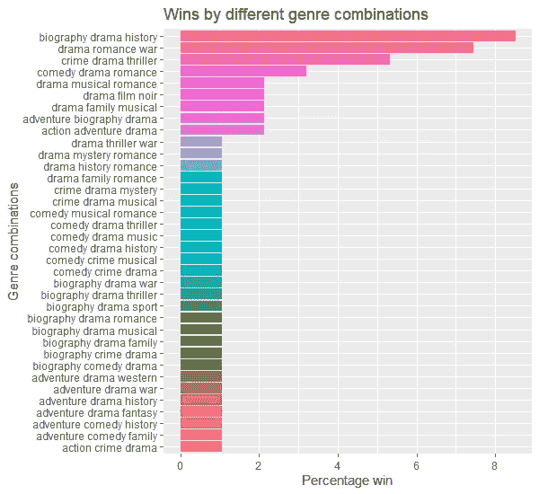

传记和历史题材的戏剧获奖最多，其次是带有战争元素的浪漫戏剧。

# 演员:

一部电影的全部演员阵容中有许多演员。我们可以从名单中的每部电影中挑选出 10 位主要演员，看看他们中有哪些人出现在了 2 部以上的最佳影片中。

这 8 位演员出演了 3 部获得奥斯卡最佳影片奖的电影。我们可以从榜单上看看他们都出演过哪些电影。

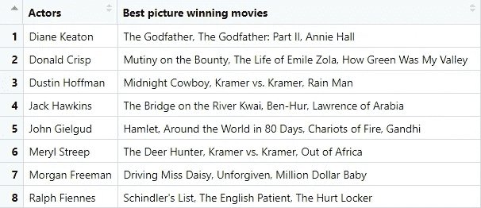

今天到此为止。如果有其他想法，我会编辑并添加到帖子中！

我不得不称赞使用 Andrew Couch 示例的`tidyverse`上的精彩教程。他在 YouTube 上的“ [TidyTuesday](https://www.youtube.com/playlist?list=PLJfshcspBCYeJeO8YFT5e5HxuYOb5a_1W) ”系列是想获得亲身体验的人的必看节目。

干杯！

如果有人想要帖子的完整 R 代码，我已经粘贴在下面了: