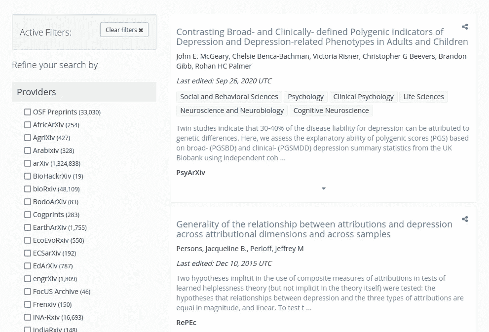
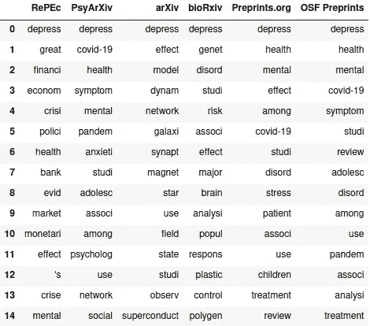
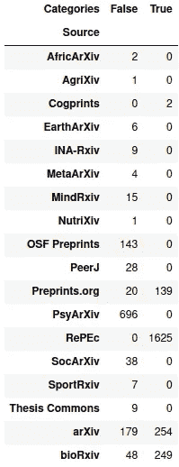
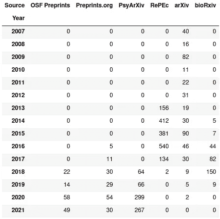
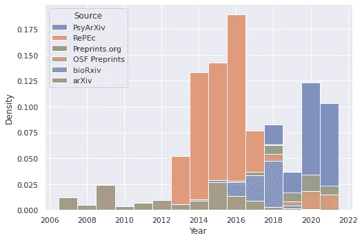
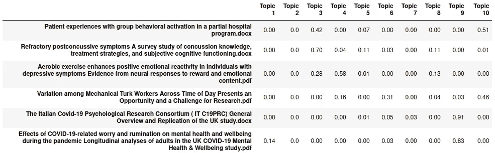
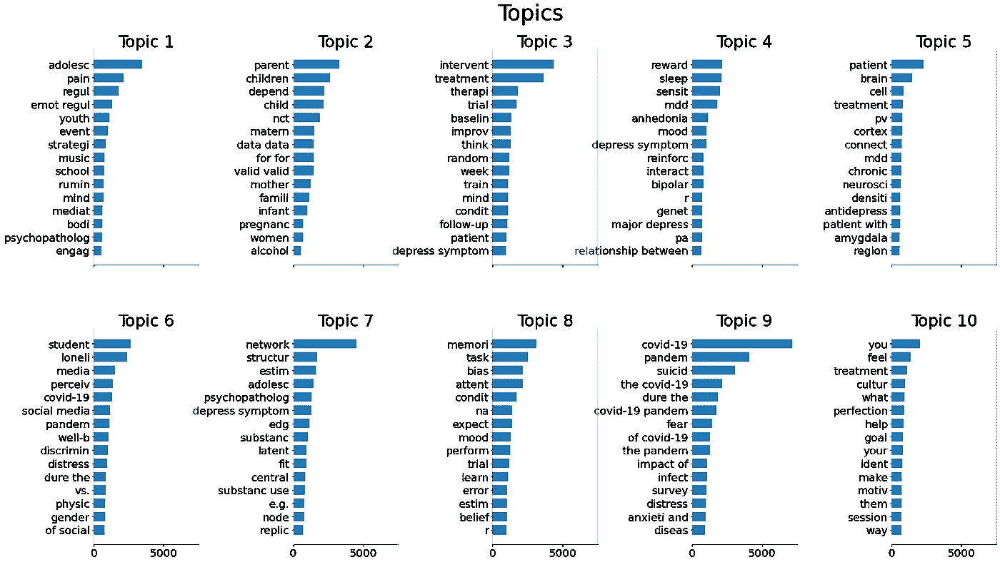

# 抑郁症相关预印本分析

> 原文：<https://medium.com/nerd-for-tech/an-analysis-of-depression-related-preprints-b64487f697ab?source=collection_archive---------7----------------------->

## 从收集预印本开始，以潜在狄利克雷分配的主题分析结束

这篇文章旨在对一个特定主题的预印本文章集进行从头到尾的分析——在这个例子中是抑郁症——包括我遇到的问题和关于项目进展的笔记。

它并不意味着是对抑郁症研究的全面分析，也不应该被赋予比随意分析更大的权重。

# 来源

有许多用于出版预印本文章的来源。如果你已经关注数据科学主题有一段时间了，那么由于那里出现了许多数据科学和机器学习的预印本， [arXiv](https://arxiv.org/) 将会出现。还有很多其他网站提供更专业的主题。

首先，我考虑了[开放科学基金会](https://osf.io/)的网站，这是开放科学中心的一个项目，它汇集了多个类似 arXiv 的预印本服务(包括 arXiv 本身)的结果，并使它们可以作为一个整体进行搜索。因此，从许多不同的来源获取预印本是一个潜在的有趣的出发点。

搜索界面非常标准，网站返回了预印本本身的摘要和其他基本信息，以及它们各自网站上的预印本链接。

OSF 网站对“抑郁症”的搜索结果截图(没有其他修饰词)。图片来源:本人。

这些摘要中的数据结构非常好，所以使用 Python 的 BeautifulSoup 库从页面中获取信息并不坏。也就是说，页面上返回的结果是用 JavaScript 呈现的，所以在抓取之前需要完全加载页面。所以我们还需要[硒](https://www.selenium.dev/)来完全自动化这个过程。

# 刮 OSF 网站

首先，导入和设置必要的变量:

识别页面相当简单，因为搜索的所有页面都可以通过“https://OSF . io/preprints/discover？page = XXX & q = depression”形式的 URL 访问。获取搜索中返回的页数是必要的，但幸运的是这包含在页面底部的一个元素中。

我们还需要从每个结果中提取感兴趣的信息:预印本的标题、其位置的 URL、最后一次编辑的日期、预印本所标注的类别以及预印本所在的源的名称。搜索结果几乎完全一致——唯一的例外是一些预印本缺少 URL 链接，但是可以通过检查 title 元素中是否存在元素来检测这些链接。

将所有这些放在一起相当简单。在 for 循环中使用 tqdm 只是为了监视循环的进度——它不一定要起作用。

在运行这个的时候(2021 年 7 月下旬)，有 443 个搜索页面需要抓取。我添加了一个延迟，因为我不想让 OSF 网站收到垃圾页面请求，所以需要大约 40 分钟才能完全抓取。

从那里，我们可以将命名元组列表转换为数据帧，保存这些结果，然后关闭 Selenium 浏览器。

# OSF 分析

返回的数据包括 4，414 份预印本及其附带信息。不幸的是，几乎有 1000 个是重复的，尽管还有很多可以看:

有了这些初始数据，我试图回答四个不同的问题:

1.  每个源的计数是多少？
2.  标题中最常见的词干是什么？
3.  各种类别多久出现一次？
4.  “最后更新”年份是如何分布的？

## 问题 1:来源计数

根据给定的信息，获得源的数量相当容易:

由于大小原因，我将把少于 100 份预印本的资料放在一边。其余的有:

*   RePEc 是经济学研究论文的缩写，所以它更关注经济萧条而不是心理状况。
*   PsyArXiv 关注的是“心理科学”,正如它的首页所说，所以它的预印本可能是最关注这个主题的。
*   从一些标题来看，arXiv 在几个上下文中使用了“抑郁症”一词，但似乎没有一个与这一分析相符:

*   bioRxiv 专注于遗传学和生物科学，可能有一些相关的预印本:

*   与其他来源相比，Preprints 和 OSF 的预印本有一些通用名称，虽然一些预印本标题看起来相关，但总体相关性可能更复杂:

顺便提一下，这些标题中很大程度上缺少的是抗抑郁药物和其他药理学主题——上面列出了一些，但重复取样并没有出现多少。我猜想这是来源中的一些偏见的结果(例如，可能预印本被上传到 OSF 没有覆盖的来源)，而不是抑郁症研究整体上的准确横截面。

## 问题 2:最常见的词干

调查标题的共同元素也可以说明问题。检查单词的词干似乎比检查单词本身更有用——例如，分别计算“depression”、“depressive”和“depressed”不应该比只计算“depresse”词根更有用。

按来源分类，预印本标题中最常见的词干。图片来源:本人。

不出所料，“沮丧”在所有六个来源中排名第一。正如你可能从之前的预印本资料中猜到的那样，RePEc 的 stems 更侧重于经济学，arXiv 是一个大杂烩(实际上不是我们要找的东西)，其他四个侧重于心理状况，bioRxiv 更侧重于生物学和遗传学角度。有趣的是，在 PsyArXiv 的文章中，新冠肺炎实际上是第二个最常见的词干，并且在 Preprints.org 和 OSF 预印本的前 15 名之内。检查它们出现的次数:

“covid”一词出现在 149 篇 PsyArXiv 预印本中，这是他们在搜索中的预印本的五分之一多一点。对于 Preprints.org 和 OSF 的预印本，这只是八分之一。令我感兴趣的是，PsyArXiv 预印本中第二常见的词干“新冠肺炎”只出现了大约 21%的时间——我不确定这是否是例外。

## 问题 3:类别的频率

首先，我从 OSF 的搜索门户网站上了解到，有许多预印本根本没有任何类别。事实上，他们中的大多数都没有分类:

这里的首犯似乎是 RePEc:

预印本是否缺失类别(真)或不缺失类别(假)。图片来源:本人。

从好的方面来看，由于 PsyArXiv 和 OSF 预印本对所有预印本都有分类，经济学主题不会出现在最常见的类别中(尽管看起来 ArXiv 把“物理学”偷偷放到了第 15 位):

## 问题 4:“最后更新”年份是如何分布的？

最后，预印本如何及时分发的问题。今年的一项基本调查显示，并没有出现稳定的增长:

2016 年有一个高峰，这是之前或之后(或迄今为止，就 2021 年而言)任何一年都无法比拟的。我不太确定这些预印本服务是什么时候开始的，所以很难确切地说出是什么推动了这一发展。查看我们之前查看的六个来源与年份的交叉列表:

结果的交叉列表。图片来源:本人。

所以基本上所有的尖峰信号都来自 RePEc。有趣的是，它似乎会在 2018 年后消失——在他们的网站上搜索一下，会出现更多的结果，包括最近发表的结果。不清楚为什么，虽然这里似乎有一个与 bioRxiv 类似的情况，所以我怀疑它是在 OSF 方面。从 2019 年开始，PsyArXiv、OSF 预印本和 Preprints.org 似乎是 OSF 可以看到的唯一来源。

上表以图表形式表示:

按年份和来源分类的预印本。纵轴是年度/来源覆盖的所有论文的比例。图片来源:本人。

# PsyArXiv

因为大多数看起来合理的预印本都出现在 PsyArXiv 上，所以我最终决定使用它作为我的预印本的唯一来源。然而，稍微浏览一下网站，就会发现有更多的预印本没有被 OSF 聚合发现。该网站本身似乎是由与 OSF 网站相同的代码驱动的，所以抓取它很容易(不值得在这里重复相同的代码)。不过，有两处细微的变化:

1.  描述内容的标签可以在预印本的页面上找到。这些看起来是上传者给的——至少，它们看起来不规则，因为大小写不同和一些看起来过于具体的标签。我抓住了这些信息，尽管我最终没有用它们做任何事情。
2.  需要下载预印本本身。这很容易，因为下载 URL 只是预印本 URL，后面加上“/download ”,尽管有一个问题:预印本可以有三种不同的文件格式——PDF、DOC 和 DOCX。幸运的是，页面上有一个文件名提供了这些信息。

收集搜索数据，我发现总共有 905 个结果(在 2021 年 8 月中旬)，比 OSF 搜索中出现的 696 个略多。我不确定这是为什么，尽管我更相信 PsyArXiv 本身的结果数量，而不是聚合器。然而，我们最终得到的可用预印本少于 905 份:

*   有些一开始没有被下载，因为它们在 PsyArXiv 上有页面，但后来被撤回了。实际下载了 764 篇论文。
*   在检查这些文件时，100 个文件被证明是重复的，因为它们具有相同的文件大小和相同的标题，只是存在一个冒号。
*   另外五个有非英语的标题和内容。
*   当试图读取它们时，另外 48 个抛出了与字符编码相关的错误。

剩下 611 份可用的预印本。这些文件是用 [textract](https://textract.readthedocs.io/en/stable/index.html) 库打开的，这是一个 Python 库，作为一个抽象层来读取几种不同的文件格式。

# 主题建模

为了了解论文的主要主题，我采用了潜在的狄利克雷分配法(LDA)。我的大部分代码都是基于 scikit-learn 文档中的一个例子，尽管做了一些添加和修改。

首先，LDA 需要一个词频矩阵来计算它的结果，可以使用 scikit-learn 中的 CountVectorizer 找到它。

上面代码的一些注释:

*   如果不使用“tokenizer”或“token_pattern”参数(允许您指定标记必须匹配的正则表达式)，CounterVectorizer 将尝试匹配它能匹配的所有内容，包括数字。这是这个数据的一个问题，因为引用的使用意味着四位数的年份和编号的参考文献遍布预印本，所以我们需要一个标记器来过滤掉它们。
*   使用标记化函数的另一个原因是，在检查输出中最重要的术语时，很明显它们中的许多只是同一个单词的细微变化，如“青春期”与“青春期”或“依赖”与“依赖”
*   “max_df”和“min_df”参数的语法很有趣——如果您提供一个小于 1 的值，它将被解释为数据集中文档的分数，但大于 1 的整数将被解释为文档的计数。所以这里使用的值意味着“出现在至少三个但少于 75%的文档中的术语”
*   由于弹出了下面的警告，这里没有使用停用词。似乎标记化(因此，在这种情况下，词干化)发生在停用词检查之前，scikit-learn 警告不要将停用词标记化为实际上不在停用词列表中的东西。我试图通过将最大文档频率设置得比我本来的要低来解决这个问题。

> /家/我/。local/lib/python 3.8/site-packages/sk learn/feature _ extraction/text . py:383:user warning:您的停用词可能与您的预处理不一致。对停用词进行标记化会生成标记['abov '，' sever '，' alon '，' alreadi '，' alway '，' ani '，' anoth '，' anyon '，' anyth '，' anywher '，' becam '，' becaus '，' becom '，' befor '，' besid '，' cri '，' describ '，' dure '，' els '，' elsewher '，' empti '，' everi '，' everyon '，' everyth '，' everywher '，' fifti '，' forti '，' henc '，' hereaft '，' herebi '，' howev '，

我们可以用几种不同的方式来看待报纸上的话题。LDA 对象的 fit_transform 方法返回每个文档的主题权重的 NumPy 数组，因此我们可以直接查看权重:

LDA 主题数据框架。文件名(不一定是预印本标题)是索引，而主题只是编号为 1 到 10。图片来源:本人。

数据帧中的每一行被缩放以使内容总和为 1，各个列中的值是主题的权重。我们还可以使用 scikit-learn 文档中示例中的函数来可视化每个主题最常见的 n 元语法频率:

10 个主题中每一个的前 n 个字母的权重。在另一个选项卡中打开此图像可能对下一部分有用。图片来源:本人。

## 主题摘要

通过对数据帧中每个主题的最高值进行一些补充检查(为了简洁起见，这里不再重复)，我们可以检查各个主题。

主题 1 似乎主要涉及情绪调节和/或青春期，给出了五个最常用的术语。前 10 名预印本中的大多数(就主题得分而言)在其标题中涵盖了这两者，如*应对青年日常消极和积极事件的情绪调节:事件强度和精神病理学的作用*，因此这似乎非常清楚。

**话题 2** 主要是关于怀孕和婴儿期到幼儿期的抑郁症，要么是母亲的产后抑郁症，要么是试图找到孩子以后生活中抑郁症的预测因素。

例外情况是一份名为*的预印本网络分析揭示了抑郁症*的互联网干预(抑郁)后哪些症状得到了改善(或没有改善)，这在该主题中得分最高(1.00，第二高为 0.60)。对预印本的检查表明，它的突出之处是因为它包含了 R 代码的几十页输出，这些代码输出了大量的短语“注意:依赖数据的 NCT 尚未被验证”——大概是“依赖”的定义被混淆了。

**专题 3** 涵盖了一系列干预和其他治疗策略，例如*基于自传记忆的年轻人抑郁症状干预:认知回忆疗法的随机对照试验*。一些涵盖智能手机或互联网驱动的干预策略，这可能更符合主题 2 的离群值。

看起来**话题 4** 有点鱼龙混杂。两个最常见的术语是“睡眠”和“奖励”，“快感缺失”(无法体验快乐)也相当常见。鉴于“mdd”(根据上下文可能是“[重度抑郁障碍](https://en.wikipedia.org/wiki/Major_depressive_disorder)”的缩写)和“双相情感障碍”都是常见术语，它可能会在更广泛的意义上处理障碍。

**话题 5** 涉及抑郁对大脑的生理影响。几个最常见的术语都与大脑的结构有关，预印本标题对此处理得很多— *压力如何在物理上重塑大脑:对精神疾病中脑细胞形状、数量和连接的影响*就是一个明显的例子，它在该主题中的得分为 0.95。

主题 6 主要关注孤独和隔离，尤其是歧视、新冠肺炎、社交媒体和身为学生。该主题中第二高的预印本，*精神病理学和进入新冠肺炎一年的中国国际学生中的感知歧视:预先登记的比较研究*，涵盖了该主题的大多数方面。

**话题 7** 将“网络”作为其最常见的术语，但除此之外似乎没有太多一致性。这个主题可能是一个单词有多个定义的另一种情况，会影响分析。具有最高主题分数的 20 份预印本中的一些标题:

*   *跨五个样本的内化症状网络的可复制性和可推广性*
*   *量化精神病理学网络特征的可靠性和可复制性*
*   *二元变量网络的客观贝叶斯边缘筛选和结构选择*
*   *美国退伍军人 DSM-5 创伤后应激障碍症状和相关因素的网络分析*

**话题 8** 看起来是专注于记忆和注意力。“任务”具有很高的重要性与此一致，因为(至少从我读到的来看)记忆和注意力的测试通常被称为“任务”。

话题 9 很明显是关于新冠肺炎的。

话题 10 可能是一个大杂烩，因为它似乎是排名最低的热门词汇。实际的术语本身表明了对身份和文化的关注。一些预印本的标题，如*损失和同化:居住在卢森堡*的英国公民在英国退出欧盟的生活经历，表明这个主题可以描述一般的生活方式和生活经历。

不过，这个话题确实有一个显著的例外。一个名为*Psilocybin for Depression:The ACE Model Manual*的预印本不太符合上述描述，但它的写作方式清楚地表明，它是在直接与读者对话，对术语频率矩阵的检查表明，它占了整个语料库中“你”一词(该主题中最重要的术语)使用量的四分之一。该类别中的其他一些高分预印本似乎包括来自人们的轶事，这些轶事在其转录中频繁使用“您”或“您的”，这可能是造成这种情况的原因。(这似乎也导致了另一篇关于 psiolocybin 的预印本得分相对较高，尽管除了这篇预印本之外，它与其他内容都无关。)

# 结论

这里的几个主题似乎有相当好的焦点。数量多一些还是少一些不一定更好，这一点并不清楚——事实上，其中一些主题的关注度较低，可能会推荐更多的主题，但我觉得一些混乱的主题是不可避免的，因为一般来说，自然语言具有微妙的性质。

这些话题本身对我来说并不太令人惊讶，但正如我之前提到的，对药物的关注比我预期的要少。我不知道这是否预示着任何关于抗抑郁药物的研究，或者是否有一些东西对非药物研究产生了更多的兴趣，或者抗抑郁药物的研究只是在别处结束了。

关于 LDA 的一般使用，这里值得注意的异常值是一个很好的提醒，检查文本本身是一个很好的检查，以确保主题是有意义的。由于 LDA 是不受监督的，并且最终由词频矩阵提供动力，因此它可能会被具有一些语法怪癖或以一些不相关的方式重复一些文本的文档丢弃，就像上面的离群值一样。