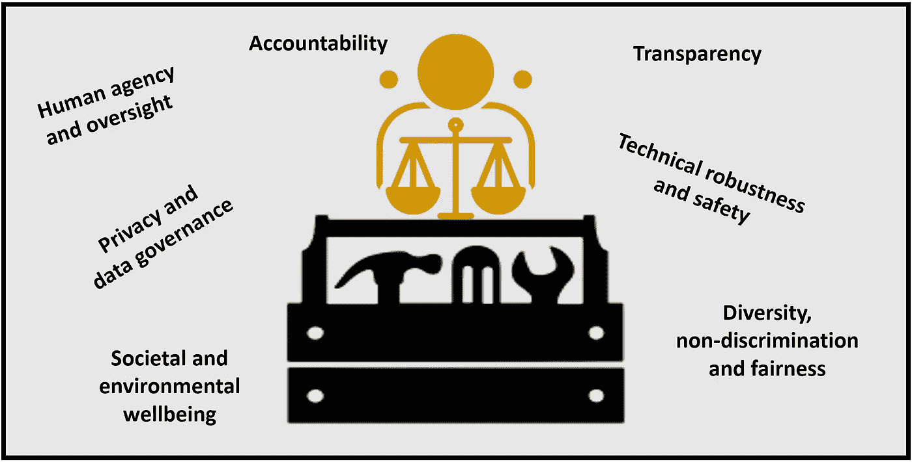
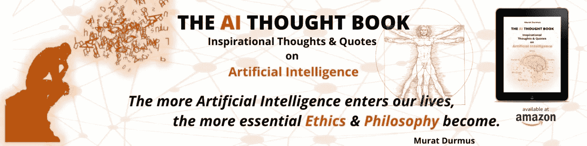

# 一些伦理人工智能工具包的简要概述

> 原文：<https://medium.com/nerd-for-tech/an-brief-overview-of-some-ethical-ai-toolkits-712afe9f3b3a?source=collection_archive---------5----------------------->

伦理-人工智能工具包(穆拉特·杜马斯)

道德工具包有助于让数据驱动的应用和系统更加公平、可靠和透明。以下是一些可以帮助实现“道德人工智能”的工具包:

内容:

1.  通用机器学习应用的偏差测试
2.  玩人工智能公平(谷歌新的机器学习诊断工具让用户尝试五种不同类型的公平)
3.  道德与算法工具包(政府风险管理框架)
4.  人工智能可解释性 360 (IBM)
5.  普华永道的责任 AI
6.  InterpretML(微软)
7.  多样性工具包:身份、权力和特权讨论指南
8.  WEF 赋予人工智能领导力——董事会监督工具包(世界经济论坛)
9.  负责任的创新:最佳实践工具包(微软)
10.  偏见和公平审计工具包(Aequitas——芝加哥大学数据科学和公共政策中心)
11.  工程/设计实践伦理工具包(马库拉应用伦理中心—圣克拉拉大学)
12.  Fairlearn(微软)
13.  工具箱:人工智能原理的动力学(人工智能伦理实验室)
14.  算法问责政策工具包(AI Now 研究所)
15.  从原则到实践——人工智能伦理学操作化的跨学科框架(AIEI 集团)
16.  道德操作系统工具包

# 1.通用机器学习应用的偏差测试

audit-AI 是一种工具，用于衡量和减轻训练数据中歧视性模式的影响，以及为社会敏感决策过程而训练的机器学习算法所做的预测。

这项研究的总体目标是提出一种合理的方式来思考如何让机器学习算法更加公平。虽然识别训练数据集中的潜在偏见，以及由此产生的对它们进行训练的机器学习算法不足以解决歧视问题，但在一个越来越多的决策被人工智能自动化的世界中，我们理解和识别算法公平或偏见程度的能力是朝着正确方向迈出的一步。

更多信息:[https://github.com/pymetrics/audit-ai](https://github.com/pymetrics/audit-ai)

# 2.玩人工智能公平(谷歌新的机器学习诊断工具让用户尝试五种不同类型的公平)

谷歌 PAIR(人与人工智能研究)计划的研究人员和设计人员创建了假设可视化工具，作为机器学习系统开发人员的实用资源。然而，使用假设工具揭示了人工智能系统提出的一个最难、最复杂、最完全人性化的问题:用户希望什么才算公平？

更多信息:【https://pair-code.github.io/what-if-tool/ai-fairness.html 

# 3.道德与算法工具包(政府风险管理框架)

利用算法的政府领导人和工作人员正面临来自公众、媒体和学术机构的越来越大的压力，要求他们对算法的使用更加透明和负责。每天都有描述算法的意外或不良后果的故事出现。政府还没有理解和管理这种新风险所需的工具。

更多信息:[https://ethicstoolkit.ai/](https://ethicstoolkit.ai/)

# 4.人工智能可解释性 360 (IBM)

这个可扩展的开源工具包可以帮助你理解机器学习模型如何在整个 AI 应用程序生命周期中通过各种方式预测标签。我们邀请您使用它并改进它。

更多信息:【http://aix360.mybluemix.net/ 

# 5.普华永道的责任 AI

普华永道负责任的人工智能工具包是一套可定制的框架、工具和流程，旨在帮助你以道德和负责任的方式利用人工智能的力量——从战略到执行。

更多信息:[https://www . PwC . com/GX/en/issues/data-and-analytics/artificial-intelligence/what-is-responsible-ai . html](https://www.pwc.com/gx/en/issues/data-and-analytics/artificial-intelligence/what-is-responsible-ai.html)

# 6.InterpretML(微软)

InterpretML 是一个开源包，在一个屋檐下集成了最先进的机器学习可解释性技术。有了这个包，你可以训练可解释的玻璃盒子模型和解释黑盒系统。InterpretML 帮助您理解模型的全局行为，或者理解单个预测背后的原因。

可解释性对于以下方面至关重要:

模型调试——为什么我的模型会犯这个错误？

检测公平问题——我的模型有歧视吗？

人类与人工智能的合作——我如何理解和信任模型的决策？

法规遵从性—我的模型是否满足法律要求？

高风险应用—医疗保健、金融、司法

更多信息:[https://github.com/interpretml/interpret](https://github.com/interpretml/interpret)

# 7.多样性工具包:身份、权力和特权讨论指南

这个工具包是为那些觉得在微观(个人)和宏观(社区)层面上缺乏关于多样性和身份在社会关系中的作用的富有成效的讨论的人准备的。也许你是一名教师、青年团体辅导员、学生事务人员，或者管理一个为得不到充分服务的人群工作的团队。这种培训可以提供关于身份政治和权力与特权动态的历史背景，或者帮助建立更强的自我意识。

更多信息:[https://MSW . USC . edu/ms wuc-blog/diversity-workshop-guide-to-discussion-identity-power-and-privilege/# intro](https://msw.usc.edu/mswusc-blog/diversity-workshop-guide-to-discussing-identity-power-and-privilege/#intro)

# 8.WEF 赋予人工智能领导力——董事会监督工具包(世界经济论坛)

董事会资源包括:简介；13 个模块旨在与传统的理事会委员会、工作组和监督问题保持一致；以及人工智能(AI)术语词汇表。

八个模块侧重于战略监督及其相关责任。它们涵盖:品牌、竞争、客户、运营模式、人员和文化、技术、网络安全和可持续发展。其他五个模块涵盖其他董事会监督主题:道德、治理、风险、审计和董事会责任。

按照下面描述中的链接选择一个模块。继续向下滚动阅读简介，其中包括对 AI 的描述。

每个模块提供:主题描述、针对该模块主题的理事会职责、监督工具、为理事会讨论设置议程的建议以及了解该主题更多信息的资源。

更多信息:【https://adobe.ly/2WTBOmI 

# 9.负责任的创新:最佳实践工具包(微软)

该工具包为开发人员提供了一套开发实践，用于预测和解决技术对人类的潜在负面影响。我们分享这个作为反馈和学习的早期实践。

更多信息:[https://docs . Microsoft . com/en-us/azure/architecture/guide/responsible-innovation/](https://docs.microsoft.com/en-us/azure/architecture/guide/responsible-innovation/)

# 10.偏见和公平审计工具包(Aequitas——芝加哥大学数据科学和公共政策中心)

偏见报告由 Aequitas 提供支持，Aequitas 是一个开源的偏见审计工具包，用于机器学习开发者、分析师和决策者审计机器学习模型的歧视和偏见，并围绕开发和部署预测风险评估工具做出明智和公平的决策。

更多信息:[http://aequitas.dssg.io/](http://aequitas.dssg.io/)

# 11.工程/设计实践伦理工具包(马库拉应用伦理中心—圣克拉拉大学)

以下工具代表了在技术行业工程和设计工作流程中实施道德反思、深思熟虑和判断的具体方法。

正确使用，它们将有助于开发符合道德的工程/设计实践，这些实践:

很好地融入专业技术环境，并被视为优秀工程和设计工作的自然组成部分(不是外部的或多余的)

明确表明道德实践不是可以被忽视或遗忘的“未言明”的规范

规范化，以便随着重复和习惯，工程师/设计师/技术人员可以逐渐加强他们的道德分析和判断的技能

可操作化，以便工程师/设计师在他们的工作环境中得到关于道德实践的明确指导，而不是被迫依靠他们自己对道德的个人和不同的解释

更多信息:[https://www . scu . edu/ethics-in-technology-practice/ethical-toolkit/](https://www.scu.edu/ethics-in-technology-practice/ethical-toolkit/)

# 12.Fairlearn(微软)

Fairlearn 是一个 Python 包，它使人工智能(AI)系统的开发者能够评估他们系统的公平性，并减轻任何观察到的不公平问题。Fairlearn 包含缓解算法以及用于模型评估的 Jupyter 小部件。除了源代码之外，这个存储库还包含了 Jupyter 笔记本，上面有 Fairlearn 用法的例子。

更多信息:【https://github.com/fairlearn/fairlearn 

# 13.工具箱:人工智能原理的动力学(人工智能伦理实验室)

你可以用它来思考技术的伦理含义

你正在评估或创造的。

盒子是一种简化的工具，它

列出了重要的道德原则和关注点，

将工具伦理原则与核心原则联系起来，

帮助可视化技术的道德优势和劣势，以及

支持技术的可视化比较。

更多信息:【https://aiethicslab.com/big-picture/ 

# 14.算法问责政策工具包(AI Now 研究所)

以下工具包旨在为法律和政策倡导者提供对政府使用算法的基本理解，包括在处理该问题时可能出现的关键概念和问题的分类、现有研究的概述以及政府当前使用的算法系统的总结。该工具包还包括一些资源，供有兴趣或目前正在从事工作的倡导者使用，以发现算法在哪里被使用，并创建透明和问责机制

更多信息:[https://ainowinstitute.org/aap-toolkit.pdf](https://ainowinstitute.org/aap-toolkit.pdf)

# 15.从原则到实践——人工智能伦理学操作化的跨学科框架(AIEI 集团)

人工智能伦理影响小组是由 VDE 电气、电子和信息技术协会和贝塔斯曼基金会领导的跨学科联盟。我们在 2019 年走到了一起，将人工智能伦理从原则带到实践。

通过我们的标签和规范框架，我们旨在支持欧洲价值观的实施和对欧洲公民的保护，在市场中创造质量透明度和可比性，并为公司避免不必要的繁文缛节，仅在必要时直接实施。

我们还想确保人工智能伦理变得易于沟通，便于全欧洲及欧洲以外的组织和公民理解。

我们在这里提出我们的发现，并期待着一个广泛的面向实施的辩论。

更多信息:[https://www.ai-ethics-impact.org/en](https://www.ai-ethics-impact.org/en)

# 16 道德操作系统工具包

工具箱里有什么:

一份包含 8 个风险区域的清单，帮助您确定风险和社会危害的新兴领域，这对于您的团队来说是最重要的，现在就开始考虑。

14 个场景引发对话，并拓展您对当前所构建技术的长期影响的想象力。

7 个面向未来的策略，帮助你今天就采取道德行动。

更多信息:【https://ethicalos.org/ 

这可能也是我感兴趣的(我最近关于‘正念’人工智能的书):

人工智能思想书

链接(亚马逊): [**《人工智能思想书:励志思想》&人工智能语录**](https://www.amazon.com/gp/product/B08Z4BWN1X/ref=dbs_a_def_rwt_bibl_vppi_i0)