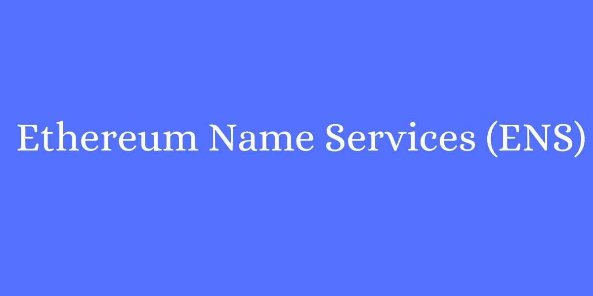

# 以太坊名称服务上的雄辩模型，以减轻您的 Web3 体验

> 原文：<https://medium.com/nerd-for-tech/an-eloquent-model-on-ethereum-name-services-to-ease-your-web3-experience-fbf19d65b4c9?source=collection_archive---------11----------------------->

由于其广泛的益处，互联网在过去几十年中的巨大发展已经不是秘密。互联网向 web3 的演变是复杂的；随着时间的推移，互联网用户面临许多困难，技术极客已经找到了消除这些关键问题的有效解决方案。本博客将深入探讨 [**以太坊名称服务**](https://www.infiniteblocktech.com/blog/ethereum-name-service/?utm_source=nerdfortech&utm_medium=guestblog&utm_campaign=dhanushkumar) 及其特性和福利。

在互联网的早期阶段，用户面临的主要问题之一是用于访问网站的又长又复杂的地址。用户每次访问网站时都必须输入复杂的地址。此问题是由 web2 中的域名系统(DNS)引起的。现在在 web3 中，用户面临同样的加密钱包复杂地址的问题。[**以太坊名称服务【ENS】**](https://www.infiniteblocktech.com/nft-development-services?utm_source=nerdfortech&utm_medium=guestblog&utm_campaign=dhanushkumar)**的出现解决了这一难题。**

## ****以太坊名称服务——是什么？****

**以太坊名称服务(ENS)旨在将加密地址中机器可读的复杂十六进制字符简化为人类可识别的字符。例如，让“0xde0b256669ajgsdhjmnlkjhia”作为地址，使用 ENS，可以将地址命名为“Joel.eth”，这样更容易理解。有了 ENS，用户可以在没有这种复杂性的情况下进行交易。**

## ****ENS 的架构——了解其工作原理****

**ENS 的工作过程分为两个主要部分:注册中心和解析器。相同作品的架构如下。**

## ****注册表****

**智能合同设计的注册表维护以太坊区块链中所有域和子域的列表。它存储了关于它们的三条基本信息。这些信息包括:**

*   **域的所有者。**
*   **域的解析器。**
*   **域下记录的捕获生存时间(TTL)。**

**注册中心的重要目的是从域名映射到负责域名的解析者。同时，注册表中的域所有者可以更改他们对子域的所有权，将他们的域所有权转移到另一个地址，并为该域设置解析器和 TTL。**

## ****解析器****

**另一方面，解析器有责任将域名转换成地址。每个表现出所需标准的智能合约都有可能成为以太坊名称服务中的解析器。**

**解析名称分两步进行。第一步是当注册管理机构知道哪个解析器负责特定域名时。在第二步中，注册中心要求解析器回答它的查询。**

## **为什么要选择 ENS？**

**由于这是一个基于区块链的协议，它的工作更加安全和有效。ENS 抵制审查是因为它的母公司区块链以太坊。这个域名协议实现了一个简单的、人类可识别的加密地址，并实现了用户友好的交易。此外，将 ENS 集成到 web3 应用程序中可以实现透明和广泛的域名，从而刺激创收。**

## ****你平台上的 ENS 有价值的额外津贴****

*   **ENS 方便加密用户轻松识别他们的协议地址。**
*   **它提高了加密平台的互操作性和声誉。**
*   **ENS 可以与星际文件系统(IPFS)连接，这是一个巨大的存储系统，拥有一个抗审查的网站。**
*   **ENS 域名可以链接到智能合同，以促进平台上的交易活动。**
*   **这种域名命名机制允许其用户体验到高收入和其他价值。**
*   **它为 NFT 持有者成为密码企业家开辟了新的门户，使他们能够为自己的域名创建 NFT。**

## ****ENS 应用****

**以太坊名称服务是以太坊生态系统中的新发现，为 web3 的创业者创造了新的可能性。这被认为是正确的时间获得 ENS 为您的业务，使域名难忘。适用于各种 web3 应用的 ENS 的前景是**

*   **加密钱包**
*   **分散式网站创建**
*   **分散式应用程序**
*   **基于 NFT 的平台**

****结论****

**利用以太坊名称服务的特性，通过提高品牌认知度，为您的 web3 企业扩大成功规模。对于一个计划丰富他们的风险投资的隐密创业者来说。eth 域名是一种潜在的方法。由于这种域名命名机制遵循以太坊区块链，其价值非常高，并有望迅速发展。尽管这只是以太坊名称服务的开始，但其光明的未来正吸引着许多爱好者沉迷于它的好处。**

**这种基于智能合同的域名服务允许加密用户有效地进行交易和交互。由于这是以太坊生态系统中的趋势服务之一，许多区块链开发公司都在 ENS 中提供他们的服务。因此，为您的所有 web3 项目掌握以太坊名称服务，因为您总是可以选择提供优质服务的领先公司。**