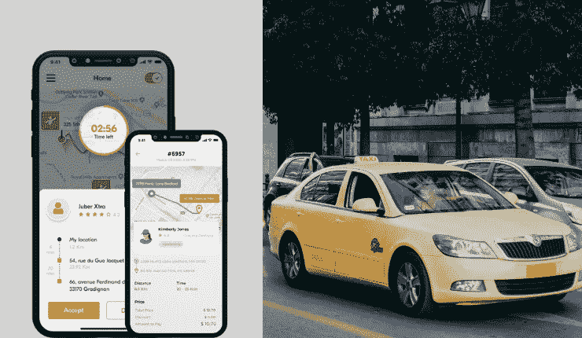
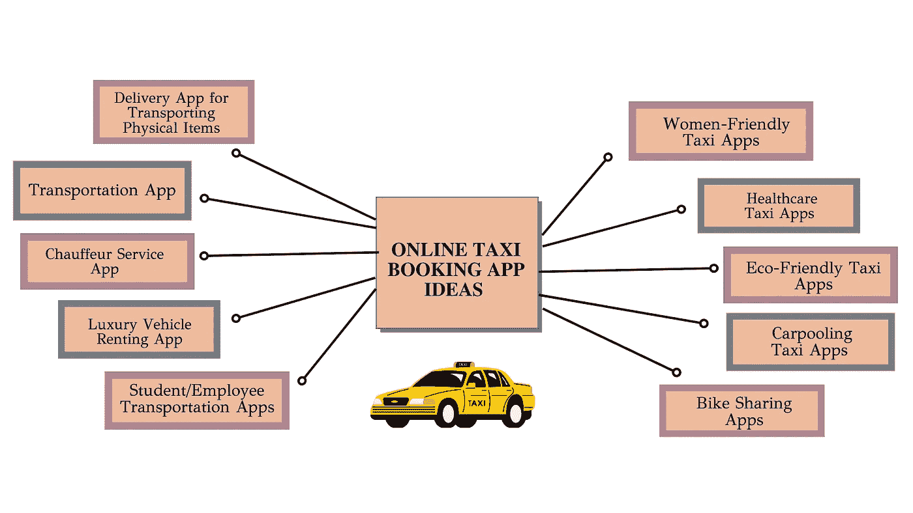

# 一个想法可以改变你的生活——2022 年出租车预订应用的想法

> 原文：<https://medium.com/nerd-for-tech/an-idea-can-change-your-life-taxi-booking-app-ideas-for-2022-3111506980e1?source=collection_archive---------6----------------------->

作为千禧一代，我们无法想象没有出租车预订应用的日子。这使得这些解决方案越来越受欢迎。因此，从商业角度来看，其发展是一个富有成效的命题。

然而，当开始一项像出租车预订这样充满活力的业务时，他们也有必要检查一下应用程序的想法，这可以使他们积累最大的成功。

因此，为了使这更容易。换句话说，作为一个崭露头角的出租车预订应用程序所有者，在下面的文章中，我们已经征集了在线出租车预订应用程序的开发理念，这些理念有望帮助您的出租车应用程序企业赚取巨额收入和客户。在此之前，让我们看看下面这些有吸引力的数字，它们将帮助你理解首先推出打车应用业务的有利可图的主张。

# 描绘打车应用盈利性质的诱人数字

> 1.到 2022 年底，出租车预订应用的收入将达到 3142 亿美元。出租车市场将见证其规模的增长。2027 年将变成 3540 亿美元
> 3。全球打车市场预计到 2026 年将增长 2300 亿美元，CAGR 为 8.75%

这些数字描述了[如何构建一个出租车预订应用](/geekculture/starting-an-on-demand-taxi-business-steps-to-follow-8183da255e8f)来提高在线知名度将是有利可图的。这是因为它将为乘客、司机和出租车行业带来以下好处。

# 出租车预订应用程序的优势——为什么出租车行业需要它？

1.通过在线出租车预订应用程序获得的实时跟踪可行性，司机和乘客可以轻松地相互跟踪，直到到达目的地。这对于评估流量也非常有用。

2.确保车手和车手之间的沟通保持透明。这是通过应用内聊天和通话的可行性实现的。因此，司机和乘客可以无缝地相互交流，并知道对方的位置。

3.司机可以根据他们在应用程序上执行的任务赚取收入。因为出租车预订应用程序可以帮助司机灵活工作。因此，根据他们提供的乘车次数，他们可以赚取。

4.出租车公司可以在网上建立强大的知名度。它们还可以执行不同的操作，如管理出租车、司机等的记录。

通过上述优势，显而易见的是，构建一个包含按需打车应用开发服务的打车应用业务将使其更上一层楼。

然而，它要求你知道一些让你的打车应用业务成功的想法。在下面的几行中，我们列出了一些流行的应用创意，这些创意有望将你的打车应用业务提升到下一代水平。

# 2022 年最受欢迎的在线出租车预订应用创意

查看下图，深入了解在线出租车预订应用程序的开发理念，让您的出租车业务更上一层楼。

打车应用创意

在上图中，你可以一窥 2022 年最受欢迎的十款出租车预订应用的创意，它们有望将拼车业务提升到一个新的水平。下面列出的是相同的-

1.  女性友好的打车应用
2.  医疗打车应用
3.  环保打车应用
4.  拼车打车应用
5.  自行车共享应用
6.  学生/员工交通应用
7.  豪车租赁 App
8.  司机服务应用
9.  商业运输应用程序
10.  用于运输实物的交付应用程序

**下面让我们逐一讨论。**

> ***女性友好型打车应用***

打开电视或浏览报纸——随处可见的标题都与威胁女性安全的事件有关。因此，要注意这一点，尤其是如果计划推出在线出租车预订应用程序业务的话。让女性成为车手将有助于保护女车手。它将确保骑手在从一个地方穿越到另一个地方时保持无压力。

这里有一些城市，这项业务将特别带来奇迹——印度、南非、中东和美国

> ***医疗打车应用***

当你照顾老人时，你需要为他们可能需要紧急医疗服务的情况做好准备。因此，不言而喻，有了医疗打车应用，获得医疗服务将变得容易。他们可以灵活地去医院或诊所接受治疗。

因此，这是另一个你在着手拥抱[按需打车应用开发服务](https://www.peppyocean.com/taxi-booking-app-development/)时可以考虑的应用想法。这需要你与诊所、医院和救护车供应商合作。有了伙伴关系，你就可以轻松高效地接触到老年人。

> ***环保打车应用***

优步和其他乘车聚合器正在合作，到 2040 年成为零排放的出租车预订应用程序。因此，努力开发环保的打车软件。这将大大有助于确保你建立一个环境友好型企业的基础。

所以，可以考虑在 app 中加入混动、电动等车型。尽管最初需要额外的资金，但从长远来看会产生奇迹。这将有助于你成为一个吸引环保客户的企业。

> ***拼车打车应用***

就像环保打车应用一样，拼车打车应用是另一种形式，可以帮助你减少空气泄漏事件，并严格控制污染。已经被 BlaBlaCar、OlaShare 等在线打车应用使用。，这种模式将证明你的奇迹。

你将能够确保司机可以在很大程度上减少交通，汽油和柴油成本变得容易节省等等。接下来，它将为乘客提供支持，以节省运输成本，因为他们将有其他人分享乘坐。因此，费用会在他们之间分摊。

> ***自行车共享 App***

当从一个地方到另一个地方旅行时，尤其是当距离很短时，两轮车可能是最经济的方法之一。同时，它也便于携带。

由于大都市以交通闻名，自行车共享应用业务将被证明是一个好主意。它将帮助您为骑行者提供便利，并确保他们在从您的自行车共享应用程序预订骑行时，也能节省成本。

很少有国家因为让这些应用流行起来而出名——美国、德国、印度、西班牙、中国等。

> ***员工&学生交通应用***

学生发现公共汽车没有准时到达的事件时有发生。另一方面，在其他情况下，公司通常很难获得顺畅的地面运输服务。

这就是这些面向员工和学生的应用程序派上用场的地方。这将有助于他们获得易于预订的乘车服务，同时便于跟踪乘车、了解乘车的 ETA(预计到达时间)等等。

> ***豪车租赁 App***

谁不希望乘坐豪华汽车呢？每个人都这样。我们确定。

这些都是婚礼、商务会议等的完美骑行选择。，因为它们有助于在骑车人下车时给人留下印象。

人们必须注意到，这些车辆是昂贵的。因此，如果乘客可以通过这些应用程序灵活地利用这些骑行，他们就可以奢侈地前往他们想要的目的地。

> ***司机服务 App***

这些应用程序让乘客可以通过私人司机轻松乘车。这对于那些拥有汽车但希望为乘客提供自驾服务的人来说非常有用。通过同样的，他们(司机)将能够赚取。

这款应用在有很多旅游景点的地方是必备的，因为乘客可以通过该应用预订私人司机，前往他们想要的地点。

> ***商业运输 App***

这个应用是另一个值得为 2022 年打造的应用。有了这些应用，旅行者可以通过公共汽车等商业交通工具从一个州到另一个州。

该应用程序将证明对商业运输公司尤其有益，因为他们可以成功地提高他们的在线知名度。最重要的是，这将确保他们能够建立一个强大的用户群。

> ***运送实物的发货 App***

最后，另一个有望让打车应用业务在 2022 年蓬勃发展的应用创意是实物交付应用。
将实物从一个地方运送到另一个地方将变得无缝。这包括包裹、包裹、蔬菜、药品等。举几个例子，使方便对顾客来说是一件轻而易举的事。

此外，这款应用还将帮助快递企业提高在线知名度。基于每一次交付，一路赚取稳定的收入。

# 包扎

一个想法可以改变你的生活。这句话是对的，尤其是从商业的角度来看。它有助于企业的繁荣和成功发展。尤其是当你是一家打车应用企业时，你必须努力超越提供典型的打车服务。这意味着你应该使用新的想法。因此，在实施在线出租车预约 app 开发思路之前——评估业务需求。理想情况下，你也可以与打车应用开发公司合作。

通过专业知识，他们在了解您的业务需求和市场需求后，在按需打车应用程序开发服务期间引导最佳实践。在理解这些方面后，他们会利用正确的想法来帮助你的打车应用从第一天起就获得巨大的用户群。