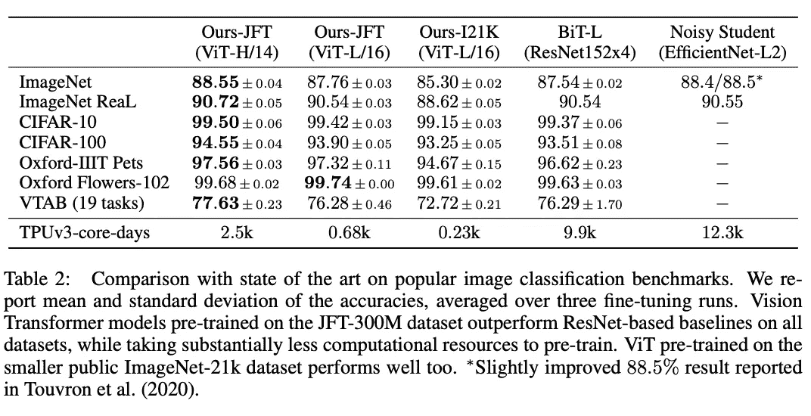

# “一幅图像值 16x16 个字:大规模图像识别的变形金刚”论文摘要和分析

> 原文：<https://medium.com/nerd-for-tech/an-image-is-worth-16x16-words-transformers-for-image-recognition-at-scale-paper-summary-3a387e71880a?source=collection_archive---------10----------------------->

论文:[https://arxiv.org/pdf/2010.11929.pdf](https://arxiv.org/pdf/2010.11929.pdf)

讨论由[Victor Butoi](https://github.com/VictorButoi)&[Cora Wu](https://github.com/cjw322)主持，智能系统子团队

# 文件的目标

**论文在攻克什么问题？** *大规模图像识别*试图解决将 Transformer 架构应用于计算机视觉任务的问题，以减轻该领域对 CNN 的严重依赖。该论文认为，这种转变将产生与传统 CNN 相当的结果，同时需要较少的计算资源来训练。

**这个问题的相关背景是什么？** 变压器已经广泛用于 NLP 任务，例如当前最先进的模型伯特、GPT 及其变体。在图像任务中使用变形金刚也有一些其他的工作，但是它们通常是非常昂贵的。

# 论文投稿

论文提出了什么方法来解决这个问题？
为了调整图像输入以适应变换器的输入，本文将 2D 图像整形为一系列扁平的 2D 面片。一个可学习的嵌入被预先添加到嵌入的补丁序列中。这个标记的作用与 BERT 的[class]标记相似。然后将位置嵌入添加到补片嵌入中，以保留位置信息。

变压器编码器由多头自关注和 MLP 块的交替层组成。变换器编码器的输出状态用作图像表示。在预训练和微调期间，一个分类头，MLP，被连接到变压器编码器的输出。在预训练期间，MLP 有一个隐藏层，而在微调期间，它是用单层实现的。

Vision Transformer (ViT)在大型数据集上进行了预训练，然后针对较小的下游任务进行了微调。通过移除预训练的预测头并用零初始化的前馈层代替它来进行微调。

**论文的投稿与之前的相关作品有何不同？** 这并不是第一篇将变形金刚应用于 CV 的论文。脸书其实已经发布了一款 [DETR(检测变形金刚)](https://ai.facebook.com/blog/end-to-end-object-detection-with-transformers/)；然而，它们与 CNN 一起使用，而不是单独使用。本文是 CV 独立变压器的成功应用。对于每个主要的贡献，它有如下不同:

*   **计算时间更少的准确性**:与[吵闹的学生](https://arxiv.org/abs/1911.04252v4)相比，ViT 将训练时间减少了约 5 倍(训练时间的 20%)(尽管它达到了与表 2 所示大致相同的准确性)。

[https://arxiv.org/pdf/2010.11929.pdf](https://arxiv.org/pdf/2010.11929.pdf)

*   **无卷积**:理论上，MLP 比 CNN 模型表现更好。然而，数据一直是影响 MLP 模型性能的一大障碍。由 CNN 强加的感应偏倚极大地推进了 CV 领域，并且通过作者使用的大数据集，他们能够克服对感应偏倚的需要。变压器与传统的 MLP 略有不同，其核心机制是**自我关注**。这使得变压器能够理解输入之间的关系。当在 NLP 中使用时，它以双向方式计算单词之间的关系，这意味着顺序不像单向 RNN 那样严格。
*   **变压器的功效**:该论文通过观察注意力头的输出来分析 ViT 的内部表现(类似于 BERTology 论文)。论文发现，该模型可以使用位置嵌入对不同斑块之间的距离进行编码。该论文还发现，ViT 甚至在较低的层内整合了来自整个图像的信息，并陈述如下:“我们发现一些头部关注已经在最低层中的大部分图像，这表明该模型确实使用了全局整合信息的能力。”此外，他们还对模型性能进行了定量分析，并对模型的注意力地图和焦点进行了定性可视化。

论文是如何评估其结果的？
提出的方法在三个不同的数据集上进行:Imagenet (1k 类和 21k 类)、JFT (18k 类)和 VTAB。通过少量拍摄或微调精度来测量结果，微调精度表示在数据集上微调模型后的精度，少量拍摄精度表示在训练和评估图像子集后的精度。

他们将 transformer 模型与流行的图像分类基准进行了比较，如 Big Transfer 和 Noisy Student。在这篇论文中，他们在 BERT 的基础上配置了 ViT，并通过用组规范化替换批量规范化以及采用标准化卷积来改进迁移学习来修改 Resnet。

此外，本文对自监督训练 ViT 进行了初步研究，结果表明，通过自监督预训练，与从头训练相比，准确率提高了 2%。

# 论文限制、进一步研究和/或潜在应用

这篇论文介绍了 ViT:使用视觉转换器，而不是 CNN 或混合方法来完成图像任务。结果很有希望，但还不完整，因为除了分类之外，基于视觉的任务(如检测和分割)的性能还不存在。此外，与 Vaswani 等人(2017 年)不同，与 CNN 相比，变压器的性能改善更加有限。作者假设，进一步的预训练可以提高性能，因为与其他先进模型相比，ViT 是相对可扩展的。

再者，[卡普兰等人。艾尔。](https://arxiv.org/pdf/2001.08361.pdf)与 NLP 中的 LSTMs 相比，主要为转换器提供缩放定律，证明转换器可以缩放到更大的数据集。与 CNN 相比，看看变压器是否表现出类似的特性将是有趣的。如果是这样的话，那么很明显，基于变压器的技术也将成为 CV 中的 SOTA。

最终，这些结果表明，变形金刚有可能成为一种通用模型，能够在广泛的人工任务领域进行学习，并享受以超大规模扩展数据的能力。这个愿景还没有到来，可能永远不会到来；如果是这样，这篇论文将被认为是未来的先兆。