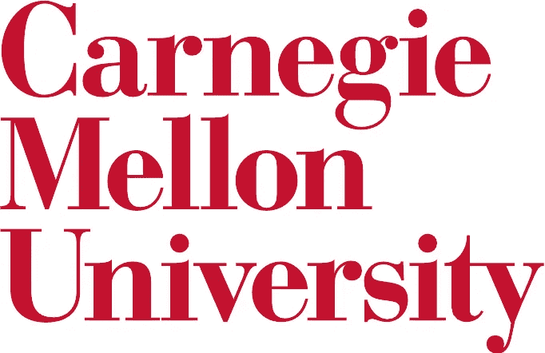
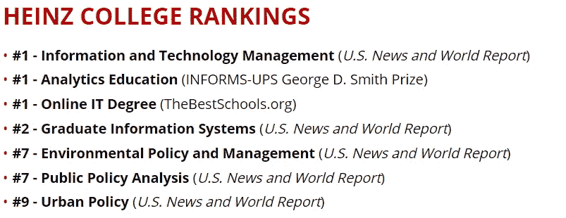
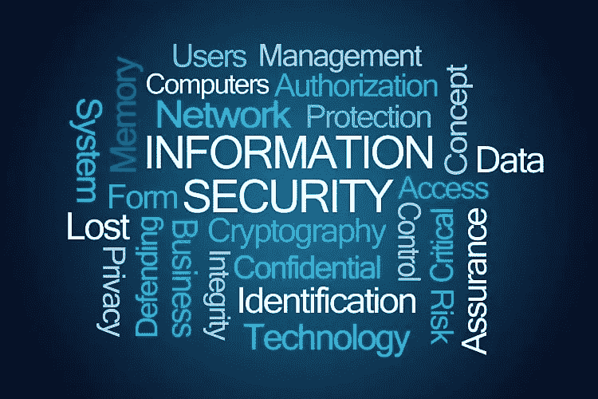

# 一位内部人士对 CMU IT 实验室的看法:夏季安全强化(SSI)

> 原文：<https://medium.com/nerd-for-tech/an-insiders-take-on-cmu-s-it-lab-summer-security-intensive-ssi-bec757a25257?source=collection_archive---------11----------------------->

图像[来源](https://intaadvising.gatech.edu/internships/carnegie-mellon-university-summer-security-intensive-fellowship-program/)

2020 年的夏天是载入史册的一年。这是不寻常的，由于世界范围的疫情。在过去的两年里，我一直在朝着我的目标努力，那就是进入卡内基梅隆大学的 IT 实验室:夏季安全强化(SSI)。如果你还没有听说过今年夏天在 CMU 的实习经历，可以在他们的 [**网站**](https://www.heinz.cmu.edu/programs/itlab/) 上查看一下。当我准备我的申请时，我发现很难找到任何关于以前学生在 SSI 经历的信息。在这篇文章中，我将分享我在实习中的一些个人经历，以及它对我未来职业和目标的影响。

SSI 是一个一体化的网络安全实习项目，让你接触不断发展的网络安全世界。自 2001 年以来，亨氏信息系统和公共政策学院在信息和技术管理领域排名第一。SSI 为你提供了一个独一无二的机会，可以帮助你进入研究生项目(特别是 CMU 的项目)，并大大增加你被录取的机会。该实习提供动手课程，包括*信息安全介绍*课程和*道德渗透测试*课程。除了课程之外，还有午餐和学习会议，你有机会与当前的网络安全专业人士交流。我能够与来自联邦调查局、国土安全部(DHS)、沃尔玛、火眼、Argo AI 和许多其他公司的专业人士进行互动。我的实习发生在 2020 年夏天，由于新冠肺炎的情况，我的实习是 100%偏远的。在正常情况下，实习将在匹兹堡进行。

**实习的最大好处:**

1.  为期七周的带薪暑期研究金(1 500 美元)
2.  获得大学课程学分
3.  自动获得 CMU 大学 MSISPM 研究生项目 50%的奖学金(相当于 5 万美元)
4.  与当前的安全专家会面并建立联系
5.  获得黑客技术和工具的实践经验
6.  了解信息安全领域、潜在工作和职业道路
7.  评估你的目标和职业道德是否与 CMU 一致

在 CMU 参加 SSI 有无数的好处。上面的清单包括了我参加实习的原因。亨氏学院在信息安全方面名列前茅。下面是亨氏学院的排名，以说明这个参加 SSI 的机会是多么有声望。无需申请费用，因此您不会有任何损失，反而会有所收获！

以下是亨氏学院的排名列表。

图像[来源](https://www.heinz.cmu.edu/about/rankings)

卡内基梅隆大学在网络安全方面有着丰富而有影响力的历史。CMU 在网络安全框架、政策、数据分析、机器学习和人工智能的研究和设计方面处于前沿。他们以培养出能解决当今和未来复杂问题的高效领导者而闻名。

让我们把课程分解一下。我们走吧。

**资讯保安简介**

图片[来源](https://riskgroupllc.com/information-security-risks/)

这是一门很好的入门课程，向您展示了信息安全的不同领域。如果你还不知道，还有很多！课程作业只是简单地涵盖了表面层面的主题。主题包括密码学、软件安全、数据库安全、隐私、CIA(机密性、完整性和访问)以及其他一些内容。作为课程的一部分，我们研究了数据泄露，并准备了一份事故分析报告，概述了数据泄露及其所有影响。课程作业直接应用于你在课堂上学到的东西，并最终巩固你的学习。有效沟通与技术相关的复杂话题的能力是一项至关重要的技能，尤其是在网络安全领域。做到这一点的最好方法是通过实践。作业的第二部分是创建并向全班展示数据泄露。总的来说，这门课程的管理是 10/10。这位教授知识渊博、专业，并对问题提供了出色的答案。他还提供了关于职业选择和 CMU 不同项目的深刻而有价值的信息。

**道德渗透测试(EPT)**

图片[来源](https://www.simplilearn.com/ethical-hackers-for-businesses-article)

EPT 课程与 InfoSec 课程有很大不同，原因有几个。这门课更多的是动手操作。同时选修两门课程的一个好处是，它可以让你学以致用。课程是一系列由实验组成的 EPT 练习。实验室是具有已知漏洞的虚拟机，目标是使用道德黑客 的 [**5 个阶段来找到并利用漏洞，获得对机器的访问权，提升您的权限，并找到证据。这是一门非常具有挑战性的课程，但也非常值得，因为你有机会将所学的东西付诸实践。例如，我们在 InfoSec 课程和 EPT 实验室中学习了软件中的缓冲区溢出，我们被分配去寻找一个**](https://www.greycampus.com/opencampus/ethical-hacking/phases-of-hacking)**[缓冲区溢出](https://www.imperva.com/learn/application-security/buffer-overflow/#:~:text=A%20buffer%20overflow%20(or%20buffer,buffer%20overwrites%20adjacent%20memory%20locations.)漏洞，利用它并获得对机器的访问权。这种类型的学习有助于巩固讲座，我现在彻底理解了软件安全的重要性。课程很有挑战性，教官们极力宣扬黑客心态:“再努力一点！”。我喜欢这门课，觉得它很有见地！该课程甚至由真正的钢笔测试员讲授。总的来说，根据难度和趣味性，我会给这门课打 11/10 分！**

我希望这篇文章对您有用，并为您提供了一些关于 SSI 如何使您受益的信息！“午餐和学习”会议为您提供了一个与全球公司的高层领导交谈的机会，向他们询问有关职业生涯以及如何成为一名成功的安全专家的问题。光是这些午餐时间就值回他们的体重！它们可以让你为未来的工作拓展人脉。我非常喜欢实习的这一部分，因为每周我都会与信息安全领域不同部门的新人交谈一次。

卡内基梅隆大学是一所杰出的大学。由于我参加了 SSI，我有幸参加了 2021 年秋季开始的 MSISPM 项目。感谢您的阅读！现在出去让它发生吧！

干杯！