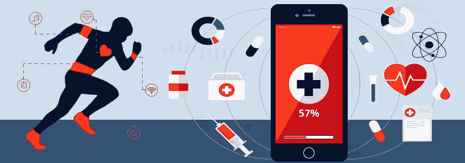

# 医疗保健物联网

> 原文：<https://medium.com/nerd-for-tech/an-internet-of-healthcare-things-346ae395128e?source=collection_archive---------9----------------------->

# 介绍

医疗保健物联网(IoHT)可能是一个概念，它描述了在医疗领域中使用的连接到网络并准备相互通信的专用可识别设备。例如，这些解决方案实现了关于资产的定位和实时信息。远程或自动管理资源也是可行的。这不仅需要更高质量的护理和时间的节省，然后还要确保病人的安全。[有了 IoHT，医疗机构的管理更加高效，可以不间断地访问设备、数据和患者信息](https://www.technologiesinindustry4.com/)。大多数 IoHT 解决方案最重要的特点是灵活性和个性化。系统通常适用于每个设施，不管是什么专业或规模。它们甚至会与现有的技术和软件集成，连接和修改。

# 描述

IoHT 中涉及的是执行某些操作(如测量)或具有特定功能的设备。重要的是，改装意味着即使是旧机器也常常要适应 IoHT 解决方案。

关于 IoHT 中的连接，有与终端设备集成的通信模块。这使得知识和远程传输成为可能。信息由 IoHT 对象组成，传输到云平台。有各种通信标准；因此，重要的是提供商要灵活，并准备好为每个系统选择合适的一个。

云平台在 IoHT 中有很大的作用。同样，软件和平台也可以作为一种服务。这提供了对数据的安全和持续的访问以及直接的传输，这对于每个医疗机构和患者都是至关重要的。云允许不同的元素使用相同的基础设施，同时提供不同的功能。IoHT 平台通常与其他内部系统集成在一起，使得合作快速而直接。

# IoHT 的好处

*   医疗保健物联网(IoHT)可能会带来新的增长，成为医学、医疗保健服务和消费者健康领域的一场革命。
*   智能医疗设备，包括智能手机、手表和其他连接在 IoHT 中的基于生物的可穿戴设备，可以提供改进的、普遍的、经济高效的和个性化的医疗援助和健康。
*   一个 IoHT 也可能在某些方面发展医院、疗养院、辅助生活和连续护理退休社区。例如，在医院中，自动洗手系统、护理人员提醒、定位设备以及设备生成的医疗数据与医疗记录的自动链接可以改善医院的运营和安全。
*   [此外，一个国际人道主义援助小组不仅可以监测，还可以支持干预和援助。](https://www.technologiesinindustry4.com/)
*   即插即用设备，不仅适用于健康人，也适用于老年人和其他残疾人的可用界面，处理大量知识以避免大量护理人员的技术，以及研究。这些研究证明，物联网技术的医疗价值是大规模采用物联网家庭医疗保健所必需的。
*   一个真正的全球物联网基础设施有可能彻底改变药物实践，并改变人们管理健康的方式。

更多详情请访问:[https://www . technologiesinindustry 4 . com/2021/06/an-internet-of-health care-things . html](https://www.technologiesinindustry4.com/2021/06/an-internet-of-healthcare-things.html)