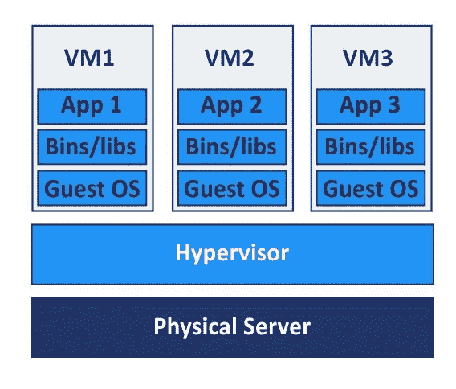
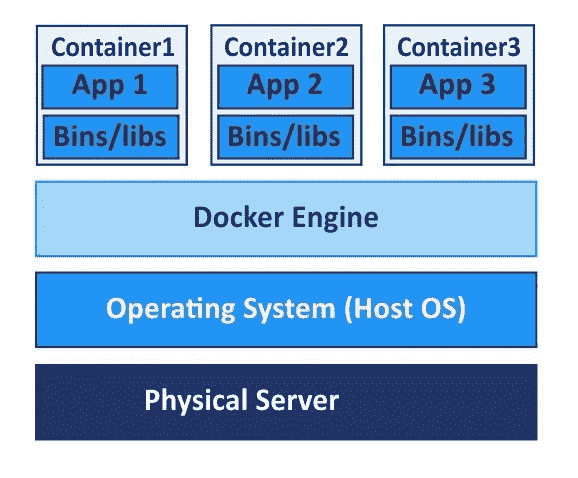

# 码头工人和集装箱介绍

> 原文：<https://medium.com/nerd-for-tech/an-introduction-to-dockers-and-containers-46255dd6f091?source=collection_archive---------13----------------------->

码头工人和集装箱介绍

早期，开发人员使用两个独立的物理服务器(如 web 和 application)来部署他们的 web 应用程序。但是在这里，所有的内存和其他功能可能没有被完全使用，这意味着这不是 100%可利用的。作为解决方案，虚拟机管理程序应运而生。

**使用虚拟机管理程序部署 Web 应用**

管理程序或虚拟机监视器(VMM)允许一个硬件通过共享公共硬件资源(如内存、处理能力等)来托管多个虚拟机。主要有两种类型的虚拟机管理程序，称为类型 1 和类型 2。

图一。使用虚拟机管理程序部署 Web 应用程序。

如图 1 所示，虚拟机管理程序安装在高处理硬件设备或物理服务器之上，独立的虚拟机安装在其上。在每个虚拟机内部，安装了操作系统和应用程序。通常，单独的虚拟机被分配给特定的应用，例如应用、web、负载平衡器、代理等。

虚拟机管理程序解决了应用程序部署的浪费问题，但在这方面我们仍有一些问题需要解决。这里我们必须注意每个独立操作系统的许可、修补和维护。作为一种解决方案，容器化应用程序的概念已经出现。

**集装箱化应用**

在这里，这解决了多操作系统的问题。因此，我们不需要担心每个独立操作系统的许可、修补和维护。参考图 2。

图二。用 Dockers 部署 Web 应用程序。

这里，我们只在物理层上安装一个操作系统。同样，我们不需要为应用程序的单个部署启动单独的操作系统，因为操作系统已经启动。坞站或集装箱部署在坞站引擎的顶部。

当我们谈论码头工人时，应该考虑以下术语。

*码头工人*

这是一个开源项目，允许创建容器和基于容器的应用程序。

*Docker 文件*

Docker 文件用于编写构建 docker 映像的命令。

*Docker 图像*

这是使用创建的 docker 文件构建的。Docker image 是一个只读模板，其中包含将用于在 Docker 引擎上创建容器的指令。

*码头集装箱*

这通过包含支持应用程序运行的所有东西来包装需要运行的应用程序。

*对接引擎*

docker 在 docker 引擎上运行。它负责管理容器、图像等等。当我们谈论 docker 引擎时，有两个重要的术语。

*   Docker 注册表:Docker 注册表是存放 Docker 图片的地方。有许多注册中心存储 docker 图像，如 Amazon、Microsoft 等。但 docker hub 是其中最大的。
*   编排:在这里，当我们有几个微观级别的服务或流程时，我们可以为每个服务创建单独的容器。之后，使用所有这些容器可以朝着一个共同的目标前进。Kubernetes 是用来延续这种编排的。以前这是由谷歌建立的，但现在这是一个开源项目。

**关于码头工人的附加要点**

*   容器或 dockers 不等于虚拟机管理程序。
*   Dockers 是持久的，这意味着你在关机前做的事情不会在关机后丢失。
*   在微服务中使用 dockers 时，最好为每个服务创建单独独立的容器。

**参考文献**

*   [https://www.youtube.com/watch?v=cUiU8yDdQmw&list = PLD-myte BG 3 x 9 haz1t 39-af 4g hetwy 9-v3&index = 1](https://www.youtube.com/watch?v=cUiU8yDdQmw&list=PLD-mYtebG3X9HaZ1T39-aF4ghEtWy9-v3&index=1)
*   [https://www.docker.com/resources/what-container](https://www.docker.com/resources/what-container)
*   [https://www . Oracle . com/it/cloud-native/container-registry/what-is-docker/](https://www.oracle.com/it/cloud-native/container-registry/what-is-docker/)
*   [https://www . freecodecamp . org/news/a-初学者友好-containers-VMs-and-docker-79 a9 E3 e 119 b/](https://www.freecodecamp.org/news/a-beginner-friendly-introduction-to-containers-vms-and-docker-79a9e3e119b/)