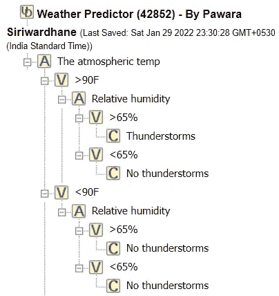
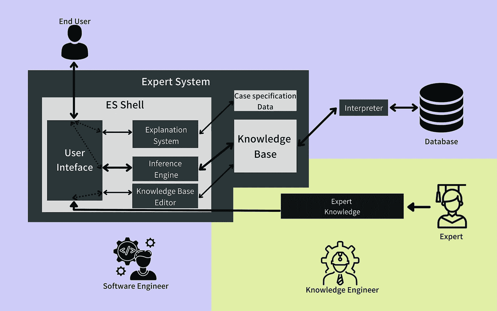

# 专家系统外壳介绍

> 原文：<https://medium.com/nerd-for-tech/an-introduction-to-expert-system-shells-530043914ec0?source=collection_archive---------1----------------------->

## ES Shell 结构概述及流行专家系统 Shell 的比较

图片来源:[https://www.canva.com/](https://www.canva.com/)

专家系统是一种经典的符号人工智能方法，是代表人工认知系统的最佳范例之一。时至今日，虽然像 [DENDRAL](https://www.britannica.com/technology/DENDRAL) (1960，仅 ACS)、 [DART](https://www.gwern.net/docs/ai/2002-hedberg.pdf) (1991，仅 ACS)、IBM 的认知计算机 [Watson](https://www.ibm.com/watson) (2011，ML+ACS)等独立产品，专家系统的推理和知识表示的概念和实现仍然在现代人工智能系统中使用。例如[罗斯](https://www.ibm.com/blogs/internet-of-things/iot-spotlight-on-lawtech/) (2017):“第一个人工智能驱动的律师”建立在 IBM 的沃森之上，可以理解语言，假设假设，并用参考和引用来支持生成的结论。因此，对专家系统和 ACSs 的研究是不可忽视的。

然而，下面的文章不是关于专家系统的；这是关于建立他们。

为了容易地构建专家系统，推荐使用既省时又省力的专家系统外壳。简单地说，专家系统外壳(ES Shell)是一个工具包，由典型专家系统的内置基本组件组成。因此，本文旨在描述 ES Shell 在构建专家系统中的结构和应用，以及流行 Shell 的优点和局限性。

本文的内容组织如下:

1.  [专家系统](#6bdb)
2.  [专家系统外壳](#2a67)
3.  [ES 外壳结构](#628c)
4.  [热门 ES 炮弹](#86b9)
5.  [结论](#4dc3)
6.  [参考文献](#ef5a)

# 1.专家系统

一个能够模仿人类专家解决问题行为的智能程序可以被认为是一个专家系统。人类知识由特定学科/领域知识和问题解决知识组成。专家系统的功能类似于人类专家，通过将其解决问题的知识应用于其特定领域的知识来解决问题。因此，专家系统是一个计算机程序，它象征着某一领域专家的知识。

以下是专家系统的主要特征:

*   在特定的域上运行。
*   主导提问过程。
*   处理不完整的信息。
*   为专家系统给出的答案提供确定性。
*   处理替代解决方案。
*   提供答案的理由

具有上述特征的专家系统可以通过使用类似 ProLog 的逻辑编程语言从头开始开发，或者可以通过使用专家系统外壳来容易地实现。

# 2.专家系统外壳

专家系统外壳是可用于开发专家系统的工具包。它们由一些构建的专家系统组件和一个空的知识库组成。因此，在大多数情况下，知识工程师只能填充知识库。它本质上是一个特殊用途的工具，内置于特定领域或专家知识领域应用程序的要求和标准中。它可以被定义为一个软件包，通过提供一个知识表示方案和一个推理机来帮助建立基于知识的专家系统。

不同的 ES shells 提供了各种方法来将知识建模到知识库中。他们是

1.作为规则

使用规则来填充知识。基于所使用的专家系统外壳，这些规则可以由 Prolog、Java、Python 或任何其他优选语言来编程

2.以决策树的形式

图 02:基于上述规则创建的基于树的专家系统(来源:[作者](http://www.mcgoo.com.au/esbuilder/viewer/viewES.php?es=c4e9042d673b7741b71c81817d8c9347)创建)

3.作为对象(框架)—具有关于特定对象或概念的典型知识的数据结构。

ES shell 是快速开发专家系统的理想选择。由于这个原因，它可以被认为是专家系统实现中最具商业可行性的方法之一。

# 3.专家系统外壳结构

专家系统外壳是指包含以下内容的软件模块:

1.  用户界面(内置)
2.  推理引擎(内置)
3.  一个知识库的结构化框架(在其空状态下),带有适当的知识表示工具

不仅上述组件，一些 ES Shells 也通过解释器、web 集成和自然语言处理(NLP)特性为数据库连接提供了便利。

图 03:[作者](https://pawara73.medium.com/)插图(参考:[专家系统架构(tripod.com)](https://cinuresearch.tripod.com/ai/www-cee-hw-ac-uk/_alison/ai3notes/subsection2_5_2_1.html#SECTION0052100000000000000))

用户界面是最终用户(使用专家系统获得解决方案)和知识工程师(执行知识工程和建模)可用的门户。

知识库可以与外部数据库(如 MySQL)连接，因为知识库在存储大量数据方面不是最佳的。知识库不能直接访问数据库，这些访问功能是通过解释器实现的。

一些 ES Shells 内置了知识库编辑器，方便知识工程师轻松地更新和检查知识库。知识工程师收集特定领域的专业知识，并在填充知识库时建模。

推理机是专家系统中最重要的部分，它通过对知识库中的事实和规则进行反向链接或正向链接来访问知识库并解决问题。在 ES Shells 中，推理机也是一个内置组件，通常用 ProLog 编程。

大多数 ES shells 由另一个称为“解释系统”的组件组成，该组件通过考虑可用的“案例说明数据”，为用户提供提供某个答案的原因和解释。

在专家系统外壳中，用户界面和其他软件组件的设计由软件工程师编程。因此，专家系统是 03 个主要团体的合作设计:专家、知识工程师和软件工程师。(根据规模，这些团体可能从个人到大型团队有所不同)

# 4.流行的专家系统外壳

下面是一些专家系统的例子，开发者可以用它们来构建不同规模的专家系统。根据 ES Shell 的不同，每个 Shell 都有不同的优缺点。

## 4.1 专家系统-构建器

ES Builder 代表专家系统构建器。它是最著名的专家系统外壳之一。这是一个免费的 ES shell，专为学生和研究人员开发专家系统 shell 而实现。这个外壳包含一个使用 AJAX 框架构建的改进的 web 界面。ES-Builder 将知识库的事实和规则存储在一个在线 MySQL 数据库中。有一个内置的推理引擎(用 Prolog 编写)，用户界面使用简单的 HTML 和 CSS 开发。维护数据库连接，以便使用 PHP 访问知识库。

规则库知识库也可以使用由属性、值和结论组成的决策树来开发。

*   **属性:**属性是要在专家系统中测试的可能结论的特征。
*   **值:**每个值节点代表对特定结论的属性的最正确响应。
*   **结论:**基于属性和值做出的最终决策就是结论。

**ES Builder 的好处:**

*   自动生成的用户界面(用户界面的简单 HTML CSS 设计)
*   能够创建知识库的备份文件，易于与 MYSQL 数据库集成。
*   能力使用决策树填充知识库。
*   基于规则的知识库的优化视图。

**ES-Builder 的局限性:**

*   仅支持正向链接规则，不支持反向链接规则。
*   桌面工具仅支持 Windows 98 和 Windows 7。

## 4.2 夹子

CLIPS 代表 C 语言集成生产系统。顾名思义，CLIPS 专家系统外壳是用过程语言 c 编写的。CLIPS 是 1985 年在 NASA 的约翰逊航天中心开发的。它是一种基于规则的编程语言，用于创建专家系统。CLIPS 用于启发式解决方案比传统算法方法更容易实现和维护的系统中。

CLIPS 以编程方法/编程范例的形式提供了 03 种不同的知识表示工具。03 方法是:

*   程序的
*   面向对象
*   基于规则的编程

由于 CLIPS 是用 C 语言编写的，因此 CLIPS 开发的专家系统也需要 ANSI 编译器。因为已经有 ANSI 编译器的系统可以容易地运行专家系统而不改变源代码。

**夹子的好处:**

*   可以很容易地嵌入到用过程语言编写的其他子程序中，以扩展现有的功能。
*   支持模糊逻辑和代理等方法。

**剪辑的局限性:**

*   仅支持正向链接规则，但不支持反向链接规则。

## 4.3 杰斯

JESS 代表 Java 专家系统外壳。JESS 是另一个专家系统 shell，也是一个完全由 Java 编程语言编写的脚本语言。JESS 大量用于构建基于规则的专家系统，这些系统与用 Java 编写的系统紧密相连。用 JESS 构建的专家系统既可以运行在命令行界面上，也可以作为 Applet 使用。

基于 JESS 的专家系统被广泛用作智能代理，用于企业资源规划系统和电子商务平台的订单验证。

**杰斯的好处:**

*   更适合应用于性能受算法质量支配的较大问题。
*   包括反向链接和工作记忆查询。
*   比用 C 语言编写的专家系统外壳开发的专家系统更快。
*   包含一些在执行系统时允许使用较少内存的命令。

**杰斯的局限性:**

*   在浏览器中使用时，某些功能会受到限制。

## 4.4 PyKE

PyKE 代表 Python 知识引擎。PyKE 使用受 Prolog 启发的逻辑编程，但 PyKE 完全是用编程语言 Python 编写的。python 函数、PyKE 规则和 PyKE 模式变量、图表是 PyKE 知识库的主要特性。这是一个推理引擎，使用规则和事实来创建额外的事实，使用规则的正向链接来证明目标。

此外，通过反向链接，它将 Python 函数组装成可定制的调用图，也称为计划。

**PyKE 的好处:**

*   高度可定制和代码适应性。
*   高性能。
*   代码可重用性。
*   支持正向链接和反向链接。
*   能够在本地系统上运行命令来指导推理。
*   提供终端用户提问功能。

**PyKE 的局限性:**

*   UI 应该手动创建。
*   当集成不同 ui 的推理机时，会出现集成问题。

# 5.结论

很明显，ES Shells 比从头开始开发一个专家系统要好得多。有许多支持不同编程语言的 ES Shells，它们为熟悉各种编程语言的开发人员打开了大门。应该主要考虑要开发的专家系统的要求和规模/大小/复杂性来适当地选择 ES 外壳。

敬请关注。我们很快就会看到下一篇文章“如何用 ES-Builder 制作专家系统”。

# 6.参考

[https://www . researchgate . net/publication/263278128 _ Basic _ Concepts _ of _ Expert _ System _ shell _ and _ an _ efficient _ Model _ for _ Knowledge _ Acquisition](https://www.researchgate.net/publication/263278128_Basic_Concepts_of_Expert_System_Shells_and_an_efficient_Model_for_Knowledge_Acquisition)

[https://cinuresearch . tripod . com/ai/www-CEE-HW-AC-uk/_ Alison/ai 3 notes/subsection 2 _ 5 _ 2 _ 1 . html](https://cinuresearch.tripod.com/ai/www-cee-hw-ac-uk/_alison/ai3notes/subsection2_5_2_1.html)

[https://www . research gate . net/publication/235028224 _ of _ Expert _ System _ shell 的 _ 适用性 _ 和 _ 限制 _ 功能](https://www.researchgate.net/publication/235028224_The_Applicability_and_Limitations_of_Expert_System_Shells)