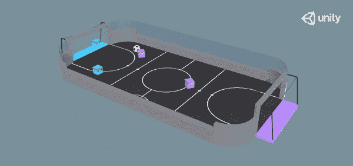
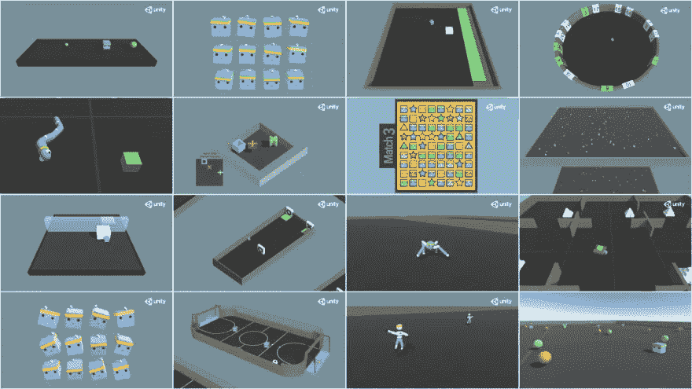
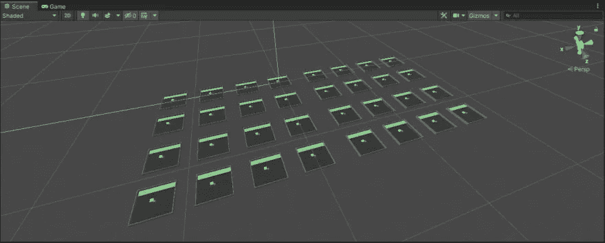
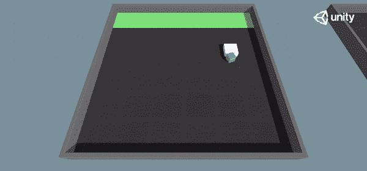
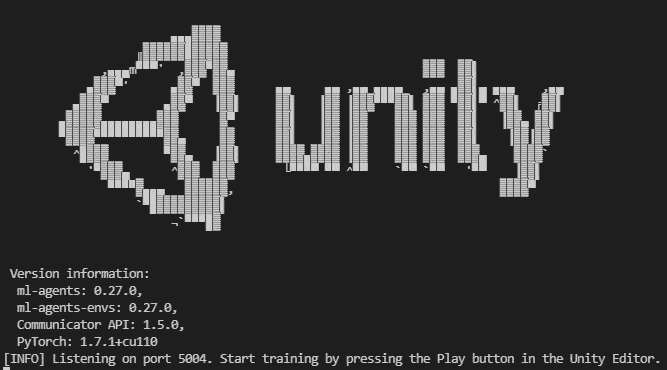
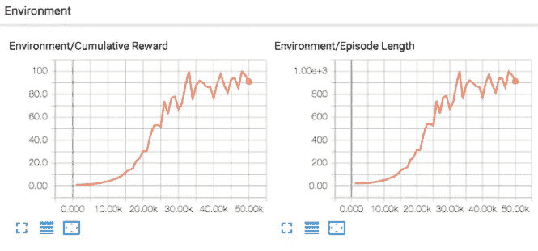
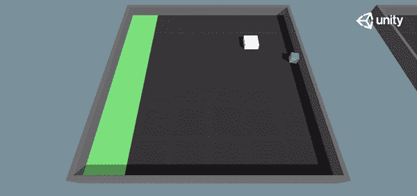
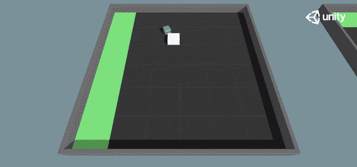
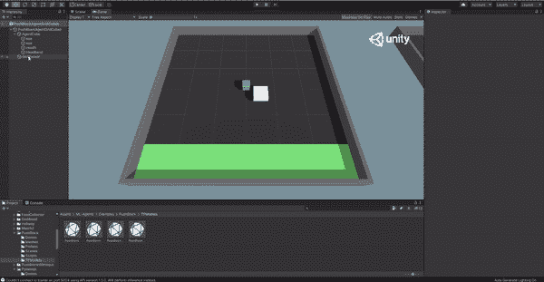

# Unity ML-agent 机器学习导论

> 原文：<https://medium.com/nerd-for-tech/an-introduction-to-machine-learning-with-unity-ml-agents-af71938ca958?source=collection_archive---------8----------------------->

## Unity ML-Agents 入门并培训一名代理来推动数据块。


在本教程中，你将学习如何设置 Unity 的 [ML-Agents toolkit](https://github.com/Unity-Technologies/ml-agents) ，并使用强化学习训练你自己的代理。不需要以前的统一经验。

# 什么是 Unity ML-Agents？

ML-Agents 是现有 Unity 平台的附件。它为研究人员和游戏开发人员提供了构建复杂 3D 环境和在其中培训智能代理的能力，同时利用强大的 Unity 引擎和 UI。



足球环境来自 Unity ML-Agents

# 在我们开始之前…

如果你正在寻找一些强化学习的背景，请查看:

*   [一(长)窥强化学习](https://lilianweng.github.io/lil-log/2018/02/19/a-long-peek-into-reinforcement-learning.html)
*   [使用 OpenAI Gym 开始强化学习](https://www.gocoder.one/blog/rl-tutorial-with-openai-gym)

接下来，您需要安装 Unity 和 ML-Agents 插件。[遵循此处的安装说明](https://github.com/Unity-Technologies/ml-agents/blob/release_18_docs/docs/Installation.md)。

您将需要遵循可选的指令来克隆 ML-Agents Toolkit 存储库[，因为它将包含我们将在本教程中使用的示例环境。](https://github.com/Unity-Technologies/ml-agents/blob/release_18_docs/docs/Installation.md#clone-the-ml-agents-toolkit-repository-optional)

# 熟悉 Unity ML-代理

一旦所有东西都安装好了，加载由`ml-agents`提供的 Unity 项目样本。

1.  在 Unity Hub 浏览器中，转到`Projects > Add`
2.  导航到您克隆或下载了`ml-agents`库的地方
3.  选择“项目”文件夹，然后在文件浏览器中单击“选择文件夹”

提供的项目包括 18+ [示例环境](https://github.com/Unity-Technologies/ml-agents/blob/release_18_docs/docs/Learning-Environment-Examples.md)供我们开箱即用。



基础 Unity ML-Agents 项目中提供的示例环境

首先加载提供的[推块环境](https://github.com/Unity-Technologies/ml-agents/blob/main/docs/Learning-Environment-Examples.md#push-block)。

1.  找到**项目标签**
2.  导航到**资产> ML-Agents >示例>推块>场景。**
3.  双击`PushBlock.unity`场景进行加载。

您应该会看到这样的场景:



💡选择工具栏中的**手形**工具，点击并拖动鼠标在视图中移动。按住 **Alt (Windows)或 Option (macOS)并左键单击**以围绕一个对象旋转。

> ***场景说明:***
> 
> *在 Unity 中，场景是包含部分游戏或应用程序的资产。在我们的例子中，这个场景包含 32 个“区域”对象。每个“区域”对象包含一个“代理”对象以及组成我们的推块环境的其他对象。
> 这些代理都独立工作，但共享相同的模型。这样做是为了加快训练速度，因为所有代理都同时参与训练。*

我们场景中的代理已经预装了一个训练有素的模型。点击场景面板上方的▶️按钮，观看它们的运行。



推块环境中训练有素的代理

# 训练代理解决推送阻塞

在推块环境中，目标是将块推到绿色目标区域。奖励函数是:

*   每步+0.0025
*   如果方块触及目标，则+1.0。

从`ml-agents`存储库的根目录在您的终端中运行:

```
mlagents-learn config/ppo/PushBlock.yaml --run-id=pb_01
```

该命令将使用一些默认配置启动训练过程。如果你打开路径`config/ppo/PushBlock.yaml`下的`PushBlock.yaml`文件，你会看到:

```
behaviors:
  PushBlock:
    trainer_type: ppo
    hyperparameters:
      batch_size: 128
      buffer_size: 2048
      learning_rate: 0.0003
      beta: 0.01
      epsilon: 0.2
      lambd: 0.95
      num_epoch: 3
      learning_rate_schedule: linear
    network_settings:
      normalize: false
      hidden_units: 256
      num_layers: 2
      vis_encode_type: simple
    reward_signals:
      extrinsic:
        gamma: 0.99
        strength: 1.0
    keep_checkpoints: 5
    max_steps: 2000000
    time_horizon: 64
    summary_freq: 60000
```

您可以通过简单地修改这个文件来试验不同的超参数。你可能还会注意到提供了其他算法，即 PPO、SAC、POCA(由 ML-Agents 团队开发)和模仿学习。

如果你已经正确安装了`ml-agents`，你将会看到如下信息:



现在转到你的 Unity 项目，点击▶️按钮开始培训过程。您可以点击▶️按钮停止训练过程。通过添加`--resume`标志，您可以随时恢复训练:

```
mlagents-learn config/ppo/PushBlock.yaml --run-id=pb_01 --resume
```

训练时，您将从控制台收到有关训练进度的信息。您还可以通过在单独的终端中运行来可视化培训:

```
tensorboard --logdir results
```



您还可以在 Unity 中实时观看我们的代理培训:



未经培训的代理人计算出推块



我们的代理人开始学习如何在大约 100，000 步后推动积木。

训练完成后，您的模型将位于`results/pb_01/PushBlock.onnx`。要加载此模型:

1.  将其重命名，以免与提供的`PushBlock.onnx`型号混淆。
2.  将这个`.onnx`文件拖到**资产> ML-Agents >示例>推块**下的 **TFModels** 文件夹中
3.  在**项目面板**中，转到**资产>ML-代理>示例>推块>预设**
4.  双击**推块区域预置**。
5.  在**层次面板**中，选择**代理对象**。
6.  将您的模型拖到检查器面板中**行为参数**下的**模型**字段中。
7.  将推理设备设置为 **CPU** (对于大多数使用 ML-Agents 工具包生成的模型，CPU 将比 GPU 更快)

> ***关于序跋:***
> 
> 在 Unity 中，预置是一个可以在场景中使用的可重复使用的资产。在我们的例子中，我们之前加载的推块场景包含 32 个推块区域预设的实例。

通过更新预设中的模型而不是场景，这个代理的所有 32 个实例的设置将被一次更新。像以前一样点击▶️，看看你训练有素的代理人！



加载我们新训练的模型

# 后续步骤

Unity ML-Agents 是一个强大的工具，它使强化学习算法的训练和实验变得容易。

然而，使 ML-Agents 成为强大工具包的是利用 Unity 引擎和创建复杂、物理和图形丰富的 3D 环境的能力。创建您自己的定制环境需要您更加熟悉 Unity。

接下来，我们将向您展示如何在 Unity 中为培训强化学习代理创建您自己的定制环境。