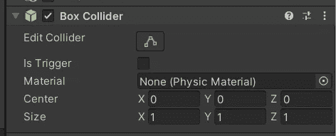
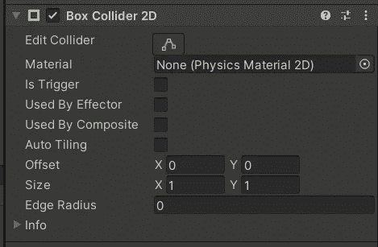
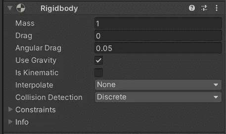
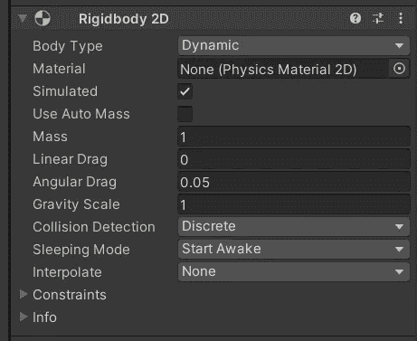

# Unity 中的物理学导论

> 原文：<https://medium.com/nerd-for-tech/an-introduction-to-physics-in-unity-d6bad0634402?source=collection_archive---------23----------------------->

_ collider.enabled = false

在我们考虑给游戏添加敌人之前，了解 Unity 中的物理系统是如何工作的很重要，这样我们就可以很容易地检测到我们不同游戏对象之间的碰撞。

Unity 为我们提供了两种类型的组件，它们需要能够利用内置的物理系统。这些是**对撞机**和**刚体**。值得注意的是，这两种类型都有 2D 和 3D 变体。

比如说—

3D 盒子碰撞器

2D 盒对撞机

碰撞器是允许碰撞被物理系统注意到的组件。

许多 Unity 图元在我们创建它们的时候都配备了一个合适的碰撞器——如果你一直跟着做，检查你的玩家游戏对象，你应该已经有一个 3D 盒子碰撞器了。我们现在将坚持使用 3D 变体，当我们开始为游戏实现一些精灵资源时，它们可以很容易地被替换掉。

正如我提到的，我们还需要一个刚体组件—

三维刚体

2D 刚体

刚体是允许力施加到我们的游戏对象上的组件。这可以通过几种不同的方法来实现，甚至可以简单地对游戏对象施加重力。

***注:*** *关于刚体组件及其各种方法的更多信息可以在* [*脚本 API*](https://docs.unity3d.com/ScriptReference/Rigidbody.html) *中找到。*

需要注意的是，要发生碰撞，**参与碰撞的两个**物体都必须连接一个**碰撞器**。而其中只有**一个**物体需要**刚体**。

刚体可能是资源密集型组件，因此建议将它们放在实例较少的对象上。例如，如果我们要检测玩家和敌人之间的冲突——我们的敌人将是一个预设，因此会被复制很多次，如果敌人有一个刚体，你就可以创建和你在屏幕上的敌人一样多的刚体。这将不是一个最佳的方法，并可能导致一个落后的游戏体验，最佳的方法将是在玩家身上安装刚体，这样我们仍然可以用最少数量的刚体来检测碰撞。

在我的下一篇文章中，我将使用这个 Unity 物理系统来看看碰撞和触发之间的区别。