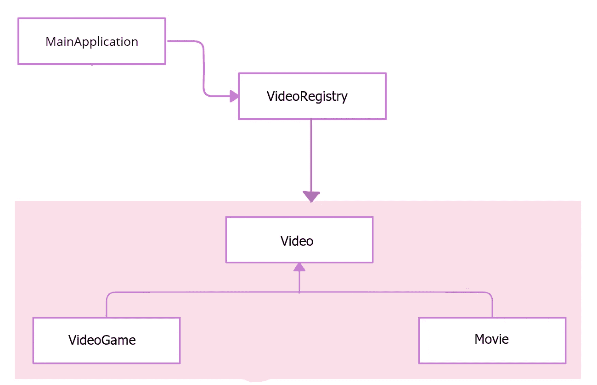

# 原型设计模式介绍

> 原文：<https://medium.com/nerd-for-tech/an-introduction-to-prototype-design-pattern-c0e27d1d1f42?source=collection_archive---------29----------------------->


原型设计模式介绍

原型设计模式负责在不使用 new 关键字的情况下创建新对象，这允许克隆先前创建的对象。这被归类在创造模式下。当直接创建对象非常昂贵时，使用原型设计模式。

当我们实现原型模式时，我们必须意识到我们是需要对象的浅层副本还是深层副本。

*浅抄*

这意味着克隆的对象只是确切资源的简单拷贝。

*深度复制*

这里我们需要将对象中的所有内容复制到新对象中。这意味着所有变量、对象等。应该复制到新的对象中。

下面的例子描述了我们如何在实际场景中实现原型设计模式。

*假设有一家音像店，他们主要向客户出售电影和电子游戏。*

这里的主要目的是创建视频类的副本。图 1 展示了应用程序的总体概况。



图一。应用程序的总体概述。

这里我实现了具有 2 个属性的 Video 类，并实现了一个根据视频类型(电影或视频游戏)计算视频价格的方法。在 Video 类中，我在实现 Cloneable 接口时覆盖了 clone()方法。参考下面的代码。

之后，我实现了从 Video 类继承的电影和视频游戏类。这里我覆盖了 calculatePrice()方法。请参考以下代码。

接下来，在 VideoResigtry 类中，我实现了构造函数，因为当用户创建 VideoResigtry 的对象时，这直接创建了电影和视频游戏类的两个独立实例，并将它们添加到带有它们的类类型的 HashMap 中。在这里，我声明了另一个方法，在给定视频类型时返回视频对象。通常，克隆方法返回对象类型中的对象，因为我们必须将返回的对象转换成我们想要的类型。参考下面的代码。

除此之外，我还实现了一个枚举来保存视频类的类型。参考下面的代码。

最后，我实现了主类，并将其命名为 MainApplication。参考下面的代码。

下面定义了接收到的输出。

```
Movie{moviePrice=250.0, quality='HD', time=180}
Movie{moviePrice=250.0, quality='1080p', time=200}
Movie{moviePrice=250.0, quality='HD', time=180}
```

当我们提到输出时，我已经更改了时间、质量并打印了输出。在那之后，我再次访问了 Movie 类的副本，但是这并没有返回包含我之前应用的更改的实例。发生这种情况是因为，在这里，它总是保存一个 Movie 的临时对象(正如我在 VideoRegistry 类中创建的那样),并在调用 getVideo()方法时返回这个临时对象。

我再次使用 javascript 中的一个小示例实现了原型模式。参考下面的代码。

在这里，我在原型空间上为视频对象添加了 2 组属性，之后，我创建了另一个名为 newvideo 的视频对象。在控制台日志中，打印视频中是否有一个名为 time 的属性。下面定义了接收到的输出。

```
true
truetrue
false
```

据此，首先，它检查时间属性是否在对象和视频原型空间中。但是第二个日志只检查对象 newvideo 的属性。

[](https://github.com/HasiniSandunika/Design-Patterns-Java.git) [## GitHub-HasiniSandunika/Design-Patterns-Java:用 Java 实现设计模式。

### 用 Java 实现设计模式。为 HasiniSandunika/Design-Patterns-Java 开发做出贡献，创建…

github.com](https://github.com/HasiniSandunika/Design-Patterns-Java.git) 

**结论**

按照上面讨论的事情。

*   原型设计模式允许克隆先前创建的对象。
*   这被归类在创造模式下。
*   当直接创建对象非常昂贵时，可以使用这种方法。

**参考文献**

*   https://www.youtube.com/watch?v=zw8kbrEbYxU&list = PLD-myte BG 3 x 86 i3 uyaxwzkfvtuy 2g MDO&index = 3
*   [https://www . tutorialspoint . com/design _ pattern/prototype _ pattern . htm](https://www.tutorialspoint.com/design_pattern/prototype_pattern.htm)
*   [https://www.javatpoint.com/prototype-design-pattern](https://www.javatpoint.com/prototype-design-pattern)