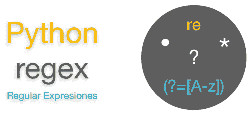

# Python 正则表达式简介

> 原文：<https://medium.com/nerd-for-tech/an-introduction-to-python-regex-eb73a0dd2a2f?source=collection_archive---------23----------------------->



正则表达式是构成搜索模式的一系列字符。RegEx 可用于检查字符串是否包含指定的搜索模式。

在 python 中，可以从名为 re 的模块中使用 RegEx，必须导入该模块才能使用正则表达式。

```
import re
```

RegEx 中使用了很多关键字模式为了组成一个搜索模式，可以在**[**RegexOne**](https://regexone.com/)**上简单看一下。****

# **比赛**

**match 函数用于检查给定的模式是否与字符串开头的字符串匹配。**

## **重新匹配(模式、单词)**

```
import re
ippat = input(‘Enter ur pattern to check: ‘)
a = re.match(ippat,’abcdabcnmh’)
if a != None:
 print(a.start(),’ — -’,a.group())
else:
 print(‘match is not available in the beginning’)Enter ur pattern to check: abc
0 --- abc
```

# **完全匹配**

**Fullmatch 用于检查给定的字符串和模式是否完全匹配。**

## **re.fullmatch(模式，单词)**

```
import re
ippat = input(‘Enter ur pattern to check: ’)
a = re.fullmatch(ippat,’bcbcag’)
if a != None:
 print(a.start(),’ — -’,a.group())
else:
 print(‘match is not available’)Enter ur pattern to check: bcb
match is not available
```

**与匹配不同，fullmatch 仅在模式与给定字符串完全匹配时才返回值。**

# **搜索**

**搜索关键字用于检查给定的模式是否出现在句子的开头。**

## **重新搜索(模式、单词)**

```
import re
ippat = input('Enter ur pattern to check: ')
a = re.search(ippat,'abcdabcnmh')
if a != None:
 print(a.start(),'---',a.group())
else:
 print('match is not available in the beginning')Enter ur pattern to check: ab 
0 --- ab
```

# **芬达尔**

**这个 findall 用于查找该模式在一个句子的给定单词中的所有出现。**

## **re.findall(模式，单词)**

```
import re
a = re.findall('[0-9]','abcdab789cnmh0122jjh')
for i in a:
print(i)7 
8 
9 
0 
1 
2 
2
```

# **潜水艇**

**sub 关键字用于用特定的给定字符替换单词中出现的所有给定模式。**

## **re.sub(模式、要替换的字符、单词)**

```
import re
c = re.sub('[0-9]','#','abcdab789cnmh0122jjh')
print(c)abcdab###cnmh####jjh
```

# **使分离**

**split 用于在给定的模式出现在单词中时将单词拆分成子字符串。它返回一个**列表**格式的子字符串。**

## **重新拆分(模式、单词)**

```
import re
c = re.split('\.','192.168.1.289')
print(c)['192', '168', '1', '289']
```

# **我们在哪里使用正则表达式？**

**在完成这个故事后，你脑海中唯一的问题是我们在哪里使用正则表达式，它的目的是什么，答案是我们可以用它以格式化的方式获得输入，或者搜索和替换操作，如 clrl+F 和 ctrl+H。**

## **示例:**

**车辆登记号码输入格式**

```
a = input(‘Enter the vehicle number: ’)
b = re.fullmatch(‘[A-Z][A-Z][0–9]{4}’,a)if b != None:
 print(‘valid’)
else:
 print(‘invalid’)Enter the vehicle number: TN4567
valid
Enter the vehicle number: KL89
invalid
```