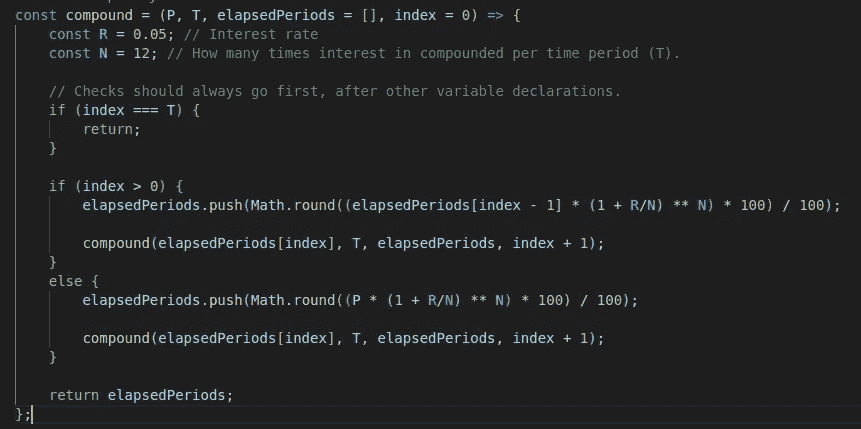
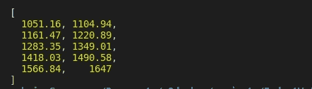
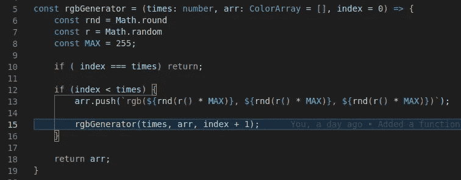

# Javascript 中递归的介绍

> 原文：<https://medium.com/nerd-for-tech/an-introduction-to-recursion-in-javascript-8a42b200ec0a?source=collection_archive---------13----------------------->


[蒂内·伊万尼奇](https://unsplash.com/@tine999?utm_source=medium&utm_medium=referral)在 [Unsplash](https://unsplash.com?utm_source=medium&utm_medium=referral) 拍摄的照片

如果你正在探索函数式编程，那么学习如何循环是值得的，因为循环是你会发现自己在整个项目中使用的一个关键工具。在这个行业中，没有办法真正避免它，除非你只是编写没有重复元素的非常小的应用程序。

如果你熟悉函数式编程中的 for、while 和 forEach 循环方式，你应该把它们抛在脑后，因为它们是面向对象编程/命令式范式的(没有双关的意思)。但是绝对不要忘记他们。毕竟，函数式编程不是宗教，它只是一种编写代码的方式，这主要取决于您的项目需要什么。

不过，不要告诉其他人我说过这话，他们可能会认为这是一种亵渎。*咳嗽*。

本质上，递归只是一个从内部调用自身的函数(或者高阶函数调用低阶函数 x 次)。

让我们看一个简单的递归函数。

```
const rebelScum = (times, index = 0) => { if (index === times) return; console.log('You rebel scum.');
   rebelScum(times, index + 1);
};
```

这将会，你大概能猜到，输出“你这个叛逆的人渣。”x 到控制台的次数。本质上，这或多或少就是 for 循环的工作方式。以下是构建递归函数的一些简单指南:

1.  必须有计数器参数。
2.  必须有退出条件。

差不多就是这样。简单吧？没错。递归函数可以:

*   对于 n 维数组/对象有多个计数器。
*   动态改变循环次数。
*   做浓缩咖啡(或者不做)。

让我们来看一个更实用的递归函数:



递归复合函数

我们得到的输出是:



输出

事情是这样的:

*   首先，它检查 index 是否等于 period。如果是，则返回(跳到末尾)，然后返回数组。
*   else 语句首先触发，因为索引不大于 0，复合起始原则并将其作为数组中的第一个元素添加。
*   该函数调用自身，将更新后的内容作为参数传递给自身，并再次遍历所有 if 语句。
*   由于 index 现在大于 0，它复合最后一个数组元素并将其推送到数组中。
*   在最后一次循环中，index 现在等于 T，因此进行了一次限定范围的返回，跳到函数的末尾并返回数组。

如果我们不提供第一个检查，或者把它放在最后，我们就会得到一个无限循环，也就是所谓的堆栈溢出或 JS，`maximum call stack exceeded`。这个循环实际上可能不是无限的(尽管它当然可能是无限的)，但是这个函数被调用的次数太多，以至于它超过了浏览器或系统的可用内存。

下面是另一个创建 rgb 颜色数组的示例:



然而这并不是实现递归的唯一方法。您也可以使用递归函数调用常规函数，使用与上面相同的原理。

## 让我们回顾一下:

*   递归是当一个函数调用它自己或另一个函数，直到它到达一个条件退出(或崩溃你的 IDE)。
*   您应该始终实现一种方法来让递归函数退出。
*   递归函数最常用于函数式编程。
*   在函数式编程中使用 for 和 while 循环对某些人来说是不可饶恕的大罪，因此递归是一项必须掌握的技能。
*   尽管如此……函数式编程不是一种宗教😏。