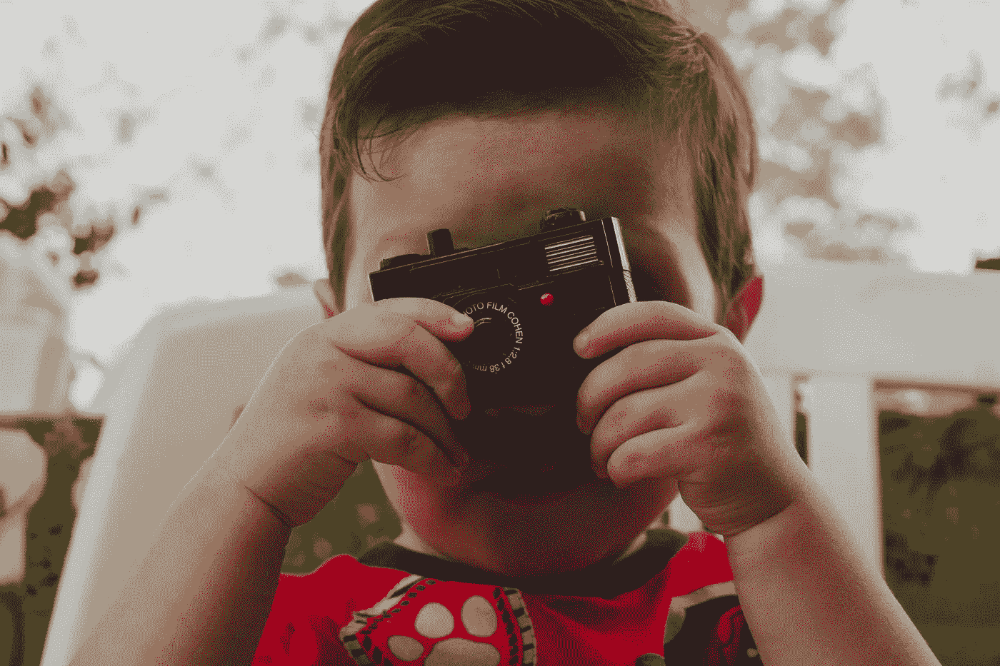
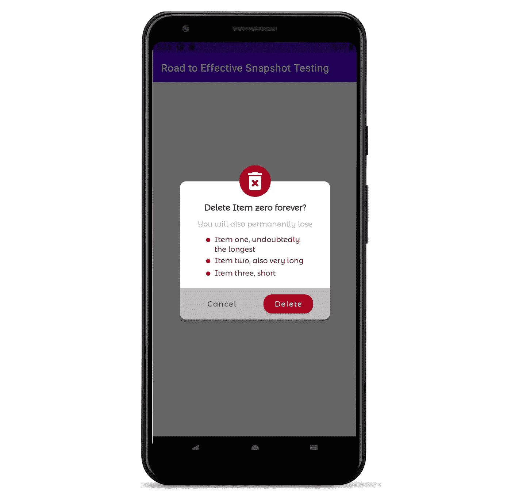
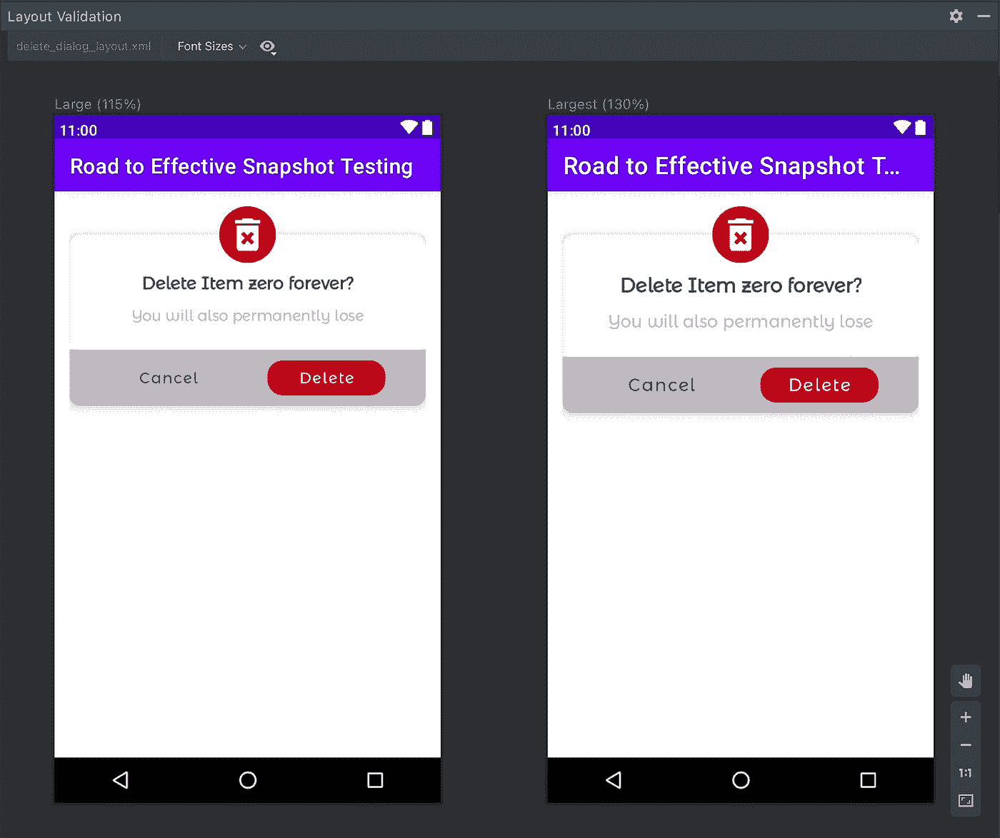
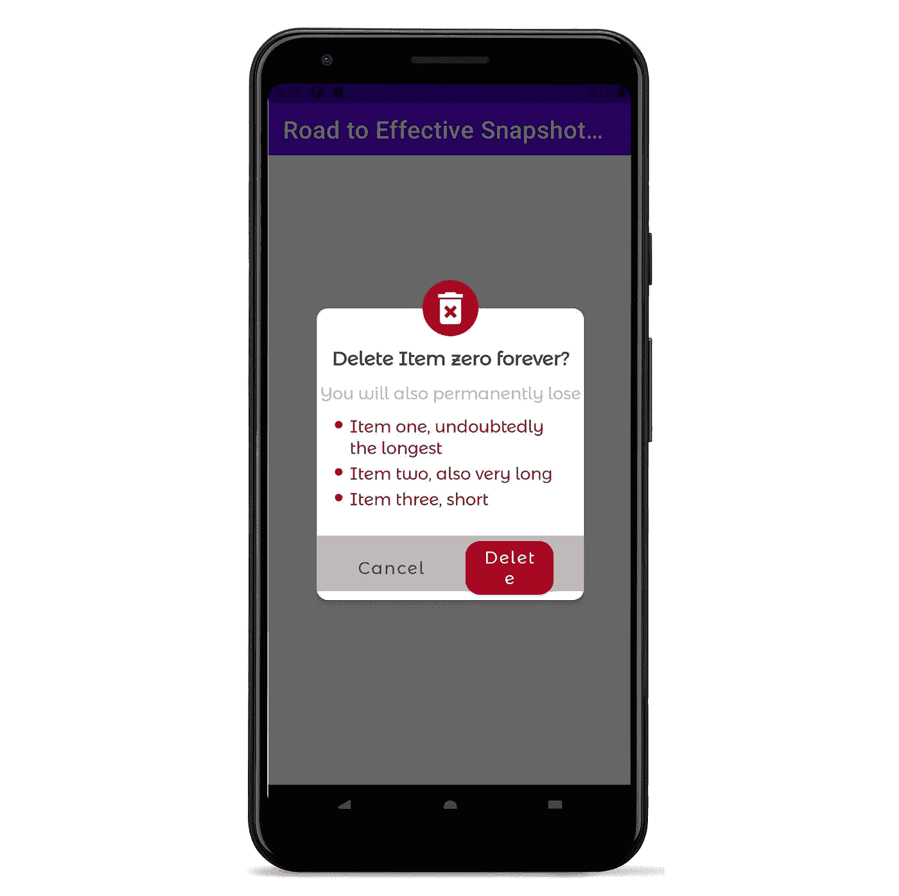

# 2021 年安卓快照测试简介

> 原文：<https://medium.com/nerd-for-tech/an-introduction-to-snapshot-testing-on-android-in-2021-c9826e22deb1?source=collection_archive---------7----------------------->

由 [Eduardo Barrios](https://unsplash.com/@laloblu?utm_source=unsplash&utm_medium=referral&utm_content=creditCopyText) 在 [Unsplash](https://unsplash.com/s/photos/camera-intro?utm_source=unsplash&utm_medium=referral&utm_content=creditCopyText) 上拍摄的封面图片

自 2015 年 10 月 8 日脸书开源了他们的快照测试库的第一个版本以来，快照测试(也称为截图测试)已经在 Android 世界存在了一段时间。它们是一种特殊类型的 UI 测试，可以放大一个视图，对其进行截图，并将其与作为参考的已存储图像进行比较。如果它们不同，测试失败，否则通过。

同样值得一提的是，快照测试并不是要取代 UI 测试。一方面，标准 UI 测试关注于测试视图交互和导航到正确的屏幕。另一方面，快照测试关注的是视图在特定状态下的外观。

与标准 UI 测试相比，快照测试的编写和维护成本更低，而且运行速度更快，可以为开发人员提供更快的反馈。根据《大规模构建移动应用——39 个工程挑战》一书中的数据，快照测试比 UI 测试被许多大公司广泛使用:

*   Airbnb:大约 30.000 次快照测试
*   优步:数以千计的快照测试与少量的 UI 测试
*   Spotify:大约 1.600 次快照测试与大约 500 次用户界面测试
*   Shopify:大约 2.300 次快照测试与大约 20 次 E2E 测试

在我之前的公司 CHECK24，德国最大的比较门户网站，我们在我参与的最后一个项目中也有类似的数字:

*   MoneyTracker:大约 400 次快照测试与大约 30 次用户界面测试
*   C24 银行:大约 800 个快照测试与少量 UI 测试

那么，快照测试如何帮助提高我们应用的质量呢？

# 动机

截图测试擅长检测提交之间的视觉变化。背后的主要动机是它可以捕捉标准 UiAutomator 和 Espresso 无法捕捉的视觉回归 bug。

对于回归错误，我们的意思是:

1.  由库版本更改引入的意外更改，这在 MaterialDesign 组件中时有发生。
2.  间距、样式和主题、文本样式等。
3.  布局正确性

*   如何显示边缘情况(例如，很长的文本与 text == null)
*   确保能见度变化时没有视图重叠
*   不同屏幕密度和/或字体大小下的视图对齐，
*   非常冗长的语言或具有特殊属性的语言，如 RTL(从右到左)、非拉丁字母或文字等。

所有这些视觉属性都很容易用截图测试来验证，而用 UiAutomator 或 Espresso 来断言却非常困难或不可能。虽然这些框架断言*视图是否*被显示，但是它们不能断言*视图如何*被显示。这就是快照测试的目的。

但是你可能仍然认为我们不会经常遇到这些问题。所以让我们想象我们有一个“删除项目对话框”，如下图所示。您可以在这里找到 [xml 布局。](https://github.com/sergio-sastre/RoadToEffectiveSnapshotTesting/blob/master/app/src/main/res/layout/delete_dialog_layout.xml)

设备上的布局如下所示

所以…一切看起来都很好。然而，这只是代表我们的布局，没有任何特殊的配置。为了检查其他配置，Android Studio 附带了布局验证。它使我们能够通过几次点击在众多设置下预览我们的布局。根据我的经验，大而巨大的字体大小是视觉错误的主要来源之一，主要是由于使用 ConstraintLayouts 时糟糕的视图约束。因此，如果我们在布局验证中检查它…

我们动态添加的视图没有显示出来，但是除此之外，看起来很好。

但出于好奇，你决定在设备设置中将字体大小改为“最大”/“巨大”，看看是什么样子。您可以在*设置>显示>字体大小*下找到字体大小选项。这就是你得到的

> *您可以在本回购* 中下载相应的代码

*嗯……看起来我们的布局在一个设备上看起来被破坏了。我们可以得出结论，用布局验证预览来检查我们的布局的正确性因此有一些限制:*

1.  *无法显示动态添加的视图。*
2.  *预览可能会中断，并且可能无法正常显示或根本无法显示。*
3.  *并不总是像在设备上一样显示视图(尽管在大多数情况下非常准确)。*

*考虑到预览不在设备或模拟器上运行，所以它模拟 Android view 系统。因此上面提到的第二点和第三点。*

*好的一面是，我们可以用快照测试解决所有这些问题。更重要的是:我们还获得了跨提交自动检测可视化回归错误的能力。*

*让我们看看快照测试是如何工作的…*

# *快照测试如何工作*

*快照测试不同于传统的 Espresso/UiAutomator 测试。首先，重要的是**所有快照都在具有完全相同规格的仿真器/设备上进行记录和验证**。这是因为验证是逐像素进行的，将作为参考的快照与验证时测试记录的快照进行比较。因此，每个开发团队成员都必须创建一个仿真器或获得一个配置完全相同的设备来进行快照测试。CI 上的模拟器或设备也是如此。*

*在继续之前，值得一提的是快照测试框架提供了两个主要任务:*

1.  ***记录**。当执行时，它为每个测试生成一个快照文件，作为参考*
2.  ***验证**。执行时，它会为每个测试生成一个快照文件，并与记录时作为参考的文件进行逐个像素的比较。*

*一旦团队中的每个人都同意使用相同的设备设置进行快照测试，流程如下:*

1.  ***创建一个快照视图的测试**。这可以从动态放大的视图到仿真器/设备屏幕上显示的活动。*
2.  ***确保** `**adb**` **只列出快照测试设备/仿真器**。这是因为仪器测试在 adb 检测到的所有仿真器/设备上运行。这可能会导致一些问题，如快照文件复制错误、运行时间延长等。*
3.  ***本地执行“记录”**生成相应的快照文件，打开包含这些文件的相应 PR。*
4.  ***一些队友检查快照**以确认它反映了我们期望的视图状态。一旦被批准和合并，这个快照将作为未来测试验证的真实来源。*
5.  ***定期验证快照**(例如，每次 PR、每天一次等。).理想情况下，您有一个配置为“验证”它们的配置项。这意味着，它用最新的代码执行快照测试，并截取一个屏幕截图。之后，它会将此截图与上次上传到 CI 的截图或 PR 中推送的截图进行比较。如果两者匹配，测试通过，否则失败。*

# *赞成的意见*

1.  *与 UI 测试相比，编写和维护成本更低。主要包括放大视图、设置其状态和拍摄快照。在大多数情况下，它不需要或很少需要与 UI 交互。如果需要，可以使用 Espresso 或 UiAutomator 进行快照测试，它们并不相互排斥。*
2.  *运行起来比 UI 测试快得多。根据其复杂程度，每个测试甚至可以在不到一秒钟的时间内运行和记录。快照验证需要更多时间，因为它还涉及到将快照与其对应的引用进行比较。我还将专门用一章来减少快照测试的执行时间，对于那些有大量快照测试的人来说。*
3.  ***捕捉只有快照测试才能捕捉到的视觉缺陷**。UiAutomator/Espresso 测试可以验证视图是否显示，但快照测试在断言视图是否按预期显示方面要精确得多。*
4.  ***帮助改善与设计师和/或翻译的沟通**。快照测试要求团队成员确认快照反映了视图的预期状态。通过将设计人员和翻译人员纳入他们的审批范围，我们可以在合并之前尽早发现设计和翻译错误。其结果是降低了某项功能的开发成本，同时提高了应用程序的整体质量。*
5.  ***极具扩展性**。编写一个测试，并让它在每种可能的配置下运行。这对于参数化测试来说很简单，我将在下一篇文章中解释。然而，如果不小心，它可以成倍增加您的建设时间。在接下来的文章中，我还会给出一些写好快照测试的建议。*

# *骗局*

1.  ***视图中的任何变化都被视为回归**错误，除非记录了新的测试。您经常会发现自己处于这样一种情况:由于新的需求，您修改了一些布局，推进了您的代码，但是它在 CI 上失败了，因为您没有记录反映这些更改的布局的新快照。*
2.  ***仍然不是 100%自动化**。需要手动验证才能知道什么显示正确，什么显示不正确。以前面的图像为例:在没有人类评估的情况下，您如何确定布局已经损坏？或者一种语言的翻译是正确的？或者黑暗模式中的颜色是预期的？*
3.  ***片状剥落**。当进入更复杂的视图时，剥落开始毫无理由地出现。但是，深呼吸。这些剥落大多是有原因的，是可以避免的。我会写一篇完整的博客来解释如何找到并消除这些剥落的根源。*
4.  ***仿真器配置**。最常见的快照测试方法是使用仿真器，因为它们是“廉价”的选择。然而，这比看起来更麻烦。您会发现自己在错误的设备/仿真器上记录快照测试，或者经常从仿真器中擦除数据，以避免由于存储不足而导致的错误。在 CI 模拟器上验证快照测试？小心冻结模拟器。演出还在继续…但是，不要太担心这个。我将在本系列的另一篇文章中给出一些缓解这些问题的技巧。*

*如果使用得当，快照测试是一个强大的工具，可以确保您的应用程序在我们的应用程序要求的任何规范下看起来都应该是这样。你的应用程序支持的配置越多(例如语言、明暗主题)，它们就越有用。另一方面，它的剥落和配置麻烦是开发者放弃它们的主要原因。*

*在本系列之后，您将对快照测试有非常深刻的了解，并且能够充分利用它们。我们不仅会讨论如何从快照测试中去除碎片，以及一些减轻模拟器配置问题的技巧，还会讨论如何编写高效的快照测试，以及在我们得到数百个快照测试后如何提高它们的速度。*

*在下一篇文章中，我将讲述如何编写有效的快照测试，包括一些例子，也是针对 Jetpack 组合视图的。*

*您可以在这里找到本系列将使用的回购，包括本文中使用的示例。*

*我希望你喜欢这篇文章。不要忘记*明星*[仓库](https://github.com/sergio-sastre/RoadToEffectiveSnapshotTesting)或*订阅*这个博客，敬请关注！*

*如果您喜欢这篇文章，您可能也会喜欢我写的其他文章:*

1.  *[通过参数化测试实现更好的单元测试](https://sergiosastre.hashnode.dev/better-unit-tests-with-parameterized-testing)*
2.  *[用基于属性的测试编写防弹代码](https://sergiosastre.hashnode.dev/writing-bulletproof-code-with-property-based-testing-pbt)*
3.  *[用 HTML 标记直接在 Android xml 中设计动态字符串](/nerd-for-tech/styling-dynamic-strings-directly-in-xml-7b93cfe380ab)*

**最初发布于*[*https://sergiosastre . hash node . dev*](https://sergiosastre.hashnode.dev/an-introduction-to-snapshot-testing-on-android-in-2021)*。**