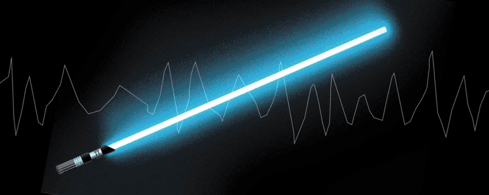
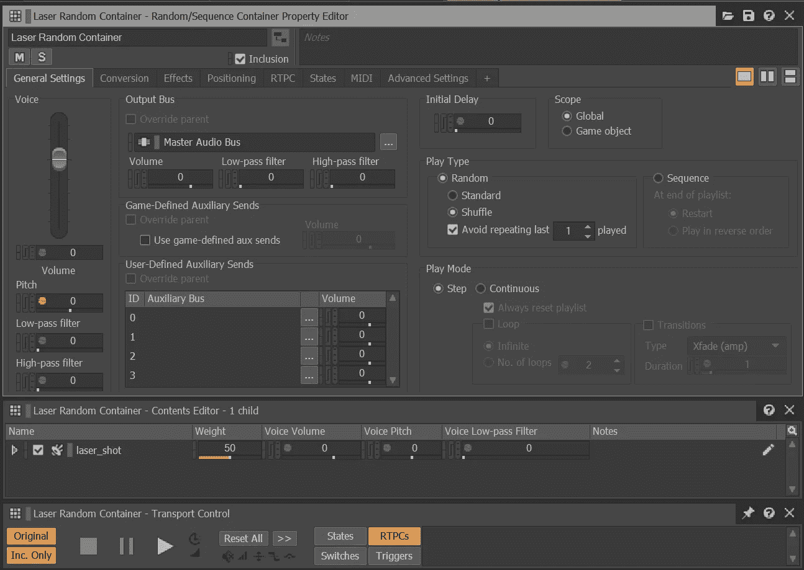
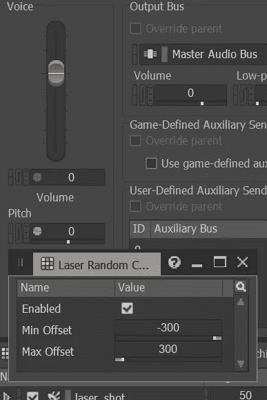
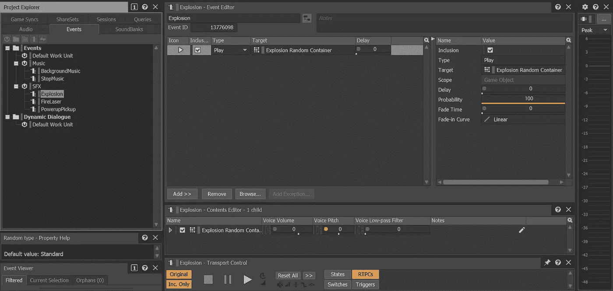
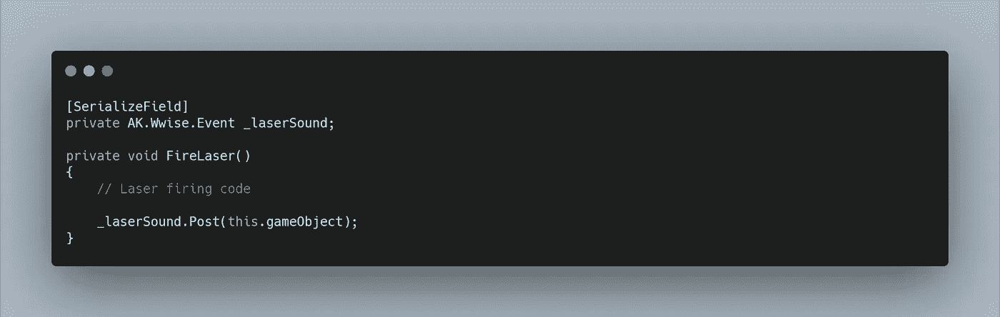

# Wwise 简介第 2 部分:SFX

> 原文：<https://medium.com/nerd-for-tech/an-introduction-to-wwise-part-2-sfx-b71bd1a74489?source=collection_archive---------24----------------------->

如果你还没有阅读上一篇文章，请在这里阅读****，因为我们已经介绍了 Wwise 的一些基本功能，并将直接跳到**音效。SFX** 是沉浸在任何形式的视觉媒体中的关键部分。在电影中，一切都是线性的，但当涉及到视频游戏时，我们不知道用户将如何玩游戏。在我们的太空射击游戏中，有大量的激光射击。玩家会对同样的**声音**一遍又一遍地重复感到非常厌倦。但是有了像 **Wwise** 这样的中间件，我们可以很容易地将变化应用到我们所有的声音中。****

****所以让我们从我们的**激光器开始。**首先在我们的 **Actor-Mixer 层次结构**中创建一个 **SFX 工作单元**。在这个**工作单元**中，让我们创建一个**随机容器**。现在，如果我们选择这个，我们可以导入我们的声音。我们仍在进行原型制作，只是对实现进行分类，所以现在，让我们只使用我们的单个占位符 **Laser SFX** 。****

********

****一个**随机容器**的主要目的是，我们可以用多个**声音剪辑**填充它，但只需调用它来播放一个**事件。**保持我们的代码在 **Unity** 内简短，留下 **Wwise** 在内部处理其余的。如果我们靠近图像的右上方，我们可以看到一个名为**播放类型**的部分，这允许我们随机或按顺序运行**剪辑**的**容器**。我们想要选择**随机**和**标准**，这作为一个正在进行的随机功能，而**无序播放**作为一个更传统的音乐播放列表功能，因为每个**剪辑**在播放后都会从**池**中移除。如果我们有大量的**片段**，我们也可以在再次听到相同的**片段**之前调整播放量。****

****查看图像底部，我们还可以看到，我们可以在**容器中的每个**剪辑**上设置一个**权重**，**进一步允许我们操纵随机性。****

**因为我们只有一个占位符音效，让我们通过随机选择**音高**来创造一些变化。这可以通过点击我们的**音量下左边的小圆圈来完成。****

****

**这使我们能够以最小和最大的偏移来增加音高的变化。如此简单的东西可以立即使我们的 **SFX** 感觉更加身临其境，并为重复的声音而精心设计。**

**我们可以简单地对我们的**爆炸声**和**开机声重复这个过程。**现在我们可以为每个在各自的**随机容器上调用 **Play** 的容器创建一个**事件**。****

****

**让我们跳回到 **Unity** ，看看我们如何从代码中调用 **Wwise Events** 。**

**如果你还没有，确保你已经移除或者取消激活了你的**游戏对象上的**音频源和/或音频剪辑组件**。****

**我们最初的**激光声音**是从我们的**玩家脚本中调用的。我们不再需要编写代码来获取组件和空值检查。相反，我们可以创建一个私人 AK。Wwise.Event 变量**和**将**序列化，这样我们就可以在检查器中分配我们的**事件**。**

**现在在我们的 **FireLaser 方法**中，我们可以**将**事件**发送到 **Wwise。******

****

**默认情况下，我们的**容器**在**窗口**中的**定位**被设置为**直接分配**，因此不遵循任何形式的空间化。由于我们在一个 2D 游戏中，我们的**监听器**连接到**摄像头**，我们可以简单地在 **this.gameObject** 上发布**事件**。如果我们有一个 3D 游戏，想要让**激光声音**在玩家周围的各个方向发射，我们可能会想要将事件发布到激光对象，以便**音频监听器**可以读取适当的空间化属性。**

**最后，我们只需要在**检查器中分配我们的**事件**。**您将需要在 **Wwise** 中**重新生成**您的**音色库**，并可能在 **Unity 中的 **Wwise Picker 窗口**中刷新项目。****

**对于我们的**爆炸**，我们用两种不同的方式来称呼它。一个在**敌人死法**中的**敌人**上，另一个在**开始法中的**爆炸预制体**上。****

**很像激光，这些都可以分配给 **AK。各自脚本中的 Wwise.Event 变量**。然后在各自的方法中，我们在游戏对象上发布事件，这比使用 Unity 的音频引擎要简单得多，并且已经在 SFX 上有了变化。**

**同样，我们可以在我们的**加电脚本**、**上做同样的事情，在我们的**ontrigerenterd2d 方法中发布**事件**。**即使我们的**加电**立即**在碰撞时销毁**本身，只要我们在**销毁函数之前有**后置函数**，我们的 **Wwise 事件**仍然会被调用和播放。这是因为我们的 **Wwise 事件**不是游戏对象的一个组件，相反，一旦它被调用， **Wwise** 就会独立完成所有的工作。因此，我们不必担心**播放剪辑点**和找到**收听者位置**来准确放置 **SFX。********

随着我个人项目的进展，希望我能找到一些时间和灵感来创作一些我自己的**音乐**和**音效**，我们可以在**场景**中看到一些更深层次的**沉浸**。当这种情况发生时，我一定会发布第 3 部分！现在，我对进一步的音频集成问题的讨论或问题持开放态度，无论是在这里的评论区还是在我的[**LinkedIn**](https://www.linkedin.com/in/calum-slee-a45345210/)**上。**