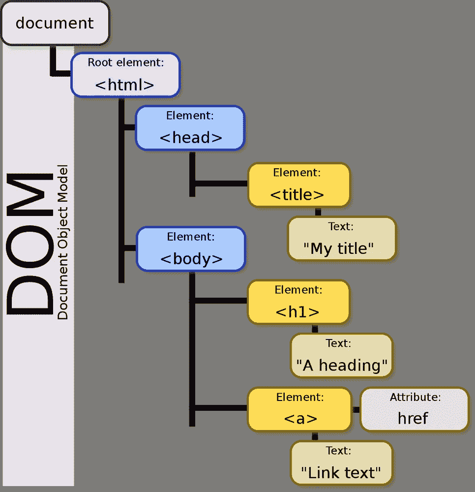
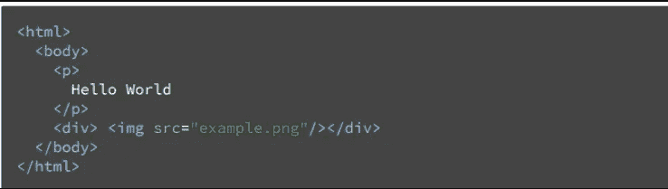
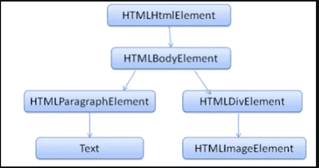
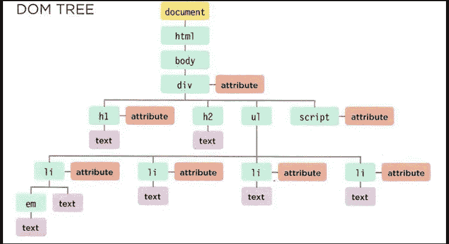

# 反应研究指南 JS[DOM，虚拟 DOM 和 JSX]第一部分

> 原文：<https://medium.com/nerd-for-tech/an-investigative-guide-to-react-js-dom-virtual-dom-and-jsx-part-i-30f62d5b0b7b?source=collection_archive---------3----------------------->

**反应**的必要性是什么？

*必要性是发明之母*，如果是这样的话，那么**反应**的必要性是什么？

在 React 之前，Javascript 被用作 DOM 操纵器，或者作为链接到 HTML 文件的独立文件，或者作为内联脚本标签。

记住这一点！

> *HTML——页面的结构*
> 
> *CSS —页面装饰*
> 
> *JS —页面的行为*

让我们打破这些单词，

**文档** = HTML 文档

**对象** =标签/元素及其关联的**方法**和**属性**

模型 =网页的布局

从上面我们可以得出结论， **HTML** 和 **DOM** 是链接的。他们之间有什么联系？是的，**浏览器**

> *浏览器接收 HTML 文件并解析它以给出 DOM 树*

HTML 文件

DOM 树

由于所有的 DOM 树元素都由 HTML 文件中的标签表示，所以它被称为**标记**语言，而不是**编程**语言

# **重述**

*   所以 DOM 是一个网页的面向对象的表示。
*   它们由 **HTML(标记)**表示
*   这可以通过名为 **JavaScript 的脚本语言来修改。**
*   这就是为什么 **javascript** 被称为 **DOM 操纵器**
*   HTML 提供了网页的结构，CSS 提供了网页的装饰，最后，Javascript 提供了网页的行为。
*   浏览器接收一个 HTML 文件，并将其转换成 DOM 树。这被称为**解析。**
*   我们在 HTML 中做的是 DOM 树的标记。这就是为什么 HTML 被称为**标记语言**
*   DOM 树是由**元素**、**属性**和**内容**(文本)组成的网页结构
*   我们可以通过 **Javascript 改变 DOM 树。**这就是为什么 javascript 被称为 **DOM 操纵器**

# Javascript 作为 DOM 操作

> *每个节点都是有方法和属性的对象。*
> 
> 脚本访问并更新这个 DOM 树(不是源 HTML 文件)。这实质上意味着无论何时我们打开同一个 html 文件，我们得到的是同一个页面，而不是被操纵的页面
> 
> *对 DOM 树的任何更改都会反映在浏览器中。*

有 4 个节点？在此之前**节点**和**元素有什么区别？**

所有的**元素**都是带有**标签**的**节点**。例如，< a >、< head >、< HTML >都是**元素**，而**属性**和**文本**都是**不是**元素而是**节点！**

这 4 个节点是

**文件**→顶部

**元素** → < h1 >、< p >、<李>等

**属性** →类别、风格、id 等

**文本** →元素内容

# DOM 查询

访问 DOM 包括两个步骤:

1.  找到代表您想要使用的元素的节点
2.  使用它的文本内容和属性来操作 DOM 树。

在 DOM 树中寻找元素(标签)的方法被称为 **DOM 查询**。

注意:**方法**是 javascript 中的内置函数，它使我们能够操作 DOM。请阅读[本](https://www.w3schools.com/jsref/dom_obj_document.asp)

# 概述

*   Javascript 被用作 DOM 操纵器
*   操作不会改变源 HTML 文件
*   DOM 中的元素是 Node 的子集。即元素是带有标签的节点
*   通过 DOM 查询(方法和属性)访问 DOM，如 **getElementByID、getElementByClassName、querySelector**

我知道我已经把一个网页的整个工作原理塞进了一篇文章里。下一篇文章我们将会看到为什么**反应**是必需的

*最初发表于 2022 年 2 月 27 日*[*https://www.pansofarjun.com*](https://www.pansofarjun.com/post/an-investigative-guide-to-react-js-dom-virtual-dom-and-jsx-part-i)*。*