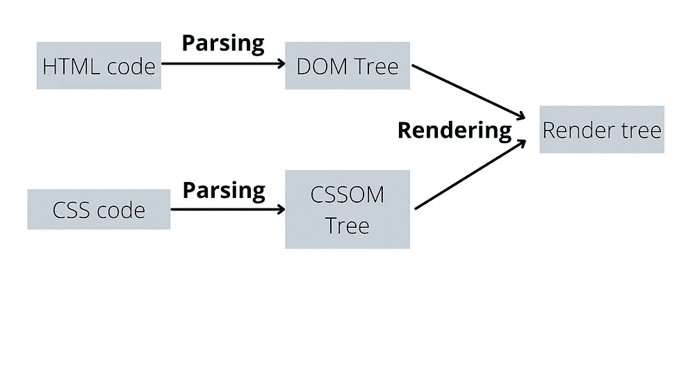
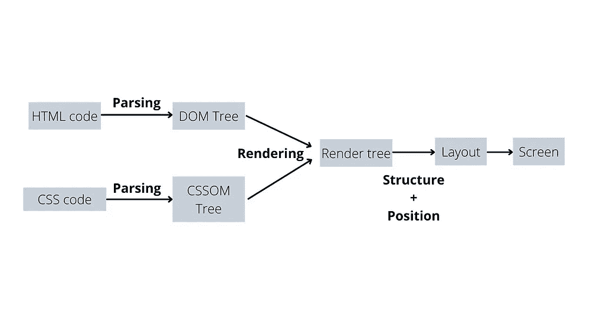

# 调查指南反应 JS[DOM，虚拟 DOM 和 JSX]第二部分

> 原文：<https://medium.com/nerd-for-tech/an-investigative-guide-to-react-js-dom-virtual-dom-and-jsx-part-ii-26f406ed7a00?source=collection_archive---------1----------------------->

第一部分的亮点

*   浏览器将我们的 **HTML 代码**解析成 **DOM 树**
*   这是因为浏览器只理解 DOM
*   DOM 基本上有 4 个节点——文档、元素、属性和文本
*   DOM 可以通过 Javascript 修改，这就是为什么 JS 被称为 **DOM 操纵器**
*   JS 有 DOM 操纵器(方法和属性),它们统称为 **DOM 查询**

当浏览器显示页面时，其结构由 **DOM 树**决定。浏览器引擎解析 DOM 树。如果你有 CSS 附加到一个 HTML 文件，那么它会被转换成一个 **CSSOM 树**。

> ***解析*** *意为* ***代码到树*** *转换*

在显示到屏幕上之前，DOM 树(来自 HTML)和 CSSOM 树(来自 CSS)混合在一个叫做**渲染树的地方。**这个过程叫做**渲染。**

> ***渲染*** *表示 DOM 和 CSSOM 相遇的地方*

所以**渲染树**在屏幕或网页显示之前连接 DOM 和 CSSOM。我们知道 HTML 是用于页面的**结构(head、** **title、** **body 等)**，CSS 是用于页面的**装饰(colour、** **position、** **background 等)**。结构和装饰都需要在屏幕前计算/安排。这部分由**布局阶段完成。然后它会显示在屏幕/网页上。**

> ***布局*** *表示结构和位置的混合*

# Javascript 在浏览器中是如何工作的？

我们有一个 HTML 文件作为源。将会有链接到它的 CSS 用于样式化和 **Javascript** 用于 DOM 操作。

发明 Javascript 是为了让网页变得动态。我们可以很舒服地说，JS 在 web-1.0(静态)和 web-2.0(交互)之间架起了一座重要的桥梁。作为 DOM 操纵器，需要和 DOM 沟通。为了访问 DOM， **JS** 必须使我们能够与 DOM 通信。该启用或通信过程由 **API(应用编程接口)**完成

> ***API*** *是指* ***两个* ***软件/应用*** 之间的**

*当 Javascript 作为一种编程语言被引入时，它需要像语法/规则这样的标准，这样它就可以在所有浏览器上运行。这是 ECMA 做的。*

***ECMA** 讲述了 JS 应该如何被所有浏览器(Chrome、Firefox 等)实现，以便它在所有浏览器上运行完全相同。这就是为什么 Javascript 和 ECMA 脚本可以互换使用。*

> *注意:ECMA 没有告诉 JS 应该如何在浏览器中运行。这就是为什么我们为 chrome 开发了 V8 引擎，为 Firefox 开发了 SpiderMonkey，为 Internet explorer 开发了 Chakra*
> 
> **运行是指它如何被转换成机器代码在 CPU 中执行**

*如果我解释浏览器的引擎如何运行 javascript，这篇文章就会变成一个兔子洞。这超出了本文的范围。*

1.  *HTML 和 CSS 分别转换成 **DOM** 和 **CSSOM** 。这个过程叫做**解析。***
2.  *DOM 和 CSSOM 在**渲染树**混合。这个过程被称为**渲染***
3.  *在屏幕上显示之前，结构和位置在**布局**阶段混合*
4.  *Javascript 通过 DOM 的 **API** 赋予网页动态性*
5.  *Javascript 由 ECMA 标准化。JS 是由所有浏览器完全相同的**实现的，但是在浏览器内部运行 JS 是由浏览器决定的**。*****

******最初发表于 2022 年 3 月 2 日*[*https://www.pansofarjun.com*](https://www.pansofarjun.com/post/an-investigative-guide-to-react-js-dom-virtual-dom-and-jsx-part-ii)*。******