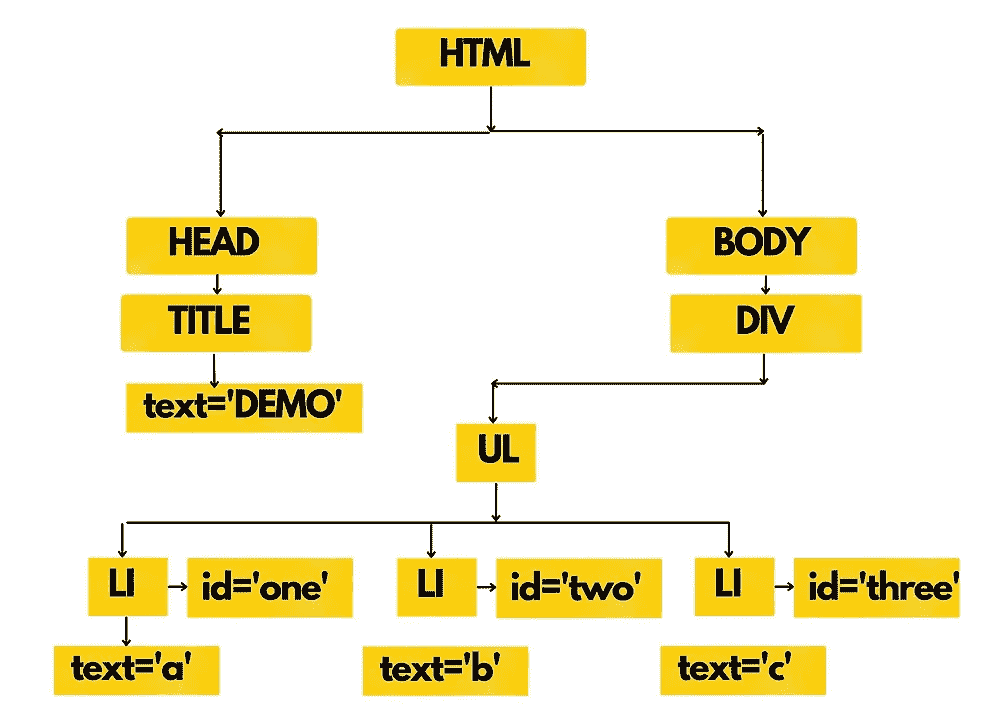
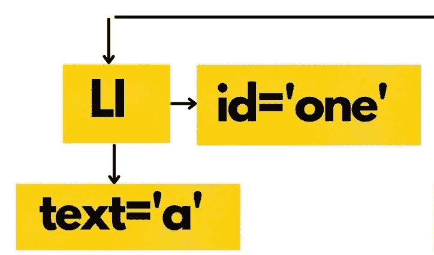
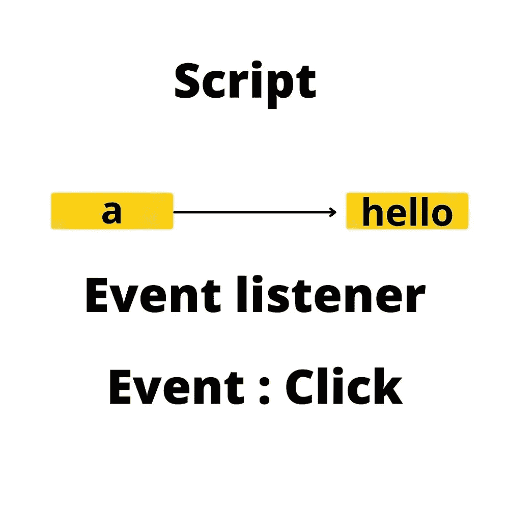

# 调查指南反应 JS[DOM，虚拟 DOM 和 JSX]第三部分

> 原文：<https://medium.com/nerd-for-tech/an-investigative-guide-to-react-js-dom-virtual-dom-and-jsx-part-iii-f446fd0a8366?source=collection_archive---------3----------------------->

*   HTML 和 CSS 分别被解析为 **DOM** 和 **CSSOM**
*   DOM 和 CSSOM 在称为**渲染**的过程中混合在一起，并输出渲染树
*   **布局**是结构和位置(HTML 结构和 CSS 装饰)相遇的地方
*   最后，它们被显示在屏幕上
*   我们知道 JS 是一个 DOM 操纵器，它通过 API (应用编程接口)访问 **DOM**
*   为了在所有浏览器上实现相同的输出或显示， **ECMA** 标准化了 JS。
*   每个浏览器**运行**JS**不同**

# 是什么促使了 ReactJS 的发明？

这个问题让我们想到了在 React、Angular、Vue 等 JS 库/框架出现之前，事情是如何运作的。我们知道 JS 的引入是为了给网页带来动态性。添加动态性，如**背景颜色变化，如夜间模式**，**内容变化**如新闻网站，**定制用户体验**如网飞等。

这基本上把我们带到了一个问题:在库/框架之前和之后，动态性是如何被添加到网页中的？

# 在框架/库之前

动态性基本上使用户能够与网络互动。大多数时候，用户交互是通过点击、滚动、按键、选择等事件发生的。这些被称为**事件。**

**事件检测(点击、选择、调整页面大小等)→触发 JS 函数(包含 DOM 查询)→通过 DOM 查询更新 DOM**

在代码层面上，涉众是 **DOM 元素、DOM 查询、事件和 JS 函数**。

流程包括

*   我们需要在 DOM → DOM 查询中更新什么元素，比如 getElementById、getElementByClassName 等。\
*   在 JS 中创建一个函数来做我们**想要**做的事情——这个函数叫做**事件监听器**
*   将元素附加到事件侦听器函数

应用上述过程，

*   我们需要更新什么元素？我们将更新 id 为**‘one’**的元素
*   我们打算做什么？让我们将文本**‘a’**替换为**‘你好’**
*   我们将在脚本(内联或<脚本>中创建 JS 中的函数(又名**事件监听器**),它将文本更改为**‘hello’**
*   如果有事件侦听器，我们需要指定事件。为简单起见，我们将以' **click** 事件为例。

节点元素

事件监听器

我有意识地不想在这里写代码，因为人们甚至没有意识到他们为什么要写代码。他们写代码是因为他们被要求或被训练这样做。大脑总是从视觉化的角度来思考。

# 这种方法的局限性

*   这种方法起初看起来很容易。但是当你大规模构建 web 应用程序时，这就变得更加困难了。
*   设想一个场景，您需要跟踪许多具有不同 id 和类的元素节点。我们如何更新 DOM？
*   我们如何将不同的脚本文件连接到源 HTML 文件中？
*   遍历和访问 DOM 元素变得复杂，错误修复变得乏味
*   代码的重用几乎是不可能的
*   模块化方法，即 JS、CSS 和 HTML 不在同一个地方。它们之间的连接是另一个繁琐的过程。

*原载于 2022 年 3 月 6 日*[*【https://www.pansofarjun.com】*](https://www.pansofarjun.com/post/an-investigative-guide-to-react-js-dom-virtual-dom-and-jsx-part-iii)*。*