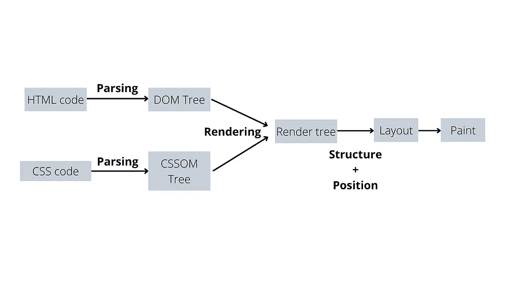

# 调查指南反应 JS[DOM，虚拟 DOM 和 JSX]第四部分

> 原文：<https://medium.com/nerd-for-tech/an-investigative-guide-to-react-js-dom-virtual-dom-and-jsx-part-iv-9c8220340a06?source=collection_archive---------3----------------------->

第三部分[的亮点](https://www.pansofarjun.com/post/an-investigative-guide-to-react-js-dom-virtual-dom-and-jsx-part-iii)

*   JS 的真正目的是增加网页的动态性
*   大多数情况下，这是通过用户与页面的交互来实现的。这些被称为**事件**。
*   我们创建 JS 函数来增加动态性。这些被称为**事件监听器。**
*   我们通过 DOM 查询来访问 DOM。
*   *事件检测(点击、选择、调整页面大小等)→触发 JS 函数(包含 DOM 查询)→ DOM 和事件监听器连接。*
*   当您构建像脸书这样的大型交互式应用程序时，这个过程会变得复杂

# 是什么让 DOM 操作变得缓慢？

DOM 基本上是一个**树形数据结构**。树形数据结构使得 DOM 的改变和更新更快。那是什么让它慢了？每当我们更新一个节点(父节点)时，即使子节点没有变化，它的子节点也会被重新渲染(即更新)。如果应用程序包含许多节点和子节点，这种不必要的重新渲染会使速度变慢。*记住，由于树形数据结构，更新速度很快，但在屏幕上绘画会使更新速度变慢(即显示)。* ***这是因为与*** ***关联的整个子节点被重新绘制在屏幕上。***

> ***在一个*** ***浏览器上下文中，DOM 对象是 javascript 对象***

# React 只是在原始 DOM 之前添加了另一个层

到目前为止，我们已经看到了 HTML/CSS/JS 在浏览器中是如何工作的。浏览器总是使用 DOM。在大型应用程序中频繁操作 DOM 会降低性能。所以我们需要找到一种在浏览器中操作 DOM 的有效方法。此外，这种方式不应该改变浏览器的 DOM 模型。这让我们想到下一件事，无论我们创建什么样的库/框架，都应该是在浏览器 DOM 工作之前额外添加的一层。

> 不同的 javascript 库采用不同的方法来解决这个问题。最终，更快的 DOM 更新和在屏幕上的显示才是最重要的

# 额外的一层反应是什么？

嗯！React 创建真实世界的副本。这叫做**虚拟 DOM** 。这和真实世界一样，但是没有在屏幕上反映出来。由于没有体现在屏幕上(屏幕上没有绘画)，虚拟 DOM 更新更快。

# 虚拟 DOM 是如何工作的？

虚拟 DOM 是具有**键**和**值**对的 javascript 对象。每次发生更新时，都会创建一个新的虚拟 DOM。这实质上意味着 JS 对象中的一些**键**已经改变。新的虚拟 DOM 将所有的键与旧的虚拟 DOM 进行比较。它记录所有已经改变的**键**，并且任何已经改变的**键**将被发送到队列。这个过程叫做**差分**。如果队列中有**键**，将**批量更新**到真实 DOM。这个过程使它更快。

> *批量更新是指将虚拟 DOM 中的所有更新合并到一个更新中，同时发送到真实 DOM*

*注:* *这些东西都是*为了更好理解而对*事物的超级简化*

# 将这些点连接起来

嗯！react 实际上会带来什么？简单！这让事情变得更容易

> *做出反应不会让事情变得更快更容易*

一开始可能看起来很奇怪，但很快就会明白了。浏览器、DOM、虚拟 DOM、DOM 操作、javascript 等这些东西同时发生。因此，我们不时需要回到我们之前在新视角中讨论过的主题。

我们知道**布局**和**绘制(显示)**是浏览器处理网页的阶段。

## 即使一个元素节点改变，Real-DOM 是否重新渲染整个页面？

从逻辑上来说不应该，因为从浏览器的角度来看这些都是简单的事情，他们可以改进，当然他们也确实改进了。对 DOM 的任何更改都可以分为两部分——一部分影响布局(元素和位置),另一部分影响外观(颜色、背景等)。

> *影响位置的一个——回流*
> 
> *影响外观的一种——重涂*

## 哪一个触发了重新渲染？

触发重新渲染的是**回流**。这很直观，因为如果任何元素的位置发生变化，整个网页流都会发生变化(即其他元素的相对位置)。因此，每个元素的位置从零开始重新计算，最终输出再次被**重绘**。这是一个过于简单的解释。

对于**重画**的情况——例如，改变元素字体颜色——只有需要改变颜色的元素被重新渲染，而不是所有的元素。

> *计算越多，性能越差——因此回流使得 DOM 更新缓慢*

React 不会取代这一点，因为 React 通过相同的 DOM API 与 DOM 通信。如果发生回流，react 也会进行相同的整体重新渲染。

*记住:React 只是在原来的 DOM 之前多加了一层。所以它不会改变浏览器的工作方式。因此，如果有人说反应使过程更快，这是不正确的。这让事情变得简单。*

我知道我没有把这些点完美地连接起来。我们将在下一篇文章中完成它。

*原载于 2022 年 3 月 10 日*[*【https://www.pansofarjun.com】*](https://www.pansofarjun.com/post/an-investigative-guide-to-react-js-dom-virtual-dom-and-jsx-part-iv)*。*