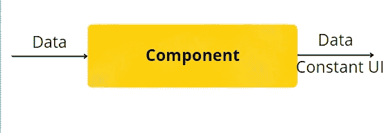

# 反应研究指南 JS[DOM，虚拟 DOM 和 JSX]第六部分

> 原文：<https://medium.com/nerd-for-tech/an-investigative-guide-to-react-js-dom-virtual-dom-and-jsx-part-vi-413b04a71ff3?source=collection_archive---------1----------------------->

零件亮点— [V](https://www.pansofarjun.com/post/an-investigative-guide-to-react-js-dom-virtual-dom-and-jsx-part-v)

*   React 是一个 javascript 框架，因此 React 虚拟 DOM 由 Javascript 方法创建。这个方法叫做 *React.createElement*
*   当你控制台记录任何由 *React.createElement、*创建的元素时，你会得到一个带有键的 JS 对象:
*   **type:** **我们想要在真实的 DOM 中创建什么类型的元素——h1，p，** **div 等**
*   **道具:** **创建真实 DOM 所需的数据和子对象——文本、嵌套元素等**
*   我们可以使用 javascript 使用数据和应用逻辑

# 写 React.createElement()可以吗？

当你每次都要写 React.createElement 来反应元素的时候，这就像是火上浇油。假设我们需要列出所有州的所有区。我们将列出

*   标签来显示地区，如

```
<ul><li>Thanjavur</li><li>Trichy</li></ul>
```

这些选项包括

1.  我们需要为所有的州手工硬编码它
2.  我们可以对输入数据使用 JS 逻辑
3.  我们可以硬编码 React.createElement 来创建 React 元素，然后将它们提供给虚拟 DOM

第二个和第三个选项是相同的。事实上，第三种选择比第二种更耗费时间。但我们必须从第三种选择中发展出一种策略。这里的策略是在上面的场景中找到一个共同的模式。

让我重申一下这个场景，

我们需要使用每个州的列表标签来显示所有的地区。

这里改变的是**数据**(即区)，但 UI 保持不变。

我们将不得不调整像输入和输出系统的 React.createElement，而输出是与输入数据相同的 UI。

接受数据和处理并适合同一 UI 的系统被称为 **React 组件。**

我们可以将任何州的数据输入这个系统，输出将是一个具有相同用户界面的地区列表(即

*   )。

这个系统可以使用 javascript 中的**函数**和**类来创建。这个系统的名字叫做 **React 组件。基于功能的组件是未来的趋势，React 核心团队将更加关注这些组件。****

> *React 组件是返回 React 元素(即普通 js 对象)的简单 javascript 函数*

**重述**

*   使用 DOM 操纵器(JS)更新实际的 DOM 效率不高。
*   重画和回流是更新实际 DOM 时的两个过程
*   React 通过在实际的 DOM 之前添加另一层来解决这个问题。这一层叫做**虚拟 DOM** 。
*   虚拟 DOM 是实际 DOM 的复制品，没有附加到屏幕上(即不会反映屏幕)
*   每当发生更新时，React 都会创建新的虚拟 DOM。
*   然后比较新的和旧的虚拟 DOM，以发现什么被改变/更新。这个过程被称为**差分**
*   任何更改都会被发送到队列中。然后在真实/实际 DOM 中批量更新。这种批量更新使得整个过程更加容易。因此 *React 使流程更简单、更高效，而不是全新的更快的流程*
*   从 JS 的角度来看，这个虚拟 DOM 是一个带有键的简单对象— **类型、键、引用、道具、_ 所有者、_ 商店**。
*   键'**道具**嵌套了' **id** '和'**子**'键。这是在 React(父子关系)中创建嵌套元素的基础
*   该对象由 **React.createElement()** 创建。这个 JS 对象被称为 **React 元素**。
*   我们需要代码的可重用性，因此使用/编写 React.createElement 是乏味且不可重用的。这就演变成了**反应组件的概念。**
*   **React 组件**使 React 代码可重用。组件可以由 Javascript 中的函数和类创建。
*   由函数创建的 React 组件是 React 团队的前进方向和推进方式。
*   因此，React 组件是返回 React 元素的简单 javascript 函数(即带有 key-type、key、ref、props、_owner、_store 的 JS 对象)

*原载于 2022 年 3 月 19 日 https://www.pansofarjun.com**的* [*。*](https://www.pansofarjun.com/post/an-investigative-guide-to-react-js-dom-virtual-dom-and-jsx-part-vi)