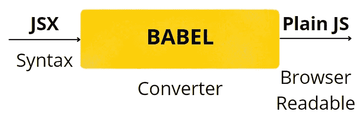
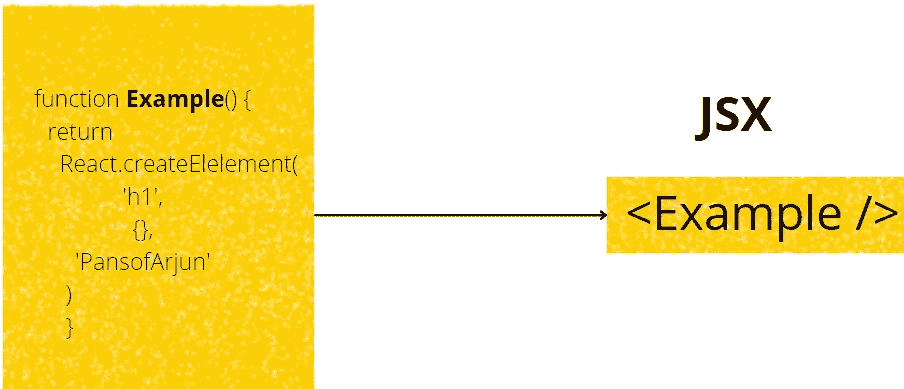
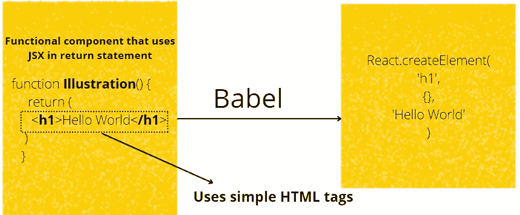

# 调查指南反应 JS[DOM，虚拟 DOM 和 JSX]第七部分

> 原文：<https://medium.com/nerd-for-tech/an-investigative-guide-to-react-js-dom-virtual-dom-and-jsx-part-vii-1ba8e46ff3c9?source=collection_archive---------2----------------------->

我们不能每次都写 React.createElement()来创建一个虚拟 DOM。因此，我们需要某种语法来将我们编写的内容转换成 React.createElement 调用。这种语法被称为 **JSX。**

## React.createElement 的缺点

*   每次创建一个元素都要编写这样的代码是很乏味的
*   如果根元素和最后一个子元素之间有更多的元素，则在括号内嵌套元素
*   我们无法跟踪每个元素的子元素和属性

# **JSX？**

JSX 只是 Javascript 和 XML 的结合。但是等等！为什么是 XML 而不是 HTML？据我在网上浏览，有一件事是清楚的——XML(可扩展标记语言)使我们能够使用用户定义的标签，而不像 HTML 那样强调预定义的标签，如

、

等。这个理由对我来说是合理的，因为我们可以将任何名字放入标签中，如、<hello>、<welcome>等。我同意这听起来很奇怪，但不考虑它与 React 的联系。</welcome></hello>

> 因此，JSX 是 Javascript 和 XML 的语法糖，其中 XML 允许用户定义标签。

但是最终，浏览器只接受普通的 javascript。所以一定有什么东西把 JSK 转换成普通的 JS。这个转换器叫做'**巴别塔**'。

# 这一切是如何结合在一起的？

当我们使用 React 时，我们通常有一个**index.html**，它有一个标签 **< div id='root' >。**会有一个 **index.js** 有***document . getelementbyid(' root ')。很明显，这两个文件必须联系在一起，这里需要注意的一点是，react 应用程序的所有 UI/UX 显示都源于*index.html。*这个概念叫做**单页面应用。**这实质上意味着我们通过 react 组件呈现的所有不同内容都将拥有 id=' **root** '的父标签' **div** '。***

我们可以创造出我们想要的任何功能组件。这些函数可以通过 import 语句导入到另一个组件中。被导入函数的 UI 部分可以通过 **JSX** 合并到父函数(导入的函数)中。这是 **JSX** 的完美用例。

JSX 将像 HTML 一样的标签，它的标签名将是一个导入的函数名。参见下面的例子

基本上，我们创建的所有 react 组件都可以归结为 HTML 标签，如

、

# 、

等。因此 **JSX** 可能包含 HTML 标签，但具有小写字母和其他导入的功能组件(如<示例/ >)

*注意:同样的情况发生在嵌套子关系中，createElement 方法中的第三个参数采用嵌套子关系*

另外，记住 React.createElement 返回普通的 JS 对象，带有键——type、key、ref、props、_owner、_store。这就创建了虚拟 DOM。

*原载于 2022 年 3 月 23 日*[*【https://www.pansofarjun.com】*](https://www.pansofarjun.com/post/an-investigative-guide-to-react-js-dom-virtual-dom-and-jsx-part-vii)*。*