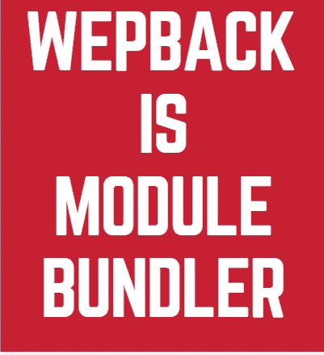

# 调查指南反应 JS[DOM，虚拟 DOM 和 JSX]第八部分

> 原文：<https://medium.com/nerd-for-tech/an-investigative-guide-to-react-js-dom-virtual-dom-and-jsx-part-viii-b3ae965e973e?source=collection_archive---------1----------------------->

第七部分的重点

*   由于 *react.createElement* 不能在每次需要 React 元素时都编写，React 团队最终创建了 JSX 语法
*   JSX 是 JS 和 XML 的结合，其中 XML 部分使我们能够创建用户定义的标签(即基本上不像 HTML 那样只使用预定义的标签，如

    、

    # 、等)。

*   因此 JSX 在虚拟 DOM**之前创建了另一层。需要将 JSX 转换为虚拟 DOM。**
*   注意:虚拟 DOM 是一个普通的 JS 对象，带有键——type、key、ref、props、_owner、_store。
*   我们用的转换器叫**巴别**。Babel 实际上是一个 transpiler，它将一种语法转换成另一种等价的语法。它可以是 React specific (JSX 到 JS)或 general(ECMA 版本之间),或者两者都是(任何浏览器可接受的语法)

# 但是浏览器只需要一个文件？

我们知道 react 构建的**单页面应用**有一个**index.html**，后者有一个标签 **< div id='root' >。**会有一个 **index.js** 有一个***document . getelementbyid(' root ')。*** 几乎我们用 react 组件创建的每一个 UI 都会追溯到 parent *id='root '。*

我们通过 index.js 文件(*document . getelementbyid(' root ')****)从 Html 文件中获取' *root* ' div。*** 我们其实选择 React 是因为我们把 UI 拆分成了返回 react element(UI)的不同组件。这个概念叫做'**模块'**。因此，在一天结束时，我们将分离的组件聚合在一起，形成 web 应用程序的整体 UI。从浏览器的角度来看，这给我们带来了另一个问题，它有一个链接到 *index.js.* 的 HTML 文件，因此浏览器将寻找一个包含所有 react 组件的文件。这个概念叫做“**捆绑**”。React 使用的一个默认工具叫做' **Webpack** '。

# Webpack 是做什么的？

Webpack 将所有 react 组件打包成一个包文件。姑且称之为 ***main.js.*** 浏览器执行这个 *main.js* 。但是有一个变化， ***而不是 index.js，我们需要在 index.html****中用 main.js 替换它，因为在那里我们得到一个单一的 javascript 文件，它捆绑了 React 中的所有组件。*

> **Webpack =模块捆绑器**

*Webpack 可以与 babel 集成。因此，从浏览器的角度来看，它提供了一站式解决方案。*

**

**原载于 2022 年 3 月 25 日*[*【https://www.pansofarjun.com】*](https://www.pansofarjun.com/post/an-investigative-guide-to-react-js-dom-virtual-dom-and-jsx-part-viii)*。**