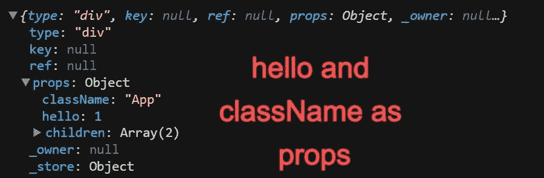
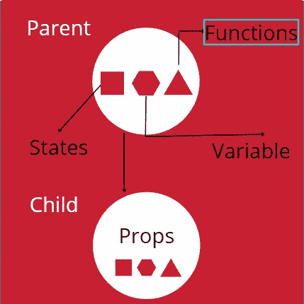

# 调查指南反应 JS[状态和道具]第十部分

> 原文：<https://medium.com/nerd-for-tech/an-investigative-guide-to-react-js-state-and-props-part-x-82e205afe3c7?source=collection_archive---------1----------------------->

我们知道状态就像数组/对象的数据类型数字的变量。如果变量是动态的(变化)，我们使用**状态。**由于状态是一个变量，它的作用域是什么，谁可以访问它？React 组件是返回 react 元素的函数，我们在函数(组件)中声明状态。因此，状态是局部范围的，只对声明它们的函数可用。

> *状态只对它们被声明的组件可用*

# 数据的交流？

我们知道，React app 由许多组件组合而成。不可否认，有些场景需要组件之间的通信。这种交流只能发生在**父母和孩子**之间，反之亦然。这种交流叫做**道具(属性)。**

**Props** 可以是来自子元素的任何东西——函数、状态或任何原始值。原始数据来源于父母，他们对数据有完全的控制权。这就是为什么*‘道具是不可变的(不可改变)。’*

# 它是如何与 React.createElement()连接的？

我们知道 createElement()返回一个带有 type、key、ref、 **props** 、_owner、_store 的对象。这个道具钥匙是一个物件。这个对象可以包含用户定义的、库定义的或类名等键。

我包括像 redux/MUI/RHF(即 npm 库)这样的库定义的，因为库仍然是 React 组件，它们通过 props 与我们的元素通信。

# 道具如何增强复用性？

子组件接收 props 作为函数中的参数(子组件)。我们可以任意多次调用这个函数，因此每次调用都可以改变参数。这实质上意味着我可以根据 web 应用程序中的用例使用不同的 props 来使用相同的组件。一个这样的例子是脸书的“你好{用户名}”。这里，组件的 UI 是相同的，但是用户名不同，因此 props(用户名)发生了变化。

*原载于 2022 年 4 月 2 日 https://www.pansofarjun.com***。**