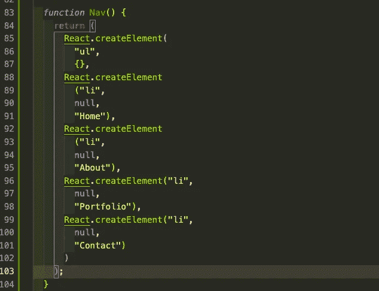

# JSX 颂歌

> 原文：<https://medium.com/nerd-for-tech/an-ode-to-jsk-85f6ce8e0a6b?source=collection_archive---------25----------------------->

如果您是使用 React 的新手，您可能会问自己，“JSX 到底是什么，为什么我不能坚持使用普通的普通 JavaScript 呢？“嗯，一个简单的答案是因为它允许你将 HTML 转换成 JavaScript，而不是相反。此外，它比普通的 JavaScript 更快，因为它在将源代码编译成 JavaScript 时执行了优化。脸书的团队甚至创造了它来简化开发者的体验，那么你为什么不使用它呢？

# Java 脚本 Xml

JSX 代表 JavaScript XML，是 JavaScript 的另一种不同语法的扩展。React 使用类似 HTML/XML 的语法，预处理器(Babel)也打算使用这种语法将类似 HTML 的文本转换成引擎能够解析的标准 JavaScript 对象。JSX 将允许你在同一个文件中编写清晰简洁的类似 HTML/XML 的树形结构和 Javascript。然后，你的预处理器(Babel)会把表达式转换成实际的 JavaScript 代码。有些人认为 JSX 是写 React 的一套捷径。很酷吧！

# 赞成的意见

*   更容易识别 HTML 代码中可能被忽略的错误
*   利用 HTML 中 JavaScript 的全部功能
*   允许 VirtualDOM 只更新已更改的信息，以获得更便宜、更快速的渲染
*   轻松传递元素的能力

# 骗局

*   文档对于新手来说可能很难理解
*   React 只关注(**模型-视图-控制器**)模式的视图部分

这里有一个使用和不使用 JSX 语法的区别的例子。

# 和...相对

# **你知道了吧！**

我个人认为使用 JSX 让代码更容易阅读，看起来更干净。在 JavaScript 中传递元素的能力就像篝火旁的一瓶威士忌一样简单，这是使用 JSX 比其他任何编写 React 应用程序的方式都要突出的原因。当然你可以走另一条路线，但是我不推荐。如果你喜欢这个内容，请在我的 LinkedIn 或 Github 上关注我，并查看我的其他博客！

 [## Jamon Dixon -熨斗学校-德克萨斯州奥斯汀大都会区| LinkedIn

### 全栈式 web 开发人员，对事物的工作原理充满好奇，并具有解决问题的能力。拥有强大的…

www.linkedin.com](https://www.linkedin.com/in/jamondixon/)  [## Jamondixon -概述

### 最近毕业于 Flatiron 软件工程专业，拥有 Ruby on Rails、JavaScript、React 和 React Native 等方面的经验

github.com](https://github.com/Jamondixon)