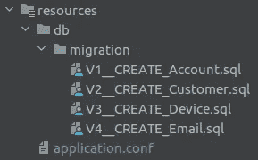

# 固执己见的 Kotlin 后端服务——数据库/迁移/ ORM

> 原文：<https://medium.com/nerd-for-tech/an-opinionated-kotlin-backend-service-database-migration-orm-52527ce3228?source=collection_archive---------1----------------------->


这是我的基于 Kotlin 的后端服务系列的第四部分。
如果你错过了前三部分:

*   [固执己见的科特林后端服务框架](/p/87f814e3dffd)
*   [固执己见的科特林后端服务——构建&部署](/p/480ab5e6cdb2)
*   [固执己见的 Kotlin 后端服务——API 路由和文档](/p/1e4b02aa6245)

# ORM


与数据库交互大致有三种方式:

*   直接使用 SQL
*   使用 SQL 包装 DSL
*   使用 ORM(对象关系映射)

这些当然只是粗略的分类，还有各种各样的“中间”解决方案，但我不想详细说明不同的方法。我的目标是**而不是**为高容量、低延迟的事务创建一个框架，所以我决定使用 ORM。

从 Java 世界来看，有一些明显的竞争者:

*   [冬眠](https://hibernate.org/)
*   [伊巴蒂斯](https://ibatis.apache.org/)
*   [EBean](https://ebean.io/)
*   更多…

像往常一样，我想要一个用简洁明了的 Kotlin DSL 为 Kotlin 构建的框架，但是没有一个 Java 框架符合这个要求。AFAIK 实际上只有两个用 Kotlin 构建的 ORM 框架:

*   [暴露](https://github.com/JetBrains/Exposed)
*   [k 表格](https://www.ktorm.org/)

两者都提供了类型安全的 SQL 包装 DSL 和 DAO /实体 API(ORM)。我们将忽略 SQL 包装部分，专注于 ORM 功能。我的模板代码我实现了两个框架，你可以在 *application.conf* 文件中轻松地在两者之间切换:

```
; possible values: [KTORM, EXPOSED]
orm = "KTORM"
```

注意，API 测试(本系列的第 5 篇文章)运行了两次测试，一次使用 Ktorm，第二次使用 Exposed。

## 数据库连接

无论使用哪种框架，连接到数据库都非常简单:

```
// Exposed
org.jetbrains.exposed.sql.Database.connect(
    url,
    driver,
    user,
    password,
)// Ktorm
org.ktorm.database.Database.connect(
    url,
    driver,
    user,
    password,
    ConsoleLogger(LogLevel.*DEBUG*)
)
```

两者都可以使用`javax.sql.DataSource`，这是企业应用程序中的常见情况，例如从连接池中获益。两个框架的语法是相同的:`Database.connect(dataSource)`。在 [Ktor 模板](https://github.com/1gravity/Ktor-Template/blob/31d654e6e98d3cb855b1844858f1f7dc6da74619/account-service/src/main/kotlin/com/onegravity/accountservice/persistence/database/DatabaseBaseImpl.kt)中可以找到包含连接池(使用 [HikariCP](https://github.com/brettwooldridge/HikariCP) )的工作代码示例。

## intermezzo:Ktor 中的配置和使用 Koin 的依赖注入

在进入下一个主题之前，我想详细说明一下 Ktor 是如何处理配置的(包括我们刚刚使用的数据库配置)。

*application.conf* 通常是 Ktor 的必经之路。有预定义的属性来决定部署、安全性等。正如你在这里看到的。你也可以使用像`${PORT}`这样的环境变量，它们可以被注入到运行时环境中。您还可以使用以下语法为这些变量提供默认值:

```
port = 5432
port = ${?DB_PORT}
```

配置可以在模块中读取为`this.environment.config` ( `this`指应用程序类):

```
environment.config.property("path.to.property")
```

很容易将配置作为“静态”变量或顶级函数暴露给应用程序中的每个组件。然而，我们确实想要修改配置的能力，例如为了测试的目的，因为我已经使用了 [Koin](https://insert-koin.io/) 作为依赖注入框架，所以我决定利用 DI。我创建了一个接口`Config`，公开了一些访问属性的便利方法，并创建了一个简单的 Koin 绑定:

```
single<Config> { ConfigImpl(environment.config) }
```

为了访问配置，一个组件实现了`KoinComponent`接口，并且:

```
private val config by *inject*<Config>()
```

或者在一个函数(不能实现`KoinComponent`)的情况下:

```
val config = *getKoinInstance*<Config>()
```

其中`getKoinInstance`为:

```
inline fun <reified T> getKoinInstance() =
    object : KoinComponent {
        val value: T by *inject*()
    }.value
```

注意，我的模板实际上是从`HoconApplicationConfig(ConfigFactory.load())`而不是`environment.config`获取配置。前者似乎更像是 Java 的方式，但老实说，我不知道是否有区别，两者似乎都像预期的那样工作。

## 数据库表/实体

两种框架定义数据库表和实体的语法非常相似:

**k 表格**

**暴露**

*   **将表列绑定到实体属性** : Ktorm 在表定义(`.bindTo{ it.propertyName }`)中进行绑定，而 Exposed 在实体(`by Customers.propertyName`)中进行绑定。在我看来，将实体绑定到表更有意义，我也更喜欢 Exposed 的委托语法。
*   **Id 定义:**都支持自动递增的主键或其他任何数据类型作为主键(当然没有自动递增)。Exposed 有一个方便的类`IntIdTable`来消除定义自动递增主键的明确需要。
*   **数据类型:** Ktorm 似乎支持更多的数据类型
    [https://www.ktorm.org/en/schema-definition.html#SqlType](https://www.ktorm.org/en/schema-definition.html#SqlType)
    [https://github.com/JetBrains/Exposed/wiki/DataTypes](https://github.com/JetBrains/Exposed/wiki/DataTypes)
    我费了点劲才让 Postgres ENUMs 正常工作(大多是用 Exposed)。Ktorm 在其 Postres 库(*org . k torm:k torm-support-PostgreSQL*)中有一个特定的数据类型`pgEnum`，它开箱即用。另一方面，Exposed 需要定义一个不能开箱即用的`customEnumeration`，我花了一些时间才找到:

*   **引用:** Exposed 的语法比 Ktorm 更简洁:

```
reference(“account_id”, Accounts)
```

相比于:

```
*int*("account_id").*references*(Accounts) { it.account }
```

*   **实体:**在 Ktorm 中，实体是接口，这使得它们很难“重用”，例如作为 HTTP 请求的模型(例如，你不能用 kotlinx.serialization 来序列化/反序列化接口)。虽然从 2.5 版本开始支持数据类和常规类(参见这里的[和](https://www.ktorm.org/en/define-entities-as-any-kind-of-classes.html))，但是这些限制太严重了，使它们无法真正替代接口(列绑定不可用，实体需要手动创建，实体操作 API 不可用)。使用 Exposed，实体是常规类(而不是数据类),这肯定更方便。

当谈到表和实体定义的基础时，总体公开是明显的赢家！

## 实体操作

所有操作代码都封装在两个 *AccountDao.kt* 和 *CustomerDao.kt* 类中，因此您可以很容易地比较这两个框架

**k torm:**[account . Dao](https://github.com/1gravity/Ktor-Template/blob/main/account-service/src/main/kotlin/com/onegravity/accountservice/persistence/model/ktorm/AccountDao.kt)/[customer . Dao](https://github.com/1gravity/Ktor-Template/blob/main/account-service/src/main/kotlin/com/onegravity/accountservice/persistence/model/ktorm/CustomerDao.kt)
k torm 有一个`EntitySequence`的概念，用来查询实体。通过将实体添加到实体序列来插入新实体，删除和更新发生在实体本身上(在从实体序列中检索它之后)。更新需要使用`flushChanges`函数显式写回。

**Exposed:**[account . Dao](https://github.com/1gravity/Ktor-Template/blob/main/account-service/src/main/kotlin/com/onegravity/accountservice/persistence/model/exposed/AccountDao.kt)/[customer . Dao](https://github.com/1gravity/Ktor-Template/blob/main/account-service/src/main/kotlin/com/onegravity/accountservice/persistence/model/exposed/CustomerDao.kt)
Exposed 的操作 API 对实体本身进行操作:`Entity.find()`进行查询，`Entity.new { }`插入新实体。更新和删除是直接在实体上执行的，不需要将更改与数据库“同步”, Exposed 会处理这些。一个不便之处是每个数据库操作都需要一个活动的事务。如果你不把所有事情都打包到一个`transaction { }`调用中，它将失败，并显示“没有上下文中的事务”错误。

总的来说，这两个框架中的操作都很简单，这主要取决于你喜欢哪一个。我发现需要将每个操作打包到`transaction { }`中，这不仅会带来不便(使代码更加冗长),还会带来潜在的 bug。

# 数据库迁移

模式版本控制和迁移是一个需要很好解决的问题。我决定研究一下 [Liquibase](https://www.liquibase.org/) 和 [Flyway](https://flywaydb.org/) 。据我所知，他们两个都做这项工作。Liquibase 的优势是在 SQL 之上支持 XML、JSON 和 YML 用于迁移脚本，这在具有多种数据库技术的异构环境中是一个优势，这将导致不同的 SQL 迁移脚本(例如，使用 H2 的本地开发和使用 Postgres 的测试/生产)。Liquibase 将使用 XML、JSON 或 YML 格式的技术不可知的迁移脚本来支持这个用例。这里可以找到一篇比较这两种工具的好文章: [Liquibase vs Flyway](/@ruxijitianu/database-version-control-liquibase-versus-flyway-9872d43ee5a4) 。

我最终决定使用 Flyway。有一个免费的社区版，不允许作为两个最严重的限制(IMO)的模拟运行和撤销(向下迁移)。在添加了 Gradle dependency(*org . flywaydb:flyway-core*)之后，它基本上需要这段代码:

```
Flyway
    .configure()
    .dataSource(jdbcUrl, username, password)
    .load()
    .migrate()
```

它将从 resources 文件夹加载迁移脚本，并在需要时进行迁移:



仅此而已。确保坚持他们的版本化模式`Vx__name.sql`(原文如此！)下划线。使用单个下划线是行不通的。

# 数据库创建

Flyway 只创建和迁移模式，而不创建数据库本身。最初，我按照一些教程和文章手动创建了该数据库，如本文:[https://medium . com/coding-blocks/creating-user-database-and-adding-access-on-PostgreSQL-8 bfcd 2 F4 a91e](/coding-blocks/creating-user-database-and-adding-access-on-postgresql-8bfcd2f4a91e)。因为我的模板是在 docker 容器中运行的，所以在 Flyway 施展魔法之前，您还需要执行到容器中来设置一切。

在不同的电脑上做了几次之后(既费时又容易出错)，我决定自动化这个过程，并幸运地找到了这个答案:[https://stackoverflow.com/a/61729115/534471](https://stackoverflow.com/a/61729115/534471)。

解决方案基本上是创建一个 *init-database.sh* 脚本(参见此处的)并在 *docker-compose.yml* 文件中引用它:

```
volumes:
  - ./init-database.sh:/docker-entrypoint-initdb.d/init-database.sh
```

不再需要手动创建数据库！

这就是本系列的第 4 部分。如果你喜欢这一点，那么请继续[一个固执己见的 Kotlin 后端服务测试](/p/87f814e3dffd)。

像往常一样，请随时提供反馈。编码快乐！