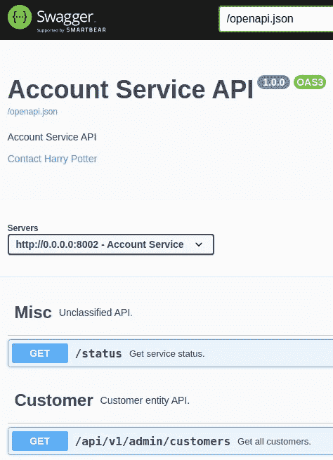
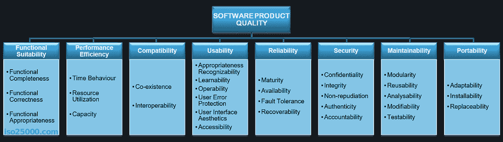
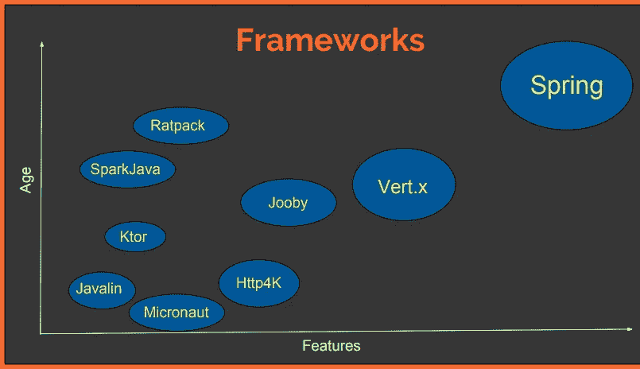

# 固执己见的 Kotlin 后端服务框架

> 原文：<https://medium.com/nerd-for-tech/an-opinionated-kotlin-backend-service-part-1-87f814e3dffd?source=collection_archive---------0----------------------->

# TL；DR；

本系列文章解释了基于 Kotlin / Ktor 的后端服务的搭建。它阐述了以下主题:

*   [固执己见的科特林后端服务框架](/p/87f814e3dffd)
*   [固执己见的科特林后端服务——构建&部署](/p/480ab5e6cdb2)
*   [固执己见的 Kotlin 后端服务——API 路由和文档](/p/1e4b02aa6245)
    + [使用 Ktor 生成 open API](/p/d57879ec5ab0)+
    +[在 Ktor/Kotlin](/p/c7e02b5dabc)
    + [在 Ktor 中进行 JSON 序列化](/p/feae3d06eadb)
*   [固执己见的 Kotlin 后端服务——数据库/迁移/ ORM](/p/52527ce3228)
*   待写:[一个固执己见的 Kotlin 后端服务测试](/p/87f814e3dffd)

## 快速启动

*   克隆[回购](https://github.com/1gravity/Ktor-Template)
*   cd 进入 *Ktor-Template*
*   运行`docker-compose up`(或`sudo docker-compose up`)
*   打开 [http://localhost:2000](http://localhost:2000)

您应该看到 OpenAPI 文档:

或者打开:[https://ktor-template-app.herokuapp.com](https://ktor-template-app.herokuapp.com/)那里的应用程序也在运行。

# 间奏曲

在深入研究技术细节之前，我想谈谈我的研究背后的动机，以及我正在寻找的技术堆栈的要求。

## 动机

我喜欢新技术。新技术通常比旧技术更好。它让我创建更少的错误，更健壮，更安全，更易维护，更易改变，更快等等。软件以及所有代码行更少的东西。

人们可能不同意，有一篇关于绿色和棕色编程语言的好文章让我想到了这里的。我将在系列文章的最后回到那篇文章。

## 要求

作为一名软件架构师，我使用 [ISO 25010 软件质量模型](https://iso25000.com/index.php/en/iso-25000-standards/iso-25010)来定义一个组件需要具备的重要质量特征。

在我的情况下，我想要(按优先顺序):

1.  **可维护性:**模块化软件，易于分解，遵循单一责任原则，关注点分离，可测试
2.  **可移植性:**不受运行时/部署环境的限制，可在内部或任何云计算提供商处部署，可容器化，无供应商限制，尽可能开源
3.  **可靠性:**生产就绪型技术，健壮，故障恢复能力强，高可用性

带着这些需求，我开始研究后端框架的巨大市场。在本系列文章的最后，我将回到上面的需求，并讨论我可以勾选哪些框。

# 后端框架

我使用不同的语言研究了不同的技术栈，阅读了大量的资料，还用一些最流行的框架(Spring Boot，Node.js)进行了测试，但最终决定走一条新的路线。我想使用一种可维护且使用起来有趣的语言，对我来说，与 Go、Swift 或 Kotlin 等语言相比，Java、JavaScript/TypeScript 或 Ruby 都不是很有吸引力。以我作为 Android 开发人员的背景，Kotlin 是显而易见的选择。

即使范围缩小到 Kotlin 框架，仍然有很多选择:

*   [春天(开机)](https://spring.io/projects/spring-boot)
*   [科特林的垂直 x 轴](https://vertx.io/docs/vertx-core/kotlin/)
*   [爪哇林](https://javalin.io/)
*   [http4k](https://www.http4k.org/)
*   [Ktor](https://ktor.io/)

还有更多…

来源: [Kotlin 服务器端框架](https://resources.jetbrains.com/storage/products/kotlinconf2018/slides/1_Komparing%20Kotlin%20Server-Side%20Frameworks.pdf)

## [弹簧(靴子)](https://spring.io/projects/spring-boot)

Spring Boot 很容易被淘汰。它是在考虑 Java 的情况下制作的，这体现在冗长和配置对代码的使用上(无尽的注释……)。感觉很难读(很难维护)，沉重(冗长)而且找不到更好的词…旧:

与 Ktor 应用程序的优雅和简洁相比:

## [垂直 x 轴](https://vertx.io/docs/vertx-core/kotlin/)

我喜欢编写反应式应用程序(我曾经是 RxJava 的超级粉丝)，我的一个副业是构建一个反应式后端堆栈(一直到数据库)。

为了*这个*研究的目的，我决定不将反应式编程的复杂性添加到其他所有事情之上(我认为反应式编程的复杂性源于我的大脑更习惯于命令式编程的事实，但这对于大多数软件工程师来说可能是真实的- >可维护性需求)。

无论如何，我决定放弃 Vert.x，但一旦我着手我的反应式后端堆栈“项目”,它肯定会是一个热门的竞争者。

## [爪哇林](https://javalin.io/)， [http4k](https://www.http4k.org/) ， [Ktor](https://ktor.io/)

老实说，我没有用 Javalin 或 http4k 做深入的测试。我决定使用 Ktor 主要是基于这样一个事实，即它是由 Kotlin 发明者创建的框架，希望这意味着它将获得一些牵引力，不会很快消失。Github 上的流行似乎支持了这一希望(截至 2011 年 4 月 29 日):

*   http4k: 29 个守望者，1.7k 星，156 叉
*   贾瓦林:106 个守望者，4.7k 星，411 个分叉
*   Ktor: 175 守望者，82k 星，675 叉

我喜欢 Javalin 的一个特性是它的 [OpenAPI 生成器](https://javalin.io/plugins/openapi#openapioptions)。为了用 Ktor 获得 OpenAPI 文档，我不得不跳过一些关卡(见这里的)。

在选定了作为后端框架的 **Ktor 之后，**我的第一步是构建和部署并运行，这就引出了本系列的第二篇文章:[一个固执己见的 Kotlin 后端服务——构建&部署](/p/480ab5e6cdb2)。

感谢您阅读本文，并像往常一样随时提供反馈。编码快乐！

# 类似文章

 [## 使用 Ktor 构建服务器的架构提案

### 本文的目的是展示如何创建一个具有清晰和可测试架构的 Ktor 服务器。

medium.com](/swlh/architecture-proposal-to-build-servers-with-ktor-1069bfaf2926)  [## 如何使用 Docker 部署 Ktor 服务器

### 关于如何使用 Docker & Docker compose 部署 Ktor 服务器的完整描述。

medium.com](/swlh/how-to-deploy-a-ktor-server-using-docker-dd01f4883c30)  [## mathias21/KtorEasy

### 这是一个展示建议的 Ktor 架构的项目。它包括与 Ktor，MariaDB 的后端实现…

github.com](https://github.com/mathias21/KtorEasy)