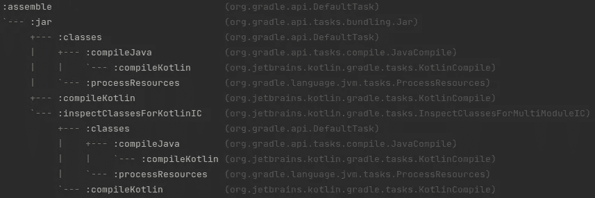
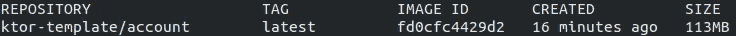

# 固执己见的 Kotlin 后端服务——构建和部署

> 原文：<https://medium.com/nerd-for-tech/an-opinionated-kotlin-backend-service-part-2-480ab5e6cdb2?source=collection_archive---------2----------------------->


这是我的基于 Kotlin 的后端服务系列的第二部分。
如果你错过了第一部分:[一个固执己见的 Kotlin 后端服务——框架](/p/87f814e3dffd)。

# Gradle Build

我对构建系统有四个主要要求:

1.  我想用 Gradle(不是 Maven)
2.  编码、配置、构建和部署(尽可能)使用单一语言
3.  我想集中管理插件和依赖版本
4.  我想支持一个单一的回购方法，每个后端服务是一个单独的梯度模块

使用 Kotlin 而不是 Groovy 支持对所有事情使用单一语言的目标。

集中管理依赖版本有两种主要方法(而不是在每个模块中复制它们):

*   使用 gradle.properties 文件
*   使用 [buildSrc 文件夹](https://docs.gradle.org/current/userguide/organizing_gradle_projects.html#sec:build_sources)

## 属性文件

在顶层***gradle . properties***文件中定义版本:

```
kotlinVersion=1.4.32
ktorVersion=1.5.3
```

对于插件，使用***settings . gradle . kts***文件中的 [pluginManagement](https://docs.gradle.org/current/userguide/plugins.html) 函数:

```
pluginManagement {
    val kotlinVersion: String by settings
    plugins {
        kotlin("jvm") version kotlinVersion
    }
}
```

***build . gradle . kts***文件将如下所示:

```
// Plugins
plugins **{** kotlin("jvm")   /// no version needed
**}**/// Dependencies
val kotlinVersion: String by project
val ktorVersion: String by projectimplementation(kotlin("stdlib", kotlinVersion))
implementation("io.ktor:ktor-server-core:$ktorVersion")
```

## [buildSrc 文件夹](https://docs.gradle.org/current/userguide/organizing_gradle_projects.html#sec:build_sources)

这是我的首选方法，因为它支持我用单一的*语言来统治所有的*方法。

buildSrc 基本上是一个特殊的模块，在编译任何其他模块之前编译。Gradle 会自动编译和测试它的代码，并将其放入您的构建脚本的类路径中。

出于我们的目的，我们只使用它来管理依赖关系，并保持模块/服务构建文件简短，几乎没有冗余。所有插件和依赖项都在两个文件 [Plugin.kt](https://github.com/1gravity/Ktor-Template/blob/main/buildSrc/src/main/kotlin/com/onegravity/Plugin.kt) 和 [Dependency.kt](https://github.com/1gravity/Ktor-Template/blob/main/buildSrc/src/main/kotlin/com/onegravity/Dependency.kt) 中管理。

这样，在每个模块中应用插件和定义依赖关系变得非常简单:

```
plugins {
    Plugin.modulePlugins.*forEach* { (n, v) -> id(n) *version* v }
}*dependencies* {
    Dependency.implementation.*forEach*(::implementation)
    Dependency.runtime.*forEach*(::runtimeOnly)
    Dependency.testImplementation.*forEach*(::testImplementation)
}
```

## [任务信息](https://gitlab.com/barfuin/gradle-taskinfo)

我添加了 TaskInfo 作为 Gradle 插件来显示任务依赖和类型。例如，运行`./gradlew tiTree assemble`会导致:



# 集装箱化

Dockerization 几乎是当今后端服务的标准，并提供了在几乎任何环境中部署的灵活性，无论是本地环境、内部环境、云环境、Kubernetes 环境还是 OpenShift 环境，只要是你能想到的。

挑战之一是使用 Gradle 在容器中构建应用程序。许多教程解释了这个过程，但是大多数教程都将安装构建工具作为构建过程的一部分，然后构建并运行应用程序(都在同一个容器中)。

我更喜欢使用多阶段构建，一个映像用于构建，另一个用于运行应用程序。这样，我可以使用一个预配置的映像进行构建，而不需要安装任何东西(减少构建时间=成本),并为运行时环境使用另一个映像。构建和运行时环境的分离似乎也是一个安全的好方法。

## 建设

```
FROM gradle AS *build*WORKDIR /appbuild
COPY . /appbuildRUN gradle wrapper     # better safe than sorry
RUN ./gradlew :account-service:clean :account-service:assemble
```

## 部署/运行

使用`COPY`命令将构建步骤中的工件复制到运行时容器中:

```
FROM openjdk:8-jre-alpine

WORKDIR /app

COPY --from=*0* appbuild/account-service/build/libs/account-service.jar application.jar

CMD ["java", "-server", "-jar", "application.jar"]
```

要构建运行时容器，请在项目的根目录中使用以下命令:

```
DOCKER_BUILDKIT=1 docker build -f account-service/Dockerfile -t ktor-template/account .
```

它将创建一个带有标签*“ktor-template/account”(命令 docker images)* 的图像:



然后可以使用以下命令运行:

```
docker run ktor-template/account
```

## docker-撰写

虽然该模板只包含一个服务，但我的意图是(如上所述)在同一个存储库中支持多个服务的单一回购方法。使用 docker-compose 似乎是管理多种服务(加上共享服务，如数据库、网关、消息服务、监控等)的好方法。).

我不想在这里详细说明 *docker-compose.yml* 文件，但是我将在本系列后面谈到数据库的设置和集成时解释一些细节。目前感兴趣的只是如何启动应用程序(这已经在本系列的第 1 部分中解释过了):

*   在项目的根目录下运行`docker-compuse up`(或`sudo docker-compuse up`)
*   打开 [http://localhost:2000](http://localhost:2000/)

这就是本系列的第 2 部分。如果你喜欢这个跟进[，一个固执己见的 Kotlin 后端服务——API 路由和文档](/p/1e4b02aa6245)。

像往常一样，请随时提供反馈。编码快乐！