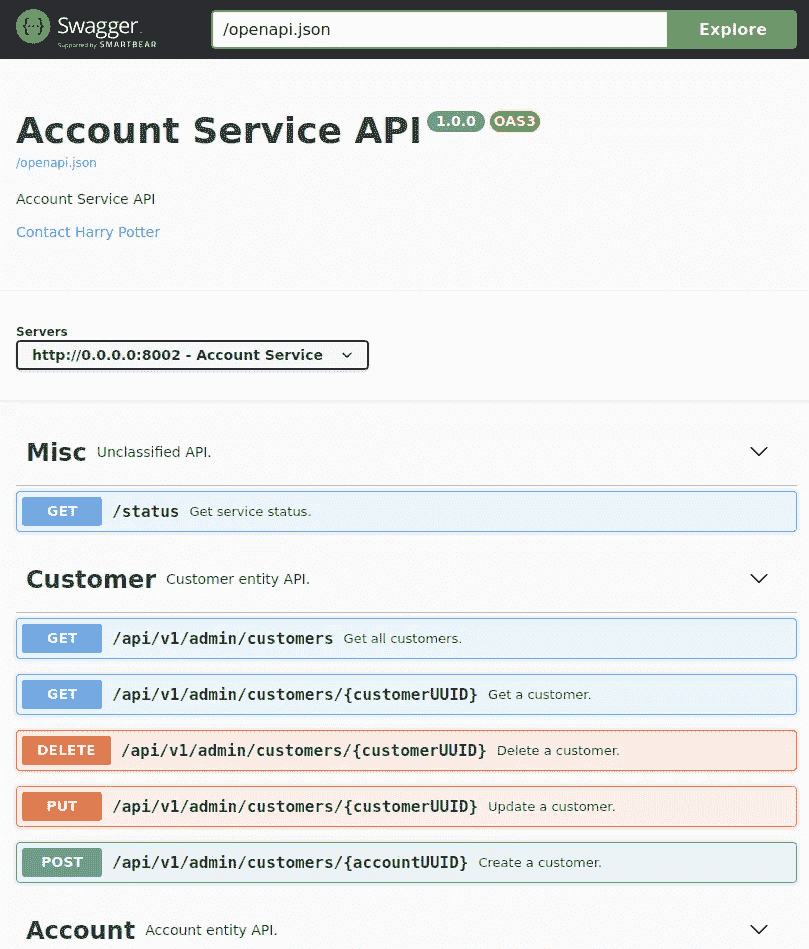
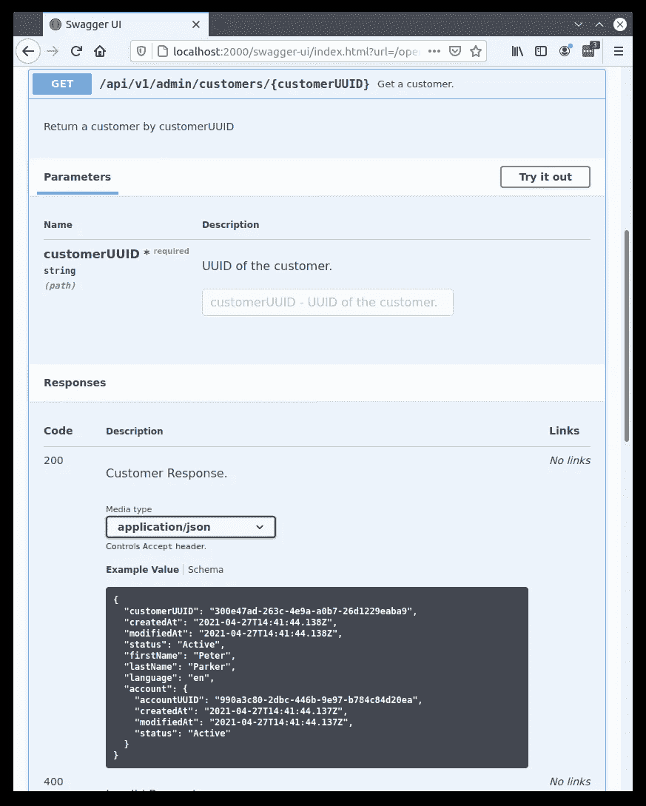
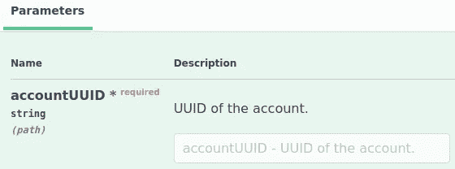
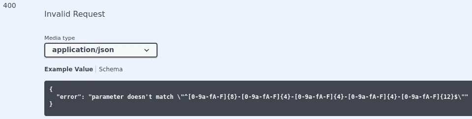
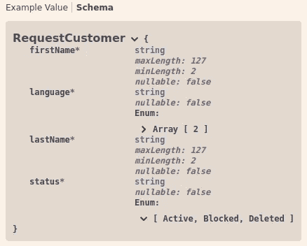

# 固执己见的 Kotlin 后端服务——API 路由和文档

> 原文：<https://medium.com/nerd-for-tech/an-opinionated-kotlin-backend-service-part-3-1e4b02aa6245?source=collection_archive---------3----------------------->


这是我的基于 Kotlin 的后端服务系列的第三部分。
如果你错过了前两部分:

*   [固执己见的科特林后端服务框架](/p/87f814e3dffd)
*   [固执己见的 Kotlin 后端服务——构建&部署](/p/480ab5e6cdb2)

# API 路由和文档

## Ktor 路由

由于有了 [DSL](https://en.wikipedia.org/wiki/Domain-specific_language) ，在 Ktor 中定义[路线变得简单且非常简洁。要定义路线，调用`routing`功能并添加您需要的路线:](https://ktor.io/docs/routing-in-ktor.html)

```
routing {
    // here go your routes
}
```

使用不同的 http 方法:

```
routing {     
    get("/customer/{id}") { /* handler */ }     
    post("/customer") { /* handler */ }     
    put("/customer/{id}") { /* handler */ } 
}
```

按路径分组:

```
routing {
    route("/customer") {
        get("/{id}") { /* handler */ }
        post("/") { /* handler */ }
    }
    route("/account") {
        get("/{id}") { /* handler */ }
    }
}
```

分层:

```
routing **{** route("/customer") **{** route("/order") **{** get("/{id}") **{** /* handler */ **}** delete("/{id}") **{** /* handler */ **}
        }
    }
}**
```

模块化(使用扩展功能):

```
routing **{** *customerByIdRoute*()
    *createCustomerRoute*()
    *orderByIdRoute*()
**}**fun Route.customerByIdRoute() {
    get("/customer/{id}") **{** /* handler */ **}** }

fun Route.createCustomerRoute() {
    post("/customer") **{** /* handler */ **}** }

fun Route.orderByIdRoute() {
    get("/order/{id}") **{** /* handler */ **}** }
```

我不想更深入地阐述标准 Ktor 路由，因为我实际上并没有使用它。如果您有兴趣了解更多关于常规 Ktor 路线的信息，请阅读众多文章中的一篇，例如[此处](/playkids-tech-blog/building-simple-webservices-in-kotlin-using-ktor-59501f004070)、[此处](/dev-genius/create-simple-post-request-with-ktor-591deab01861)或[此处](/@billwixted/building-a-rest-api-with-ktor-4c322d31eb31)。

## OpenAPI 生成

我不使用普通 Ktor 路由函数的原因在本文中有所解释:[用 Ktor 生成 OpenAPI】。](/p/d57879ec5ab0)

要点是，我想要一个 OpenAPI 文档，我决定编写代码并使用生成器来自动创建文档(而不是编写文档并自动生成代码)。我写的代码是这样的:

类似上面的定义用于:

1.  定义应用程序路线
2.  并生成 OpenAPI 文档:



## 路线定义

让我们一步一步来看定义。

```
tag(Tags.*Account*) **{** route("/api/v1/admin/accounts") **{**
```

*   **标签功能**用于将路线分组在一起(在这种情况下，分组为*杂项*、*客户*和*账户*)。
*   **路线功能**用于定义与特定路径匹配的路线。

您还可以创建路线的层次结构:

```
route("/api/v1") **{** route("/misc") **{ }** route("/accounts") **{ }** route("/customers") **{ }
}**
```

实际路线在路线功能中定义:

```
*/**
 * Create a new account.
 */* post<Unit, ResponseAccount, RequestAccount>(
    *info*(
        summary = "Create an account.",
        description = "Create a new account"
    ),
    *status*(HttpStatusCode.OK),
    exceptions = *listOf*(*badRequest*),
    exampleRequest = *accountExampleRequest*,
    exampleResponse = *accountExampleResponse* ) **{** _, account **->** val newAccount = controller.createAccount(account)
    respond(newAccount)
**}**
```

两个或三个通用类型(两个用于 get: `get<AccountUUIDParam, ResponseAccount>`三个用于 post: `post<Unit, ResponseAccount, RequestAccount>`)定义了

1.  路径参数(如 path/***【account uuid】***)
2.  反应
3.  请求正文(发布、上传)

这些类型的定义如下所示(路径参数):

```
@Path("{accountUUID}")
data class AccountUUIDParam(
    @PathParam("UUID of the account.")
    val accountUUID: String
)
```

或者(回应):

```
@Response("Account Response.")
data class Account(
    val accountUUID: String,
    val createdAt: Instant,
    val modifiedAt: Instant,
    val status: AccountStatus
)
```

这些数据类别用于:

*   创建 OpenAPI 文档:



*   定义请求/响应的序列化/反序列化的结果(与 Json / data 类的往来)
*   定义对象验证规则。接下来，我将更详细地阐述对象验证。

## 方法参数

`get`、`post`、`put`、`patch`、`delete`和`head`函数的方法参数*几乎*专用*、*用于定义 OpenAPI 文档(异常参数也绑定到对象验证)。

```
*info*(
    summary = "Create an account.",
    description = "Create a new account"
),
*status*(HttpStatusCode.OK),
exceptions = *listOf*(*badRequest*),
exampleRequest = *accountExampleRequest*,
exampleResponse = *accountExampleResponse*
```

*   `**info**`和`**status**`参数的目的很明显(描述路线和响应状态代码)。都是`RouteOpenAPIModule` vararg 参数，其中还有两个:
    1) `resonseAnnotationStatusCode`:响应 HTTP 状态码来源于响应定义，例如:
    `@Response("Account Response.", **202**)` - >覆盖`status(HttpStatusCode.OK)`语句
    2) `tags` *:* 设置该路由的标签，如果设置了多个标签，该路由将出现在所有类别/组中。
*   `**exceptions**`参数定义了可能的错误情况。

例如`badRequest`定义:

翻译过来就是:



注意，用`contentFn`定义的运行时错误取决于从作为验证过程一部分抛出的`ConstraintViolation`中获取的异常消息(见下文“对象验证”一章)。

*   最后但并非最不重要的是`exampleRequest`和`exampleResponse`参数，它们应该是自我解释的。

# 对象验证

我写过一篇关于对象验证的专门文章:[Ktor/kot Lin](/p/c7e02b5dabc)中的对象验证。在这篇文章中，我研究了几个验证库，比如 [Kalidation](https://github.com/rcapraro/kalidation) 、 [Valiktor](https://github.com/valiktor/valiktor) 或 [Konform](https://github.com/konform-kt/konform) 。虽然我声明 Konform 是我的最爱，但实际上我并不使用它，因为 [Ktor-OpenAPI-Generator](https://github.com/1gravity/Ktor-OpenAPI-Generator) 有一个内置的验证机制。虽然我并不特别喜欢基于注释的验证(我喜欢对包括配置和构建在内的所有事情使用单一语言，这里的单一语言是 Kotlin)，但这种情况下的优势在于它有两个用途:

1.  确认
2.  证明文件

例如，这里的注释被 [Ktor-OpenAPI-Generator](https://github.com/1gravity/Ktor-OpenAPI-Generator) 用来验证输入参数并创建文档:



## 错误处理

如果输入参数或请求主体验证失败，会发生什么？

[Ktor-OpenAPI-Generator](https://github.com/1gravity/Ktor-OpenAPI-Generator) 抛出一个`ConstraintViolation`，由上面发布的`badRequest`定义处理:

```
val *badRequest* = apiException<**ConstraintViolation**, ErrorMessage> {    // more code here
}
```

这又在路线定义中使用(也张贴在上面),我们来了一个完整的循环:

```
post<Unit, ResponseAccount, RequestAccount>(
    ...
    exceptions = *listOf*(***badRequest***),   
    ...
) {
    ...
}
```

这就是本系列的第 3 部分。如果你喜欢这一点，那就继续跟进[一个固执己见的 Kotlin 后端服务——数据库/迁移/ ORM](/p/52527ce3228) 。

像往常一样，请随时提供反馈。编码快乐！