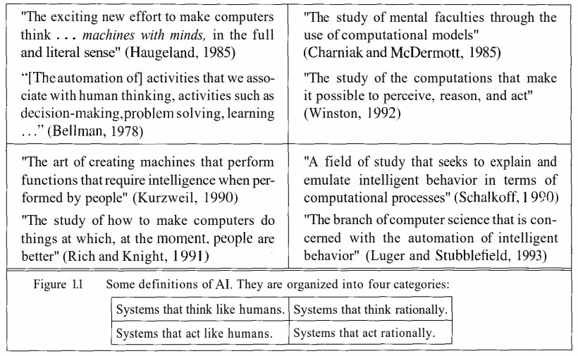

# 人工智能和数据挖掘方法概述(上)

> 原文：<https://medium.com/nerd-for-tech/an-overview-in-ai-and-path-to-data-mining-methods-part-1-5d7a8d051d0a?source=collection_archive---------32----------------------->

当时，我想知道我的学士时期会留下什么，所以我开始用一种容易理解的方式来写我的课程。

因此，为了了解数据挖掘技术，我们应该有一个人工智能的基础知识。在这里，我从 Peter Norvig 和 Stuart J. Russell 的《人工智能》一书中写了关于人工智能的文章，以更好地理解人工智能算法或具体的数据挖掘算法是如何工作的。为了更容易理解，我将分四个部分来写。

因此，不浪费时间，让我们深入研究人工智能。

资料来源:freepik.com

## 首先，我们从这个问题开始什么是人工智能？

二战后人工智能被引入。

**AI 有两个目标:**

1.  理解人类思考和理解的方式
2.  创造聪明的行为

首先提到的人工智能教科书有 4 个定义，你可以往下看:

图 1。在人工智能教科书中有人工智能的定义，在图片底部有简短的解释

# 如何测试机器的动作(或思维)像人类一样？

图灵测试用来测试机器的行为。

[**图灵测试**](https://en.wikipedia.org/wiki/Turing_test) **:** 图灵测试是我们可以接近存在一个像人类一样行动或思考的机器人的测试。

## 图灵测试是如何工作的？

为了开始图灵测试，我们将计算机放在一个房间里，将一个人放在它旁边的另一个房间里。他们可以交谈，我们的人不知道旁边的房间里有另一个人或有一个机器人。因此，如果我们的人不知道隔壁房间有一台计算机，我们的计算机将接近测试，我们可以说我们的计算机能够完成这四项任务:

1.  *自然语言处理:*能够交流。
2.  *知识表示:*在对话过程中存储信息。
3.  *自动推理:*利用存储的信息来归纳和回答新问题。
4.  *机器学习:*适应新的环境和模式。

请注意，图灵测试不包括物理部分，如果我们想在图灵测试中增加物理测试，我们将命名为**全图灵测试**，用于全图灵测试的计算机也必须具备这两项:

1.  *计算机视觉*感知物体。
2.  *机器人*这样它就能移动了。

所以这是所有的，直到现在，谢谢你的阅读，如果你想知道更多，你可以阅读下面的章节。这是下一部分的链接

[人工智能概述和数据挖掘方法之路(第二部分)](https://amindadgar.medium.com/an-overview-in-ai-and-path-to-data-mining-methods-part-2-56d44f955ae7)