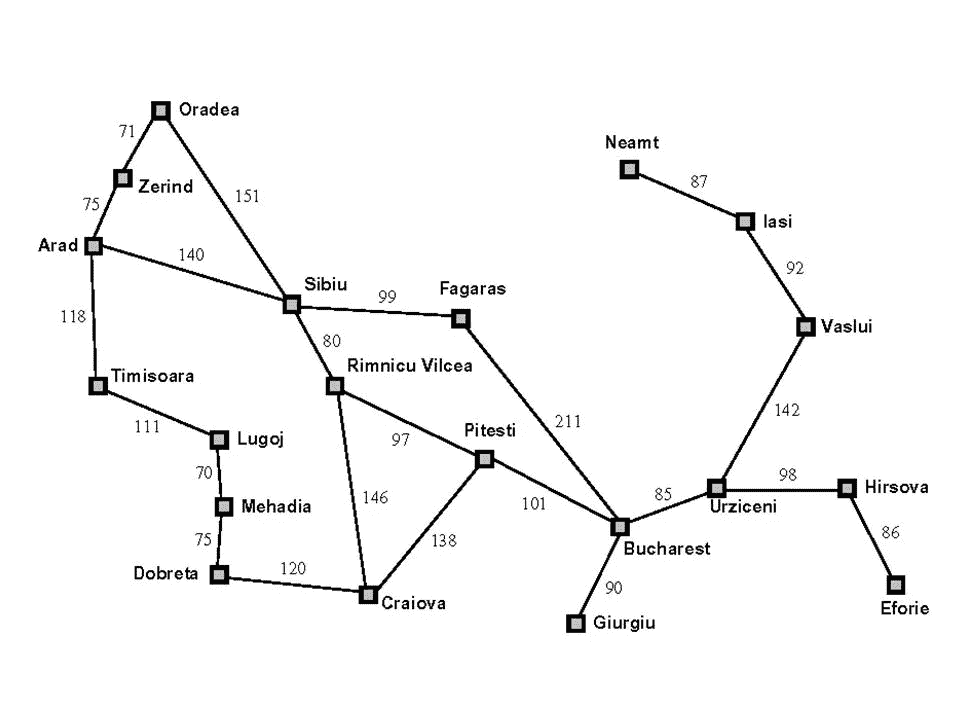

# 人工智能和数据挖掘方法概述(第三部分)

> 原文：<https://medium.com/nerd-for-tech/an-overview-in-ai-and-path-to-data-mining-methods-part-3-2a048ad42fd8?source=collection_archive---------28----------------------->

为了了解数据挖掘技术，我们应该有人工智能的基础知识。在这里，我从 Peter Norvig 和 Stuart J. Russell 的《人工智能》一书中写了关于人工智能的文章，以更好地理解人工智能算法或具体的数据挖掘算法是如何工作的。为了更容易理解，我将分四个部分来写。


来源:forbes.com

在[之前的章节](https://amindadgar.medium.com/an-overview-in-ai-and-path-to-data-mining-methods-part-2-56d44f955ae7)中，我们学习了什么是人工智能以及环境和代理如何工作。在这一部分，我们将学习如何解决我们的搜索问题。

首先，我们需要知道如何解决像路径方向问题这样的问题。

# 第一步:问题形成

我们需要将问题形式化，因此我们的算法适用于该问题。为了形式化这个问题，我们需要回答以下五个问题:

1.  **第一种状态是什么？**代理的初始点(状态)。
2.  **代理可以执行哪些操作？**我们的代理在响应环境时可能采取的一系列行动。
3.  **我们的继任者职能是什么？**后继函数显示了代理在示例状态“X”下可以执行的操作。
4.  **我们的目标测试函数是什么？我们可以选择一个函数来测试每个状态是否是我们想要的目标。如果状态是我们的目标状态，我们将停止并完成算法。**
5.  **我们的路径成本函数是什么？**我们可能在算法中使用的另一个函数是路径成本函数。它的职责是计算我们从初始状态到目标或特定状态的路径。

所以这里主要的事情是阐明我们的问题。下面的例子将帮助你更好地理解它是什么。

# 形式化著名的布加勒斯特问题

布加勒斯特问题在 Russel 的教科书中提到了很多，在这个问题中，我们想找到从阿拉德到布加勒斯特的最短路径。如你所见，下图是不同城市之间的地图。



图 1。这个问题中使用的地图取自罗素的教科书。这些数字是从一个城市到另一个城市的费用

所以让我们把问题形式化。

1.  第一种状态:我们在阿拉德。
2.  **动作:**从一个城市到另一个城市。
3.  **后继功能:**这里的功能显示了我们可以从一个城市前往的可用城市。输出是一组<动作，final_state >的例子可以看到如下:

> 继任者(In_Arad) = { <go in_zerilan="">，<go in_sibiu="">， <go in_timisora="">}</go></go></go>

4.**目标测试功能:**测试我们是否到达布加勒斯特。你可以在下面看到一个伪代码(这里的 x 是我们的状态作为输入)。

```
bool goal_test(x){
   if(x == In_Bucharest) return true;
   else return false;
}
```

5.**路径成本函数:**显示从初始状态(Arad)到当前状态的成本。例如，如果我们从阿拉德出发，经过蒂米什瓦拉和卢戈伊，现在我们处于 In_mehadia 状态，路径成本函数将显示输出 118+111+70。

所以直到现在，我们学会了如何形式化我们的问题。是时候学习一些搜索算法了。

# 搜索算法

首先我们需要提到的是，搜索算法分为两组:

1.  **不知情搜索(Blind Search):** 在这种类型的算法中，没有关于问题的信息，代理使用蛮力搜索(代理会搜索一切可能的东西)。
2.  **知情搜索(启发式搜索):**这种类型的算法代理知道一些关于问题的信息。举个布加勒斯特问题的例子，我们的代理知道哪个城市更接近它现在的状态，或者一般来说，他们知道哪个州更有希望。

## 不知情的搜索算法

我不会详细介绍每种算法，因为它们大多是计算机科学中的通用算法，但如果你不熟悉它们，我会分享这篇文章来先阅读一下。

[http://chalmersgu-AI-course . github . io/AI-lecture-slides/lecture 2 . pdf](http://chalmersgu-ai-course.github.io/AI-lecture-slides/lecture2.pdf)

1.  广度优先搜索(BFS)
2.  深度优先搜索
3.  统一成本搜索
4.  深度受限搜索(DLS)
5.  迭代深度搜索(IDS)
6.  迭代延长搜索
7.  双向搜索

## 知情搜索算法

对于有根据的搜索算法，你可以下载这个文件来更好地理解它们。

[http://chalmersgu-AI-course . github . io/AI-lecture-slides/lecture 3 . pdf](http://chalmersgu-ai-course.github.io/AI-lecture-slides/lecture2.pdf)

1.  A*
2.  迭代加深 A*
3.  递归最佳优先搜索(RBFS)
4.  简化的内存受限 A* (SMA*)
5.  局部搜索算法

所以直到这里，我们学习了如何形式化我们的问题，我们知道一些算法。在下一节也是最后一节，我们将学习局部搜索算法是如何工作的，特别是我们如何在数据挖掘方法中使用它们。这是下一部分的链接

[人工智能概述和数据挖掘方法之路(第四部分)](https://amindadgar.medium.com/an-overview-in-ai-and-path-to-data-mining-methods-part-4-4d5cf18711cd?source=user_profile---------1----------------------------)

感谢阅读。敬请期待:)