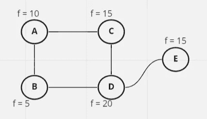

# 人工智能和数据挖掘方法概述(第四部分)

> 原文：<https://medium.com/nerd-for-tech/an-overview-in-ai-and-path-to-data-mining-methods-part-4-4d5cf18711cd?source=collection_archive---------19----------------------->

为了了解数据挖掘技术，我们应该有人工智能的基础知识。在这里，我从 Peter Norvig 和 Stuart J. Russell 的《人工智能》一书中写了关于人工智能的文章，以更好地理解人工智能算法或具体的数据挖掘算法是如何工作的。为了更容易理解，我将分四个部分来写。

来源:forbes.com

在《T4》第一集中，我们了解了什么是真正的人工智能

在第二个中，我们学习了什么是人工智能，以及环境和代理是如何工作的。

在第三个[中，我们学习了如何用搜索来解决我们的问题。](https://amindadgar.medium.com/an-overview-in-ai-and-path-to-data-mining-methods-part-3-2a048ad42fd8)

在最后一节，我们将学习局部搜索算法和遗传算法是如何工作的，以具体了解数据挖掘方法是如何工作的。

因此，为了不浪费时间，让我们开始最后一部分。

# 什么是局部搜索算法？

在其他算法中，如 BFS、DFS、A*，…我们会找到一条通向目标的路径，但在局部搜索算法中，从当前状态出发，我们试图找到一个目标状态或更好的状态。

所以局部搜索有很多算法。在此，我想提及其中一些。

## 爬山算法

在该算法中，我们将选择一个理想状态作为当前状态，并且在每次迭代中，该算法将选择更好的邻居并移动到它。在这个算法中我们没有树，我们只是在每次迭代中选择最近的(或更好的)节点。所以这里我举一个例子来更好的理解算法。

图 1。以地图为例

在这个问题中，我们试图找到具有最大 *f* 值的节点。首先，我们将随机选择一个节点。例如，我们选择节点 B 开始算法。在第一次迭代中，B 的邻居是 A 和 D，D 的值更大，所以我们会选择它，在下一次交互中，D 会查看它的邻居，因为它是主导节点，所以算法会停止并返回 D 作为输出。

局部搜索中存在一些问题，特别是爬山算法，我将在这里提到它们:

1.  **local-maximum:** 有时候我们处于这样一种状态，它的邻居的值比自己低，但我们也有值更好的节点。该算法将停止(由于较低的邻居值),我们无法达到全局最大值。在这种情况下，我们说我们陷入了局部最大值。
2.  **局部最小值:**与局部最大值相同，但我们的目标是找到最小值。
3.  **平:**在这种状态下，我们的邻居的值与现在的状态相同，但我们也有值更好的节点，无法到达。

## 有几种方法可以解决这些问题

1.  如果我们的算法停止，我们可能会从另一个随机状态开始。
2.  我们可以用一个以上的 CPU 内核同时从随机状态开始，最后，我们会选择最佳状态。
3.  如果我们陷入局部最大值、局部最小值或平坦状态，我们可以进入没有更好值的状态，希望从其他节点找到更好的值。(注意，在传统的爬山中，我们总是选择更好的状态)
4.  对于 fix no.3 有一个更好的看法就是，在搜索的起始年龄，以更大的概率，我们可以去比结束次数(或最后一次迭代)值更小的节点。这是模拟退火算法的观点。

所以这是一些修正爬山算法的意见(也是由它们产生的算法)。

现在我们可以学习遗传算法，它是许多算法的基础。

# 遗传算法

所以直到这里，我们了解了不同的爬山算法是如何工作的。在这里，我们将学习与数据挖掘算法密切相关的遗传算法。

遗传算法是基于达尔文的理论。在达尔文的理论中，在每个社会中，占主导地位的生物将会保留下来，而最弱的生物将会被淘汰。在每一代中，这种情况都会发生，优势生物会产生子代，子代会继承优势生物更强的特性，因此，与上一代相比，新一代将成为优势代。

这是遗传算法的主要工作，我不会详细介绍，因为我们的主要话题是更好地了解数据挖掘方法，但如果你想更好地了解，我会留给你这个[链接](https://www.sciencedirect.com/topics/engineering/genetic-algorithm#:~:text=A%20genetic%20algorithm%20(GA)%20is,process%20that%20mimics%20biological%20evolution.)。

这里的最后一个问题是 ***遗传算法如何与数据挖掘方法联系在一起？***

为了回答这个问题，我们可以说，在遗传算法中，我们的迭代产生了比上一次更好的结果，所以在数据挖掘方法中，我们有相同的工作。例如，我们可以说我们制作了一个模型来预测房价数据，当我们创建模型时，它会训练自己(代迭代)来创建房屋属性和价格之间的最佳联系(主要是数学函数)。

所以这是我们一起学习人工智能如何在数据挖掘中工作的最后一部分。我强烈推荐你阅读 Peter Norvig 和 Stuart J. Russell 的《人工智能》一书，特别是第四章，以便更好地了解这些算法是如何工作的。

如果你想了解更多关于如何学习和作为一名数据挖掘者工作的信息，你可以在阅读完 Russell 的教科书后，阅读由 Galit Shmueli，Peter C. Bruce，Peter Gedeck，Nitil R. Patel 撰写的*商业分析数据挖掘一书。*

感谢您的阅读，如果您需要更多的说明，您可以在这里留下您的评论或者用这个电子邮件【dadgaramin96@gmail.com[联系我，我将非常乐意帮助您。](mailto:dadgaramin96@gmail.com)