# 流水线并行性及其研究进展综述

> 原文：<https://medium.com/nerd-for-tech/an-overview-of-pipeline-parallelism-and-its-research-progress-7934e5e6d5b8?source=collection_archive---------1----------------------->

**关键词:深度神经网络，分布式系统，流水线并行，GPipe，PipeDream，DAPPLE，PipeMare**

# **简介**

现在，现代深度神经网络和训练数据的规模变得非常大。在单个 GPU 节点上训练新的 DNN 模型变得越来越困难。因此，我们需要建立一个大型分布式机器学习系统，该系统可以使用大规模集群，用大数据训练模型，并获得与单个节点相当甚至更好的性能。为了实现这一目标，我们需要优化机器学习系统的并行策略，以获得更高的速度和更有效的训练。该领域的相关工作可以分为以下几类:模型并行、数据并行和混合并行。

数据并行是最广泛使用的策略。它用于训练数据的大小很大并且无法放入单台机器的情况。为了解决这个问题，数据并行性允许我们将数据划分为多个分片，并将它们分发到不同的节点。每个节点首先利用规模较小的局部数据训练一个子模型，并与其他节点进行通信，以确保来自每个节点的训练结果在一定时间内能够被整合，最终获得全局模型。数据并行的参数更新策略(机器学习/深度学习的 SGD)可以分为异步更新和同步更新两类。数据并行的缺点也很明显。由于每个子模型在每次迭代训练后都需要提交梯度，网络通信开销非常大。

模型并行用于模型非常大并且不能存储在本地内存中的情况。在这种情况下，我们需要将模型分割成不同的模块(例如，DNN 中的不同层)。然后，可以将每个模块放入不同的节点进行训练。此时，可能需要不同节点之间频繁的节点间通信。模型并行的性能取决于两个方面，连接结构和操作的计算需求。虽然模型并行可以解决大模型训练的问题，但是也会给我们带来网络流量低，训练时间增加的问题。

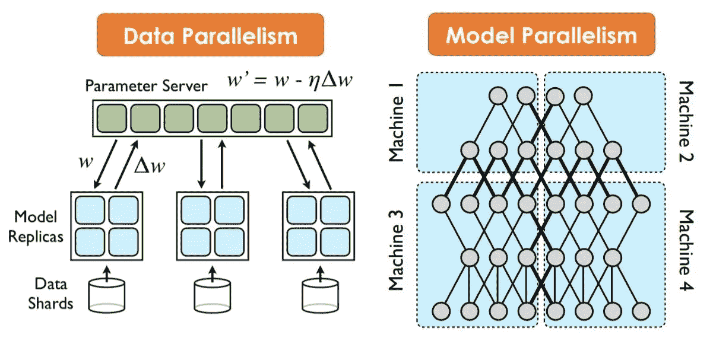

图一。数据并行和模型并行。数据并行化:并行化小批量梯度计算，模型复制到所有机器。模型并行性:跨机器划分模型并复制数据。[1]

混合并行是数据并行和模型并行的结合。混合并行的一个很好的例子是 DistBelief，它是 Google 提出的一个经典软件框架。它包含两个部分:(1) Downpour SGD，一种异步随机梯度下降过程，支持大量模型副本，这些副本在异步执行中结合了模型和数据并行性，以及(Sandblaster，一种支持各种分布式批处理优化过程的框架，包括 L-BFGS 的分布式实现。关于混合并行，可以阅读《优化深度学习训练的多 GPU 并行化策略》。了解更多信息。

在本报告中，我们将讨论一种新的并行策略:流水线并行。管道并行性同时发表在 Gpipe 和 PipeDream 论文中，是一种在多个 GPU 上训练大型模型的有效技术。接下来的部分将介绍流水线并行的一般原理，然后比较和讨论基于流水线并行的四个框架:PipeDream、Gpipe、DAPPLE 和 PipeMare。

# **流水线并行度**

深层神经网络可以定义为一系列层。每一层都由一个正演计算函数和一组相应的参数组成。模型的大小受层数和每层神经元数量的影响。正如我们上面讨论的，对于不适合一台机器的本地存储器的大型深度神经网络，模型并行性被采用，其中模型的某些部分被放置在不同的机器上。每一层的参数将被平衡到相应的机器上。模型并行性的训练过程是双向的。它包括用于处理一个小批量的正向路径和反向路径。如图 2 所示，标准模型并行导致计算资源的严重利用不足。此外，通常不清楚如何在不同的机器之间分割模型以获得最佳性能。

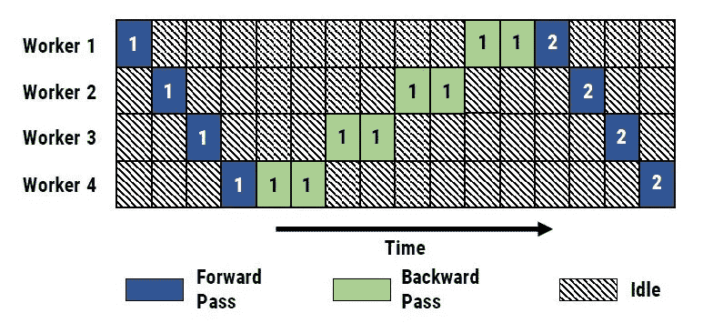

图二。有 4 名工人的模拟平行培训。数字表示批次 ID，向后传递花费的时间是向前传递的两倍。为了简单起见，作者假设在工人之间交流激活/梯度没有开销。[3]

为了解决这个问题，迪帕克·纳拉亚南，亚伦·哈莱普。等人(管道梦)和黄雁萍。GPipe 等人同时提出了流水线并行的概念。流水线并行的关键思想是在训练期间利用流水线并行。它首先将训练示例分成小批(GPipe 中的微批和 PipeDream 中的小批)，然后使用批间或批内并行性将每组小批的执行流水线化到单元上。流水线并行的效率可以通过总的存储器使用和流水线利用率来评估。管道利用率(Util)是在任何给定时间非空闲(停止)的管道阶段的百分比。与数据并行类似，流水线并行也可以分为同步流水线和异步流水线，因为它们的更新策略不同。

**GPipe** — **同步管道**

GPipe 将输入小批分成多个微批，并通过管道在多台机器上执行这些微批。渐变在最后同步应用。

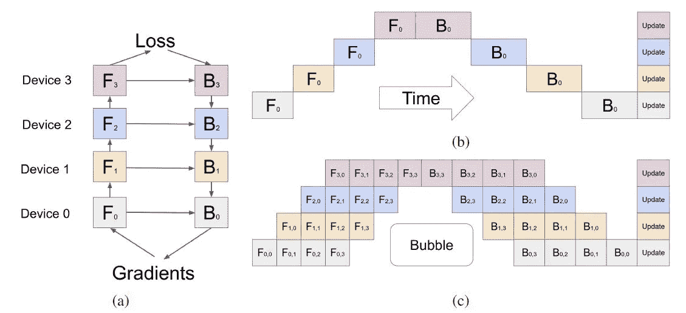

图 3。(a)具有连续层的示例神经网络跨四个加速器划分。(b)由于网络的顺序依赖性，朴素模型并行策略导致严重的利用不足。(c)流水线并行将输入小批量分成更小的微批量，使得不同的加速器能够同时处理不同的微批量。渐变在最后同步应用。[4]

在图 3 中，他们将每个小批量分成 4 个小批量。设备 0、1、2、3 分别存储层 0、1、2、3 的参数，并向前和向后传递中间变量。其工作方式如下:

微批处理 0 首先传递到设备 0，并通过设备 0 的转发功能进行计算。

设备 1 从设备 0 接收微批次 0，计算并将其传输到设备 2。同时，微批次 1 传递到设备 0。

设备 2 从设备 1 接收微批次 0，计算并将其传输到设备 3。同时，设备 1 从设备 0 接收微批次 1，计算并将其传送到设备 2。同时，微批次 2 传送到设备 0。

设备 3 从设备 2 接收微批次 0，计算并将其传送到设备 4。设备 2 从设备 1 接收微批次 1，计算并将其传送到设备 3。同时，设备 1 从设备 0 接收微批量 2，计算并将其传送到设备 2。同时，微批次 3 传送到设备 0。

……

渐变在最后同步应用。更新每个层/设备的参数。然后，开始下一个管道。

为了总结 GPipe 的优势，作者列出了三个关键属性:(1)效率:GPipe 使用一种新颖的批量分裂流水线算法，随着器件数量的增加，实现了几乎线性的加速比。(2)灵活性:GPipe 支持任何可以表示为一系列层的深度网络。(3)可靠性:GPipe 利用同步梯度下降，无论分区数量多少，都能保证训练的一致性。由于其可靠性和比模型并行更好的训练速度，GPipe 在业界得到广泛应用，并有 GPU 集群和 TPU 集群两个版本。

**pieddream—异步流水线**

虽然 PipeDream 与 GPipe 同时期出版，但其并行思想与 GPipe 大相径庭。PipeDream 将前向传递的执行流水线化，并将它们与后向传递穿插在一起，试图最大化硬件利用率和吞吐量。它将小批连续插入管道，并在反向传递后异步更新参数。PipeDream 和 GPipe 之间的区别很明显:PipeDream 应用异步向后更新，而 GPipe 应用同步向后更新。

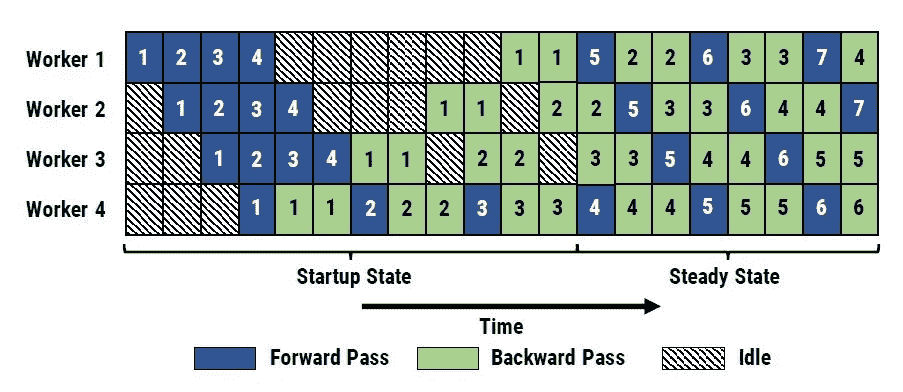

图 4。PipeDream:为了确保在任何时间点都没有 GPU 空闲，框架将多个小批量一个接一个地注入到管道中。在完成小批量的正向传递后，每个阶段将输出激活异步发送到下一个阶段，同时开始执行另一个小批量的工作。类似地，在完成小批量的反向传递之后，每个阶段异步地将输出梯度发送到前一阶段，同时开始另一个小批量的计算。这确保了不同的 GPU 同时处理不同的小批量。[3]

PipeDream 的基本框架如图 4 所示。它结合了批内并行和批间并行。如何将不同批次的正向和反向传递分配给每个工人是一个优化问题。PipeDream 选择大致均匀的分割，以最小化计算节点之间的通信，同时平衡它们之间的计算负载，使用动态程序来解决这一优化问题。

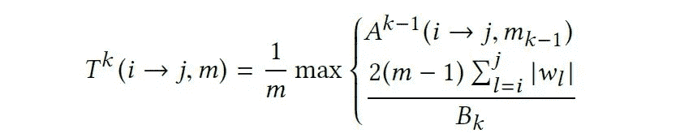

T^k (i → j，m)表示跨越层 I 到 j 的单个级向前和向后传递所花费的总时间，使用带宽 B_k 复制 overm 工作器

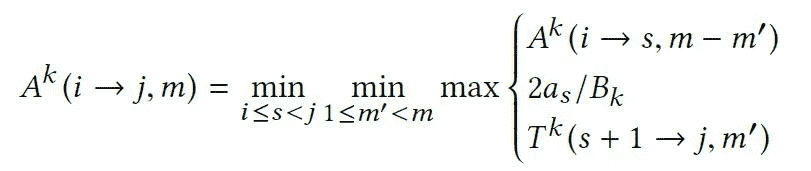

这是 PipeDream 的 DP 定义:max 内的第一项是具有 m 个 m’工作者的层 I 和 s 之间的最优子管道的最慢阶段所花费的时间，第二项是在层 s 和 s + 1 之间传递激活和大小梯度所花费的时间，第三项是在 m’工作者的数据并行配置中包含层 s + 1 到 j 的单个阶段所花费的时间。

然后，流水线并行计算涉及将 DNN 模型的层划分成多个阶段，其中每个阶段由模型中的一组连续层组成。每个阶段映射到一个单独的设备，该设备为该阶段中的所有层执行正向传递(和反向传递)。同时，参数更新将不是同步的。例如，在图 4 中，在工作 1 对小批量 1 的反向传递之后，小批量 5 的新正向传递将使用更新的参数。因此，PipeDream 在每台机器上维护多个版本的参数(每个正在进行的小批量一个版本)。

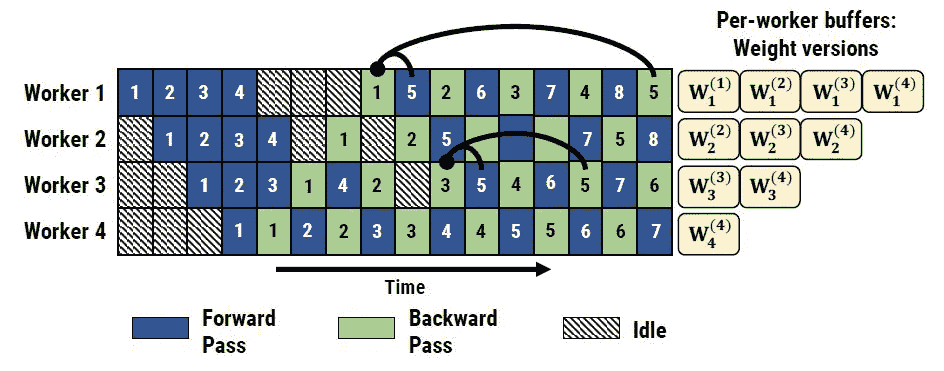

图 5。重量藏在管道梦里。[3]

然而，图 4 的设计遭受由异步向后更新引入的权重陈旧。为了解决这个问题，PipeDream 使用了一种叫做重量堆积的技术。砝码存储维护多个版本的砝码，每个有效迷你批次一个。每个阶段使用正向传递中可用的最新版本砝码处理一个小批次。完成向前传递后，PipeDream 会存储该迷你批次所用的重量。然后，相同的重量版本用于计算重量更新和微型批次后向传递中的上游重量梯度。

总之，PipeDream 是分布式训练的一个有用的异步流水线并行工具。在吞吐量和加速方面，它比 GPipe 更好。但是由于使用了加权存储，它也需要更多的存储资源。

**斑纹**——**改进型** **同步流水线**

DAPPLE 是一个同步分布式训练框架，结合了大型 DNN 模型的数据并行和流水线并行。

与 GPipe 相比，DAPPLE 使用了更好的内存调度和相等的气泡空闲。如图 6 所示，GPipe 一次注入所有微批处理，而 DAPPLE 有一个早期向后调度。DAPPLE 的向后调度可以释放用于存储由相应的向前阶段产生的激活的存储器。优化步骤类似于 PipeDream:使用动态编程找到最佳分区、复制和放置策略。

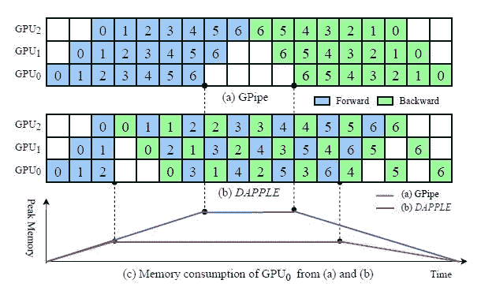

图 6。GPipe (a)和 DAPPLE (b)之间的不同调度以及它们的内存消耗。(作者有一个笔误:在下面的内存比较图例中，红线应该是斑纹线，而蓝线应该是 GPipe 线)[6]

在同步训练场景下，DAPPLE planner 始终比 PipeDreams planner 生成的策略快 3.23 倍，DAPPLE scheduler 比 GPipe 快 1.6 倍的训练吞吐量，同时节省 12%的内存消耗。

**pipe mare——改进的异步流水线**

PipeMare 是一个提高异步流水线训练统计效率的新框架。在模型需要使用时，它使用内存中的任何权重计算梯度，这避免了存储模型权重的额外副本(无权重存储)或引入气泡，但比 PipeDream 实现了更好的性能。

PipeMare 使用两种技术来提高异步管道并行性。它们是(1)学习率重新安排，和(2)差异校正。学习率重调度是解决延迟更新的一种新方法。它设计了一个步长方案来控制训练过程中的步长，因为步长与异步更新的衰减相关。误差校正取代了重量存储。它根据权重的最近平均轨迹，通过外推前向过程中的权重来调整后向过程中使用的权重值。它不是保存多个版本的权重，而是只使用一点额外的内存来保存权重速度的近似值。

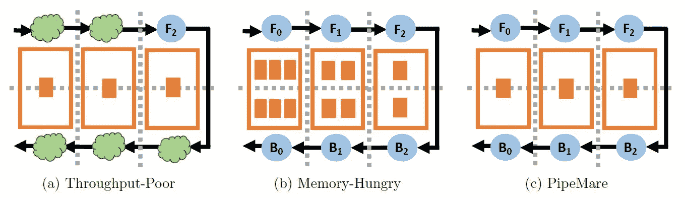

图 7。将 PipeMare 与模型并行性和 PipeDream 进行比较。PipeMare 的内存效率更高，并且仍然保持高吞吐量。[7]

作者将 PipeMare 与 PipeDream 和 GPipe 进行了比较。他们发现 PipeMare 实现了与 GPipe 相似的最终模型质量，但实现了更高效的端到端训练。

# **讨论**

训练神经网络时的管道并行性使得更大的模型能够在空间上被划分，从而导致更低的网络通信和整体更高的硬件利用率。流水线并行有两种方法。诸如 GPipe 的同步流水线并行需要相邻训练迭代之间的必要梯度同步，以确保收敛。在运行时，它调度尽可能多的并发管道阶段，以最大化设备利用率。实际上，这种调度策略会导致显著的内存消耗高峰。诸如 PipeDream 之类的异步流水线并行将小批量连续地插入到流水线中，并丢弃原始的同步操作以实现最大的吞吐量。然而，它需要很高的内存消耗来避免权重过时。研究人员已经为同步流水线并行和异步流水线并行开发了一个内存高效的版本。例如，DAPPLE 使用了比 GPipe 更好的内存调度，并在加速和收敛方面都取得了良好的性能，而 PipeDream-2BW 和 PipeMare 的内存效率比 PipeDream 更好。

正如我们所见，流水线并行的研究人员正试图在两个方向上改进他们的框架。(1)提高记忆效率；(2)保持较高的管道利用率。有趣的是，无论是同步管道还是异步管道的改进版本，都试图将对方的研究思路融入到自己的框架中。例如，DAPPLE 应用动态编程来优化同步管道的内存调度，这类似于 PipeDream 中的优化问题。他们的研究思路类似于寻找同步 SGD 和异步 SGD 在数据并行性上的取舍。

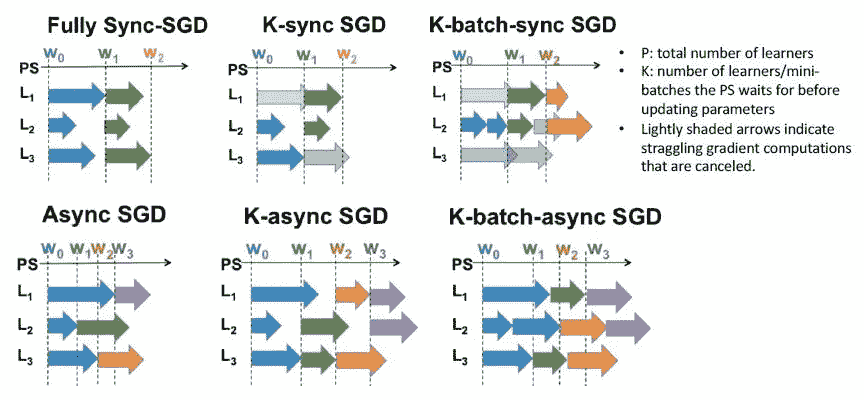

图 8。GPipe 和 PipeDream 之间的差异类似于同步 SGD 和异步 SGD 在数据并行性方面的差异。(此图参考 Parijat Dube 教授的讲稿)

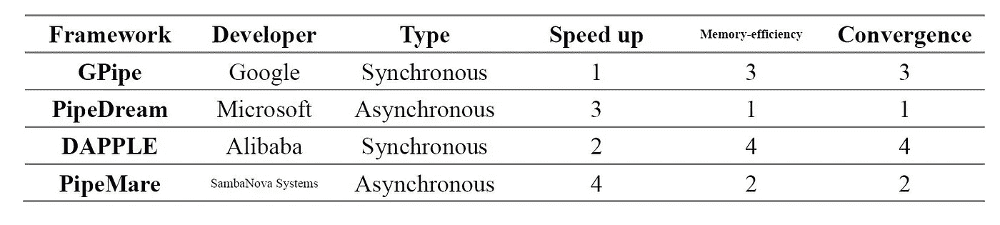

表 1。这是我自己总结的一个对比表。从低到高的比较值意味着从最差到最好。加速(1->4:低->高)；内存效率(1->4:高->低)；收敛(1->4:低->高)

**未来前景**

作为这方面的初学者，我将根据所有这些论文谈谈我的一些想法。同步管道和异步管道各有优缺点，适用于不同的应用场景。在我看来，同步流水线和异步流水线的取舍取决于如何控制收敛和加速来进行训练。同步流水线和异步流水线都属于极端情况:同步流水线有很高的收敛但代价是速度，异步流水线很快但代价是收敛低。能不能把它们结合起来，在中间取得更好的表现？我觉得一个可能的研究方向是建立一个跨同步管道和异步管道的决策代理。在训练期间，流水线可以在同步和异步之间动态切换。为了跨同步管道和异步管道训练决策模型，我们可以使用强化学习或元学习。

可以想象的是，作为机器学习系统的一种新的并行方法，流水线并行将成为一个长期的热门话题。

**实施**

GPipe 和 PipeDream 已经与 Pytorch 集成。DAPPLE 在 GitHub 中也有开源版本。

**相关博客**

如果您在阅读我的报告后对流水线并行感兴趣，这里有一些相关技术博客的链接:

GPipe:[https://ai . Google blog . com/2019/03/introducing-GPipe-open-source-library . html](https://ai.googleblog.com/2019/03/introducing-gpipe-open-source-library.html)

GPipe:[https://towards data science . com/explained-GPipe-training-giant-neural-nets-using-pipeline-parallelism-341 b 63 bfc 74 b](https://towardsdatascience.com/explained-gpipe-training-giant-neural-nets-using-pipeline-parallelism-341b63bfc74b)

PipeDream:[https://www . Microsoft . com/en-us/research/blog/PipeDream-a-more-effective-way-to-training-deep-neural-networks-using-pipeline-parallelism/](https://www.microsoft.com/en-us/research/blog/pipedream-a-more-effective-way-to-train-deep-neural-networks-using-pipeline-parallelism/)

# **致谢**

本文基于 NYU·库兰特计算机科学系的课程 CSCI-GA 3033–091 深度学习系统介绍和相关参考资料撰写。课程的老师是 Parijat Dube 教授，助教是 Kshitij Bharat Sanghvi。感谢他们精彩的课程让我了解到深度学习系统的研究进展。

# **参考:**

[1]迪恩，杰弗里，等，“大规模分布式深度网络”乳头。2012.

[2] Pal，Saptadeep，等，“优化深度学习训练的多 GPU 并行化策略。” *IEEE 微*39.5(2019):91–101。

[3] Narayanan，Deepak，等人，“pipe dream:DNN 训练的广义流水线并行性”第 27 届美国计算机学会操作系统原理会议录。2019.

[4]黄，严平，等.“Gpipe:利用流水线并行实现巨型神经网络的高效训练”arXiv 预印本 arXiv:1811.06965 (2018)。

[5] Harlap，Aaron 等，“pipe dream:DNN 培训的流水线并行性”第一届系统和机器学习会议录。2018.

[6]范，，等.“DAPPLE:一种用于训练大模型的流水线数据并行方法”第 26 届 ACM SIGPLAN 并行编程原理与实践研讨会会议录。2021.

[7]杨，鲍文，等.“Pipemare:异步流水线并行 dnn 训练.”机器学习与系统会议录 3 (2021)。

[8] Narayanan，Deepak，等人，“内存高效的流水线并行 dnn 训练”arXiv 预印本 arXiv:2006.09503 (2020)。

[9][https://pytorch.org/docs/stable/pipeline.html](https://pytorch.org/docs/stable/pipeline.html)

[https://github.com/AlibabaPAI/DAPPLE](https://github.com/AlibabaPAI/DAPPLE)