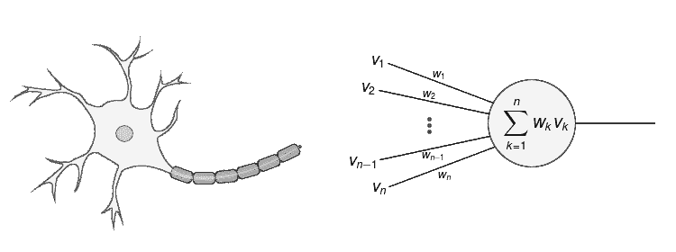
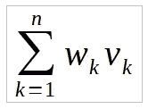

# 卷积神经网络体系结构综述:深度神经网络

> 原文：<https://medium.com/nerd-for-tech/an-overview-of-the-architectures-of-convolutional-neural-networks-deep-neural-networks-a08929f60b23?source=collection_archive---------15----------------------->

弗兰基·查马基在 [Unsplash](https://unsplash.com/s/photos/artificial-intelligence?utm_source=unsplash&utm_medium=referral&utm_content=creditCopyText) 上拍摄的照片

卷积神经网络与其他神经网络一样，既用于分类，也用于学习特征。随着深度神经网络的加速发展，以及在过去几年中用于形状的视觉识别系统的加速发展，这种类型的神经网络变得越来越重要。这一系列文章将描述这种类型的神经网络，从它的起源到今天最著名的架构。

# 深度神经网络

深度学习是机器学习的一个子集，其中这个术语的使用通常与深度人工神经网络相关联。深度神经网络和深度学习的核心是从简单的概念开始，逐步建立更复杂的概念。模型学习作为社会学中的一种学习类型，也是人类天生的学习方式之一，是深度神经网络和深度学习的基础。这方面的一个例子当然是，计算机模型在事先准备好并充分标记的大量图像、文本、声音等样本的基础上，直接学习执行分类任务。[1]

深度学习的应用是多种多样的，包括从自动驾驶到现代智能手机中的个人助理，再到推荐音乐或电影的系统等等。这种类型的神经网络中的深度指的是网络本身中存在的所谓隐藏层的数量。因此，网可以是浅的，意味着它们只有一个隐藏层，或者是深的，意味着它们有不止一个隐藏层。正是这种更多隐藏层的形成，使得网络能够根据形状层次的原理进行学习，这意味着首先形成较简单的形状，然后将这些形状传播到下一层，以便形成更复杂的形状。大量隐藏层的存在影响了数学复杂度，这导致需要增加计算机资源的消耗。

# 深度学习和神经网络的区别

人们认为，深度学习和人工神经网络(ANN)的区别体现在隐含层的数量上，即人工神经网络使用一个隐含层，而深度人工神经网络使用多个隐含层。许多人认为深度学习只代表了人工神经网络的发展，而其他来源认为将这两种类型的网络之间的差异减少到隐藏层的数量是不够的，因为深度神经网络的相应层的任务是建模适当的模式(例如，对象的边缘)，然后可以在后续层中传播，而人工神经网络的任务是将数据投影到问题本身可以线性分离的子空间上。

# 神经网络的要素

人工神经网络由大量人工神经元组成。人工神经元本质上是一种基于某些输入形成适当输出的功能。

图 1:天然和人工神经元

有各种拓扑结构来表示连接人工神经元的方式，其中，前馈最为突出。前馈人工神经网络或信号从输入传播到输出的网络意味着没有反馈或回路。这些是连接输入和输出的简单网络。值得一提的是递归神经网络，其特征在于信号在两个方向上传播，形成反馈回路。这种类型的连接允许在网络中存在某种类型的存储器，因为在网络中的某一点形成的计算可以向后传播，但是这是以增加复杂性为代价的。

## 前馈网络

每个神经元都有一定数量的输入。输入对神经元的影响由一个称为权重的适当系数决定。在图 1 的人工神经元示例中，输入为 v1… vn，权重为 w1… wn，所有输入的影响描述如下:

等式 1:人工神经元的数学形式

## 多层感知器

多层感知器是一种具有前向传播的网络。它是最常用的神经网络类型之一。这意味着网络由多个感知器组成。这个网络由一个负责接收信号的输入层、一个负责做出决策的输出层以及它们之间任意数量的隐藏层组成。[2]

第二部分: [*卷积神经网络(CNN)的历史与描述*](https://mikevastech.medium.com/an-overview-of-the-architectures-of-convolutional-neural-networks-history-and-description-of-3439f44e19c8)

# 资源

[1][https://www.mathworks.com/discovery/deep-learning.html](https://www.mathworks.com/discovery/deep-learning.html)
【2】[https://skymind.com/wiki/multilayer-perceptron](https://skymind.com/wiki/multilayer-perceptron)
【3】[https://keras.io/](https://keras.io/)
【4】[https://hacker noon . com/a-brief-history-of-computer-vision-and-convolutionalneural-Networks-8 Fe 8 aacc 79 f 3](https://hackernoon.com/a-brief-history-of-computer-vision-and-convolutionalneural-networks-8fe8aacc79f3)
【5】实用的 Convolutiona 神经网络，莫希特·塞沃克，马里兰州雷佐尔·卡里姆，帕拉德普·普贾里，ISBN 978–1–71 pack Publishing ltd .
【6】[https://cs . NYU . edu/~ Fergus/tutorials/deep _ learning _ cvpr 12/tutorial _ p2 _ nnets _ ranz at](https://cs.nyu.edu/~fergus/tutorials/deep_learning_cvpr12/tutorial_p2_nnets_ranzat)o _ short . pdf
【7】[https://cs.nju.edu.cn/wujx/teaching/15_CNN.pdf](https://cs.nju.edu.cn/wujx/teaching/15_CNN.pdf)
【8】[https://www.mdpi.com/2079-9292/8/3/292/htm](https://www.mdpi.com/2079-9292/8/3/292/htm)
【9】[https://en . Wikipedia . org/wiki/Rectifier _(neural _ networks)](https://en.wikipedia.org/wiki/Rectifier_(neural_networks))