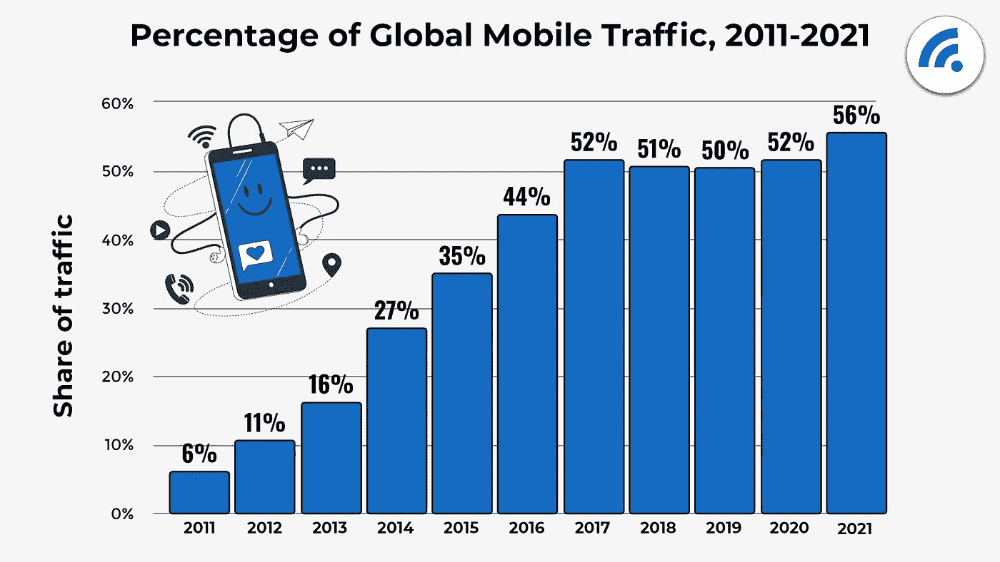

# 移动应用程序开发的终极指南

> 原文：<https://medium.com/nerd-for-tech/an-ultimate-guide-for-mobile-app-development-ff3c17ece87a?source=collection_archive---------2----------------------->

## 在动手开发移动应用程序之前，你应该知道的一切

来源: [Freepik](http://www.freepik.com)

## 介绍

移动应用开发是为智能手机和数字助理构建移动应用的过程，最常见的是为 **Android** 和 **iOS** 构建。该软件可以预先安装在设备上，也可以由用户以后下载并安装。用于这种软件开发的编程和标记语言包括 Java、Swift、Dart、C#和 HTML5。

## 为什么要开发移动应用？

2021 年，预计移动应用将通过应用商店和应用内广告产生 6930 亿美元的收入。此外，预计到 2022 年，企业移动价值将达到 5103.9 亿美元。普通消费者会在自己的设备上安装 30 多个应用程序。普通用户每月花 35 个小时使用移动应用。

来源:- [宽带搜索](https://www.broadbandsearch.net/blog/mobile-desktop-internet-usage-statistics)

如果我们从市场份额的角度来看，截至 2021 年 2 月，移动设备以不到 55%的市场份额领先，桌面设备占 42%的市场份额。剩下的 3%可以归因于平板电脑，它并没有被广泛使用，但却是在线环境的一部分。

全球有超过 35 亿智能手机用户，因此毫无疑问，这个行业是健康和繁荣的。用户在稳步增长，没有任何下降的迹象。研究表明，普通美国人至少每 12 分钟检查一次手机，超过 10%的人大约每 4 分钟检查一次手机。

## 选择哪些手机 App 开发平台？

虽然有多种平台可以开发应用程序，但是应该在考虑一些关键因素(如开发成本、目标受众、当前技术、商业模式和开发时间等)后选择平台。

两个最重要的移动应用平台是苹果公司的 iOS 和谷歌的 Android。iOS 是苹果公司专为 iPhones 打造的专有移动操作系统。然而，Android 可以在包括谷歌在内的各种原始设备制造商生产的移动设备上运行。

据统计，Android 在全球市场占有超过 70%的份额，而 iOS 占有大约 30%。预计这一差距在未来几年将会扩大。此外，谷歌 Play 商店的限制比苹果应用商店少。另一方面，为 iOS 开发的移动应用需要支持的设备要少得多，这使得优化更加简单，iOS 应用的用户保留率通常也更高。

## 移动应用的类型

1.  原生应用
2.  移动网络应用
3.  混合网络应用
4.  渐进式网络应用

无论您选择哪种方法，构建应用程序都有优点和缺点。通过选择与您的策略相匹配的方法，您可以获得所需的用户体验，利用计算资源，并构建您的应用程序所需的本机功能。

## 原生应用开发

使用操作系统原生语言专门为单一平台开发的应用程序是原生应用程序。原生应用通常是用一种编程语言为特定的操作系统编写的。例如，为 Android、Java 或 Kotlin 开发原生应用程序，而为 iOS 开发原生应用程序，可以使用 Objective-C 或 Swift。

原生应用获得了设备和操作系统功能的所有可能优势。这些应用程序利用对设备硬件的直接访问，如 GPS、摄像头、麦克风、离线访问等。因此，它们更快、更可靠、性能更高，并具有更好的用户体验。

虽然原生开发看起来很完美，但最大的挑战是在不同的平台上运行应用程序，这吓跑了成本高昂的初创公司。原因是，要在多个平台上运行应用程序，需要为每个平台单独开发和维护应用程序。这意味着原生应用相当于为每个平台 Android 和 iOS 构建两个不同的应用，使用不同的代码集。

## 构建原生应用的优势

## 高速

由于本地移动应用程序没有太复杂的代码，它们往往比其他应用程序运行得更快。很多 app 元素显示的很快，因为是预先预加载的。

## 离线功能

即使在没有互联网连接的情况下，本机应用程序也不会出现任何问题。这使得这种应用程序对用户来说更加方便，因为他们可以在旅途中或飞机上没有连接时访问所有功能。

## 可靠的

本地应用是面向未来的投资。它们是安全的，用户友好的，比其他应用程序更快。如果你的业务需要很好地服务于受众，你应该选择原生应用开发。

## 构建本地应用的缺点

## 没有可重用的代码

如果一个开发者想同时为 Android 和 iOS 创建本地应用，他必须开发两个独立的本地应用(正如我们所讨论的)。这将比开发一个具有可重用代码库的跨平台移动应用程序或一个具有共享后端代码的混合应用程序花费更多的时间和精力。

## 涉及更多技能

由于原生应用的核心是语言特定的，公司通常很难找到一个熟练的开发人员来连续开发原生应用。当比较本机应用程序和跨平台应用程序时，如果一个公司想要接触更广泛的受众，他们必须雇佣两个开发团队来开发本机应用程序。而在跨平台的情况下，可能只需要一个。

> **工具**:

**安卓**:

*   [安卓工作室](https://developer.android.com/studio)
*   [安卓 IDE](https://www.android-ide.com/)
*   [Intellij IDEA](https://www.jetbrains.com/idea/)

**对于 iOS** :

*   [XCode](https://developer.apple.com/xcode/)
*   [应用代码](https://www.jetbrains.com/objc/)

## 跨平台移动应用

要知道混合和跨平台 app 是不一样的。这两种类型的应用程序之间唯一的相似之处是“代码共享性”。对于具有安全、稳定和易于维护特性的低成本定制应用来说，跨平台开发是最好的方法。许多跨平台应用程序开发框架有助于实现类似于原生应用程序的感觉和用户体验。

移动开发者需要获得尽可能多的用户群，而不管他们偏好的平台是什么，这使得跨平台移动应用的价值越来越大。跨平台开发方法使用本地渲染引擎。它们提供无缝功能、易于实施和经济高效的生产。与原生应用相比，跨平台应用的性能较低，但远好于混合应用。定制也是一种痛苦，因为它受限于您使用的框架。

## 构建跨平台应用的优势

## 性价比高

本地应用与跨平台应用的问题可能会有争议，但当涉及到成本效益时，跨平台应用会胜出。当一个企业需要同时面向不同平台的受众时，这是一个理想的选择。此外，大多数跨平台开发需要使用原生的公司所需劳动力的一半，因此节省了公司的资源。

## 可重复使用的

有了跨平台应用，开发人员不再需要为每个操作系统编写独特的代码。相反，他们可以使用公共代码库将代码转移到不同的平台。

## 构建跨平台应用的缺点

## 复杂的开发过程

需要一个熟练的开发人员来创建一个能够很好地适应一些平台的应用程序。有必要保留操作系统和运行它们的硬件之间的所有细微差别，尤其是在实现复杂的界面和功能时。

## 具有挑战性的集成

开发人员在将跨平台应用程序集成到本地设置和第三方云服务提供商时可能会遇到困难。

> **工具**:

*   [颤动](https://flutter.dev/)
*   [反应原生](https://reactnative.dev/)
*   [Xamarin](https://dotnet.microsoft.com/apps/xamarin)

## 混合移动应用

混合应用是本地应用和网络应用之间的中庸之道。它们由两部分组成——后端代码和一个本地查看器，可以下载后在 web 视图中显示后端。比如安卓用 WebView，iOS 有 WKWebView 显示混合 app。与网络应用不同，混合移动应用不需要浏览器来访问，并且可以利用 Apache Cordova 或 Ionic 的 Capacitor 等插件。该插件允许开发者访问平台的本地特性。

混合应用程序开发是一个时间救星，比原生应用程序更具成本效益。您可以编写一次代码，并将其用于多个平台。它使用户体验和性能接近原生应用。然而，从视觉角度来看，实现一个伟大的 UX 和导航模式是一个挑战。

它需要更少的开发时间，并允许代码共享。缺点是缓慢的性能和次优的用户体验。从理论上讲，从视觉角度来看，实现大 UX 和导航模式是可能的。然而，这是一个付诸实践的挑战。它们的开发成本比原生应用更低，但性能很慢，用户体验也不理想。

## 构建混合应用的优势

## 更快的发展

由于该应用程序对所有平台使用相同的后端代码，因此创建一个混合应用程序不会花费太多时间。然而，具有许多功能的混合应用程序可能会更加耗时，所以最好保持简单。

## 简单的维护

由于混合应用程序是基于 web 技术的，因此比本地应用程序更容易维护。

## 构建混合应用的缺点

## 无法脱机访问

由于混合应用本质上是基于网络的，没有互联网连接它们就无法工作。而且由于 app 的所有元素都要加载，所以执行速度普遍较慢。网络连接是开发本地和混合应用的一个重要因素。

## 操作系统不一致

由于混合应用程序共享一个代码库，某些功能可能会受到 Android 的支持，而不会在 iOS 设备上显示，反之亦然。它需要更多的测试时间来识别不一致的地方，并进行大量的修改来解决这些问题。

> **工具**:

*   [离子型](https://ionicframework.com/)
*   [阿帕奇科尔多瓦](https://cordova.apache.org/)
*   [微软 Visual Studio](https://visualstudio.microsoft.com/vs/features/mobile-app-development/)

## 渐进式网络应用(PWAs)

渐进式 web 应用程序是一个行为类似于原生移动应用程序的网站。在某种程度上，渐进式网络应用程序或 pwa 类似于混合型。由于 pwa 在浏览器中运行，所以不需要从应用商店下载。人们仍然可以在主屏幕上访问该应用程序。他们的进步基于为每个平台优化的用户体验。

虽然 PWA 可以离线工作，为 Android 和 iOS(最新的 12.2 版本)提供 GPS 访问、推送通知和许多其他功能，但仍有一些限制，如没有摄像头访问、没有默认启动图像、没有安装 API 和其他问题。

渐进式 Web 应用程序没有专用的语言或框架，因此没有必要雇用特殊类型的开发人员。它们可以在角度或反应上完成。这种类型的 app 编码在电子商务项目中最受欢迎。

## 建造公共工程区的好处

## 无安装

PWA 相对于其他应用的一大优势是它们独立于应用商店。客户不需要下载 PWA，只需要一个网络浏览器。

## 离线功能

PWA 可以在脱机模式下工作，使用户可以随时访问在线商店，并使他们始终保持最新状态。

## 安全性

pwa 具有坚如磐石的安全性，因为它们基于 HTTPS，允许浏览器到服务器的加密。

## 廉价而快速的发展

PWAs 比其他应用程序更便宜、更快、更容易开发。开发 PWA 不需要很大的预算。你可以节省你的金钱和资源，因为它只开发一次。由于 pwa 在任何平台上都只需要 HTML、CSS 和 JavaScript，所以开发起来更快。

## 建造公共工程部的缺点

## 功能限制

由于 pwa 只是半个应用程序，它们的功能在某些操作系统上是有限的。有些功能 PWAs 无法使用，比如无法访问日历、通讯录、浏览器书签和闹钟。

## 高电池消耗

PWA 消耗电池的速度更快，因为它需要更多的 CPU。还有，PWA 不能像原生一样优化。

## 有限的网络浏览器支持

并非所有 web 浏览器都支持 pwa。渐进式网络应用程序是面向 Android 的，它们在 Safari 上不起作用。由于 Safari 是美国领先的浏览器，拥有 51%的市场份额，如果只使用 PWA，就有失去大量移动应用受众的风险。

## 有限的 iOS 访问

对于 PWAs，推送通知对 iOS 用户不可用。此外，当 iOS 用户安装 PWA 时，离线数据将最多可用两周，之后缓存将自动清除。因此，用户数据不会保存很长时间。

> **工具**:

*   [棱角分明](https://angular.io/)
*   [反应过来](https://reactjs.org/)
*   [聚合物](http://polymer-library.polymer-project.org/)

## 如何学习以上列举的技术必备技能？

由于互联网上的一切都是免费的，所以没有必要在技能培养上花费额外的钱。下面是一些学习不同技术的最佳教程的链接。

> **为** **安卓**

> **iOS 版**

> **用于颤振**

> **为 React Native**

> **用于 Xamarin**

> **用于离子型**

> **对于阿帕奇科尔多瓦**

> **为角度**

> **作出反应**

> 本教程中提到的资源是其创作者的专有财产。我没有创造它们，也没有从这些资源中获得任何利益。

希望对你有帮助。谢谢:-)

如果你想谈更多或者有任何疑问，你可以通过-
-[Linkedin](https://www.linkedin.com/in/vatsal-patel-919691193/)-
-[Github](https://github.com/PatelVatsalB21)与我联系