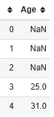
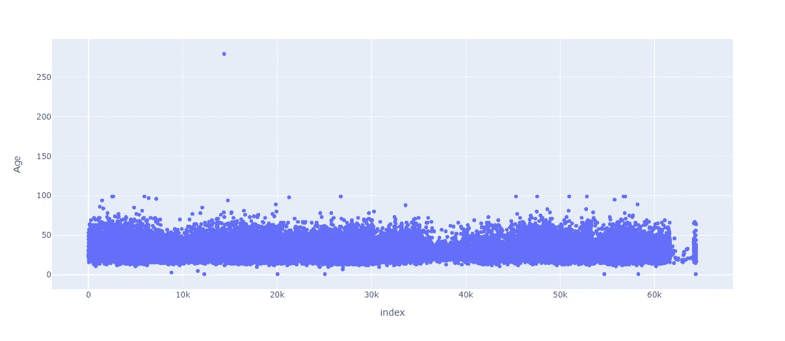
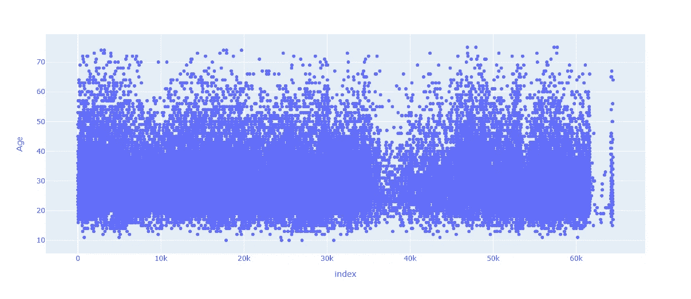
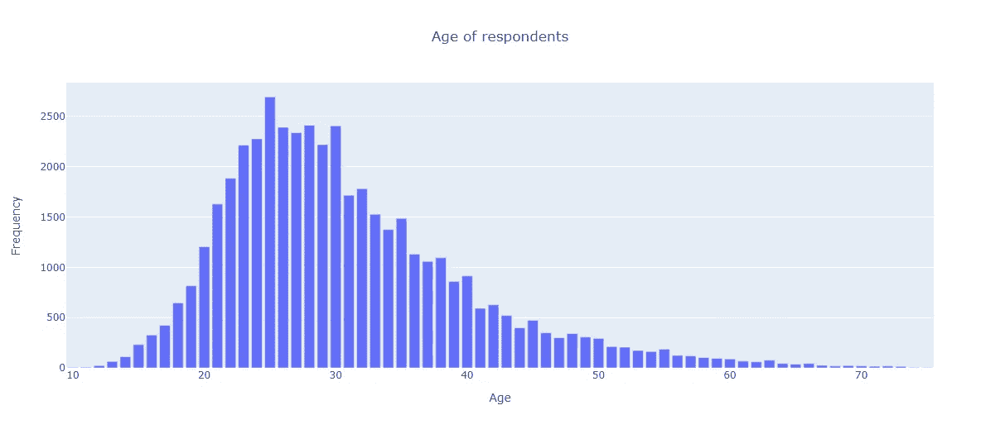

# 分析年龄分布 Python 数据分析系列第 1 部分

> 原文：<https://medium.com/nerd-for-tech/analyse-the-distribution-of-ages-python-data-analysis-series-part-1-cc0fb2ca7f36?source=collection_archive---------1----------------------->


封面图片([来源](https://unsplash.com/photos/jD6eRgBpE0c))

在发表了几篇关于使用 Python 进行数据分析的独立文章后，我决定以适当系列的形式分享我在以前个人项目中所做的一些工作。

这个“Python 数据分析”系列将由五篇文章组成，使用 2020 堆栈溢出开发者调查结果数据集解决不同的数据问题。我将向您展示如何使用 pandas 来解决数字和分类数据的问题，并在最后使用 Plotly (Express)创建漂亮的可视化效果。

虽然我在这里只展示了一个 Python 脚本，但是每篇文章都有自己的 Jupyter 笔记本，上面有相同的代码和解释。在第 5 部分中，我们将把这些笔记本上传到 Azure DataBricks workspace 的云中。

到本系列结束时，您将掌握数据转换和可视化的新概念，并开始使用云中数据科学的强大工具。

如果您想自己运行代码，您需要一些先决条件:

*   安装 Python 库:[熊猫](https://pypi.org/project/pandas/)、 [Plotly](https://pypi.org/project/plotly/) 和 [Jupyter](https://pypi.org/project/jupyter/) (最后一个是运行笔记本用的)
*   下载 2020 年堆栈溢出开发者调查结果[数据集](https://insights.stackoverflow.com/survey)

对于代码本身，您可以使用本文提供的脚本，或者从 [my GitHub repository](https://github.com/Ze1598/medium-articles/tree/master/Python%20Data%20Analysis%20series%20with%202020%20Stack%20Overflow%20survey) 下载 Jupyter 笔记本。这些笔记本本质上是这些文章的替代品，因为它们包含相同的代码和解释。主要的区别是文章有到系列的每个部分的链接。

对于这些文章，我将首先解释目标，即最终目标和达到该解决方案所需的数据转换。之后，我将展示完整的 Python 脚本。此时，您可以单独通读一遍，或者看一下脚本并继续阅读文章中的解释。

此外，请记住，本系列不一定是针对熊猫和 Python 数据分析的完全初学者。当然，如果有解释，代码会更简单，但是我认为如果您已经对 pandas 和可视化库(如 Matplotlib 或 Plotly)有了一定程度的了解，您会从这些系列中获得更多。

最后，这里有一些方便的链接来浏览本系列的内容:

*   第 2 部分:[绘制年度薪酬直方图](https://soulsinporto.medium.com/plot-an-histogram-of-annual-compensations-python-data-analysis-series-part-2-24d5d3bc4ed8)
*   第 3 部分:[分析受访者的教育水平](https://soulsinporto.medium.com/analyse-the-education-level-of-respondents-python-data-analysis-series-part-3-39fee072aba)
*   第 4 部分: [Unpivot 分隔数据](https://soulsinporto.medium.com/unpivot-delimited-data-python-data-analysis-series-part-4-145c06ab75ad)
*   第 5 部分:[将您的 Jupyter 笔记本移动到 Azure DataBricks 工作区](https://soulsinporto.medium.com/move-your-jupyter-notebooks-to-an-azure-databricks-workspace-python-data-analysis-series-part-5-693f5de36450)
*   [本文 Jupyter 笔记本](https://github.com/Ze1598/medium-articles/blob/master/Python%20Data%20Analysis%20series%20with%202020%20Stack%20Overflow%20survey/Age%20of%20Respondents.ipynb)

事不宜迟，让我们开始今天的演示吧。

# 分析受访者的年龄



数据预览

对于第一篇文章，目标是绘制一个条形图，展示受访者年龄的频率。为此，我们需要过滤异常值/坏数据点的数据，并删除浮点年龄(是的，有年龄，如 15.5 岁)。还有一行用于删除空白的代码，尽管在应用过滤器后并不需要，但我还是将它包含在内，以向您展示未来工作中可能遇到的更多选项。剧情之前最不需要的就是得到每个年代的频率。

受访者的年龄

这些演示的前 8 行代码完全相同。我们总是要从相同的位置导入相同的库和相同的数据集(当然，根据您在机器上的位置来更改 CSV 的位置)。

由于我们使用的是一列数据，完全没有调查中其他问题和答案的上下文，因此我们可以删除所有其他列，只保留年龄的一列(第 10 行)。

第 12 行和第 13 行用于一些探索性的数据分析。目标是找到数据的极限和异常值，即过滤掉哪些响应。



年龄的探索性数据分析

散点图显示，接近 100 岁或更老的受访者可能不完全代表准确的数据点。此外，有一个门槛，在这个门槛上，儿童将太小而不能回答调查。

因此，在第 15 行，我们只保留年龄在 10 到 75 岁之间的受访者。

```
data = data.query("(Age >= 10) and (Age <= 75)")
```

在第二幅图(第 18 行)中，我们可以看到年龄的分布更加均匀。



过滤后年龄的探索性数据分析

下一步是删除浮点年龄(第 21 和 22 行)。通常，年龄被记录为整数值，所以我们将简单地删除那些浮点值。请记住，删除数据应始终经过仔细考虑。在这些文章中，为了简单起见，我们采取了简单的方法，但是在一个实际的项目中，还有其他的选择，比如向上/向下取整，用平均值代替，等等。

```
is_integer = lambda row: int(row["Age"]) == row["Age"]
data = data[data.apply(is_integer, axis="columns")]
```

列中的值表示为 float，所以如果我们逐行进行，我们可以将整数表示与当前的数字表示进行比较。如果它们相同，则该数字是整数(例如 23.0 或 45.0)；否则年龄是一个浮点数，我们丢弃它(例如 15.5 不同于 15)。

第 25 行使用`dropna`函数删除空白值，即使该列中没有空白(当我们过滤 10–75 范围时，它们被删除)。我使用该函数的目的是展示其潜力。有了这个电话

```
data = data.dropna(axis="rows", how="any", subset=["Age"])
```

您了解到可以从两个轴(行或列)中删除空白，可以仅基于列的子集进行删除，并且可以选择如何删除:轴是否有任何空白值，或者轴是否需要所有数据点都为空白。

为了获得年龄频率，在第 28 行用`value_counts`实现。

```
age_counts = data["Age"].value_counts()
```

该方法返回一个熊猫序列，其中指数是“年龄”值，数据点是各自的频率。

我们可以将这个系列直接传递给 Plotly，它能够将年龄和频率分配给绘图的正确维度。

```
fig = px.bar(age_counts, title="Age of respondents")
fig.update_layout(
    xaxis_title = "Age",
    yaxis_title = "Frequency",
    title_x = 0.5, 
    showlegend = False
)
fig.show()
```



结果

# 结论

我们已经到了第一部分的结尾。“年龄”是一个相当简单的例子，但它适合第一部分。我们了解了“真实”数据的局限性，清理了这些数据，最终获得了我们想要的视觉效果。

在第 2 部分中，我们将使用另一列数字数据，但用于连续数据。换句话说，我们将查看宁滨数据来创建直方图。

在我离开您之前，这里是本系列的一些方便的链接:

*   第二部分:[绘制年度薪酬直方图](https://soulsinporto.medium.com/plot-an-histogram-of-annual-compensations-python-data-analysis-series-part-2-24d5d3bc4ed8)
*   第 3 部分:[分析受访者的教育水平](https://soulsinporto.medium.com/analyse-the-education-level-of-respondents-python-data-analysis-series-part-3-39fee072aba)
*   第 4 部分: [Unpivot 分隔数据](https://soulsinporto.medium.com/unpivot-delimited-data-python-data-analysis-series-part-4-145c06ab75ad)
*   第 5 部分:[将你的 Jupyter 笔记本转移到 Azure DataBricks 工作区](https://soulsinporto.medium.com/move-your-jupyter-notebooks-to-an-azure-databricks-workspace-python-data-analysis-series-part-5-693f5de36450)
*   [Jupyter 系列笔记本](https://github.com/Ze1598/medium-articles/tree/master/Python%20Data%20Analysis%20series%20with%202020%20Stack%20Overflow%20survey)