# 基于支持向量机(SVM)的银行营销数据集分析

> 原文：<https://medium.com/nerd-for-tech/analysis-of-bank-marketing-dataset-by-using-support-vector-machine-svm-1ccae6eaa782?source=collection_archive---------1----------------------->

> ***分析预测客户是否会认购定期存款……***


用例:数据集与一家葡萄牙银行机构的直接营销活动(电话)相关。目标是预测客户是否会认购定期存款。[*下载数据集*](https://archive.ics.uci.edu/ml/datasets/bank+marketing#) *。*

**步骤 01 —数据预处理**

**步骤 02 —应用合适的数据转换**

**步骤 03 —应用合适的特征离散化**

**步骤 04——应用合适的特征编码技术**

**步骤 05——缩放和/或标准化特征**

**步骤 06——相关矩阵和主成分分析(PCA )**

**步骤 07 —检查类别不平衡并处理类别不平衡**

**步骤 08——应用支持向量机(SVM)**

首先我们必须导入一些库。因为大多数 python 库都有一组有用的函数，可以简单地消除从头编写代码的需要。所以我导入了下面的库

```
import numpy as np
import pandas as pd
import scipy.stats as stats
from matplotlib import pyplot as plt
%matplotlib inline
from sklearn.preprocessing import StandardScaler
```

我已经添加了以下代码，用于将 google drive 帐户安装到 google colaboratory，以访问 drive 上可用的文件。当我们执行下面的代码时，我们必须转到生成的 URL，并获得授权代码才能进入这里。

```
from google.colab import drivedrive.mount(“/content/gdrive”)
```

输入授权码后。您将得到一条消息“安装在 [/content/drive](https://colab.research.google.com/drive/1nVXYLhJ2QiFQHRE3n43m-LxgliqJQz2-?authuser=1#) ”。此后，通过下面的代码，您可以访问您连接的 google drive 上的文件。

```
data = pd.read_csv('/content/gdrive/My Drive/Colab Notebooks/data/banking.csv')
```

通过下面的代码，我们可以检查数据集上可用的记录数

```
len(data)
```

现在，您已经成功地将数据加载到名为“data”的变量中。出于修改的目的，我已经将数据复制到另一个名为“X”的变量中

```
X = data.copy() #dataset has been copied to  X
```

通过下面的代码，您可以看到该变量中存储的前 10 个数据行。Pandas libary 提供了一个名为 head()的方法，广泛用于返回数据帧或数据系列的前 n 行。默认情况下，该方法返回存储数据集的前 5 行。

```
X.head(10)
```

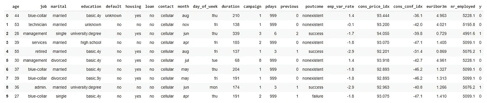

让我们详细看看每个步骤，

## 步骤 01 —数据预处理

数据预处理是机器学习中的一个主要步骤，因为从数据集中获得的有用信息直接影响模型的质量，所以在将数据输入模型之前，对数据进行至少必要的预处理是非常重要的。

> 步骤 01 A ->数据清理-识别和处理缺失值、重复记录

按照下面的代码，我们可以确定每列数据中缺少的值

```
X.isnull().sum()  #No null values
```

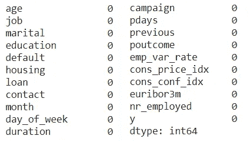

在上面的输出中，所有的值都是零，所以现在我们可以得出结论，在数据集中没有任何 nan 值。

通过下面的代码，我们可以检查数据集中的重复行。

```
print(X.duplicated().value_counts()) # To check duplicated values
```

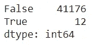

从上面的输出中，我们可以得出结论，数据集中有 12 个重复的行，但是我们不能将它们作为重复的值，因为没有客户 ID 或任何东西的唯一列。因此价值观可能是另一个人的价值观。所以我没有删除那些值

> 步骤 01 B ->数据清理——识别和处理异常值

通过下面的代码，我们可以得到数字列的名称

```
X._get_numeric_data().columns.tolist()
```

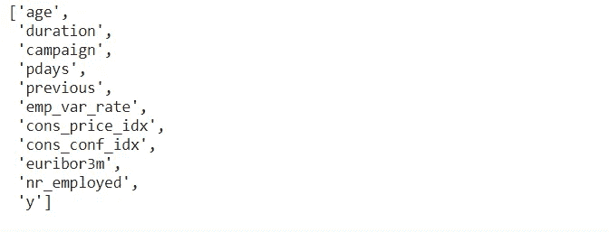

a)特征年龄 Q-Q 图和盒图

```
plt.rcParams["figure.figsize"] = (10, 6)
stats.probplot(X["age"], dist="norm", plot=plt)
plt.show()
```

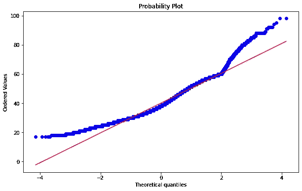

```
plt.rcParams["figure.figsize"] = (22, 3)
temp_df = pd.DataFrame(X, columns=['age'])
temp_df.boxplot(vert=False)
```

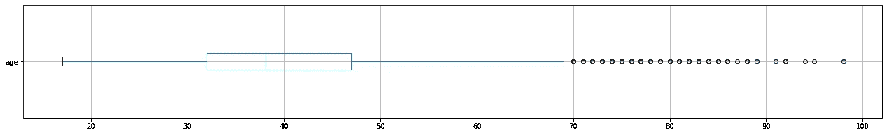

这个特性没有太大的问题，所以我们可以不经过任何预处理就使用它

b)特征持续时间 Q-Q 图和箱线图

```
plt.rcParams["figure.figsize"] = (10, 6)
stats.probplot(X["duration"], dist="norm", plot=plt)
plt.show()
```


```
plt.rcParams["figure.figsize"] = (22, 3)
temp_df = pd.DataFrame(X, columns=['duration'])
temp_df.boxplot(vert=False)
```

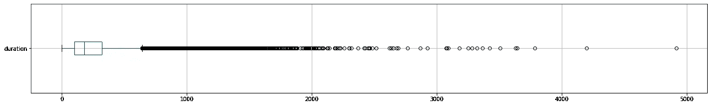

此属性对输出目标有很大影响(例如，如果 duration=0，则 y='no ')。然而，在执行呼叫之前，持续时间是未知的。还有，结束通话后 y 显然是已知的。因此，该输入应仅用于基准测试目的，如果目的是获得现实的预测模型，则应丢弃。

```
X = X.drop(['duration'], axis = 1)
```

按照上面的代码，我们可以删除持续时间列。

c)特色活动 Q-Q 图和箱线图

```
plt.rcParams["figure.figsize"] = (10, 6)
stats.probplot(X["campaign"], dist="norm", plot=plt)
plt.show()
```

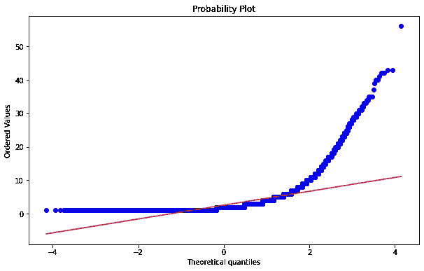

```
plt.rcParams["figure.figsize"] = (22, 3)
temp_df = pd.DataFrame(X, columns=['campaign'])
temp_df.boxplot(vert=False)
```

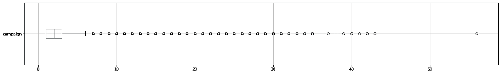

代表在此活动期间为此客户执行的联系次数的活动。在上面的箱线图中，我们可以看到只有 1 个值超过 50。所以我已经删除了那个记录。

```
X=X[X['campaign']<50]
X=X.reset_index(drop=True)
```

去除异常值后的箱线图，

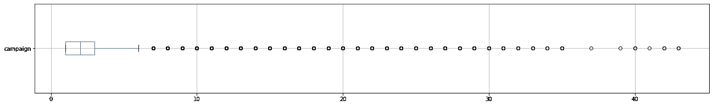

d)特征日 Q-Q 图和箱线图

自上次活动联系客户后经过的天数(999 表示以前没有联系过客户)

```
plt.rcParams["figure.figsize"] = (10, 6)
stats.probplot(X["pdays"], dist="norm", plot=plt)
plt.show()
```

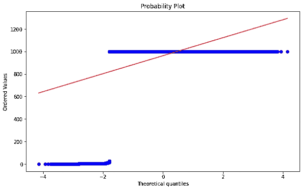

```
plt.rcParams["figure.figsize"] = (22, 3)
temp_df = pd.DataFrame(X, columns=['pdays'])
temp_df.boxplot(vert=False)
```

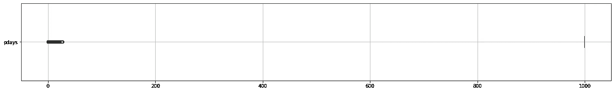

```
len(X[X['pdays']==999])  # -> 39672
```

这个特性没有太大的问题，所以我们可以不经过任何预处理就使用它。我们必须通过使用标签编码来处理特征。因为 39672 个值中有 999 个意味着客户以前没有联系过。

e)以先前 Q-Q 图和箱线图为特征

在此活动之前为特定客户执行的联系次数

```
plt.rcParams["figure.figsize"] = (10, 6)
stats.probplot(X["previous"], dist="norm", plot=plt)
plt.show()
```

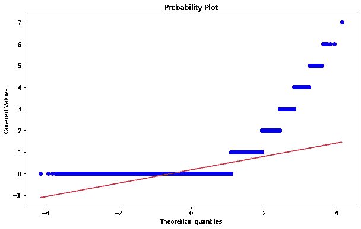

```
plt.rcParams["figure.figsize"] = (22, 3)
temp_df = pd.DataFrame(X, columns=['previous'])
temp_df.boxplot(vert=False)
```


```
X['previous'].value_counts()
```

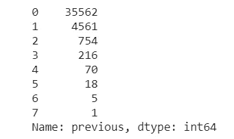

这个特性没有太大的问题，所以我们可以不经过任何预处理就使用它

f)特征是雇员变量比率 Q-Q 图和箱线图

就业变化率-季度指标

```
plt.rcParams["figure.figsize"] = (10, 6)
stats.probplot(X["emp_var_rate"], dist="norm", plot=plt)
plt.show()
```

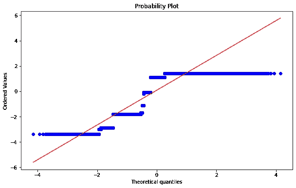

```
plt.rcParams["figure.figsize"] = (22, 3)
temp_df = pd.DataFrame(X, columns=['emp_var_rate'])
temp_df.boxplot(vert=False)
```

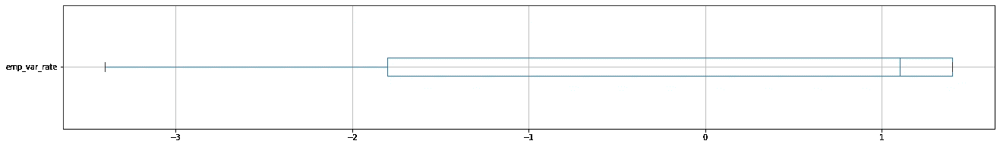

这个特性没有太大的问题，所以我们可以不经过任何预处理就使用它

g)特征 Cons_price_idx Q-Q 图和箱线图

消费者价格指数——月度指标

```
plt.rcParams["figure.figsize"] = (10, 6)
stats.probplot(X["cons_price_idx"], dist="norm", plot=plt)
plt.show()
```

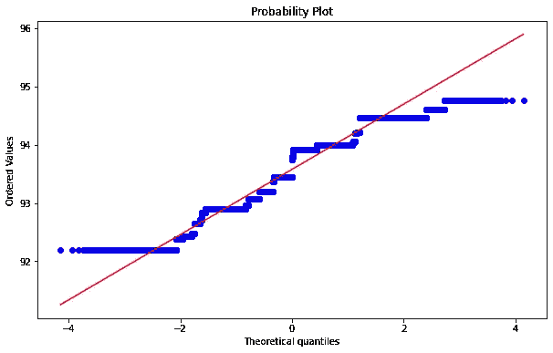

```
plt.rcParams["figure.figsize"] = (22, 3)
temp_df = pd.DataFrame(X, columns=['cons_price_idx'])
temp_df.boxplot(vert=False)
```

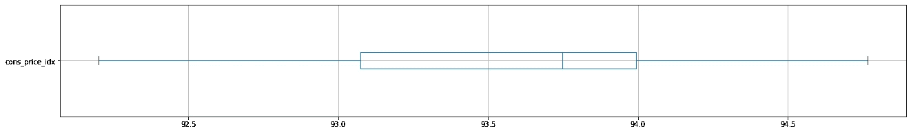

这个特性没有太大的问题，所以我们可以不经过任何预处理就使用它

h)特征 Cons_conf_idx Q-Q 图和盒图

消费者信心指数——月度指标

```
plt.rcParams["figure.figsize"] = (10, 6)
stats.probplot(X["cons_conf_idx"], dist="norm", plot=plt)
plt.show()
```

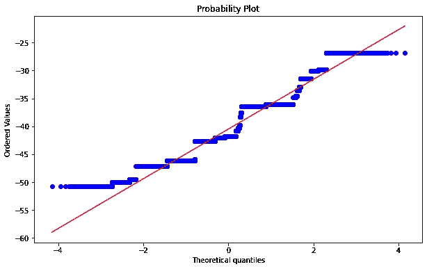

```
plt.rcParams["figure.figsize"] = (22, 3)
temp_df = pd.DataFrame(X, columns=['cons_conf_idx'])
temp_df.boxplot(vert=False)
```

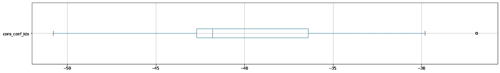

这个特性没有太大的问题，所以我们可以不经过任何预处理就使用它

I)以 Euribor3m Q-Q 图和箱线图为特色

每日指示器

```
plt.rcParams["figure.figsize"] = (10, 6)
stats.probplot(X["euribor3m"], dist="norm", plot=plt)
plt.show()
```

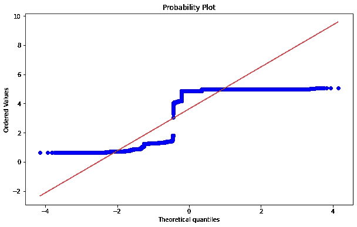

```
plt.rcParams["figure.figsize"] = (22, 3)
temp_df = pd.DataFrame(X, columns=['euribor3m'])
temp_df.boxplot(vert=False)
```

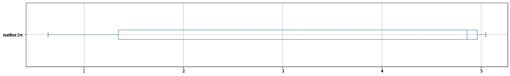

这个特性没有太大的问题，所以我们可以不经过任何预处理就使用它

j)特征 Nr _ 采用 Q-Q 图和盒图

```
plt.rcParams["figure.figsize"] = (10, 6)
stats.probplot(X["nr_employed"], dist="norm", plot=plt)
plt.show()
```

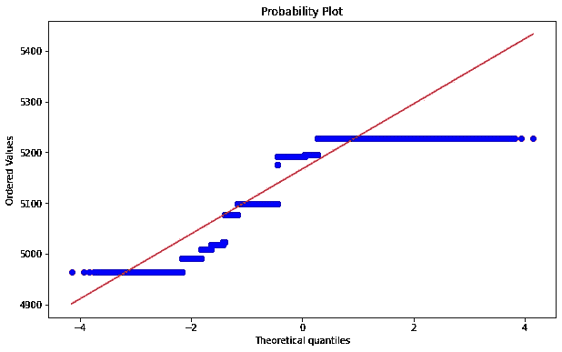

```
plt.rcParams["figure.figsize"] = (22, 3)
temp_df = pd.DataFrame(X, columns=['nr_employed'])
temp_df.boxplot(vert=False)
```

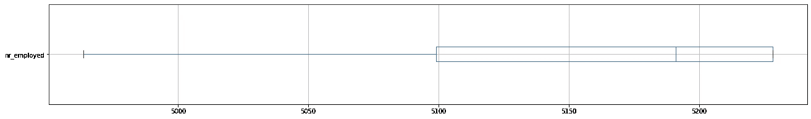

这个特性没有太大的问题，所以我们可以不经过任何预处理就使用它。

## 步骤 02 —应用合适的数据转换

大多数情况下，我们更喜欢数据来自正态分布来训练模型。因为实际数据集中的要素通常会遵循更偏态的分布。通过根据这些变量的偏斜度应用不同类型的变换，我们可以将偏斜分布映射成正态分布。

```
cols_ForHist= X._get_numeric_data().columns.to_list()
cols_ForHist.remove('y')
cols_ForHist
```

['age '，' campaign '，' pdays '，' previous '，' emp_var_rate '，' cons_price_idx '，' cons_conf_idx '，' euribor3m '，' nr_employed']

```
plt.rcParams["figure.figsize"] = (24, 12)
X[cols_ForHist].hist()
```

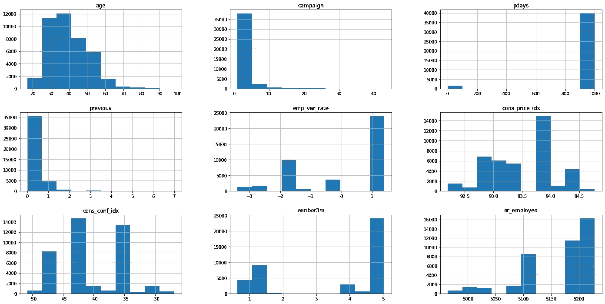

```
plt.rcParams["figure.figsize"] = (8, 6)
from sklearn.preprocessing import FunctionTransformer
```

由于天数和一些独特的代码，我认为有些特征是绝对的。例如，Pdays 有 999 表示以前没有联系过客户。由于这些类型的原因，我认为它们是绝对的

## 左偏分布

我们可以使用指数或幂变换来减少左偏分布。

a)柱- Euribor3m 的改造

```
exponential_transformer = FunctionTransformer(np.exp,validate=True)
exponential_transformer.fit(X[['euribor3m']])
X['euribor3m'] = exponential_transformer.transform(X[['euribor3m']])
X['euribor3m'].hist()
```

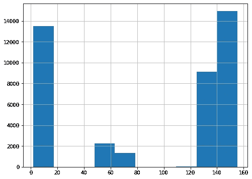

b)列的转换-雇员变量比率

```
exponential_transformer = FunctionTransformer(lambda x: x ** 2)
exponential_transformer.fit(X[['emp_var_rate']])
X['emp_var_rate'] = exponential_transformer.transform(X[['emp_var_rate']])X['emp_var_rate'].hist()
```

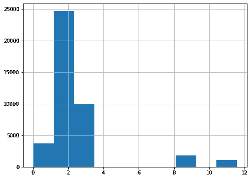

c)转换列- Nr_employed

```
logarithm_transformer = FunctionTransformer(lambda x: x ** 2, validate=True)
logarithm_transformer.fit(X[['nr_employed']])
X['nr_employed'] = logarithm_transformer
                   .transform(X[['nr_employed']])
X['nr_employed'].hist()
```

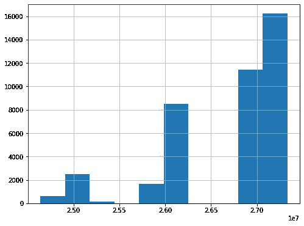

## 步骤 03 —应用合适的特征离散化

特征离散化是指将特征或变量的连续值划分或转换为离散化的或标称的特征或区间的过程。

在这里，我为年龄特征创建了 bin。因为我们可以把 10 岁到 30 岁的年轻人归为一类。

```
bins = [18, 30, 40, 50, 60, 70, 120]
labels = ['18-29', '30-39', '40-49', '50-59', '60-69', '70+']
X['age'] = pd.cut(X['age'], bins, labels = labels,include_lowest = True)
```

## 步骤 04 —应用合适的特征编码技术

ML 模型要求所有输入和输出值都应该是数字。因此，如果数据集包含分类数据，您必须在拟合和评估模型之前将其编码为数字。有几种方法可以完成这项任务，如一键编码、整数(标签)编码。这里我使用了一键编码

```
cols = X.columns
num_cols = X._get_numeric_data().columns
cat_cols=  list(set(cols) - set(num_cols))add_cat = ['pdays','previous','campaign']
for x in add_cat:
    cat_cols.append(x)for col in X[cat_cols]:
    print(col,"--->",X[col].unique())
    print("")
```

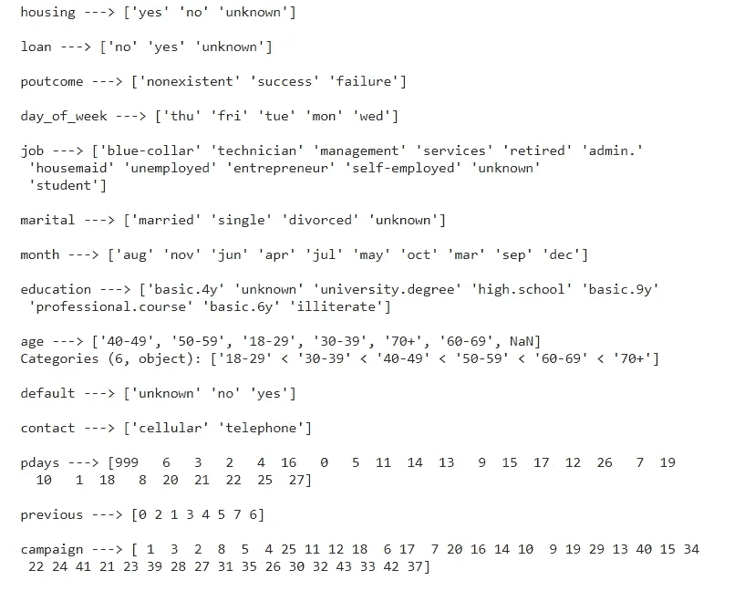

```
for col in X[cat_cols]:
   print(col+'-Values ')
   print(X[col].value_counts())
   print("")
```

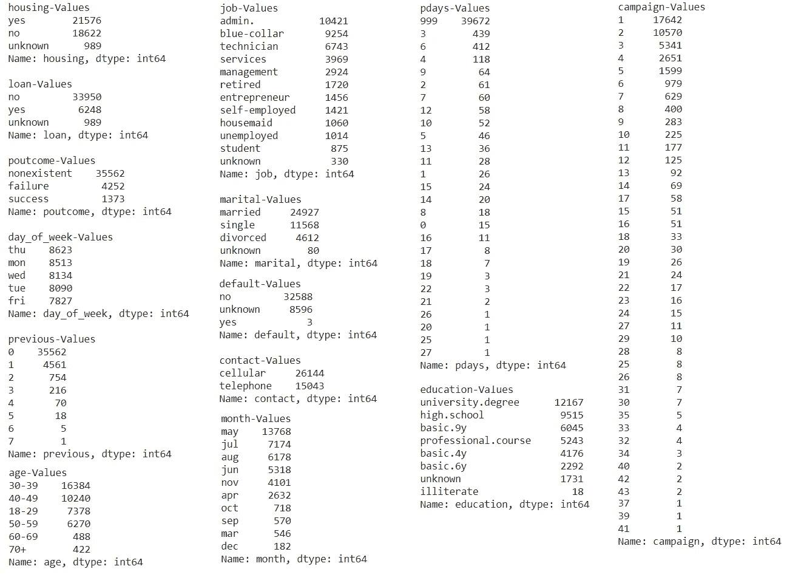

从上图中，您可以看到数据集中可用的唯一值和这些值的计数。

```
X = X.drop(['default'], axis = 1)cat_cols.remove('default')from sklearn.preprocessing import LabelEncoder
labelencoder =LabelEncoder()dummies= []for col in X[cat_cols]:
   temp_dummies = pd.get_dummies(X[col],prefix=col)
   dummies += (temp_dummies.columns.to_list())
   X=pd.concat([X, temp_dummies], axis=1)
   X = X.drop(col, axis = 1)print(dummies)
```

从下图中，你可以看到数据集中创建的假人。

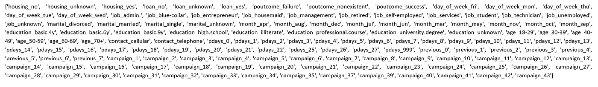

```
xa_Encode = X.copy()xa_Encode.isnull().sum()
```

通过使用上面的代码，我检查了数据集中的空值，以便进行缩放。

## 步骤 05-缩放和/或标准化特征

数据标准化是重新调整一个或多个要素的方式，以便它们的平均值为 0，标准差为 1。标准化假设您的数据具有高斯(钟形曲线)分布。但这并不一定是真的，但如果你的特征值分布属于高斯分布，这种技术被认为是更有效的。

通过下面的代码，我删除了数据集中的分类变量来进行缩放。

```
Remove_columns_values = dummies
Remove_columns_values.append('y')
X_without_Cat=X.drop(Remove_columns_values, axis = 1)
X_without_Cat.head()
```

移除分类特征后的数据集输出，

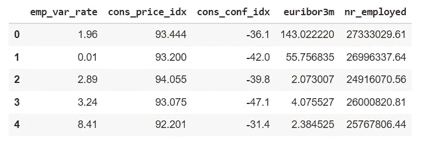

我已经使用 sklearn.preprocessing 的 StandardScaler 对上面的数据集进行了扫描，我已经在下面的代码中展示了这一点。

```
from sklearn.preprocessing import StandardScaler
scaler = StandardScaler()
scaler.fit(X_without_Cat)
X_Scaled = scaler.transform(X_without_Cat)columns_value_new=X_without_Cat.columns
X_Scaled_Except = pd.DataFrame(X_Scaled, columns=columns_value_new)X_Scaled_Except.head(5)
```

缩放后数据集的输出，

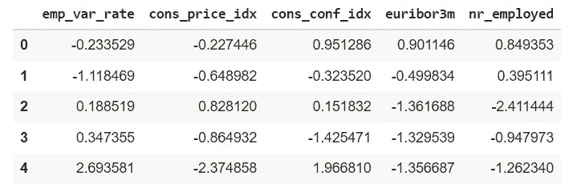

```
plt.rcParams["figure.figsize"] = (24, 12)X_Scaled_Except.hist()
```

我用上面的代码制作了相关的图表来展示缩放/标准化的效果。

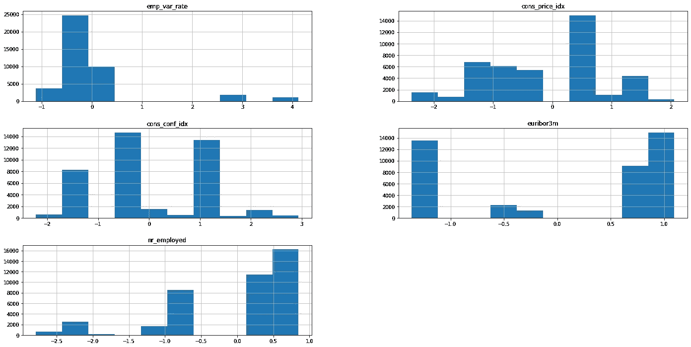

```
data_Final =X_Scaled_Exceptfor f in dummies:
     data_Final = data_Final.join(xa_Encode[f])
```

通过使用上面的代码，我已经将分类值加入到缩放数据集。

## 步骤 06 —相关矩阵和主成分分析(PCA)

通过以下代码，我们可以生成给定数据集的相关矩阵，

```
import seaborn as sns
plt.rcParams["figure.figsize"] = (24, 8)
sns.heatmap(X_Scaled_Except.corr(),annot=True); 
#Seems they can be assuemed as independent
```

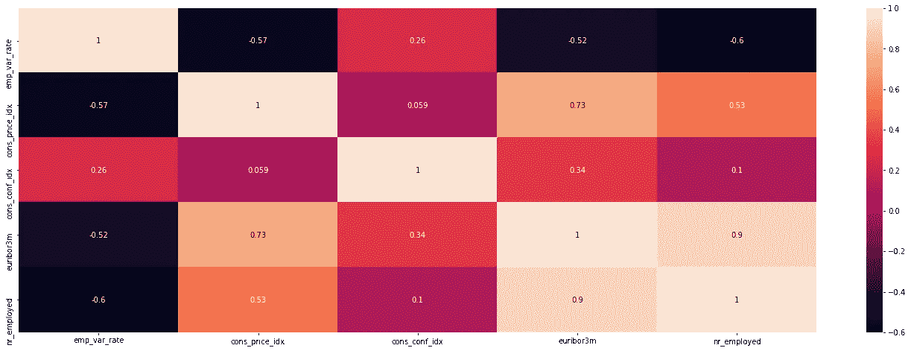

通过观察上图和下图，我们可以说 nr_employed 和 euribor3m 具有很高的相关性。但有一些相当大的差异，所以可以保持原样。

```
X_Scaled_Except.corr()
```

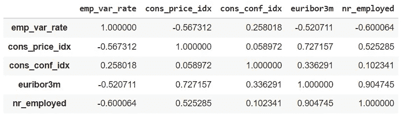

通过下面的代码，我们可以看到与目标变量 Y 的相关性。

```
X_Scaled_Except['y']=xa_Encode['y']plt.rcParams["figure.figsize"] = (24, 8)sns.heatmap(X_Scaled_Except.corr(),annot=True);
```

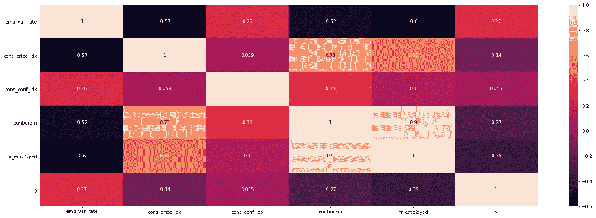

通过查看上面的相关矩阵和下面的表值，我们可以得出结论，与其他特征相比，cons_conf_idx 与 y 的相关性非常低。这是一个消费者信心指数，是月度指标。员工信心指数是衡量员工对经济、他们的雇主以及他们寻找其他工作的能力的整体信心。因此，预测客户是否会认购定期存款是我们必须考虑的重要问题。所以我没有移除它。

```
X_Scaled_Except.corr()
```

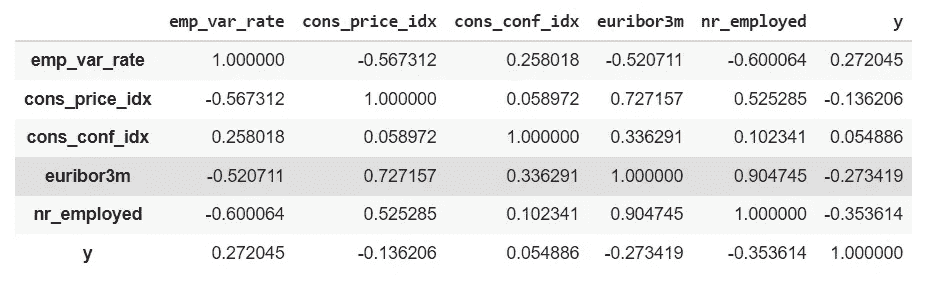

```
Y=data_Final['y']data_Final_without_Y = data_Final.drop('y', axis = 1)
```

按照上面的代码，我放弃了目标变量 Y 来进行主成分分析。

## 主成分分析

主成分分析(PCA)是一种降维方法，通常用于降低大型数据集的维数，方法是将一个大型变量集转换为一个较小的变量集，该变量集仍包含大型数据集中的大部分信息。

```
from sklearn.decomposition import PCApca = PCA(n_components=30)pca.fit(data_Final_without_Y)
X_PCA = pca.transform(data_Final_without_Y)
#X_pca_test = pca.transform(X_test)
X_PCA = pd.DataFrame(data = X_PCA)pca.explained_variance_ratio_[:30].sum()
```

通过将维数减少到 30，我得到的总方差为 0.93，因此足以进行平衡步骤。

通过使用下面的代码，我将数据集分成 20%用于测试，80%用于使用 sklearn.model_selection 中的 train_test_split 进行训练

```
from sklearn.model_selection import train_test_splitX_class_train, X_test, y_class_train, y_test = train_test_split(data_Final_without_Y, Y, test_size=0.2, random_state=0)
```

## 步骤 07 —检查班级失衡并处理班级失衡

大多数机器学习算法都假设数据是均匀分布的。因此，当我们在数据集中存在类别不平衡时，机器学习分类器往往会更偏向于多数类别，导致少数类别的错误分类。所以我们应该检查和处理这些问题。

通过下面的代码，我们可以通过绘制目标数据分类值计数来检查类别不平衡。

```
import seaborn as sns
plt.rcParams["figure.figsize"] = (8, 6)
data_Final['y'].value_counts()
sns.countplot(x='y', data=data_Final)
plt.show()
```

从上面的图中我们可以看到，我们的数据集数据类不平衡。所以我用过 SMOTE。也许最广泛使用的合成新示例的方法是合成少数过采样技术，简称 SMOTE。该过程可用于根据需要为少数类创建尽可能多的合成示例。

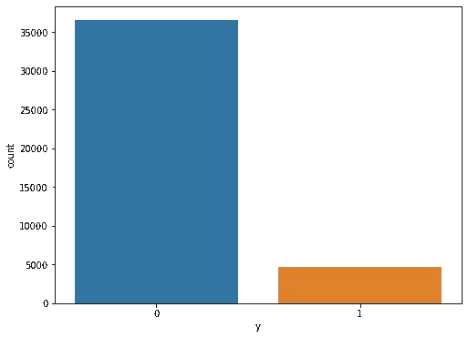

有两种取样技术。一种是欠采样技术，即去除多数类点的欠采样技术。另一种是过采样技术，过采样技术是指创建人为的少数类点。

```
from imblearn.over_sampling import SMOTEos = SMOTE(random_state=0)
columns = X_class_train.columns
data_X, data_y = os.fit_sample(X_class_train, y_class_train)
smoted_X = pd.DataFrame(data=data_X,columns=columns )
smoted_y = pd.DataFrame(data=data_y,columns=['y'])
```

通过下面的代码，我们可以看到只对训练数据集应用 SMOTE 后的输出。我们不应该增加测试数据集。当使用任何专门的合成采样技术时，如 SMOTE，您应该首先划分您的数据，然后仅对训练数据应用合成采样。训练后，您可以使用只包含原始样本的测试集进行评估。

```
sns.countplot(x='y', data=smoted_y)
plt.show()
```

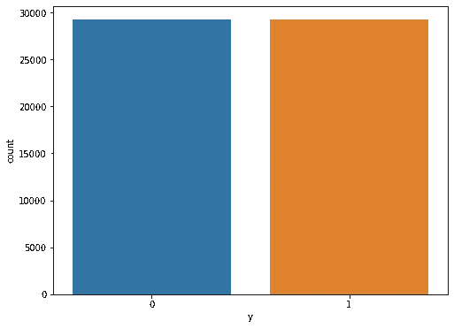

```
X_train = smoted_X
y_train = smoted_y
X_test
y_test
```

## 步骤 08 —应用支持向量机(SVM)

SVM 是一种监督机器学习方法，其中 y 是分类的和二进制的。在这里，我使用了 sklearn 库中的 svm 进行训练和测试。

```
from sklearn import svm
from matplotlib import pyplot as plt
%matplotlib inline
```

这里的核可以是 rbf、poly 或 sigmoid。但是在尝试了不同的核之后，我选择了 rbf 来进行模型训练。径向基核是在机器学习中用于寻找非线性分类器或回归线的核函数。

c 是 SVM 正则化参数。我选择了 70 作为 c。

gamma 是“rbf”、“poly”和“sigmoid”的核心系数。当 gamma 的值增加时，它将尝试精确地拟合每个训练数据集。通过试验，我选择了 0.001

```
svc = svm.SVC(kernel='rbf', C=70, gamma=0.001).fit(X_train,y_train)
predictionsvm = svc.predict(X_test)
from sklearn.metrics import classification_report
print(classification_report(y_test,predictionsvm))
```

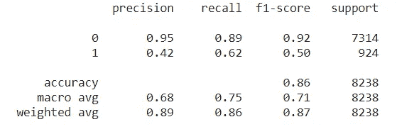

以上输出是模型的分类报告。我已经在这篇文章的结尾解释了上面的报告。

```
predictionsvm = svc.predict(X_test)
percentage = svc.score(X_test,y_test)
percentage      #0.8614955086185967
```

从上面的代码输出中，我们可以看到模型的整体预测准确性。但我们不能只从整体预测精度来评价该模型。所以也要对照分类报告来做研究。

```
from sklearn.metrics import plot_confusion_matrix
plt.rcParams["figure.figsize"] = (8, 10)
fig=plot_confusion_matrix(svc, X_test, y_test,display_labels=["0",'1'],cmap=plt.cm.Blues,values_format = '.2f')fig.figure_.suptitle("Confusion Matrix ")
plt.show()
```

通过使用上述代码，我们可以为开发模型的结果绘制混淆矩阵。

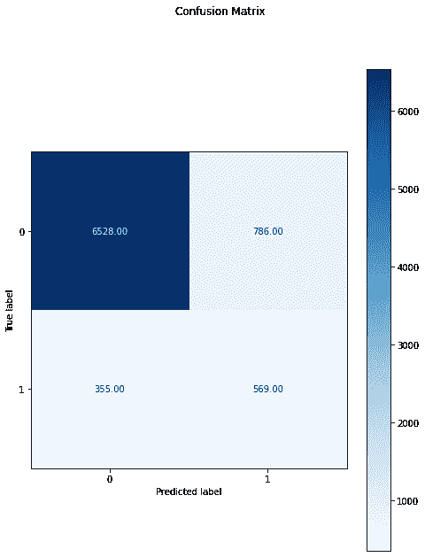

上面的图像和分类报告显示了我们开发的模型。真阳性计数高于假阳性计数。实际上，这意味着我们的模型确实表现不好，但对于 yes 分类来说相当可观。您可以看到 1(是)类的精度是 0.42。与 0(无)级相比，该值较低。以上结果是应用 SMOTE 后的结果。作为总结我们可以看到，我们的模型有 0.68 的宏观平均精度和 0.89 的加权平均精度。