# 使用基本 ML 技术分析 ChEMBL 新冠肺炎数据集

> 原文：<https://medium.com/nerd-for-tech/analysis-of-chembl-covid-19-dataset-using-basic-ml-techniques-c89a6b79088a?source=collection_archive---------0----------------------->

本文旨在用 python 语言建立传统的机器学习模型，如随机森林和线性回归，以从 ChEMBL 数据集预测分子的生物活性值。

# **你将学到什么**

*   如何使用 [ChEMBL Python API](https://github.com/chembl/chembl_webresource_client) 进行数据收集
*   利平斯基描述符的实际应用。
*   使用 *rdkit python 库*

# 安装所需的库

```
pip install pandas
pip install np
pip install matplotlib
pip install sklearn
pip install chembl_webresource_client
pip install seaborn##Now in order to install *rkdit* use 
conda install -c conda-forge rdkit
```

如果您遇到任何错误，请访问[此链接。](http://www.rdkit.org/docs/Install.html#installation)

还有，注意你必须有 python 2.7-3.6 版本；否则 rkdit 就不行了。

# 导入库

```
*a and for One-Hot Encoding*
**import** **numpy** **as** **np** *# numpy is used to calculate the mean and standard deviation*
**import** **matplotlib.pyplot** **as** **plt** *# matplotlib is for drawing graphs*
**import** **matplotlib.colors** **as** **colors**
**from** **sklearn.model_selection** **import** train_test_split *# split  data into training and testing sets*
**from** **sklearn.preprocessing** **import** scale *# scale and center data*
**from** **sklearn.svm** **import** SVC *# this will make a support vector machine for classificaiton*
**from** **sklearn.model_selection** **import** GridSearchCV *# this will do cross validation*
**from** **sklearn.metrics** **import** confusion_matrix *# this creates a confusion matrix*
**from** **sklearn.metrics** **import** plot_confusion_matrix *# draws a confusion matrix*
**from** **sklearn.decomposition** **import** PCA *# to perform PCA to plot the data*
**from** **rdkit** **import** Chem
**from** **chembl_webresource_client.new_client** **import** new_client
**from** **chembl_webresource_client** **import** *
**from** **collections** **import** Counter
**from** **operator** **import** itemgetter
**from** **chembl_webresource_client.new_client** **import** new_client
**from** **rdkit** **import** Chem
**from** **rdkit.Chem** **import** Descriptors, Lipinski
**import** **seaborn** **as** **sns**
**from** **scipy.stats** **import** skew
**import** **pandas_profiling**
%matplotlib inline
**from** **sklearn.ensemble** **import** RandomForestRegressor
*# data visualization*
**import** **seaborn** **as** **sns**
%matplotlib inline
**from** **matplotlib** **import** pyplot **as** plt
**from** **matplotlib** **import** style

*# Algorithms*
**from** **sklearn** **import** linear_model
**from** **sklearn.linear_model** **import** LogisticRegression
**from** **sklearn.ensemble** **import** RandomForestClassifier
**from** **sklearn.linear_model** **import** Perceptron
**from** **sklearn.linear_model** **import** SGDClassifier
**from** **sklearn.tree** **import** DecisionTreeClassifier
**from** **sklearn.neighbors** **import** KNeighborsClassifier
**from** **sklearn.svm** **import** SVC, LinearSVC
**from** **sklearn.naive_bayes** **import** GaussianNB
```

# 数据收集

在本节中，我已经解释了如何使用 ChEMBL API 从 ChEMBL 数据库中为您的模型收集相关数据，即*chem bl _ web resource _ client*

首先，您必须下载一个[样本数据集](https://github.com/AslanDevbrat/Covid-Drug-Discovery/blob/master/covid.csv)。让我谈谈这个数据集。从 [ChEMBL 官网](https://www.ebi.ac.uk/chembl/g/#browse/compounds/filter/_metadata.compound_records.src_id%3A52)下载。这是一个由 6900 个与新冠肺炎相关的分子组成的数据集，这些分子具有它们的内在属性，如*“名称”、“同义词”、“类型”、“最大相位”、“RO5 违例数”、“可旋转键数”、“CX ApKa”、“CX BpKa”、“结构类型”、“无机标志”、“RO5 违例数(Lipinski)”、“分子量(单同位素)”、“分子种类”、“分子式”、“通过 Ro3”、“分子量”、“目标”、“生物活性”、“QED 加权”、“CX LogP”、“CX LogD”、“芳香环”、“重原子”、“HBA Lipinski”、“HBD Lipinski”*

**不要惊慌**我们只对几列感兴趣，即*“微笑”、“化学标识”、“阿洛普”、“HBD”、“HBA”、“PSA”、“分子量”…*

您可以使用以下代码处理数据集；它将*微笑*转化为他们的结构性表征。这部分是可选的。

```
df = pd.read_csv('covid\covid.csv',sep=';')

m =Chem.MolFromSmiles(df['Smiles'][1])
m
```

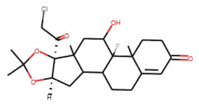

图一

```
m =Chem.MolFromSmiles(df['Smiles'][2098])
m
```

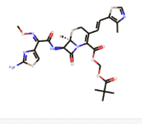

图 2

```
m =Chem.MolFromSmiles(df['Smiles'][34])
m
```

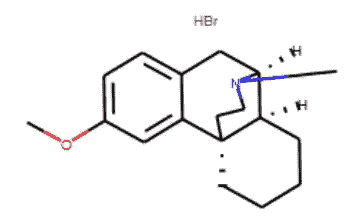

图 3

```
m =Chem.MolFromSmiles(df['Smiles'][61]) 
m
```

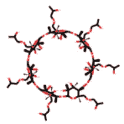

图 4

```
m =Chem.MolFromSmiles(df['Smiles'][60])
m
```

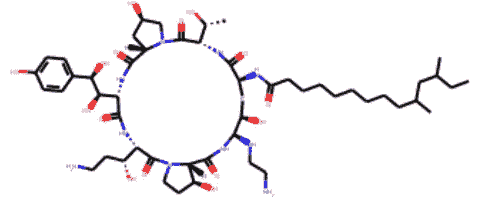

图 5

我们的目标变量是'**生物活性**，'在数据集中有一列，但它实际上不是实际的生物活性值。相反，它只是一个分子具有的生物活性数量的频率。所以这里棘手的部分是**如何获得正确的生物活性值？**

生物活性有几种类型，但我们感兴趣的是标准类型" **ic50"** 和标准单位" **nM。**”

*以下函数使用 chembl 的 API 检索具有所需标准类型和标准单位的分子的生物活性。这里为了简单起见，我将 standard_units 的值硬编码为‘nM’。
这个函数从互联网上取值需要相当长的时间。*

```
*Argument:*
 *chembl_id : chemble id of the molecule*
 *standard_type : IC50, ec50 etc*

 *return:* 
 *A (chembl_id, Bioactivity of the molecule)-tuple*
*"""*
**def** get_standard_value(chembl_id, standard_type):
    records = new_client.activity.filter(molecule_chembl_id=chembl_id).filter(standard_units='nM').filter(standard_type=standard_type)
    df = pd.DataFrame.from_dict(records)
    **if** len(df)>0:
        **return** (chembl_id,df['standard_value'][0])
```

上面声明的函数是从下面的代码调用的。这里我们在数据帧的包含 chembl ids 的列上有一个循环。为每个 id 调用上面的函数，上面的函数检查对于那个 chembl_id 是否存在所要求的值。如果是，则返回 chembl_id 和生物活性值的元组。

```
x_list = list()
i=1
**for** chem_id **in** df['ChEMBL ID']:
    f=get_standard_value(chem_id,'IC50')
    **if** f!= **None**:
        x_list.append(f)
        print(x_list[-1])
        print(f"**{**i**}**/**{**len(df['ChEMBL ID'])**}**")
    i+=1
    print('----------------')
```

在上面的循环中，我们需要一些时间，所以我已经把我的[文件保存在](https://github.com/AslanDevbrat/Covid-Drug-Discovery/blob/master/bioactivity.csv)这里了。

现在我们必须检查刚刚取出的化合物，它们和**是否激活**。最简单的方法是检查我们之前获取的标准值是否小于 1000。如果超过 1000，那么分子对我们就没用了。

```
i=0
**for** num **in** sd['standard_value']:
    **if** num<=1000:
        i+=1
print(f"Number of the active class is **{**i**}**")>>>Number of the active class is 502
```

# 特征选择

包含 CHembl ID、Alogp、HBD、HBA、Smiles 的列是我们感兴趣的列。因此，我们将删除所有其他列。

```
new_df = df.drop(['Name','Synonyms','Type','Max Phase','#RO5 Violations','#Rotatable Bonds','CX ApKa','CX BpKa','Structure Type','Inorganic Flag','#RO5 Violations (Lipinski)','Molecular Weight (Monoisotopic)','Molecular Species','Molecular Formula','Passes Ro3','Molecular Weight','Targets','Bioactivities','QED Weighted','CX LogP','CX LogD','Aromatic Rings','Heavy Atoms','HBA Lipinski','HBD Lipinski'],axis=1).copy()
new_df.head()
```

以下是生成的数据帧:

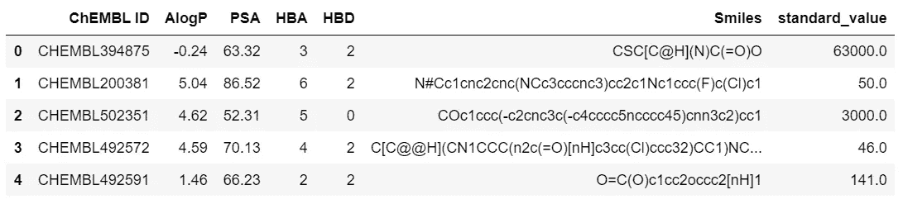

在 ChEMBL ID 列上合并以下两个 CSV 文件:

*   covid.csv
*   生物活性. csv


最终 _df

# 数据预处理

这样做的目的是删除任何列包含“none”、“Nan”或“None”的行

## 检查 final_df 中的 None 值

从 HBD 列中删除 none、Nan、None 值

```
print('Unique value in HBD column',final_df['HBD'].unique())>>>Unique value in HBD column ['2' '0' '1' '5' '3' '4' '12' 'None' '9' '6' nan '7' '8' '10' '11']final_df = final_df.replace(['None','NONE','none'],np.nan)
final_df = final_df.dropna()
print('Unique value in HBD column',final_df['HBD'].unique())
len(final_df)>>>Unique value in HBD column ['2' '0' '1' '5' '3' '4' '12' '9' '6' '7' '8' '10' '11']
>>>989
```

现在让我们检查一下 *Alog* 列是否没有 none、Nan 或 None 值。

```
print('Unique value in AlogP column',final_df['AlogP'].unique())
```

幸运的是，AlogP 没有空值，所以不需要删除行。

删除 PSA 列中包含 none、Nan、None 值的行

```
print('Unique value in PSA column',final_df['PSA'].unique())
```

PSA 没有空值，因此不需要删除该行。

# 计算 Lipinski 描述符

辉瑞公司的科学家 Christopher Lipinski 提出了一套评估化合物药物相似性的经验法则。这种药物相似性是基于吸收、分布、代谢和排泄(ADME)，也称为药代动力学特征。Lipinski 分析了所有 FDA 批准的口服活性药物，以制定所谓的**五法则**或 **Lipinski 法则**。

利平斯基的规则陈述如下:

*   分子量< 500 道尔顿
*   辛醇-水分配系数(LogP) < 5
*   氢键给体< 5
*   氢键受体< 10

# 用李平斯基法则计算分子量

我们将使用利普斯基法则，只得到那些活性化合物的分子量，这意味着它们有摩尔。重量< 500 道尔顿

```
# Inspired by: [https://codeocean.com/explore/capsules?query=tag:data-curation](https://codeocean.com/explore/capsules?query=tag:data-curation)def lipinski(smiles, verbose=False):moldata= []
    for elem in smiles:
        mol=Chem.MolFromSmiles(elem) 
        moldata.append(mol)

    baseData= np.arange(1,1)
    i=0  
    for mol in moldata:        

        desc_MolWt = Descriptors.MolWt(mol)
        #desc_MolLogP = Descriptors.MolLogP(mol)
        #desc_NumHDonors = Lipinski.NumHDonors(mol)
        #desc_NumHAcceptors = Lipinski.NumHAcceptors(mol)

        row = np.array([desc_MolWt,
                      ])   

        if(i==0):
            baseData=row
        else:
            baseData=np.vstack([baseData, row])
        i=i+1      

    columnNames=["MW"]   
    descriptors = pd.DataFrame(data=baseData,columns=columnNames)

    return descriptorsdf_lipinski = lipinski(final_df.Smiles)
df_lipinski.head()
```

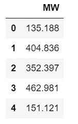

df _ 利平斯基

合并 mol。根据我们之前的数据进行加权

```
final_df_combined = pd.concat([final_df, df_lipinski],axis=1)
final_df_combined.head()
```

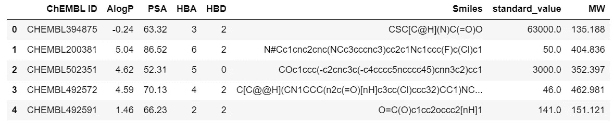

最终 _ df _ 组合

删除包含 MW 为 None，Nan …的行。

```
final_df_combined = final_df_combined.replace(['None','NONE','none'],np.nan)
final_df_combined = final_df_combined.dropna()
#print('Unique value in MW column',final_df_combined['MW'].unique())
len(final_df_combined)>>>978
```

# 将 IC50 转换为 pIC50

为了让 **IC50** 数据分布更加均匀，我们将 **IC50** 转换为负对数刻度，这是必不可少的 **-log10(IC50)** 。

这个自定义函数 pIC50()将接受一个数据帧作为输入，并将:

*   从`standard_value`栏中取出 IC50 值，通过将该值乘以 1099，将其从 nM 转换为 M
*   取摩尔值并应用-log10
*   删除`standard_value`列并创建一个新的`pIC50`列

```
import numpy as npdef pIC50(input):
    pIC50 = []for i in input['standard_value_norm']:
        molar = i*(10**-9) # Converts nM to M
        pIC50.append(-np.log10(molar))input['pIC50'] = pIC50
    x = input.drop('standard_value_norm', 1)

    return xdef norm_value(input):
    norm = []for i in input['standard_value']:
        if i > 100000000:
          i = 100000000
        norm.append(i)input['standard_value_norm'] = norm
    x = input.drop('standard_value', 1)

    return x
```

我们将首先应用 norm_value()函数来规范化 standard_value 列中的值。

```
df_norm = norm_value(final_df_combined)
df_norm
```

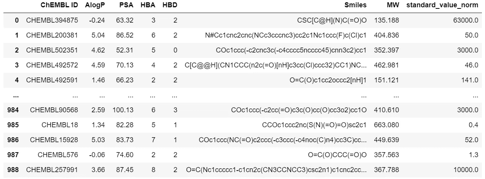

df_norm

最终确定数据框架

```
df_final = pIC50(df_norm)
df_final
```

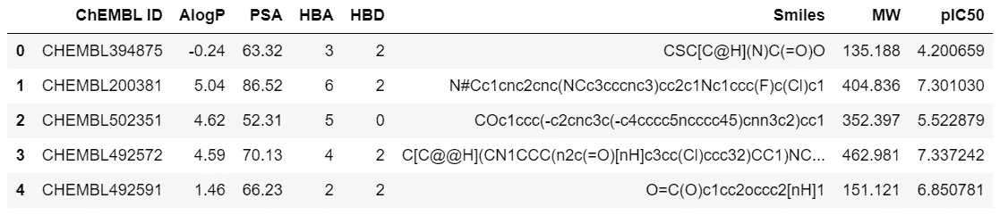

df_final

请注意，pIC50 列替换了 IC50 列。

# 数据可视化

**特征与生物活性的关系**

下图显示了 ALogP、PSA 与 pIC50 值的关系。

**注意:由于 seaborn 库中的错误，第一个图是空白的。**你可以在这里查看[。](https://github.com/mwaskom/seaborn/issues)

```
sns.pairplot(df_final, x_vars=['AlogP','AlogP','PSA'], y_vars='pIC50', height=7, aspect=0.7);
```

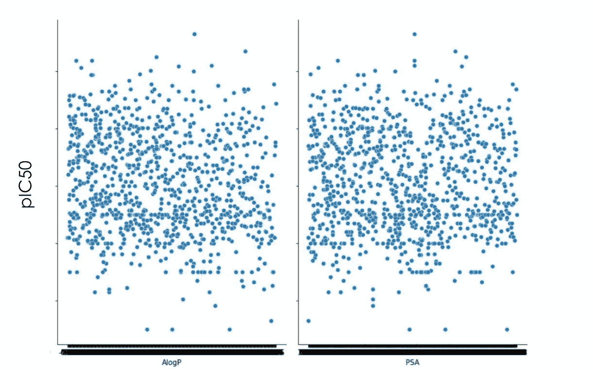

下图显示了 HBD、HBA、MW 与 pIC50 值的关系。

```
ns.pairplot(df_final, x_vars=['AlogP','HBD','HBA','MW'], y_vars='pIC50', height=7, aspect=0.7);
```

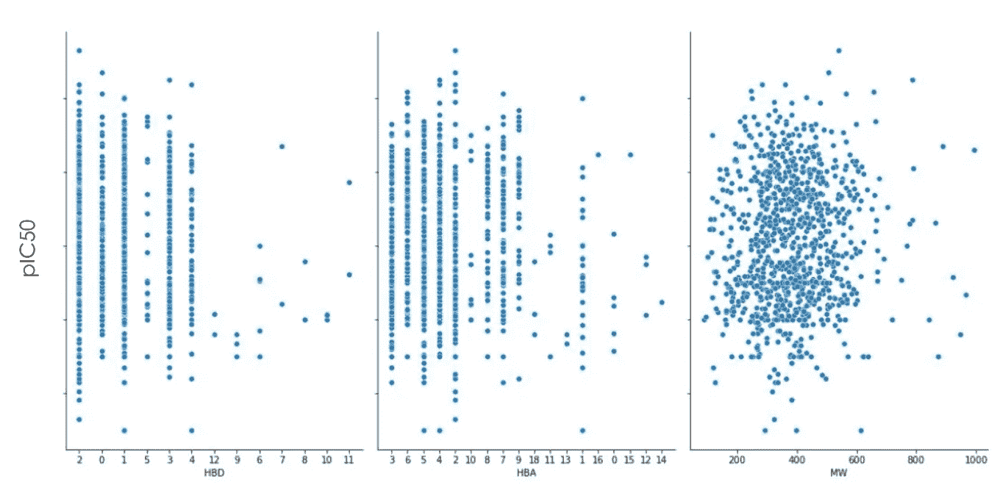

# 生成数据的详细报告

下面的单元格包含数据的详细报告，如每个特征、计数、空单元格等之间的关系

```
df_final.profile_report(title="Data Report")
profile = pandas_profiling.ProfileReport(df_final) 
profile.to_file("Data Report.html")
```

上述命令将创建一个包含数据详细分析的 HTML 文件；你可以从[这里](https://github.com/AslanDevbrat/Covid-Drug-Discovery/blob/master/Data%20Report.html)下载那个文件。请在进一步移动之前检查一次。下面也是 Phik 相关性

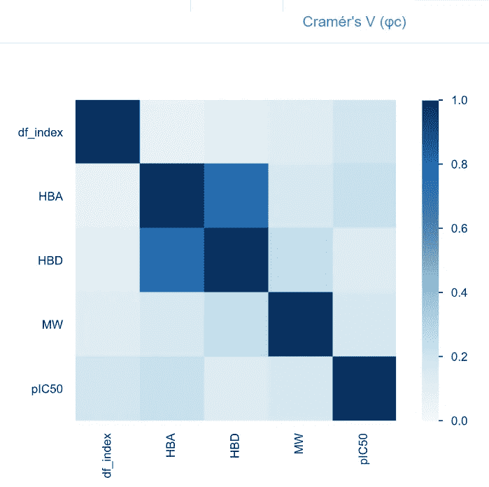

相互关系

***形成以上所有图形；很容易看出 pIC50 和其他特征之间没有明确的线性多项式关系。***

# 应用不同的模型

## 多元线性回归

```
from sklearn.linear_model import LinearRegression
feature_cols = ['AlogP','HBA','HBD','MW','PSA']
X = df_final[feature_cols]
y = df_final.pIC50# instantiate and fit
lm1 = LinearRegression()
lm1.fit(X, y)# print the coefficients
print(lm1.intercept_)
print(lm1.coef_)# pair the feature names with the coefficients
list(zip(feature_cols, lm1.coef_))
```

以下是输出:

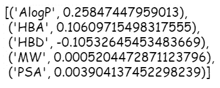

列表(zip(feature_cols，lm1.coef_))

以上结果的意义是

***生物活性=(0.25 * a logp)+(0.106 * HBA)——(0.105 * HBD)+(0.00052 * MW)+(0.0039 * PSA)***

但是这种方法在训练数据集本身上效率不高，这与我们在上面的图表中看到的直觉有些相似。

# 线性回归

```
from sklearn.model_selection import train_test_split
from sklearn.metrics import mean_squared_errorX_train, X_test, y_train, y_test = train_test_split(X, y, random_state = 1)lm4 = LinearRegression()
lm4.fit(X_train, y_train)
lm4_preds = lm4.predict(X_test)print("RMSE :", np.sqrt(mean_squared_error(y_test, lm4_preds)))
print("R^2: ", r2_score(y_test, lm4_preds))from yellowbrick.regressor import PredictionError, ResidualsPlot
visualizer = PredictionError(lm4)visualizer.fit(X_train, y_train)  # Fit the training data to the visualizer
visualizer.score(X_test, y_test)  # Evaluate the model on the test data
visualizer.poof()visualizer = ResidualsPlot(lm4)
visualizer.fit(X_train, y_train)  
visualizer.score(X_test, y_test) 
visualizer.poof()
```

这一次，我尝试将数据集分为训练数据集和测试数据集，并尝试进行线性拟合。即使在这种方法中，测试数据集上的 r2 分数是 0.12，这证实了线性模型不能适合该数据集。下面是一些与这种方法相关的图表

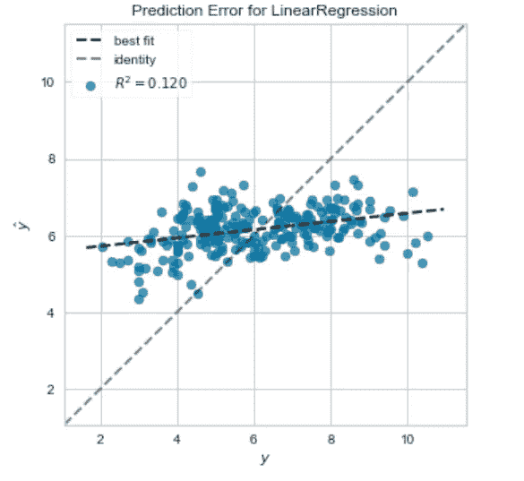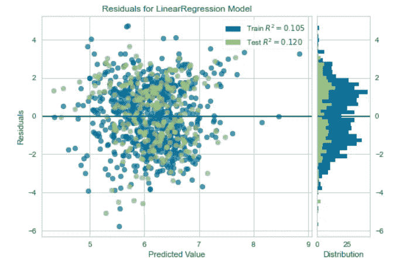

现在到了最后一部分

# 帕德尔描述符

我已经使用 padel.sh 和一个 zip 文件夹计算了 PaDEL 描述符。要首先获得 PaDEL 描述符，您必须创建。只包含 Smile 和 CHEMBL_id 的 smi 文件。一旦有了这个文件，就需要在工作目录中有 padel.sh 和解压后的 padel 文件夹。然后运行 padel.sh 终端。一旦完成，这将需要一些时间；您将在工作目录中找到一个“descriptors_output.csv ”;它看起来会像这样。

```
df_final.to_csv(r'extracted_data.csv', index = False)
df3 = pd.read_csv('extracted_data.csv')
df3.head()
```

制作一个以 Smiles 和 Chenmbl_id 为两列的 molecule.smi 文件

```
selection = ['Smiles','ChEMBL ID']
df3_selection = df3[selection]
df3_selection.to_csv('molecule.smi', sep='\t', index=False, header=False)df3_X = pd.read_csv('descriptors_output.csv')
df3_X.head(-5)
df_final2=pd.merge(df_final, df3_X, on='ChEMBL ID')
df_final2.head()
df3_X = df_final2.drop(columns=['ChEMBL ID','AlogP','PSA','HBD','HBA','Smiles','MW','pIC50'])
df3_X.head()
df3_Y = df_final2['pIC50']
df3_Ydataset3 = pd.concat([df3_X,df3_Y], axis=1)
dataset3.head(-10)dataset3 = dataset3.dropna()dataset3.head()
```

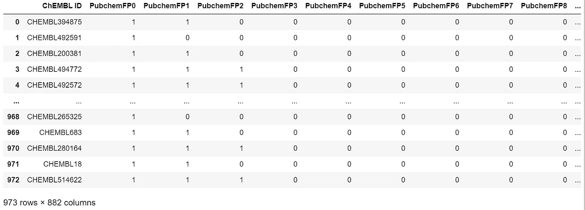

数据集 3

现在，我已经使用 dataset3 应用了 **RandomForestRegressor** ，得到了 **0.62，**的分数，这相当不错。

# 随机森林回归量

```
X_train, X_test, Y_train, Y_test = train_test_split(df3_X, df3_Y, test_size=0i=0
for i in range(10):
    model = RandomForestRegressor(n_estimators=100)
    model.fit(X_train, Y_train)
    r2 = model.score(X_test, Y_test)
    #print(r2)
    i+=1
Y_pred = model.predict(X_test)
print('R2 score of this model is',r2_score(Y_test, Y_pred))import seaborn as sns
import matplotlib.pyplot as pltsns.set(color_codes=True)
sns.set_style("white")ax = sns.regplot(Y_test, Y_pred, scatter_kws={'alpha':0.4})
ax.set_xlabel('Experimental pIC50', fontsize='large', fontweight='bold')
ax.set_ylabel('Predicted pIC50', fontsize='large', fontweight='bold')
ax.set_xlim(0, 12)
ax.set_ylim(0, 12)
ax.figure.set_size_inches(5, 5)
plt.show
```

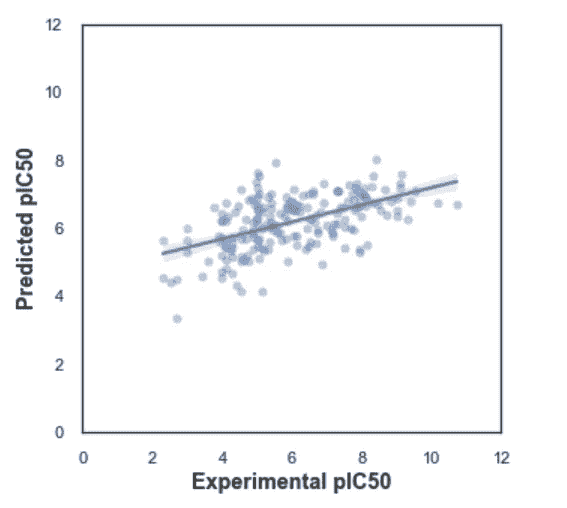

# 结论

与其他方法相比，随机森林回归器工作良好。但是由于描述符和生物活性之间没有明确的关系，传统的方法不足以高精度地预测生物活性，我们需要比传统的机器学习方法更强大的方法，如我们需要 CNN、神经网络或 GANs 来更准确地预测这些值。

你可以从 [Github](https://github.com/AslanDevbrat/Covid-Drug-Discovery) 获得全部代码