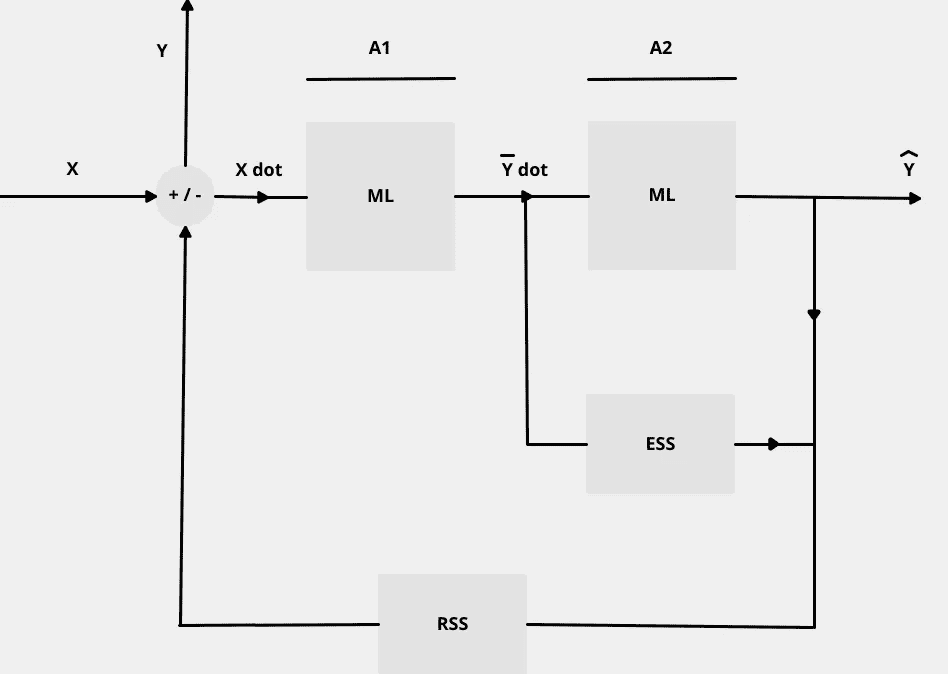
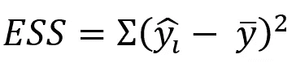
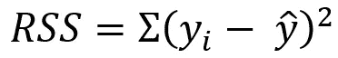
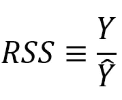
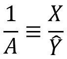
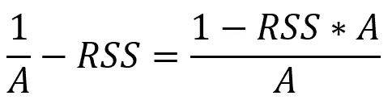
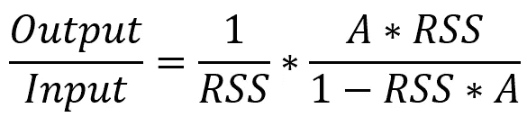
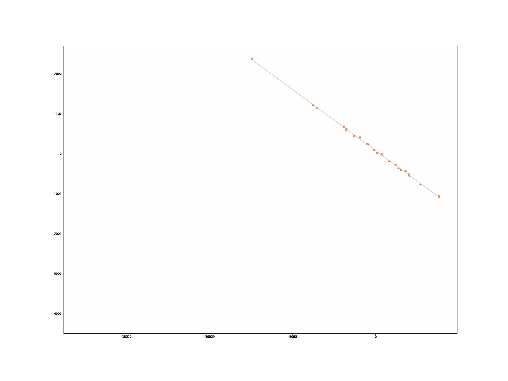

# OLS 回归分析——机器学习算法

> 原文：<https://medium.com/nerd-for-tech/analysis-of-ols-regression-machine-learning-algorithms-783c37d10aa3?source=collection_archive---------10----------------------->

## 普通最小二乘回归解释

# OLS 回归

在[直观解释](https://setosa.io/ev/)中用 [Setosa](https://setosa.io/#/) 直观解释回归技术。我们确实知道 OLS 技术，但是算法的复杂性将在后面的章节中解释。本文比较介绍了 OLS 技术，[简化线性回归——普通最小二乘法与梯度下降](https://towardsdatascience.com/linear-regression-simplified-ordinary-least-square-vs-gradient-descent-48145de2cf76)。

在上面的文章中，我们考虑了普通最小二乘(OLS)的公式化表示，并针对其梯度下降(SGD)实现进行了解释。OLS 回归用于许多分析问题，从**通过观测速度确定星系位置**到**通过房间大小和地段大小确定房价**。它们或者被用于一个特殊的和特定的问题，在那里有一个最小化的错误被执行。这种误差最小化可以通过[批处理](http://www.stengel.mycpanel.princeton.edu/MAE546Seminar16.pdf)和[在线学习](https://pierpaolo28.github.io/blog/blog57/)来实现。

## 状态空间方程对分析的解释

> 数据中的错误影响问题和解决方案的群体动力，而数据中的关系影响问题和解决方案的行为。

在状态空间方程中，有的问题表现为稳态，有的问题表现为瞬态方程。

该状态空间模型的内部状态可以与以下各项进行比较:

**LR 通过渐变下降—** [**来源**](https://towardsdatascience.com/linear-regression-simplified-ordinary-least-square-vs-gradient-descent-48145de2cf76)

**线性回归的状态空间模型(OLS)**

如上所述，可以将 X 点等同于线性回归梯度下降的迭代步骤。但是我们不要这样做，在这样一个等式中会变得复杂。我们来弄清楚这个状态空间模型的传递函数是什么。

## 获得传递函数

图中的 ESS 和 RSS 分别对应解释的平方和和残差平方和。它们被写成:

解释的平方和是预测值和平均值之间的平方差

残差平方和是实际值和预测值之间的平方差

现在，总平方和大约等于解释和残差之和，因为总平方和是净误差，代表实际值和平均值之间的平方差。

这里，RSS(残差平方和)是随机梯度下降中的一种梯度技术，它从输出映射到输入。因此，方程组的传递函数可以写成:

让我们找出当它们被奇异地从连接中取出时的传递函数。

**传递函数:RSS 相当于 y 和ŷ的关系，传递函数 1/A 相当于 x 和ŷ的关系，求反，因为它们方向相反**

> 传递函数参数 A 从输入映射到输出，而 RSS 从输出映射到输入。A 也是 x 的系数矩阵β的特征。当您将 RSS 和 A 一起比较以获得并行作用的有效传递函数时，必须进行求逆和求反，以满足箭头方向。

因此，我们可以用下面的等式写出将效率从输入传递到输出的传递函数。

**有趣的是，RHS 是一个无限的几何和**

现在我们已经得到了从输入( **X，Y** )映射到输出( **ŷ)** 的有效传递函数。在下面的实践解释中，我们分析了我们的联系是如何工作的。

## 实用解释

> **在解释 OLS(普通最小二乘法)回归算法的基础上，我考虑了从年降雨量到售出雨伞数量的数据。**

对于沿 X 和 Y 坐标的点的值的每次变化，绘制了 OLS 回归的动画。每当 X 坐标和 Y 坐标改变时，RSS 值改变，斜率随之改变，截距也随之改变。

> 事实上，OLS 回归算法的形状，无论是 2D 或三维或更高维绘图，结果是依赖于斜率，这是依赖于 RSS 值。

**A 代表斜率，RSS 代表各点的 RSS 值**

在人工智能(AI)和心理学中，有两种心理学——发展心理学和社会心理学。RSS 价值观的思维过程类似于心理学后期所关注的群体动力学。前一部分是发展心理学，它致力于了解人类从子宫内到老年阶段的情况。

换句话说，RSS 值的变化影响问题的群体动力学，这也表现为真实值(y)和预测值 **(ŷ).)之间的关系**还必须注意的是，输入特征(x)和预测值 **(ŷ)** 之间的关系是基于历史变化的，这就是为什么当我们向其添加更多数据时，问题会更好地适用于 OLS 回归。

> 数据中的错误影响问题和解决方案的群体动力，而数据中的关系影响问题和解决方案的行为。

## 我是如何创建模拟的