# 情感 Twitter 建模分析(上)

> 原文：<https://medium.com/nerd-for-tech/analysis-of-sentiment-twitter-modeling-part-1-98daf07d2b46?source=collection_archive---------3----------------------->


# **作者动机**

社交媒体成为社区生活的一部分。许多人也使用社交媒体作为交流和社交的手段。除此之外，他们还把它作为自我表达的一种手段(比如他们的活动)。Twitter 是拥有 3.965 亿用户的部分社交媒体之一(【backlinko.com】T2)。

从 2019 年到现在，疫情仍在地球上继续发生。政府正试图通过给每个人注射疫苗来处理新冠肺炎病例。但是许多人通过推特账户表达了这个疫情问题。有些人给出不好的、中性的、正面的回答。

因此，随着人们可以根据 Twitter 帐户用户的声明找到他们得到的回应，它将建立深度学习模型。第一部分，介绍数据分析的一些探索。此外，还将介绍模型的建立和特征的提取。

# 浏览数据集

数据集可以通过这个[链接](https://drive.google.com/drive/folders/1Y1D6OE0vd6-UmDHIFeyoBHqRuTuKwjQD?usp=sharing)和这里[中的代码](https://github.com/chandna70/medium_sentiment_analysis/blob/main/analytical_sentiment_twitter.py)获得。

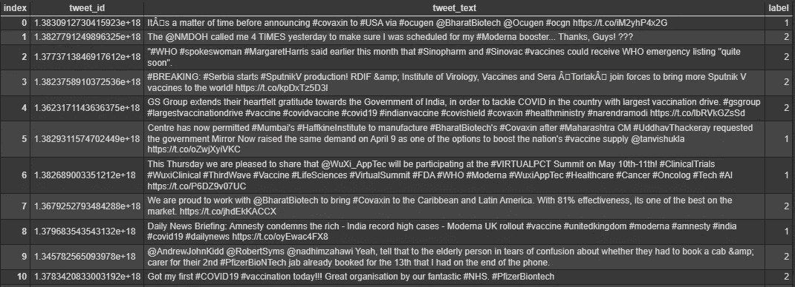

训练数据集

根据上图，有 3 个特征数据，由 **tweet_id** 、 **tweet_text** 和**标签**组成。 **tweet_id** 将从 dateset 中删除，因为 **tweet_id** 是一个帐户用户。从这里开始，我们将关注两个特征数据。两个变量 **tweet_text** 和 **label** 中的每一个都是自变量和因变量。从**标签**看，它由 3 个类别组成。它们是:

*   0:否定回答
*   1:中性反应
*   2:积极响应

让我们看看训练和测试数据的大小

```
##Check data type
print('Size of training data :', len(df_twitter))
print('Size of testing data:',len(df_testing_twitter))
df_twitter.info()
```

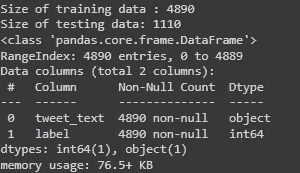

通过这张图可以看出，训练和测试数据的规模分别为 4890 和 1110。对于训练数据，它没有任何空值。变量 **tweet_text** 是对象数据类型。此外，**标签**需要根据类别进行可视化，以确定是否显示不平衡。

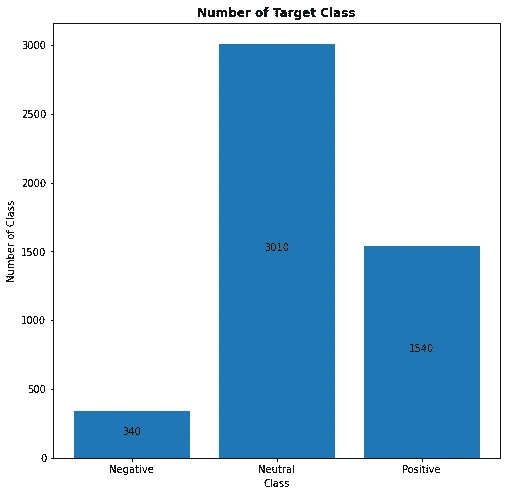

条形图的标签

这张图表表明每一类都显示出不平衡。阴性、中性和阳性反应的百分比分别为 6.95%、61.55%和 31.5%。这听起来像是“中性”反应比其他反应占优势。为了防止这个问题，需要**重量等级**。要确定它的重量等级，公式如下:

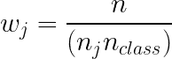

其中:

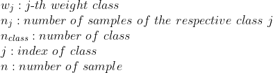

自变量的第一件事， **tweet_text** 将基于单词的长度来描述。

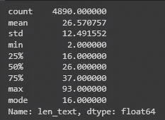

len_text 中的描述性统计数据

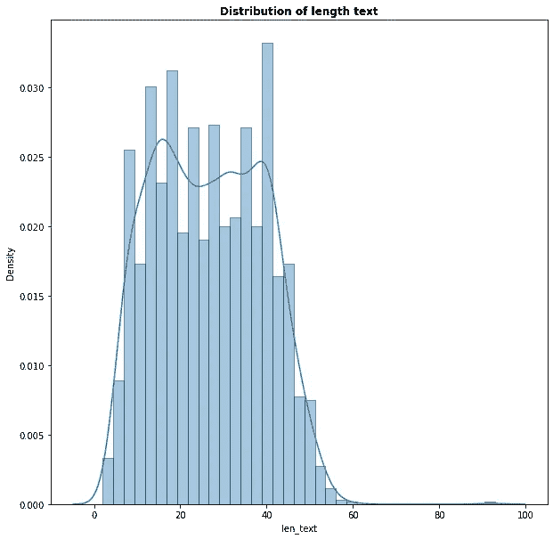

len_text 的分布

从这个描述性统计数据来看，它代表了单词长度的均值为 26.57(接近 27)。同时，单词长度的中值和众数分别为 26 和 16。也就是说， **len_text** 的分布是右偏态分布。根据分布情况，可以看出来自 **len_text 的离群值。**可能会显示一些标点符号、重复的单词和帐户用户。

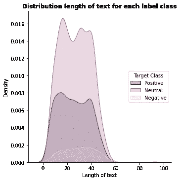

每个标注分类的文本分布长度

听起来好像每个标签类文本长度的平均值彼此接近，它们的离差数据也是如此。在间隔 80-100，有最大长度的中性类文本。

为了制作单词云，每个标签类别的语句的标点符号都将被删除。

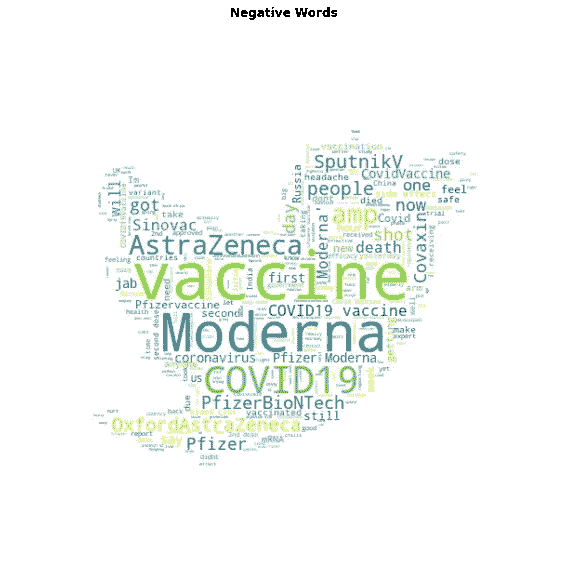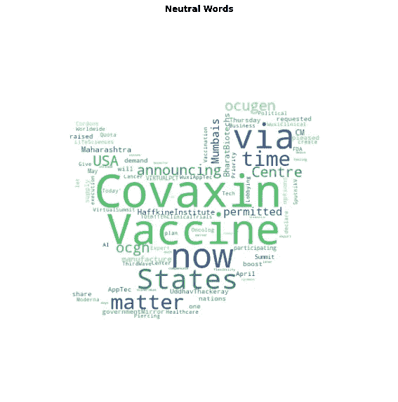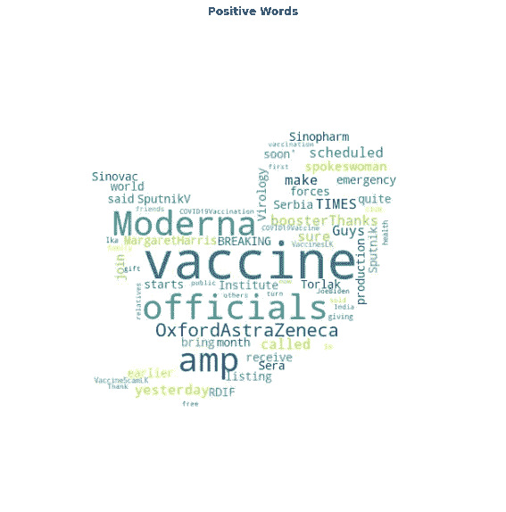

Wordcloud

根据这些图片，我们得到了一些信息:

*   许多字母都是大写的
*   在这三种反应中,“疫苗”一词频繁出现
*   即使否定回答的样本量极低，其词汇多样性也相对较广。

为了减少一些偏见，它必须清理数据，如删除标点符号，名称帐户用户，停用词和数字。URL 需要探索，因为 URL 可能会加强他们的论点。

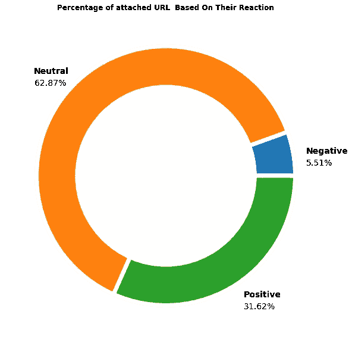

根据饼图，附加 URL 的帐户用户的最高百分比是中性响应。根据从数据集中获得的信息，附加 URL 的帐户用户的数量是 3393。因此，其报表中未附加 URL 的百分比为

*   否定回答= 5.51 %
*   中性反应= 62.87%
*   正面回答= 31.62%

从这个饼状图来看，还需要进一步探索，他们的每个声明中有多少是基于他们的响应而附加的 URL。这是可视化数据。

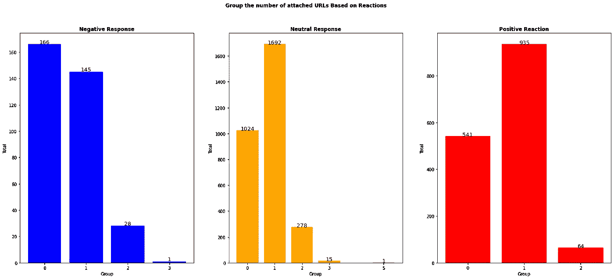

*   三个响应数据，它们看起来是偏右的。
*   对于否定响应，只有一个由 5 个 URL 组成的语句。如果它被加到附加了 URL 的语句中，则它的总和高于组 0(它被称为未附加的 URL 语句组)。除此之外，第 0 组的阴性反应最高
*   来自中性响应的组 1(语句具有一个附加的 URL)是两个响应中的最大值。有 2 个声明附有六个网址。
*   对于肯定的响应，可以看到一个 URL(组 1)频繁出现在语句中。第 6 组只出现一个语句。这意味着，基于 1540 声明的积极回应，只有一个声明，其中包括六个网址。

从现在开始，让我们看看 n-gram。正如我们所见，有 1 克、2 克和 3 克的。这里它获得了数据

正如已经得到的，1 克是相对足够多样的。同时，如果从***【ngram _ range】****增加 *n* 值，n 元数据的结果将会降低多样性。作为证明，将展示描述性统计。*

```
*print('Descriptive Statistics of 1-gram')
df_1gram['total'].describe()
print('Descriptive Statistics of 2-gram')
df_2gram['total'].describe()
print('Descriptive Statistics of 3-gram')
df_3gram['total'].describe()*
```

*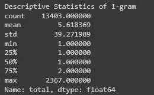**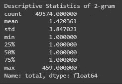**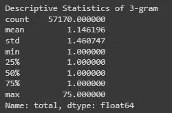

n 元语法的描述统计* 

*从描述性统计的结果来看，1 克数据的离差比较大，因为标准差是 39.271989。与此同时，2-gram 和 3-gram 两种描述性统计量的离差也在减小。但是，相应地，n-gram 数据的大小也在增加。因此，这个 n-gram 将被视为构建模型。*

# *该部分的下一步*

*根据以上解释，下面是建立模型所需的步骤:*

*   *班级的比例必须平衡*
*   *文本数据需要清理，从删除标点符号，数字，帐户用户名和后缀，并使小写*
*   *它需要提取语句中使用的 URL 的数量*
*   *它需要提取他们的文本表情作为变量*
*   *它将通过 LSTM 方法建立模型，并与 1 克、2 克和 3 克进行比较*