# 使用 Twitter 数据分析情绪

> 原文：<https://medium.com/nerd-for-tech/analyze-sentiments-using-twitter-data-fe0f94dc2b61?source=collection_archive---------4----------------------->

利用 Twitter 数据构建自己的情绪分析工具指南。


众所周知，通过分析 Twitter 数据来衡量人们对某个话题的看法不再乏味，这些数据包括人们在社交媒体平台上分享的趋势和历史推文。情感分析目前最流行的用例为[](https://www.ibm.com/cloud/learn/natural-language-processing)*。*

*本文的目的是分享一个全面的指南，它将帮助您通过利用 Twitter API 通过 [***Tweepy***](https://www.tweepy.org/) 构建自己的情感分析工具，Tweepy 恰好是一个用户友好的 Python 库，它将帮助我们访问 Twitter API 和 tweet 数据。我们所需要的只是一个 Twitter 开发者账户和一些样本代码来进行分析*

*我们将利用 Twitter 推特数据来衡量人们对疫情期间发生的新冠肺炎相关封锁趋势的想法和意见。*

*我们将按照下面指定的步骤来构建我们的情感分析工具—*

## *安装并导入相关的库—*

*在我们开始之前，我们需要使用 ***安装 [**textblob**](https://textblob.readthedocs.io/en/dev/) 和 [**tweepy**](https://docs.tweepy.org/en/stable/) 库！pip 安装*命令。请注意，本教程需要在 Jupyter 上设置和运行一个开发环境。如果您没有 Jupyter 环境设置，请在运行以下命令之前，遵循此处提到的[安装和设置说明](https://jupyter.org/install)***

```
*!pip install textblob
!pip install tweepy*
```

*我们还需要在我们的情感分析项目中导入以下库—*

```
*from textblob import TextBlob
import sys
import tweepy
import matplotlib.pyplot as plt
import pandas as pd
import numpy as np
import os
import nltk
import pycountry
import re
import stringfrom wordcloud import WordCloud, STOPWORDS
from PIL import Image
from nltk.sentiment.vader import SentimentIntensityAnalyzer
from langdetect import detect
from nltk.stem import SnowballStemmer
from nltk.sentiment.vader import SentimentIntensityAnalyzer
from sklearn.feature_extraction.text import CountVectorizer*
```

*Tweepy 同时支持 [OAuth 1.0a](https://oauth.net/core/1.0a/) (应用程序用户)和 OAuth 2.0(仅应用程序)认证类型。身份验证由 Tweepy 库 AuthHandler 类处理。*

*OAuth 2.0 是一个行业标准的授权协议。OAuth 2.0 关注客户端开发人员的简单性，同时为 web 应用程序、桌面应用程序、移动电话和客厅设备提供特定的授权流。简单地说，这种身份验证方法是应用程序在没有用户上下文的情况下发出 API 请求。当我们需要对公共信息进行只读访问时，我们使用这种方法。*

*我们将首先注册我们的客户端应用程序，并获取一个消费者 API 密钥和一个秘密令牌。接下来，我们将创建一个 AppAuthHandler 实例，传入我们的消费者 API 密钥和秘密令牌。对于认证方面，我们需要有一个 **Twitter 开发人员帐户**设置。如果您没有现有帐户，请在此处创建一个。这个过程通常需要一两天，但有时可能会更长，这取决于 Twitter 审查你的申请的时间。*

## *为 Twitter API 设置认证—*

```
*consumerKey = “Type your consumer key here”
consumerSecret = “Type your consumer secret here”
accessToken = “Type your accedd token here”
accessTokenSecret = “Type your access token secret here”auth = tweepy.OAuthHandler(consumerKey, consumerSecret)
auth.set_access_token(accessToken, accessTokenSecret)
api = tweepy.API(auth)*
```

*在我们的认证设置好之后，我们需要使用 Tweepy 来提取文本，并使用 Textblob 来计算文本中的**正**、**负**、**中性**、**极性、**和**复合**参数。*

## *使用关键词/标签获取推文—*

```
*def percentage(part,whole):return 100 * float(part)/float(whole)keyword = input(“Please enter keyword or hashtag to search: “)
noOfTweet = int(input (“Please enter how many tweets to analyze: “))
tweets = tweepy.Cursor(api.search, q=keyword).items(noOfTweet)
positive = 0
negative = 0
neutral = 0
polarity = 0
tweet_list = []
neutral_list = []
negative_list = []
positive_list = []for tweet in tweets:

#print(tweet.text)tweet_list.append(tweet.text)
analysis = TextBlob(tweet.text)
score = SentimentIntensityAnalyzer().polarity_scores(tweet.text)
neg = score[‘neg’]
neu = score[‘neu’]
pos = score[‘pos’]
comp = score[‘compound’]
polarity += analysis.sentiment.polarity

if neg > pos:
 negative_list.append(tweet.text)
 negative += 1elif pos > neg:
 positive_list.append(tweet.text)
 positive += 1

elif pos == neg:
 neutral_list.append(tweet.text)
 neutral += 1positive = percentage(positive, noOfTweet)
 negative = percentage(negative, noOfTweet)
 neutral = percentage(neutral, noOfTweet)
 polarity = percentage(polarity, noOfTweet)
 positive = format(positive, ‘.1f’)
 negative = format(negative, ‘.1f’)
 neutral = format(neutral, ‘.1f’)*
```

*这篇文章中的场景是这样的，用户应该键入一个关键字或标签( **lockdown2 london** )并键入他们想要获得和分析多少条推文( **2500** )。*

*因为有限制，tweets 参数的数量很重要。*

*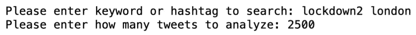*

*在收到 2500 条关于“**伦敦**封锁”的推文后，让我们看看有多少条推文表达了这种情绪。*

```
*(Total, Positive, Negative, Neutral)tweet_list = pd.DataFrame(tweet_list)
neutral_list = pd.DataFrame(neutral_list)
negative_list = pd.DataFrame(negative_list)
positive_list = pd.DataFrame(positive_list)
print(“total number: “,len(tweet_list))
print(“positive number: “,len(positive_list))
print(“negative number: “, len(negative_list))
print(“neutral number: “,len(neutral_list))*
```

*对于本教程，我们将获取 2500 条推文，分类如下-*

*   ***1025 条(41.0%)** 条推文包含正面情绪*
*   *580 条推文(23.2%) 包含负面情绪*
*   *895 条(35.8%) 的推文包含中性情绪*

*让我们用上面的数据画一个饼状图*

```
*PieChartlabels = [‘Positive [‘+str(positive)+’%]’ , ‘Neutral [‘+str(neutral)+’%]’,’Negative [‘+str(negative)+’%]’]sizes = [positive, neutral, negative]colors = [‘yellowgreen’, ‘blue’,’red’]patches, texts = plt.pie(sizes,colors=colors, startangle=90)plt.style.use(‘default’)
plt.legend(labels)
plt.title(“Sentiment Analysis Result for keyword= “+keyword+”” )
plt.axis(‘equal’)
plt.show()*
```

*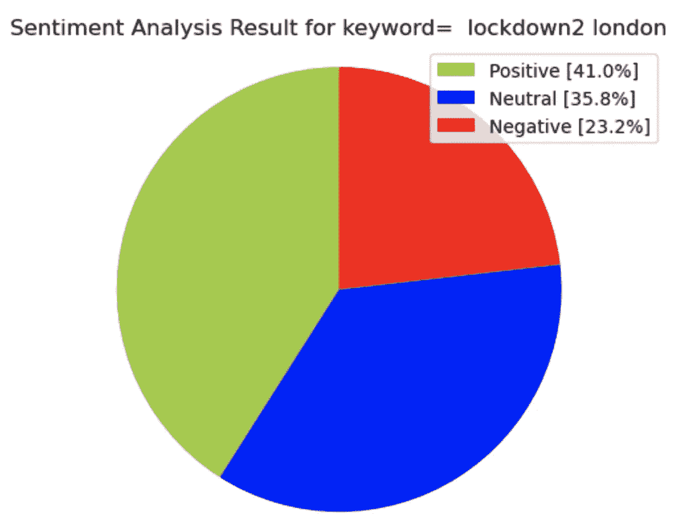*

*让我们看看下面的推文列表-*

```
*tweet_list*
```

*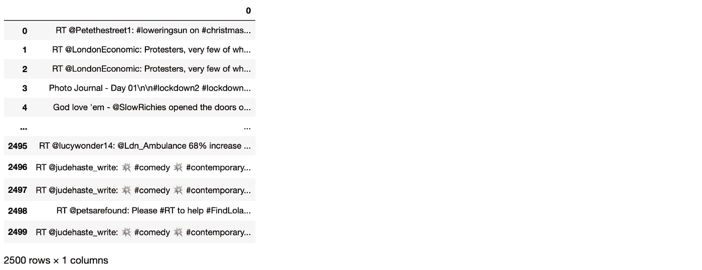*

## *清理推文以准确分析情绪-*

*当你看一下推文列表时，你会注意到有一些重复的推文。我们需要使用 **drop_duplicates** 函数来消除这些重复记录。*

```
*tweet_list.drop_duplicates(inplace = True)*
```

*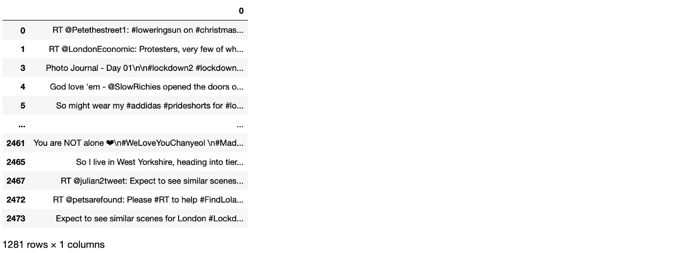*

*我们的新数据集有 **1281** 条独特的推文。*

*首先，我们将创建一个新的数据框(名为— tw_list)和一个新的要素(text ),然后通过我们的 lambda 函数来清理文本，该函数将清理 RT、链接、标点符号、特殊字符等，最后将所有内容转换为小写。因此，我们现在将通过移除 RT、标点符号等来清理文本，然后使用以下命令创建一个具有全新功能集的新数据框-*

```
*tw_list = pd.DataFrame(tweet_list)
tw_list[“text”] = tw_list[0]#Removing RT, Punctuation etc
remove_rt = lambda x: re.sub(‘RT @\w+: ‘,” “,x)
rt = lambda x: re.sub(“(@[A-Za-z0–9]+)|([⁰-9A-Za-z \t])|(\w+:\/\/\S+)”,” “,x)
tw_list[“text”] = tw_list.text.map(remove_rt).map(rt)
tw_list[“text”] = tw_list.text.str.lower()
tw_list.head(10)*
```

**

## *分析情绪-*

*现在，我们可以使用清理后的文本再次计算极性、主观性、情绪、负面、正面、中性和复合参数。为了计算所有这些参数，我们将为我们的数据框创建如下新特征-*

```
*valuestw_list[[‘polarity’, ‘subjectivity’]] = tw_list[‘text’].apply(lambda Text: pd.Series(TextBlob(Text).sentiment))for index, row in tw_list[‘text’].iteritems():
  score = SentimentIntensityAnalyzer().polarity_scores(row)
  neg = score[‘neg’]
  neu = score[‘neu’]
  pos = score[‘pos’]
  comp = score[‘compound’]
   if neg > pos:
      tw_list.loc[index, ‘sentiment’] = “negative”
   elif pos > neg:
      tw_list.loc[index, ‘sentiment’] = “positive”
   else:
      tw_list.loc[index, ‘sentiment’] = “neutral” tw_list.loc[index, ‘neg’] = neg
 tw_list.loc[index, ‘neu’] = neu
 tw_list.loc[index, ‘pos’] = pos
 tw_list.loc[index, ‘compound’] = comptw_list.head(10)*
```

*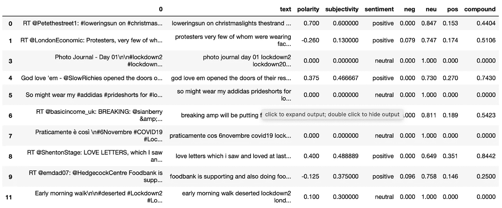*

*我们可以根据情感将我们的数据框架分成 3 组。在这种情况下，我们将创建 3 个新数据帧(即 tw_list _ negative、tw_list_positive 和 tw_list_neutral ),并从原始 tw _ list 数据帧导入。*

```
*tw_list_negative = tw_list[tw_list[“sentiment”]==”negative”]
tw_list_positive = tw_list[tw_list[“sentiment”]==”positive”]
tw_list_neutral = tw_list[tw_list[“sentiment”]==”neutral”]*
```

*让我们统计情感特征的值，并检查总百分比。*

*实现***count _ values _ in _ single _ columns***功能-*

```
*def count_values_in_column(data,feature):
 total=data.loc[:,feature].value_counts(dropna=False)

percentage = round(data.loc[:,feature].value_counts(dropna=False,normalize=True)*100,2)
return pd.concat([total,percentage],axis=1,keys=[‘Total’,’Percentage’])count_values_in_column(tw_list,”sentiment”)*
```

*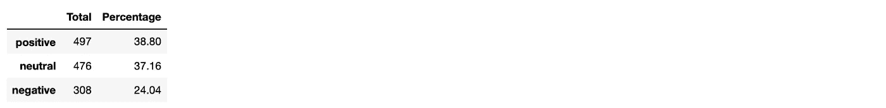*

*我们也可以通过利用情感推文的数量来创建一个图表，如下所示*

```
*# data for piechartpiechart = count_values_in_column(tw_list,”sentiment”)
names= pc.index
size=pc[“Percentage”]

# draw a circle for plot centremy_circle=plt.Circle( (0,0), 0.7, color=’white’)
plt.pie(size, labels=names, colors=[‘green’,’blue’,’red’])
p=plt.gcf()
p.gca().add_artist(my_circle)
plt.show()*
```

*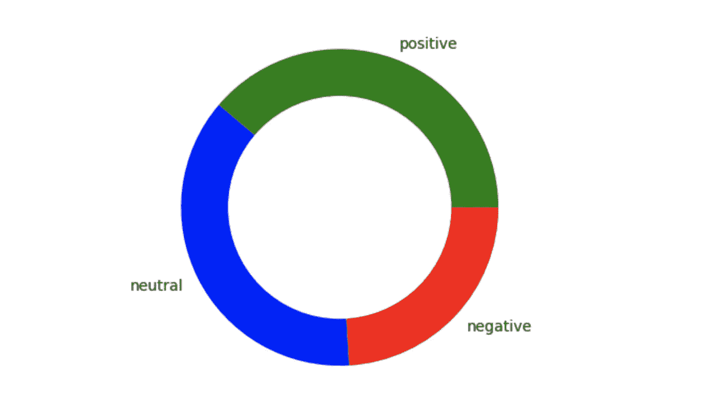*

*现在我们将使用这 1281 条推文创建一个词云。这将有助于我们回顾这些推文中使用频率最高的词。为了创建词云，我们将首先定义一个如下所述的函数，然后我们可以对所有推文，正面推文，负面推文等再次使用这个词云绘图实现。*

```
*create_wordcloud(text):
  mask = np.array(Image.open(“cloud.png”))
  stopwords = set(STOPWORDS)
  wc = WordCloud(background_color=”white”,
  mask = mask,
  max_words=3000,
  stopwords=stopwords,
  repeat=True)
  wc.generate(str(text))
  wc.to_file(“wc.png”)
  print(“Word Cloud Saved Successfully”)
  path=”wc.png”
  display(Image.open(path))*
```

*定义了这个函数之后，我们可以通过运行以下命令来查看所有绘制的 tweet 数据的单词云*

```
*create_wordcloud(tw_list[“text”].values)*
```

**

*正面情感推文的词云可以绘制如下-*

```
*create_wordcloud(tw_list_positive[“text”].values)*
```

*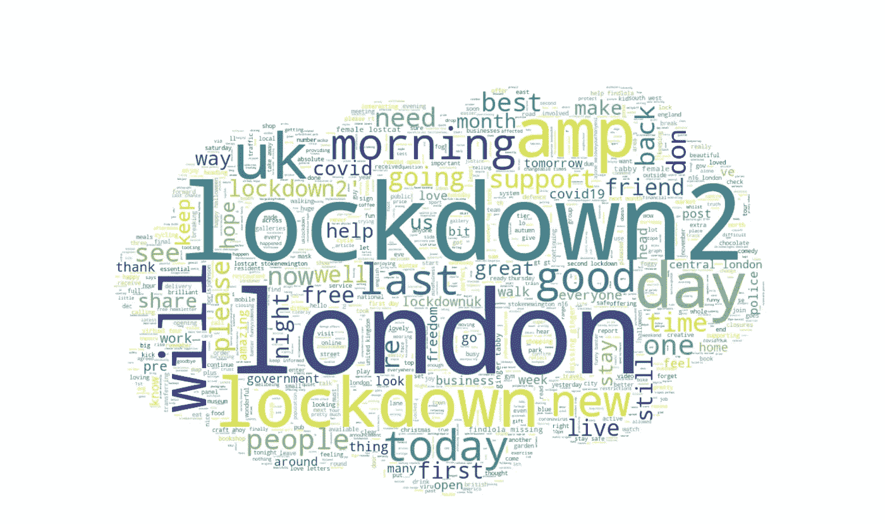*

*负面情绪化推文的词云可以绘制如下-*

```
*create_wordcloud(tw_list_negative[“text”].values)*
```

*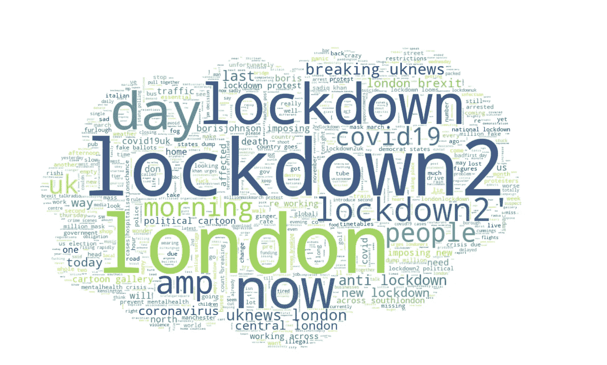*

*现在让我们来计算推文的长度和字数。我们可以根据不同的情绪来检查推文中使用的单词密度和字符—*

```
*tw_list[‘text_len’] = tw_list[‘text’].astype(str).apply(len)
tw_list[‘text_word_count’] = tw_list[‘text’].apply(lambda x: len(str(x).split()))round(pd.DataFrame(tw_list.groupby("sentiment").text_len.mean()),2)s*
```

**

```
*round(pd.DataFrame(tw_list.groupby(“sentiment”).text_word_count.mean()),2)*
```

*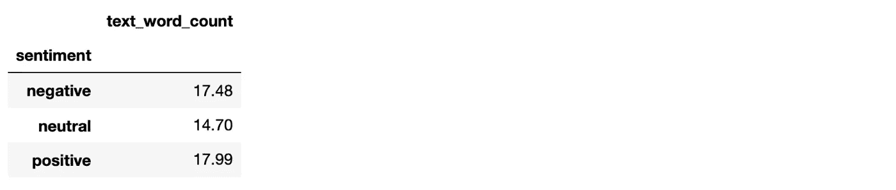*

*应用计数矢量器提供了在生成矢量表示之前预处理文本数据的能力，使其成为高度灵活的文本特征表示模块。算上矢量器之后，就可以用两三个或者你想要的任何东西来分析单词了。*

*对我们的数据应用词干分析器也会重新运行这些 tweet 单词的词根。我们可以排除这些来自同一个词根的单词，如下-*

*   *连接*
*   *关系*
*   *连接的*
*   *连接*
*   *连接*

*这些都可以从**“连接”中推导出来。一旦我们将词干分析器功能应用于如上所述的单词列表，多余的部分将被删除。***

```
*def remove_punct(text):
  text = “”.join([string.punctuation])
  text = re.sub(‘[0–9]+’, ‘’, text)
  return texttw_list[‘punct’] = tw_list[‘text’].apply(lambda x: remove_punct(x))def tokenization(text):
    text = re.split('\W+', text)
    return texttw_list['tokenized'] = tw_list['punct'].apply(lambda x: tokenization(x.lower()))stopword = nltk.corpus.stopwords.words('english')def remove_stopwords(text):
    text = [word for word in text if word not in stopword]
    return text

tw_list['nonstop'] = tw_list['tokenized'].apply(lambda x: remove_stopwords(x))ps = nltk.PorterStemmer()def stemming(text):
    text = [ps.stem(word) for word in text]
    return texttw_list['stemmed'] = tw_list['nonstop'].apply(lambda x: stemming(x)) def clean_text(text):
    text_lc = "".join([word.lower() for word in text if word not in string.punctuation]) 
    text_rc = re.sub('[0-9]+', '', text_lc)
    tokens = re.split('\W+', text_rc)    # tokenization
    text = [ps.stem(word) for word in tokens if word not in stopword]  
   return texttw_list.head()*
```

*在应用计数矢量器后，结果显示所有这 1281 条推文总共有 2966 个唯一单词。*

*如果我们看一下我们的数据框架，我们会看到一些新功能，如点状、标记化、不间断、词干化。*

*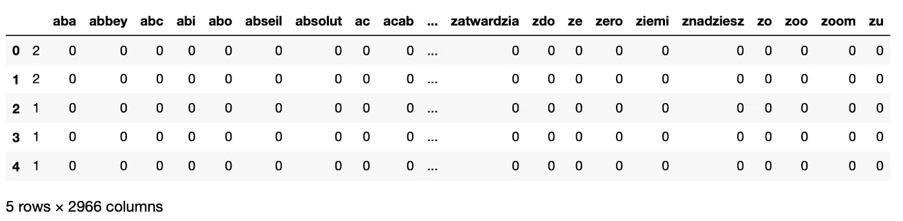*

*我们可以按降序排列这些值，找出最常用的单词-*

```
*count = pd.DataFrame(count_vect_df.sum())
countdf = count.sort_values(0,ascending=False).head(20)
countdf[1:11]*
```

**

*构建一个 n-gram 模型有助于我们预测这个序列中最有可能出现的下一个单词。首先，我们将创建一个函数来构建 n2_bigram、n3_trigram 等。*

```
*def get_top_n_gram(corpus,ngram_range,n=None):
 vec = CountVectorizer(ngram_range=ngram_range,stop_words = ‘english’).fit(corpus)
 bag_of_words = vec.transform(corpus)
 sum_words = bag_of_words.sum(axis=0)  words_freq = [(word, sum_words[0, idx]) for word, idx in vec.vocabulary_.items()]
 words_freq = sorted(words_freq, key = lambda x: x[1], reverse=True)
 return words_freq[:n] n2_bigrams = get_top_n_gram(tw_list[‘text’],(2,2),20)n2_bigrams*
```

**

```
*n3_trigrams = get_top_n_gram(tw_list[‘text’],(3,3),20)n3_trigrams*
```

**

*最后，我们现在可以使用 twitter tweets 来分析情绪，我们可以有效地得出哪些词最常使用以及哪组词经常一起使用的结论。*

*感谢您的阅读。
编码快乐！！*