# 用 HarperDB 分析 Twitter 对泰勒斯威夫特的反应

> 原文：<https://medium.com/nerd-for-tech/analyze-twitters-reaction-to-taylor-swift-with-harperdb-6207a50aee5d?source=collection_archive---------1----------------------->

端到端数据分析组合项目。


2500000000000000000

如果你读这个有困难，让我们为你简化它。这是 2.5 万亿字节，或人类每天估计产生的数据量。我们所有人都有意或无意地以这样或那样的方式对此做出了贡献，使数据成为目前地球上最珍贵的商品之一。

比数据本身更有价值的是从数据中创造东西的能力。企业对用数百万个数据点填满他们的存储器不感兴趣，他们感兴趣的是从中得出的见解和收获。这使得在全球范围内执行这一任务的资源受到高度重视。创建无缝提取、分析、预测和预报数据的系统是当前的需要。

为此，我们需要高性能的数据库管理系统来帮助扩展和优化数据事务处理过程。像 [HarperDB Cloud](https://harperdb.io/?utm_source=Aakriti-tutorial) 这样的服务有助于管理云上的大型数据库，使这个过程更加可扩展、可访问和快速，内置的 HTTP API 端点可以在所有主要语言中访问。

# **问题陈述**

一个人不可能没有泰勒·斯威夫特的音乐，这是一个众所周知的事实。这位美国歌手兼词曲作者拥有许多获奖唱片，并以她的自传体歌曲而闻名。她的重新录制的歌曲在这个月被删除，粉丝们用他们的反应、评论、想法，当然还有阴谋论淹没了时间轴。

该项目旨在提取包含主题“泰勒斯威夫特”的推文，并通过利用自然语言处理进行详细分析。


照片由[拉斐尔·洛瓦斯基](https://unsplash.com/@raphaellovaski?utm_source=medium&utm_medium=referral)在 [Unsplash](https://unsplash.com?utm_source=medium&utm_medium=referral) 拍摄

# **数据收集**

为了收集数据，我们将使用 python 中的 Twint 库抓取包含关键字“Taylor Swift”的推文。

**安装**

```
git clone — depth=1 [https://github.com/twintproject/twint.git](https://github.com/twintproject/twint.git)
cd twint
pip3 install . -r requirements.txt
```

提示:将需求文件中的 aiohttp 改为 aiohttp==3.7.0，以避免前面的错误

**刮削**

```
import twintc = twint.Config()c.Search = [‘Taylor Swift’] # topic
c.Limit = 2000000 # number of Tweets to scrape
c.Store_csv = True # store tweets in a csv file
c.Output = “tweets.csv” # path to csv filetwint.run.Search(c)
```

与 Tweepy 相比，我更喜欢使用 Twint，因为它的语法简单，没有认证和无限的特性。上面的代码块创建了一个包含 100k+ tweets 及其属性的文件。这需要一段时间来处理，然后所有的 tweets 以下面的格式保存在 tweets.csv 文件中:

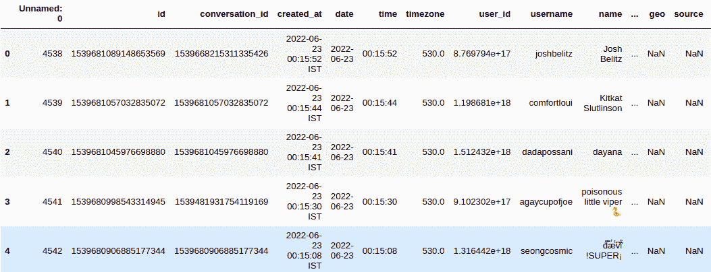

数据的第二部分来源于 [Kaggle](http://kaggle.com/datasets) 。你可以在这里下载它[，解压并添加到你的项目文件夹中。](https://www.kaggle.com/datasets/PromptCloudHQ/taylor-swift-song-lyrics-from-all-the-albums?resource=download)

# **数据预处理**

由于数据收集过程是自动化的，因此可能会在数据中引入错误和不一致。为了识别和消除任何这样的故障，数据探测是必要的。

**空值**

每列中具有空值的单元格的计数打印为-

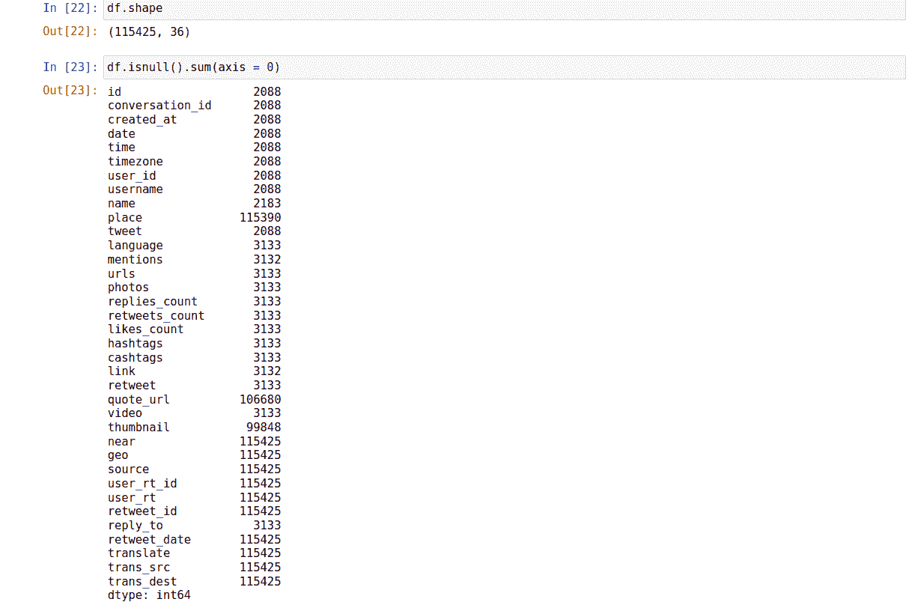

可以看出，10+个列中没有或只有很少的值。可以使用以下命令删除它们:

```
df=df.drop([‘near’, ‘geo’, ‘source’, ‘user_rt_id’, ‘user_rt’,
 ‘retweet_id’, ‘retweet_date’, ‘translate’, ‘trans_src’,
 ‘trans_dest’],axis=1)
```

在列之后，让我们删除空值的行，如-

```
df=df.dropna()
```

这里我们删除了具有空值的行，因为它们包含非常少量的数据(< 2%) , if only this was a large amount we would have adopted different methods like replacing with median/average or predicting missing values.

Let’s check for null values now:

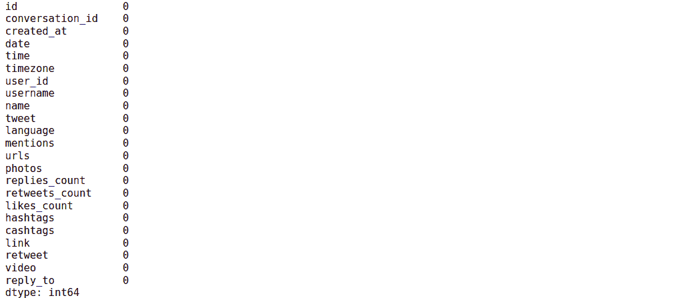

Looks perfect!

The updated dimensions of the dataframe are -

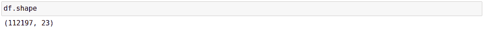

Now that we are free of any missing cells, we would look at the values of individual columns and make sure no unnecessary elements have been captured.

**调查列**

从列 *timezone* 开始，我们可以看到整个数据集只显示了一个值，即数据被捕获的国家的值。这是不准确的，因为推文肯定会从世界各地发布，使这个专栏无关紧要。

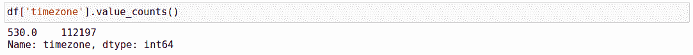

任何数据集都需要一个主键来唯一标识行和更快的查询，通过研究可以发现有两个键可以作为主键，即 id 和 conversation_id。

为了充当主键，该列对于每一行都必须有唯一的值。要检查这些列是否满足这些条件，请运行以下命令-

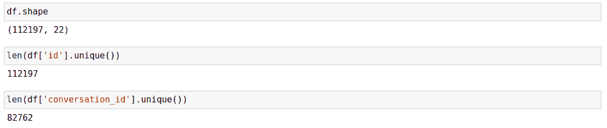

我们可以看到，列 id 对于每一行都有唯一值，即列中出现的唯一值的数量等于行数，因此它被用作主键。另一方面，conversation_id 不是唯一可识别的属性，因此可以删除。

接下来，在注意到几行中的值后，我们可以看到 *created_at* 只是日期和时间字段的连接，因此删除它是多余的，也是安全的。

**文本预处理**

现在，我们只有实际增加数据价值的必要列，我们可以从文本预处理开始。甚至每条推文中的文本也可能包含冗余数据，这对系统性能没有太大影响，因此最好一开始就删除掉。文本预处理包括通过管道传递文本数据，该管道为特定的上下文清理和准备数据，这里是去除噪声。

这里的噪声包括:

*   资源定位符
*   提及
*   表情符号
*   保留字
*   标签

这些可能在不同的上下文中有用，但是在这里，因为我们有一个专门的专栏，所以我们不需要用它们来增加数据。

*   移除标签

因为我们已经有了标签列表，我们可以简单地遍历列表，用一个空字符替换原始 tweet 中的标签。考虑到数据是如何存储的，这需要一点字符串操作，但是有了这个函数，你就可以开始了！

```
def hashtag_removal(r):
 twt=r[‘tweet’].lower()
 tags=list(r[‘hashtags’][1:-1].split(‘,’))
 for i in tags:
 i=i.strip()
 i=i[1:-1]
 twt=twt.replace(‘#’+i,’’)
 return twt 
df[‘clean_tweet’]=df.apply(lambda x:hashtag_removal(x),axis=1)
```

*   移除网址、提及和表情符号

只保留推文并删除所有提及(推文中提到的用户名)、URL 和表情符号进一步为推文做好准备，以便更好地处理。这是使用 *tweet 处理器*模块完成的。

```
!pip install tweet-processor
import preprocessor as p
df[‘clean_tweet’]=df[‘clean_tweet’].apply(lambda x:p.clean(x))
```

这给我们留下了一个更干净、更直接、噪音更少的推特版本。

*   删除标点符号

如果你仔细观察推文，你会注意到一些奇怪的字符在一些推文中毫无意义，就像这里突出显示的一样:

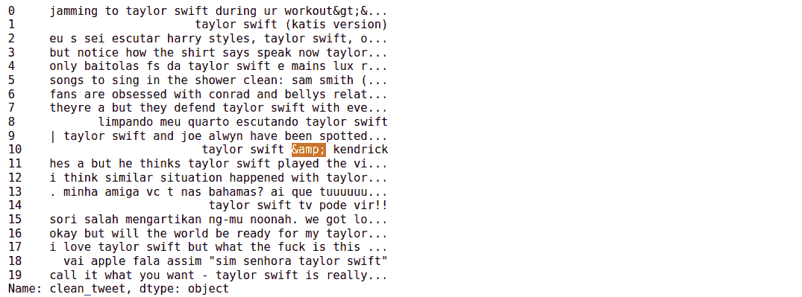

这些可能是在抓取标点符号作为它们的等价代码时进入数据的。让我们使用 Python 的 regex 模块来移除它们，在这里我们将模式与这里以&开始并以；结束的模式进行匹配。

```
import regex as re
def punctuation_removal(r):
 ls=re.findall(r’&(\w+);’, r)
 for i in ls:
 r=r.replace(f’&{i};’,’’)
 punc = ‘’’!()-[]{};:’”\,<>./?@#$%^&*_~’’’
 for ele in r:
 if ele in punc:
 r = r.replace(ele, “”)
 return r
df[‘clean_tweet’]=df[‘clean_tweet’].apply(lambda x:punctuation_removal(x))
```

*   删除数字

如前所述，预处理步骤很大程度上取决于它们被使用的上下文。例如，如果我们正在处理销售数据并分析一个语料库，就有必要提取所有的数值。然而，由于推文更倾向于情绪方面，不需要量化，所以删除它们是安全的。我们可以再次求助于正则表达式。

```
df[‘clean_tweet’] = df[‘clean_tweet’].astype(str).str.replace(‘\d+’, ‘’)
```

*   标记化

标记化是将原始文本分割成更小单元的过程。这些单元中的每一个都称为一个标记，可以是一个单词、字符或句子，这取决于标记化过程的应用方式和位置。标记化有助于更好地理解上下文，创建更好的语言模型。Python 中的自然语言工具包库用于实现这一点。

```
import nltk
from nltk import word_tokenize, FreqDist
from nltk.corpus import stopwords
from nltk.stem import WordNetLemmatizer
nltk.download
nltk.download(‘wordnet’)
nltk.download(‘stopwords’)
nltk.download(‘omw-1.4’)
from nltk.tokenize import TweetTokenizer lemmatizer = nltk.stem.WordNetLemmatizer()
w_tokenizer = TweetTokenizer()
def lemmatize_text(text):
 return [(lemmatizer.lemmatize(w)) for w in w_tokenizer.tokenize((text))]df[‘tokenized_tweet’] = df[‘clean_tweet’].apply(lambda x:lemmatize_text(x))
```

这将创建一个名为 tokenized_tweet 的新列，存储来自清理后的 tweet 的令牌列表。


*   停止单词删除

作为预处理的最后一步，我们从标记化的文本中移除停用词。停用词是语言中常用的词，因为英语中的' a '，' is '，' are '是很少的停用词。因为它们不会给文本的意义增加太多的价值，并且仅仅是为了结构而添加的，所以我们将它们从标记中移除。

```
stop_words = set(stopwords.words(‘english’))
df[‘tokenized_tweet’] = df[‘tokenized_tweet’].apply(lambda x: [item for item in x if item not in stop_words])
```

这一过程的唯一缺点是收集的数据使用了多种语言，总共有 44 种。然而，所有这些语言的语料库还不可用。因为大部分数据是英文的，所以使用了英文停用词来实现这一点。

我们完了。

将 csv 格式的数据保存为-

```
df.to_csv(‘clean_tweets.csv’, index=False)
```

# **设置 HarperDB**

HarperDB 的数据和应用平台在一个包中提供了全球分布的性能和简单性。这是第一个将混合 SQL 和 NoSQL 功能集于一身的分布式数据库，该平台支持边缘计算、实时分析和快速应用开发等解决方案。

HarperDB 最显著的特性是:

*   单端点 CRUD 操作
*   内置 HTTP API
*   [自定义功能](https://harperdb.io/docs/custom-functions/)
*   简单用户界面
*   免费永久层，含企业、内部和 SaaS 许可
*   跨主要语言和框架的多插件支持
*   SQL 和 NoSQL 都支持
*   返回 JSON 的数组，不需要 ORM

通过以下步骤开始设置数据库-

**创建你的 HarperDB 账户**

转到 [HarperDB 的注册页面](https://studio.harperdb.io/sign-up?utm_source=Aakriti-tutorial)，添加您的所有详细信息。


**创建一个实例**

注册后，您将看到以下屏幕。


点击创建新的 HarperDB 云实例。您将有两个选择:

1.  创建一个由 HarperDB 自己创建、管理和伸缩的 HarperDB 云实例。
2.  在您自己的服务器中安装 HarperDB，并将其添加到 UI 中。


**启动实例**

单击为云实例创建 AWS 或威瑞森波长实例。选择 AWS 作为云提供商，填写所有凭证，保留默认设置并确认。启动实例需要几分钟时间。

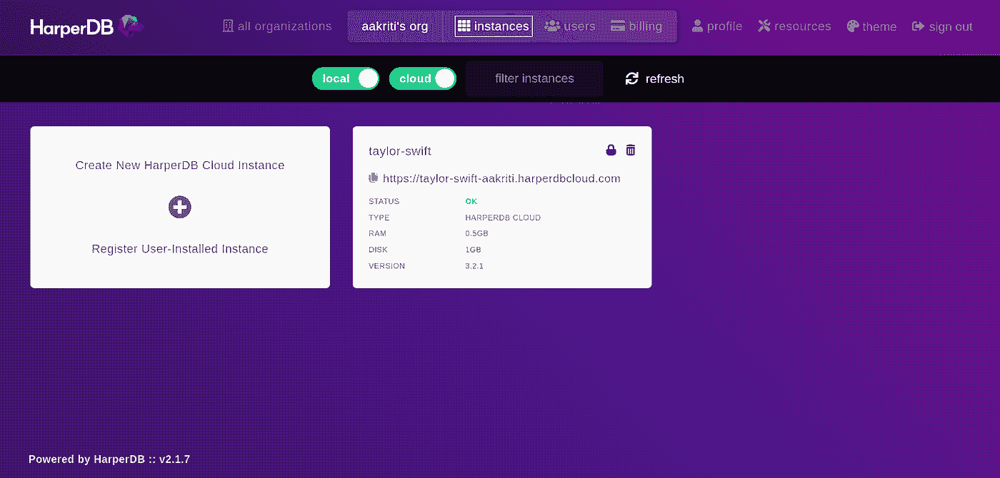

**创建模式**

接下来，单击实例，命名为 schema(数据库的结构)，并添加表的名称。我使用了名称 *tweets* 和 *songs* 和 hash 属性 id。

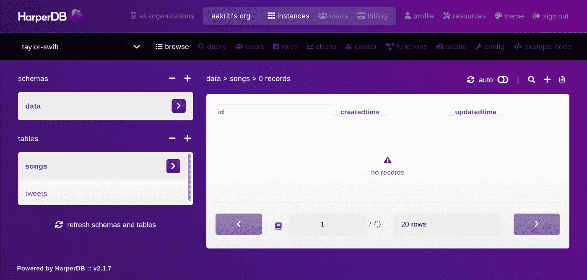

**导入数据**

单击数据图标:


在表格浏览器的右上角。您将被定向到 CSV 上传页面，在此您可以选择通过 URL 导入 CSV 或上传 CSV 文件。

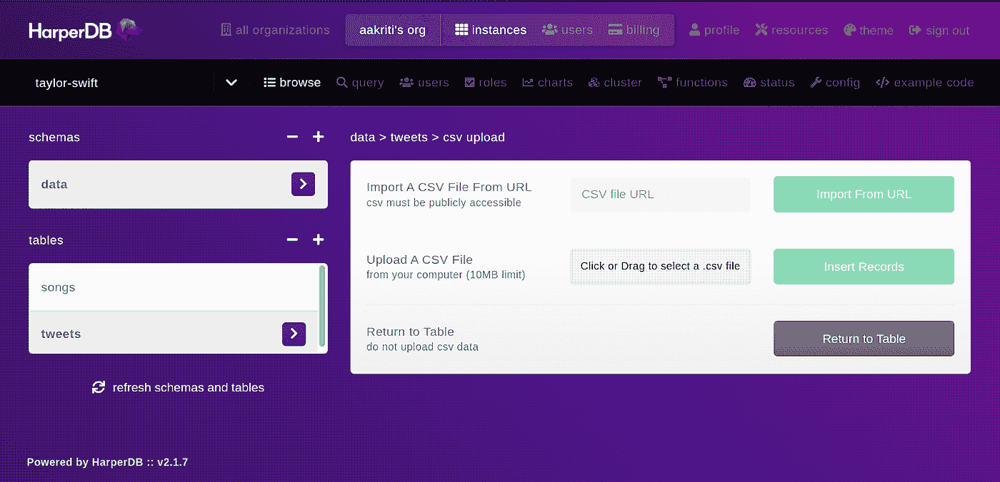

将您的 csv 文件拖到它们各自的表格上，然后单击 Insert。

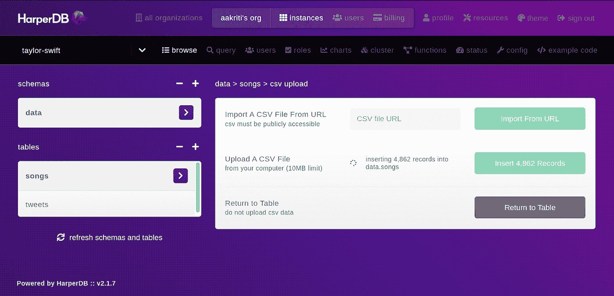

如果它提示 clean_tweets.csv 文件太大，无法上传，请尝试分割数据帧并上传。

恭喜你！您已经到达教程的结尾。这是由两部分组成的端到端数据分析项目教程的第 1 部分。这个人谈到了-

*   抓取数据
*   设置 CSV 进行处理
*   利用 python 处理文本数据
*   数据预处理步骤，如停用词去除、词汇化和降噪
*   设置云数据库
*   将数据导入云实例

下一次迭代将围绕以下内容-

*   在 Tableau 中设置 ODBC 驱动程序
*   将它连接到 HarperDB 云数据库
*   从查询的数据中创建有意义的可视化
*   托管交互式仪表板

敬请期待！


胡玛·卡巴奇在 [Unsplash](https://unsplash.com?utm_source=medium&utm_medium=referral) 上的照片